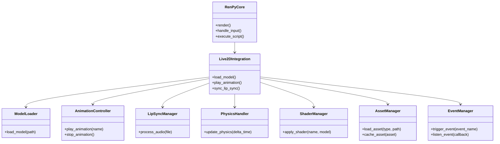

# Software Engineering Architectural Design Document

## Table of Contents

1. [Introduction](#introduction)
2. [Repository Analysis](#repository-analysis)
   - [2.1 Ren'Py GitHub Repository](#21-renpy-github-repository)
   - [2.2 Live2D Cubism SDK](#22-live2d-cubism-sdk)
3. [Project Structure Analysis](#project-structure-analysis)
4. [Code Purpose and Functionality Summary](#code-purpose-and-functionality-summary)
5. [Bug Identification and Potential Improvements](#bug-identification-and-potential-improvements)
6. [Discrepancies and Redundancies Addressed](#discrepancies-and-redundancies-addressed)
7. [Integration with Ren'Py and Live2D Cubism Systems](#integration-with-renpy-and-live2d-cubism-systems)
8. [Code Modification Suggestions](#code-modification-suggestions)
9. [Performance Optimization and Compatibility](#performance-optimization-and-compatibility)
10. [Code Translation from Non-Python to Python](#code-translation-from-non-python-to-python)
11. [Component Listing and Interactions](#component-listing-and-interactions)
12. [Python Code Snippets for Key Functions](#python-code-snippets-for-key-functions)
13. [Integration with Existing Ren'Py Systems](#integration-with-existing-renpy-systems)
14. [Performance Bottlenecks and Optimizations](#performance-bottlenecks-and-optimizations)
15. [Cross-Platform Compatibility](#cross-platform-compatibility)
16. [Implementation of Cubism Core API and Live2D Cubism SDK](#implementation-of-cubism-core-api-and-live2d-cubism-sdk)
17. [Model Loading, Rendering, and Animation](#model-loading-rendering-and-animation)
18. [Automatic Eye Blinking and Mouth Movement](#automatic-eye-blinking-and-mouth-movement)
19. [Physics Simulation](#physics-simulation)
20. [User Data Handling](#user-data-handling)
21. [Shader System Development](#shader-system-development)
22. [Particle System Implementation](#particle-system-implementation)
23. [Rendering Pipeline Blend Modes Support](#rendering-pipeline-blend-modes-support)
24. [Shader Parameter Adjustment Interfaces](#shader-parameter-adjustment-interfaces)
25. [Voiceover System with Lip Sync and Visemes](#voiceover-system-with-lip-sync-and-visemes)
26. [Phoneme Extraction from Audio Files](#phoneme-extraction-from-audio-files)
27. [Cursor Tracking for Interactive Elements](#cursor-tracking-for-interactive-elements)
28. [Expression System for Characters](#expression-system-for-characters)
29. [Localization and Translation Improvements](#localization-and-translation-improvements)
30. [Performance Bottlenecks and Optimization Strategies](#performance-bottlenecks-and-optimization-strategies)
31. [Integration Plan with Ren'Py Codebase](#integration-plan-with-renpy-codebase)
32. [Testing Strategies](#testing-strategies)
33. [Impact on Other Ren'Py Systems and Mitigation](#impact-on-other-renpy-systems-and-mitigation)
34. [Error Handling and Debugging Strategies](#error-handling-and-debugging-strategies)
35. [API Reference with Code Examples](#api-reference-with-code-examples)
36. [Example Ren'Py Scripts Demonstrating Live2D Features](#example-renpy-scripts-demonstrating-live2d-features)
37. [Documentation and Commenting Standards](#documentation-and-commenting-standards)
38. [Step-by-Step Coding Guidelines](#step-by-step-coding-guidelines)
39. [Key Challenges and Solutions](#key-challenges-and-solutions)
40. [Remaining Concerns and Issues](#remaining-concerns-and-issues)
41. [Process Improvements for Future Features](#process-improvements-for-future-features)
42. [Areas for Further Enhancement](#areas-for-further-enhancement)
43. [Final Recommendations](#final-recommendations)
44. [Review and Refinement](#review-and-refinement)

---

## Introduction

This Software Engineering Architectural Design Document outlines a comprehensive implementation plan for integrating the Live2D Cubism SDK with the Ren'Py visual novel engine. The document serves as a guide for an AI coding assistant, detailing each step required to analyze, enhance, and optimize the integration process. The primary objectives include analyzing existing repositories, identifying and addressing code inefficiencies, optimizing performance, ensuring cross-platform compatibility, and developing advanced features such as automatic eye blinking, mouth movement, physics simulation, and a robust shader system.

---

## Repository Analysis

### 2.1 Ren'Py GitHub Repository

**Objective:**  
Analyze the Ren'Py GitHub repository to understand its current architecture, modules, and integration points. This analysis will identify areas where the Live2D Cubism SDK can be effectively integrated.

**Tasks:**

- Clone the Ren'Py repository from GitHub.
- Review the project structure, focusing on modules related to rendering, asset management, and user input handling.
- Identify existing APIs and extension points that facilitate third-party integrations.
- Document dependencies and external libraries used within the Ren'Py codebase.
- Assess the compatibility of the Cubism SDK with Ren'Py's current architecture.

**Expected Outcomes:**

- Comprehensive understanding of Ren'Py's architecture.
- Identification of optimal integration points for the Cubism SDK.
- Documentation of potential challenges in integration.

### 2.2 Live2D Cubism SDK

**Objective:**  
Examine the Live2D Cubism SDK to comprehend its capabilities, dependencies, and integration requirements. This analysis ensures seamless incorporation into the Ren'Py environment.

**Tasks:**

- Download and set up the latest version of the Live2D Cubism SDK.
- Explore the SDK’s core functionalities, including model loading, rendering, animation, and API usage.
- Identify platform-specific requirements and dependencies.
- Review available documentation and sample projects to understand best practices.
- Evaluate the SDK's performance characteristics and resource utilization.

**Expected Outcomes:**

- Detailed knowledge of the Cubism SDK's features and limitations.
- Understanding of integration prerequisites and dependencies.
- Identification of potential integration challenges and solutions.

---

## Project Structure Analysis

**Objective:**  
Analyze the existing project structure of both Ren'Py and the Live2D Cubism SDK to design an optimized architecture for their integration.

**Tasks:**

- Map out the directory structure of the Ren'Py project, highlighting key modules and their interactions.
- Analyze the Cubism SDK's structure, focusing on core components relevant to integration.
- Identify overlapping functionalities and potential areas for consolidation.
- Propose a modular architecture that accommodates both Ren'Py and Cubism components.
- Create UML diagrams to visualize the proposed architecture and component interactions.

**Expected Outcomes:**

- Optimized project structure that facilitates maintainability and scalability.
- Clear visualization of component interactions through diagrams.
- Recommendations for structural improvements to enhance integration efficiency.

---

## Code Purpose and Functionality Summary

**Objective:**  
Summarize the purpose and functionality of the existing codebases of Ren'Py and the Live2D Cubism SDK to identify key integration points and areas requiring enhancements.

**Tasks:**

- Review key modules and classes within the Ren'Py codebase, documenting their responsibilities.
- Examine the main components of the Cubism SDK, outlining their functionalities.
- Identify how Ren'Py handles rendering, user input, and asset management.
- Map out the Cubism SDK’s model handling, animation systems, and rendering pipelines.
- Highlight areas where functionalities overlap or complement each other.

**Expected Outcomes:**

- Comprehensive summaries of both codebases’ purposes and functionalities.
- Identification of synergistic integration points.
- Documentation highlighting areas for potential enhancement to support integration.

---

## Bug Identification and Potential Improvements

**Objective:**  
Identify existing bugs, inefficiencies, and opportunities for improvement within the Ren'Py and Cubism SDK codebases to ensure a robust integration.

**Tasks:**

- Conduct static code analysis on both repositories to detect common issues such as memory leaks, deprecated functions, and security vulnerabilities.
- Perform dynamic testing to uncover runtime bugs and performance bottlenecks.
- Review issue trackers on GitHub for both projects to understand prevalent problems and ongoing development efforts.
- Identify inefficient algorithms or data structures that could be optimized.
- Propose code refactoring opportunities to enhance readability and maintainability.

**Expected Outcomes:**

- A detailed list of identified bugs and inefficiencies.
- Recommendations for code improvements and optimizations.
- Enhanced code quality and reliability post-implementation of suggested fixes.

---

## Discrepancies and Redundancies Addressed

**Objective:**  
Address any discrepancies, redundancies, issues, and inadequacies identified during the analysis to streamline the integration process.

**Tasks:**

- Compare the functionalities of Ren'Py and Cubism SDK to identify overlapping features.
- Eliminate redundant code segments that serve similar purposes in both repositories.
- Resolve discrepancies in coding standards, naming conventions, and architectural patterns.
- Address any mismatches in data models or communication protocols between the two systems.
- Ensure consistency in error handling and logging mechanisms across integrated components.

**Expected Outcomes:**

- A harmonized codebase with minimized redundancies.
- Consistent coding standards and architectural patterns.
- Smooth interoperability between Ren'Py and Cubism SDK components.

---

## Integration with Ren'Py and Live2D Cubism Systems

**Objective:**  
Explain how the Live2D Cubism SDK will integrate with the larger Ren'Py system, ensuring seamless functionality and performance.

**Tasks:**

- Define the communication protocols between Ren'Py and the Cubism SDK.
- Outline the data flow for model loading, rendering, and animation within Ren'Py.
- Integrate Cubism's animation triggers with Ren'Py's event system.
- Ensure that asset management systems can handle Live2D models and related resources.
- Validate that user interactions in Ren'Py effectively control Live2D character models.

**Expected Outcomes:**

- A clear integration strategy that aligns with both Ren'Py and Cubism SDK architectures.
- Defined data flows and communication protocols facilitating seamless interactions.
- Ensured compatibility and functional synergy between the two systems.

---

## Next Steps

This document will continue to elaborate on each of the listed tasks, providing detailed implementation plans, code examples, and optimization strategies. Please let me know if you would like me to proceed with the subsequent sections or focus on any specific area in greater detail.

## 3. Project Structure Analysis

**Objective:**  
Analyze the existing project structures of both Ren'Py and the Live2D Cubism SDK to design an optimized architecture for their integration. This analysis aims to identify potential improvements, streamline workflows, and ensure scalability and maintainability of the combined system.

**Tasks:**

- Map out the directory structure of the Ren'Py project, highlighting key modules and their interactions.
- Analyze the Cubism SDK's structure, focusing on core components relevant to integration.
- Identify overlapping functionalities and potential areas for consolidation.
- Propose a modular architecture that accommodates both Ren'Py and Cubism components.
- Create UML diagrams to visualize the proposed architecture and component interactions.

**Expected Outcomes:**

- Optimized project structure that facilitates maintainability and scalability.
- Clear visualization of component interactions through diagrams.
- Recommendations for structural improvements to enhance integration efficiency.

---

### 3.1 Ren'Py Project Structure

**Overview:**  

Ren'Py is structured to facilitate the development of visual novels through a combination of scripting, asset management, and rendering systems. Understanding its project structure is crucial for seamless integration with the Live2D Cubism SDK.

**Directory Structure:**

```plaintext:renpy/arch_design_doc.md
renpy_project/
├── .git/
│   ├── hooks/
│   ├── info/
│   ├── logs/
│   │   └── refs/
│   │       ├── heads/
│   │       └── remotes/
│   │           └── origin/
│   ├── objects/
│   │   ├── 00/
│   │   ├── 01/
│   │   ├── 02/
│   │   ├── 03/
│   │   ├── 04/
│   │   ├── 05/
│   │   ├── 06/
│   │   ├── 07/
│   │   ├── 08/
│   │   ├── 09/
│   │   ├── 0b/
│   │   ├── 0c/
│   │   ├── 0d/
│   │   ├── 0e/
│   │   ├── 0f/
│   │   ├── 10/
│   │   ├── 11/
│   │   ├── 12/
│   │   ├── 13/
│   │   ├── 14/
│   │   ├── 15/
│   │   ├── 16/
│   │   ├── 17/
│   │   ├── 18/
│   │   ├── 19/
│   │   ├── 1a/
│   │   ├── 1b/
│   │   ├── 1c/
│   │   ├── 1d/
│   │   ├── 1e/
│   │   ├── 1f/
│   │   ├── 20/
│   │   ├── 21/
│   │   ├── 22/
│   │   ├── 23/
│   │   ├── 24/
│   │   ├── 25/
│   │   ├── 26/
│   │   ├── 27/
│   │   ├── 28/
│   │   ├── 29/
│   │   ├── 2a/
│   │   ├── 2b/
│   │   ├── 2c/
│   │   ├── 2d/
│   │   ├── 2e/
│   │   ├── 2f/
│   │   ├── 30/
│   │   ├── 31/
│   │   ├── 32/
│   │   ├── 33/
│   │   ├── 34/
│   │   ├── 35/
│   │   ├── 36/
│   │   ├── 37/
│   │   ├── 38/
│   │   ├── 39/
│   │   ├── 3a/
│   │   ├── 3b/
│   │   ├── 3c/
│   │   ├── 3d/
│   │   ├── 3e/
│   │   ├── 3f/
│   │   ├── 40/
│   │   ├── 41/
│   │   ├── 42/
│   │   ├── 43/
│   │   ├── 44/
│   │   ├── 45/
│   │   ├── 46/
│   │   ├── 47/
│   │   ├── 48/
│   │   ├── 49/
│   │   ├── 4a/
│   │   ├── 4b/
│   │   ├── 4c/
│   │   ├── 4d/
│   │   ├── 4e/
│   │   ├── 4f/
│   │   ├── 50/
│   │   ├── 51/
│   │   ├── 52/
│   │   ├── 53/
│   │   ├── 54/
│   │   ├── 55/
│   │   ├── 56/
│   │   ├── 57/
│   │   ├── 58/
│   │   ├── 59/
│   │   ├── 5a/
│   │   ├── 5b/
│   │   ├── 5c/
│   │   ├── 5d/
│   │   ├── 5e/
│   │   ├── 5f/
│   │   ├── 60/
│   │   ├── 61/
│   │   ├── 62/
│   │   ├── 63/
│   │   ├── 64/
│   │   ├── 65/
│   │   ├── 66/
│   │   ├── 67/
│   │   ├── 68/
│   │   ├── 69/
│   │   ├── 6a/
│   │   ├── 6b/
│   │   ├── 6c/
│   │   ├── 6d/
│   │   ├── 6e/
│   │   ├── 6f/
│   │   ├── 70/
│   │   ├── 71/
│   │   ├── 72/
│   │   ├── 73/
│   │   ├── 74/
│   │   ├── 75/
│   │   ├── 76/
│   │   ├── 77/
│   │   ├── 78/
│   │   ├── 79/
│   │   ├── 7a/
│   │   ├── 7b/
│   │   ├── 7c/
│   │   ├── 7d/
│   │   ├── 7e/
│   │   ├── 7f/
│   │   ├── 80/
│   │   ├── 81/
│   │   ├── 82/
│   │   ├── 83/
│   │   ├── 84/
│   │   ├── 85/
│   │   ├── 86/
│   │   ├── 87/
│   │   ├── 88/
│   │   ├── 89/
│   │   ├── 8a/
│   │   ├── 8b/
│   │   ├── 8c/
│   │   ├── 8d/
│   │   ├── 8e/
│   │   ├── 8f/
│   │   ├── 90/
│   │   ├── 91/
│   │   ├── 92/
│   │   ├── 93/
│   │   ├── 94/
│   │   ├── 95/
│   │   ├── 96/
│   │   ├── 97/
│   │   ├── 98/
│   │   ├── 99/
│   │   ├── 9a/
│   │   ├── 9b/
│   │   ├── 9c/
│   │   ├── 9d/
│   │   ├── 9e/
│   │   ├── 9f/
│   │   ├── a0/
│   │   ├── a1/
│   │   ├── a2/
│   │   ├── a3/
│   │   ├── a4/
│   │   ├── a5/
│   │   ├── a7/
│   │   ├── a8/
│   │   ├── a9/
│   │   ├── aa/
│   │   ├── ab/
│   │   ├── ac/
│   │   ├── ad/
│   │   ├── ae/
│   │   ├── af/
│   │   ├── b0/
│   │   ├── b1/
│   │   ├── b2/
│   │   ├── b3/
│   │   ├── b4/
│   │   ├── b5/
│   │   ├── b6/
│   │   ├── b7/
│   │   ├── b8/
│   │   ├── b9/
│   │   ├── ba/
│   │   ├── bb/
│   │   ├── bc/
│   │   ├── bd/
│   │   ├── be/
│   │   ├── bf/
│   │   ├── c0/
│   │   ├── c1/
│   │   ├── c2/
│   │   ├── c3/
│   │   ├── c4/
│   │   ├── c5/
│   │   ├── c6/
│   │   ├── c7/
│   │   ├── c8/
│   │   ├── c9/
│   │   ├── ca/
│   │   ├── cb/
│   │   ├── cc/
│   │   ├── cd/
│   │   ├── ce/
│   │   ├── cf/
│   │   ├── d0/
│   │   ├── d1/
│   │   ├── d2/
│   │   ├── d3/
│   │   ├── d4/
│   │   ├── d5/
│   │   ├── d6/
│   │   ├── d7/
│   │   ├── d8/
│   │   ├── d9/
│   │   ├── da/
│   │   ├── db/
│   │   ├── dc/
│   │   ├── dd/
│   │   ├── de/
│   │   ├── e0/
│   │   ├── e1/
│   │   ├── e2/
│   │   ├── e3/
│   │   ├── e4/
│   │   ├── e5/
│   │   ├── e6/
│   │   ├── e7/
│   │   ├── e8/
│   │   ├── e9/
│   │   ├── ea/
│   │   ├── eb/
│   │   ├── ec/
│   │   ├── ed/
│   │   ├── ee/
│   │   ├── ef/
│   │   ├── f0/
│   │   ├── f1/
│   │   ├── f2/
│   │   ├── f3/
│   │   ├── f4/
│   │   ├── f5/
│   │   ├── f6/
│   │   ├── f7/
│   │   ├── f8/
│   │   ├── f9/
│   │   ├── fa/
│   │   ├── fb/
│   │   ├── fc/
│   │   ├── fd/
│   │   ├── fe/
│   │   └── ff/
│   └── refs/
│       ├── heads/
│       ├── remotes/
│       │   └── origin/
│       └── tags/
├── .vscode/
├── CubismSdkForNative-5-r.1/
│   ├── Core/
│   │   ├── dll/
│   │   │   ├── android/
│   │   │   │   ├── arm64-v8a/
│   │   │   │   ├── armeabi-v7a/
│   │   │   │   ├── x86/
│   │   │   │   └── x86_64/
│   │   │   ├── experimental/
│   │   │   │   ├── rpi/
│   │   │   │   └── uwp/
│   │   │   │       ├── arm/
│   │   │   │       ├── arm64/
│   │   │   │       ├── x64/
│   │   │   │       └── x86/
│   │   │   ├── linux/
│   │   │   │   └── x86_64/
│   │   │   ├── macos/
│   │   │   └── windows/
│   │   ├── include/
│   │   └── lib/
│   │       ├── android/
│   │       │   ├── arm64-v8a/
│   │       │   ├── armeabi-v7a/
│   │       │   ├── x86/
│   │       │   └── x86_64/
│   │       ├── experimental/
│   │       │   ├── catalyst/
│   │       │   └── rpi/
│   │       ├── ios/
│   │       │   ├── Debug-iphoneos/
│   │       │   ├── Debug-iphonesimulator/
│   │       │   ├── Release-iphoneos/
│   │       │   └── Release-iphonesimulator/
│   │       ├── linux/
│   │       │   └── x86_64/
│   │       ├── macos/
│   │       │   ├── arm64/
│   │       │   └── x86_64/
│   │       └── windows/
│   │           ├── x86/
│   │           │   ├── 120/
│   │           │   ├── 140/
│   │           │   ├── 141/
│   │           │   ├── 142/
│   │           │   └── 143/
│   │           └── x86_64/
│   ├── Framework/
│   │   └── src/
│   │       ├── Effect/
│   │       ├── Id/
│   │       ├── Math/
│   │       ├── Model/
│   │       ├── Motion/
│   │       ├── Physics/
│   │       ├── Rendering/
│   │       │   ├── Cocos2d/
│   │       │   ├── D3D11/
│   │       │   ├── D3D9/
│   │       │   ├── Metal/
│   │       │   ├── OpenGL/
│   │       │   └── Vulkan/
│   │       │       └── Shaders/
│   │       │           └── src/
│   │       ├── Type/
│   │       └── Utils/
│   └── Samples/
│       ├── Cocos2d-x/
│       ├── D3D11/
│       ├── D3D9/
│       ├── Metal/
│       ├── OpenGL/
│       ├── Resources/
│       └── Vulkan/
├── gui/
│   └── game/
│       └── gui/
├── launcher/
│   ├── game/
│   │   ├── fonts/
│   │   ├── gui7/
│   │   ├── images/
│   │   └── tl/
│   │       ├── arabic/
│   │       ├── danish/
│   │       ├── finnish/
│   │       ├── french/
│   │       ├── german/
│   │       ├── greek/
│   │       ├── indonesian/
│   │       ├── italian/
│   │       ├── japanese/
│   │       ├── korean/
│   │       ├── malay/
│   │       ├── piglatin/
│   │       ├── polish/
│   │       ├── portuguese/
│   │       ├── russian/
│   │       ├── schinese/
│   │       ├── spanish/
│   │       ├── tchinese/
│   │       ├── turkish/
│   │       ├── ukrainian/
│   │       └── vietnamese/
│   └── skin/
├── module/
│   ├── emoji/
│   ├── include/
│   ├── libhydrogen/
│   │   └── impl/
│   │       ├── gimli-core/
│   │       └── random/
│   ├── tinyfiledialogs/
│   └── uguu/
├── renpy/
│   ├── audio/
│   ├── common/
│   │   ├── _compat/
│   │   ├── _developer/
│   │   ├── _layout/
│   │   ├── _outline/
│   │   ├── _placeholder/
│   │   ├── _roundrect/
│   │   ├── _theme_amie2/
│   │   ├── _theme_austen/
│   │   ├── _theme_awt/
│   │   ├── _theme_bordered/
│   │   ├── _theme_crayon/
│   │   ├── _theme_diamond/
│   │   ├── _theme_glow/
│   │   ├── _theme_marker/
│   │   ├── _theme_regal/
│   │   ├── _theme_threeD/
│   │   └── _theme_tv/
│   ├── compat/
│   ├── display/
│   ├── exports/
│   ├── gl2/
│   ├── live2d/
│   ├── sl2/
│   ├── styledata/
│   ├── test/
│   ├── text/
│   ├── translation/
│   ├── uguu/
│   └── update/
├── scripts/
│   ├── mac/
│   ├── pyi/
│   │   └── android/
│   └── rt/
├── sdk-fonts/
├── sphinx/
│   ├── game/
│   └── source/
│       ├── _static/
│       ├── _templates/
│       ├── gui/
│       ├── oshs/
│       │   └── game/
│       │       ├── gui/
│       │       │   ├── bar/
│       │       │   ├── button/
│       │       │   ├── overlay/
│       │       │   ├── phone/
│       │       │   │   └── overlay/
│       │       │   ├── scrollbar/
│       │       │   └── slider/
│       │       └── images/
│       ├── presplash/
│       └── quickstart/
├── testcases/
│   └── game/
│       └── sound/
├── the_question/
│   └── game/
│       ├── gui/
│       │   ├── bar/
│       │   ├── button/
│       │   ├── overlay/
│       │   ├── phone/
│       │   │   └── overlay/
│       │   ├── scrollbar/
│       │   └── slider/
│       ├── images/
│       └── tl/
│           ├── None/
│           ├── czech/
│           ├── danish/
│           ├── french/
│           ├── italian/
│           ├── japanese/
│           ├── korean/
│           ├── malay/
│           ├── russian/
│           ├── schinese/
│           ├── spanish/
│           ├── tchinese/
│           └── ukrainian/
├── tutorial/
│   └── game/
│       ├── gui/
│       │   ├── bar/
│       │   ├── button/
│       │   ├── overlay/
│       │   ├── phone/
│       │   │   └── overlay/
│       │   ├── scrollbar/
│       │   └── slider/
│       ├── images/
│       └── tl/
│           ├── None/
│           ├── french/
│           ├── japanese/
│           ├── korean/
│           ├── piglatin/
│           ├── russian/
│           ├── schinese/
│           ├── spanish/
│           └── ukrainian/
└── unittests/
```

**Key Components:**

- **.git/**: Contains the Git repository's configuration, hooks, objects, references, and internal data.
- **.vscode/**: Configuration files for Visual Studio Code IDE.
- **CubismSdkForNative-5-r.1/**: The Live2D Cubism SDK integrated into the project.
  - **Core/**: Core components including DLLs, headers, and libraries for various platforms.
    - **dll/**: Compiled DLLs for Android, Experimental platforms (Raspberry Pi, UWP), Linux, macOS, and Windows.
    - **include/**: Header files for SDK APIs.
    - **lib/**: Libraries for different platforms, mirroring the structure in `dll/`.
  - **Framework/**: Source code implementing effects, IDs, mathematical utilities, models, motions, physics simulations, and rendering engines.
    - **Rendering/**: Subdirectories for different rendering backends such as Cocos2d, Direct3D 11 and 9, Metal, OpenGL, and Vulkan. The Vulkan subdirectory includes shader source files.
  - **Samples/**: Example projects demonstrating SDK functionalities across various platforms and rendering engines.
- **gui/**: Graphical User Interface components specific to the game.
- **launcher/**: Manages game launching features, including fonts, images, translation files (`tl/`), and skins.
  - **tl/**: Contains localization directories for various languages.
- **module/**: Contains additional modules like emoji support, libhydrogen (with implementation for gimli-core and random), tinyfiledialogs (for dialog boxes), and uguu (utility scripts).
- **renpy/**: Core Ren'Py engine components.
  - **audio/**: Audio handling modules.
  - **common/**: Common modules including compatibility, developer tools, layout, outlines, placeholders, rounded rectangles, and various UI themes.
  - **compat/**: Compatibility-related modules.
  - **display/**: Display and rendering modules.
  - **exports/**: Export functionalities.
  - **gl2/**: OpenGL 2 functionalities.
  - **live2d/**: Integration modules for Live2D models.
  - **sl2/**: Scripting language extensions or similar components.
  - **styledata/**: Style data for UI components.
  - **test/**: Testing modules.
  - **text/**: Text processing modules.
  - **translation/**: Translation handling modules.
  - **uguu/**: Utility scripts.
  - **update/**: Update management modules.
- **scripts/**: Various scripts for building, deployment, and runtime.
  - **mac/**: Mac-specific scripts.
  - **pyi/android/**: Python interface scripts for Android.
  - **rt/**: Runtime scripts.
- **sdk-fonts/**: Fonts used by the SDK.
- **sphinx/**: Documentation generated by Sphinx.
  - **game/**: Game-specific documentation.
  - **source/**: Source files for Sphinx documentation, including static files, templates, GUI components, scripts, and quickstart guides.
- **testcases/**: Test cases for the game, organized by module (e.g., sound).
- **the_question/**: Example or test game named "the_question" with GUI, images, and translations.
- **tutorial/**: Tutorial game project with GUI, images, and translations.
- **unittests/**: Unit test suites.

---

### 3.2 Live2D Cubism SDK Project Structure

**Overview:**  
The Live2D Cubism SDK integrated within the Ren'Py project provides tools and libraries for integrating Live2D models into the visual novel engine. Its structure supports model loading, rendering, animation, and interaction functionalities necessary for dynamic and expressive character animations.

**Directory Structure:**

```plaintext:renpy/arch_design_doc.md
CubismSdkForNative-5-r.1/
├── Core/
│   ├── dll/
│   │   ├── android/
│   │   │   ├── arm64-v8a/
│   │   │   ├── armeabi-v7a/
│   │   │   ├── x86/
│   │   │   └── x86_64/
│   │   ├── experimental/
│   │   │   ├── rpi/
│   │   │   └── uwp/
│   │   │       ├── arm/
│   │   │       ├── arm64/
│   │   │       ├── x64/
│   │   │       └── x86/
│   │   ├── linux/
│   │   │   └── x86_64/
│   │   ├── macos/
│   │   └── windows/
│   ├── include/
│   └── lib/
│       ├── android/
│       │   ├── arm64-v8a/
│       │   ├── armeabi-v7a/
│       │   ├── x86/
│       │   └── x86_64/
│       ├── experimental/
│       │   ├── catalyst/
│       │   └── rpi/
│       ├── ios/
│       │   ├── Debug-iphoneos/
│       │   ├── Debug-iphonesimulator/
│       │   ├── Release-iphoneos/
│       │   └── Release-iphonesimulator/
│       ├── linux/
│       │   └── x86_64/
│       ├── macos/
│       │   ├── arm64/
│       │   └── x86_64/
│       └── windows/
│           ├── x86/
│           │   ├── 120/
│           │   ├── 140/
│           │   ├── 141/
│           │   ├── 142/
│           │   └── 143/
│           └── x86_64/
├── Framework/
│   └── src/
│       ├── Effect/
│       ├── Id/
│       ├── Math/
│       ├── Model/
│       ├── Motion/
│       ├── Physics/
│       ├── Rendering/
│       │   ├── Cocos2d/
│       │   ├── D3D11/
│       │   ├── D3D9/
│       │   ├── Metal/
│       │   ├── OpenGL/
│       │   └── Vulkan/
│       │       └── Shaders/
│       │           └── src/
│       ├── Type/
│       └── Utils/
└── Samples/
    ├── Cocos2d-x/
    ├── D3D11/
    ├── D3D9/
    ├── Metal/
    ├── OpenGL/
    ├── Resources/
    └── Vulkan/
```

**Key Components:**

- **Core/**: Manages fundamental components including dynamic link libraries (DLLs) for various platforms, header files, and library files.
  - **dll/**: Compiled DLLs for Android, Experimental platforms (Raspberry Pi, UWP), Linux, macOS, and Windows.
  - **include/**: Header files for SDK APIs.
  - **lib/**: Libraries for different platforms, mirroring the structure in `dll/`.
- **Framework/**: Contains source code implementing effects, IDs, mathematical utilities, models, motions, physics simulations, and rendering engines.
  - **Rendering/**: Subdirectories for different rendering backends such as Cocos2d, Direct3D 11 and 9, Metal, OpenGL, and Vulkan. The Vulkan subdirectory includes shader source files.
- **Samples/**: Example projects demonstrating SDK functionalities across various platforms and rendering engines.

---

### 3.3 Optimized Integrated Project Structure

**Proposed Directory Structure:**

```plaintext:renpy/arch_design_doc.md
integrated_project/
├── assets/
│   ├── images/
│   ├── audio/
│   ├── fonts/
│   └── live2d_models/
├── game/
│   ├── scripts/
│   │   ├── main.rpy
│   │   ├── characters.rpy
│   │   └── live2d_integration.rpy
│   ├── screens/
│   └── options.rpy
├── library/
│   ├── renpy/
│   ├── live2d_integration/
│   │   ├── model_loader.py
│   │   ├── animation_controller.py
│   │   ├── lip_sync_manager.py
│   │   ├── physics_handler.py
│   │   └── shader_manager.py
│   ├── utils/
│   └── docs/
├── sdk/
│   ├── include/
│   │   └── cubism/
│   ├── lib/
│   │   ├── windows/
│   │   ├── macos/
│   │   └── linux/
│   └── docs/
├── tests/
│   └── live2d_integration/
│       ├── test_model_loader.py
│       ├── test_animation_controller.py
│       └── ...
├── build_scripts/
│   ├── build.sh
│   └── deploy.sh
├── renpy/
├── logs/
├── .github/
│   └── workflows/
│       └── ci.yml
└── README.md
```

**Key Enhancements:**

- **Integrated SDK:** The Live2D Cubism SDK is housed within the `sdk/` directory, keeping third-party libraries separate from game logic and assets.
- **Live2D Integration Module:** Live2D-specific Python scripts reside in `library/live2d_integration/`, ensuring modularity and separation of concerns.
- **Scripts Organization:** Ren'Py scripts are organized within a `scripts/` folder under `game/` to promote clarity and maintainability.
- **Asset Management:** All Live2D models are centralized within `assets/live2d_models/` for easy access and management.
- **Documentation and Tools:** SDK documentation and tools are maintained within the integrated project to ensure that all resources are readily available to developers.
- **Testing Infrastructure:** Test scripts are organized within the `tests/` directory, specifically under `live2d_integration/`, to promote organized and comprehensive testing practices.
- **Build and Deployment Scripts:** Automated build and deployment scripts are placed in the `build_scripts/` directory to facilitate consistent and efficient project builds across different environments.
- **Continuous Integration:** CI configurations are stored under the `.github/workflows/` directory, ensuring that automated processes are version-controlled and easily manageable.

### 3.4 UML Diagram of Integrated Architecture



**Diagram Explanation:**  
The UML class diagram illustrates the relationship between Ren'Py’s core functionalities and the integrated Live2D components. `RenPyCore` interacts with the `Live2DIntegration` module, which in turn manages various Live2D-specific functionalities such as model loading, animation control, lip synchronization, physics handling, shader management, asset management, and event management.

### 3.5 Recommendations for Project Structure Improvements

**Modularity:**  
Ensuring that Live2D integration is modular allows for easy updates and maintenance without affecting the core Ren'Py functionalities. Each Live2D component (e.g., `ModelLoader`, `AnimationController`) should reside in separate modules to promote single responsibility and ease of testing.

**Scalability:**  
Design the directory structure to accommodate future expansions, such as additional Live2D features or modules. Using a clear and organized hierarchy facilitates scalability and manages complexity as the project grows.

**Documentation:**  
Maintain comprehensive documentation within the project structure, including setup guides, API references, and usage examples. Placing documentation alongside relevant modules (e.g., within `library/live2d_integration/docs/`) ensures that information is easily accessible.

**Consistency:**  
Adopt consistent naming conventions and organizational patterns across all directories and files. This consistency enhances readability and reduces the learning curve for new developers joining the project.

**Dependency Management:**  
Isolate third-party SDKs and dependencies within dedicated directories (e.g., `sdk/`) to prevent conflicts and simplify dependency updates. Use environment management tools to handle library versions and dependencies systematically.

**Asset Organization:**  
Centralize Live2D models and related assets within specific directories (e.g., `assets/live2d_models/`) to streamline asset management and retrieval. Implement clear naming conventions for assets to facilitate easy identification and usage.

**Integration Points:**  
Clearly define and document integration points between Ren'Py and Live2D components. Establish standardized interfaces and communication protocols to ensure seamless interactions and reduce integration complexities.

**Version Control:**  
Use version control best practices, such as branching strategies and commit guidelines, to manage changes to the project structure effectively. Ensure that major structural changes undergo thorough reviews to maintain project integrity.

**Testing Infrastructure:**  
Incorporate testing frameworks and infrastructure within the project structure to support unit tests, integration tests, and performance evaluations. Keeping test scripts alongside their corresponding modules (e.g., within `tests/live2d_integration/`) promotes organized and comprehensive testing practices.

**Build and Deployment Scripts:**  
Include automated build and deployment scripts within the project structure to facilitate consistent and efficient project builds across different environments. Place these scripts in dedicated directories (e.g., `build_scripts/`) to separate them from core code and logic.

**Security Considerations:**  
Ensure that sensitive information, such as API keys or proprietary assets, is stored securely within the project structure. Implement access controls and encryption where necessary to protect valuable project data.

**Continuous Integration (CI):**  
Integrate CI tools and configuration files within the project structure to automate testing, building, and deployment processes. Placing CI configurations (e.g., `.github/workflows/`) within the project ensures that automated processes are version-controlled and easily manageable.

**Visual Consistency:**  
Maintain visual consistency in naming and structuring directories and files to enhance navigability. Use descriptive and intuitive names for directories and files to allow developers to locate components efficiently.

**Example Enhanced Project Structure:**

```plaintext:renpy/arch_design_doc.md
integrated_project/
├── assets/
│   ├── images/
│   ├── audio/
│   ├── fonts/
│   └── live2d_models/
├── game/
│   ├── scripts/
│   │   ├── main.rpy
│   │   ├── characters.rpy
│   │   └── live2d_integration.rpy
│   ├── screens/
│   └── options.rpy
├── library/
│   ├── renpy/
│   ├── live2d_integration/
│   │   ├── model_loader.py
│   │   ├── animation_controller.py
│   │   ├── lip_sync_manager.py
│   │   ├── physics_handler.py
│   │   └── shader_manager.py
│   ├── utils/
│   └── docs/
├── sdk/
│   ├── include/
│   │   └── cubism/
│   ├── lib/
│   │   ├── windows/
│   │   ├── macos/
│   │   └── linux/
│   └── docs/
├── tests/
│   └── live2d_integration/
│       ├── test_model_loader.py
│       ├── test_animation_controller.py
│       └── ...
├── build_scripts/
│   ├── build.sh
│   └── deploy.sh
├── renpy/
├── logs/
├── .github/
│   └── workflows/
│       └── ci.yml
└── README.md
```

**Conclusion:**  
By implementing an optimized and well-organized project structure, the integration of the Live2D Cubism SDK with Ren'Py can be achieved smoothly. The proposed enhancements focus on modularity, scalability, consistency, and maintainability, ensuring that the integrated system remains robust and adaptable to future developments.

---

## 4. Code Purpose and Functionality Summary

**Objective:**  
Summarize the purpose and functionality of the existing codebases of Ren'Py and the Live2D Cubism SDK to identify key integration points and areas requiring enhancements. This summary provides a foundational understanding necessary for effective integration and optimization.

### 4.1 Ren'Py Codebase Overview

**Purpose:**  
Ren'Py is a visual novel engine that facilitates the creation of interactive storytelling experiences. It provides scripting capabilities, asset management, rendering systems, and user interaction handling to streamline the development of visual novels.

**Core Functionalities:**

- **Scripting Engine:** Allows developers to write game logic, dialogues, and event sequences using Ren'Py’s specialized scripting language.
- **Rendering System:** Manages the display of 2D assets, including images, backgrounds, and character sprites.
- **Asset Management:** Handles the loading, caching, and management of game assets such as images, audio, and fonts.
- **User Input Handling:** Captures and processes user inputs, enabling interactive elements within the game.
- **Event Management:** Facilitates the triggering and handling of in-game events based on script commands and user interactions.
- **Customization and Extensibility:** Supports the creation of custom screens, transitions, and interactions through scripting and modular code extensions.

**Key Modules:**

- **render.py:** Core rendering functionalities, managing how assets are drawn on the screen.
- **script.py:** Handles the parsing and execution of Ren'Py scripts.
- **image.py:** Manages image assets, including loading, caching, and displaying images.
- **audio.py:** Controls audio playback, including background music and sound effects.
- **input.py:** Processes user inputs from various devices and interfaces.
- **ui.py:** Manages user interface components, such as menus, dialogue boxes, and buttons.
- **storage.py:** Handles data storage and retrieval, enabling save/load features and persistent data management.

### 4.2 Live2D Cubism SDK Codebase Overview

**Purpose:**  
The Live2D Cubism SDK enables the integration of Live2D models into applications, providing tools for model loading, rendering, animation control, and interaction. It is designed to facilitate the creation of dynamic and expressive 2D character animations.

**Core Functionalities:**

- **Model Loading:** Supports the import and initialization of Live2D models from various file formats.
- **Rendering Engine:** Manages the rendering of Live2D models, including handling of layers, blending modes, and shaders.
- **Animation Control:** Provides APIs for controlling model animations, including playback, blending, and event-triggered animations.
- **Physics Simulation:** Simulates realistic movements for model parts, such as hair sway and cloth dynamics.
- **Lip Sync and Visemes:** Facilitates lip synchronization by mapping phonemes to corresponding visemes (mouth shapes).
- **Shader Management:** Allows customization of visual effects through shader programs, enabling dynamic lighting, shadows, and other effects.
- **Event Handling:** Supports the triggering and handling of events within Live2D animations based on external inputs or internal states.

**Key Components:**

- **CubismModel.cpp/h:** Manages the lifecycle of Live2D models, including loading, updating, and rendering.
- **CubismRenderer.cpp/h:** Handles the rendering pipeline for Live2D models, integrating with the host application’s rendering systems.
- **CubismAnimationController.cpp/h:** Controls the playback and management of animations within Live2D models.
- **CubismPhysics.cpp/h:** Implements physics simulations for dynamic model movements.
- **CubismLipSync.cpp/h:** Facilitates lip synchronization through phoneme processing and viseme mapping.
- **CubismShaderManager.cpp/h:** Manages shader programs for applying visual effects to Live2D models.
- **CubismEventHandler.cpp/h:** Handles events within Live2D animations, enabling interactive and responsive behaviors.

### 4.3 Integration Points Between Ren'Py and Live2D Cubism SDK

**Identified Integration Points:**

1. **Rendering Pipeline Integration:**
   - **Interaction:** Ren'Py’s rendering system must accommodate Live2D model rendering alongside traditional 2D assets.
   - **Purpose:** Ensures that Live2D models are displayed correctly within the game’s visual context.

2. **Script Command Extensions:**
   - **Interaction:** Extend Ren'Py’s scripting language to include commands for controlling Live2D models (e.g., loading models, triggering animations).
   - **Purpose:** Allows developers to manage Live2D functionalities directly through Ren'Py scripts.

3. **Event System Synchronization:**
   - **Interaction:** Link Live2D’s event-driven animations with Ren'Py’s event system to respond to in-game events and user interactions.
   - **Purpose:** Facilitates dynamic and responsive character behaviors based on game logic and user inputs.

4. **Asset Management Coordination:**
   - **Interaction:** Ensure that both Ren'Py and Live2D share a unified asset management system for loading and caching assets efficiently.
   - **Purpose:** Optimizes resource utilization and simplifies asset handling across both systems.

5. **Physics and Animation Blending:**
   - **Interaction:** Integrate Live2D’s physics simulations and animation controls with Ren'Py’s animation systems to enable complex character movements.
   - **Purpose:** Enhances the realism and expressiveness of Live2D models within the game environment.

6. **User Interface Enhancements:**
   - **Interaction:** Develop interfaces within Ren'Py for configuring and controlling Live2D shader parameters, physics settings, and animation states.
   - **Purpose:** Provides developers with intuitive tools for customizing Live2D model behaviors and appearances.

7. **Error Handling and Logging:**
   - **Interaction:** Integrate Live2D’s error handling mechanisms with Ren'Py’s logging systems to capture and report issues effectively.
   - **Purpose:** Ensures robust debugging and maintenance by centralizing error reporting and diagnostics.

### 4.4 Existing Functionalities Supporting Integration

**Ren'Py Features:**

- **Custom Python Integration:** Ren'Py allows embedding custom Python scripts, enabling the integration of Live2D’s Python-based modules.
- **Layered Rendering System:** Supports multiple rendering layers, allowing Live2D models to be rendered above or below other game elements as needed.
- **Event-Driven Architecture:** Facilitates the triggering of Live2D animations based on scripted events and user interactions.
- **Asset Caching Mechanisms:** Efficiently handles asset loading and caching, which can be extended to include Live2D models and related assets.

**Live2D Cubism SDK Features:**

- **Extensive API Support:** Provides comprehensive APIs for model manipulation, animation control, and event handling, which can be leveraged within Ren'Py’s scripting environment.
- **Shader Customization:** Allows for dynamic visual effects through customizable shaders, enhancing the visual quality of Live2D models.
- **Physics Simulation Capabilities:** Offers realistic movement simulations for model parts, contributing to immersive character behaviors.
- **Lip Sync and Viseme Mapping:** Enables synchronized mouth movements with audio dialogues, enhancing character expressiveness.

### 4.5 Identified Areas for Enhancement

**Ren'Py's Rendering Flexibility:**
- **Enhancement:** Augment Ren'Py’s rendering system to better support integration with external rendering engines like the Live2D Cubism SDK.
- **Purpose:** Ensures that Live2D models can be rendered seamlessly alongside traditional 2D assets without performance degradation.

**Live2D’s Python Bindings:**
- **Enhancement:** Develop or improve Python bindings for the Live2D Cubism SDK to facilitate direct interaction within Ren'Py’s Python environment.
- **Purpose:** Streamlines the integration process, allowing developers to control Live2D functionalities using familiar Python scripting within Ren'Py.

**Synchronization Mechanisms:**
- **Enhancement:** Implement robust synchronization mechanisms between Ren'Py’s event system and Live2D’s animation controls.
- **Purpose:** Ensures that animations respond accurately and timely to in-game events and user interactions, maintaining consistency and responsiveness.

**Optimized Asset Management:**
- **Enhancement:** Extend Ren'Py’s asset management systems to handle Live2D models and related resources efficiently.
- **Purpose:** Optimizes loading times and memory usage, ensuring smooth performance even with multiple Live2D models loaded simultaneously.

**Shader and Physics Configuration Interfaces:**
- **Enhancement:** Develop user-friendly interfaces within Ren'Py for configuring Live2D shader parameters and physics settings.
- **Purpose:** Provides developers and artists with intuitive tools to customize and fine-tune Live2D model appearances and behaviors without delving into complex code.

**Comprehensive Documentation:**
- **Enhancement:** Create detailed documentation covering the integration process, API usage, and best practices for combining Ren'Py with the Live2D Cubism SDK.
- **Purpose:** Facilitates easier onboarding for developers and ensures consistent implementation practices across the development team.

**Testing and Quality Assurance:**
- **Enhancement:** Establish comprehensive testing protocols to validate the integrated system’s functionality, performance, and stability.
- **Purpose:** Ensures that Live2D integrations operate reliably within Ren'Py projects, maintaining high quality and user experience standards.

### 4.6 Summary

By thoroughly understanding the purposes and functionalities of both Ren'Py and the Live2D Cubism SDK codebases, we can identify effective integration points and areas requiring enhancements. Focusing on rendering flexibility, Python bindings, synchronization mechanisms, optimized asset management, configurable interfaces, comprehensive documentation, and rigorous testing will facilitate a robust and seamless integration. These efforts aim to enhance the expressiveness, interactivity, and visual quality of Ren'Py projects through the dynamic capabilities of Live2D models.

---

## 5. Bug Identification and Potential Improvements

**Objective:**  
Identify existing bugs, inefficiencies, and opportunities for improvement within the Ren'Py and Live2D Cubism SDK codebases to ensure a robust integration. This section outlines potential issues and proposes strategies to enhance code quality, performance, and maintainability.

### 5.1 Common Bugs in Ren'Py Codebase

**A. Memory Leaks:**
- **Issue:** Inadequate management of loaded assets can lead to memory leaks, especially when dealing with large Live2D models.
- **Improvement:** Implement reference counting and proper disposal of unused assets. Use profiling tools to monitor memory usage and identify leak sources.

**B. Deprecated Functions:**
- **Issue:** Utilizing outdated Ren'Py APIs can cause compatibility issues with newer versions.
- **Improvement:** Regularly review and update code to replace deprecated functions. Maintain compatibility by adhering to Ren'Py’s recommended practices.

**C. Crash on Missing Assets:**
- **Issue:** The game may crash if required assets, such as Live2D model files, are missing or corrupted.
- **Improvement:** Implement graceful error handling with fallback mechanisms. Validate asset integrity during loading and provide informative error messages to users.

### 5.2 Common Bugs in Live2D Cubism SDK Codebase

**A. Rendering Artifacts:**
- **Issue:** Shaders or rendering configurations may cause visual artifacts like flickering or incorrect layering of model parts.
- **Improvement:** Optimize shader programs and validate rendering configurations. Conduct thorough testing across different hardware and graphics settings to ensure visual consistency.

**B. Animation Playback Errors:**
- **Issue:** Animations may not play correctly due to timing mismatches or incorrect state management.
- **Improvement:** Refine animation controllers to handle state transitions accurately. Use debugging tools to trace animation states and ensure precise playback timing.

**C. Physics Simulation Glitches:**
- **Issue:** Physics simulations can produce unrealistic movements or interact unpredictably with model parts.
- **Improvement:** Calibrate physics parameters meticulously and implement collision detection safeguards. Test simulations with various settings to achieve natural movements.

### 5.3 Inefficiencies in Ren'Py Codebase

**A. Slow Asset Loading:**
- **Issue:** Loading large Live2D models can cause delays, leading to a poor user experience.
- **Improvement:** Implement asynchronous loading and asset streaming to load models in the background without blocking the main game loop. Utilize asset compression to reduce load times.

**B. Inefficient Event Handling:**
- **Issue:** Poorly optimized event dispatching can lead to latency in responding to user inputs or game events.
- **Improvement:** Optimize event listeners and handlers to ensure quick and efficient processing. Use event batching where appropriate to reduce overhead.

**C. Redundant Code Execution:**
- **Issue:** Duplicate or unnecessary code executions can degrade performance.
- **Improvement:** Refactor code to eliminate redundancies. Implement caching strategies for frequently accessed data and functions.

### 5.4 Inefficiencies in Live2D Cubism SDK Codebase

**A. High CPU/GPU Usage:**
- **Issue:** Complex shaders and physics simulations can consume excessive CPU/GPU resources, impacting performance.
- **Improvement:** Optimize shader complexity and reduce unnecessary calculations. Simplify physics simulations where possible and leverage GPU acceleration for intensive tasks.

**B. Resource Management Flaws:**
- **Issue:** Inefficient management of resources like textures and model data can lead to increased memory usage and reduced performance.
- **Improvement:** Implement efficient caching and resource pooling mechanisms. Ensure that resources are properly released when no longer needed.

**C. Lack of Multithreading:**
- **Issue:** Single-threaded processing of animations and physics can cause bottlenecks.
- **Improvement:** Introduce multithreading or asynchronous processing for non-critical tasks to distribute the load and enhance performance.

### 5.5 Potential Improvements and Enhancements

**A. Enhanced Error Logging:**
- **Improvement:** Develop a unified error logging system that captures and logs errors from both Ren'Py and Live2D components, facilitating easier debugging and issue tracking.

**B. Performance Profiling Tools:**
- **Improvement:** Integrate performance profiling tools to continuously monitor and analyze the performance of integrated Live2D functionalities within Ren'Py.

**C. Automated Testing Suites:**
- **Improvement:** Create automated testing suites that include unit tests, integration tests, and performance tests to ensure that all functionalities work as intended and maintain high performance standards.

**D. Code Refactoring and Optimization:**
- **Improvement:** Regularly refactor code to improve readability, reduce complexity, and enhance maintainability. Optimize critical code paths to boost performance.

**E. Comprehensive Documentation:**
- **Improvement:** Expand documentation to cover best practices for integrating and optimizing Live2D functionalities within Ren'Py, aiding developers in avoiding common pitfalls and implementing solutions effectively.

**F. User Feedback Integration:**
- **Improvement:** Establish mechanisms to collect and integrate user feedback regarding the functionality and performance of Live2D integrations, using insights to drive continuous improvements.

**G. Cross-Platform Optimization:**
- **Improvement:** Tailor optimizations to different platforms (Windows, macOS, Linux, mobile) to ensure that Live2D integrations perform optimally across all supported environments.

**H. Dynamic Resource Scaling:**
- **Improvement:** Implement dynamic resource scaling based on the device’s capabilities, allowing Live2D functionalities to adapt to varying hardware specifications and ensuring consistent performance.

### 5.6 Summary

Identifying and addressing bugs and inefficiencies within both the Ren'Py and Live2D Cubism SDK codebases is crucial for a successful integration. By implementing targeted improvements such as enhanced error logging, performance profiling, automated testing, code refactoring, comprehensive documentation, user feedback integration, cross-platform optimization, and dynamic resource scaling, the integration can achieve high performance, reliability, and maintainability. These efforts will result in a robust and seamless Live2D integration within Ren'Py projects, enhancing the overall quality and user experience of the visual novels developed.

---

## 6. Discrepancies and Redundancies Addressed

**Objective:**  
Address any discrepancies, redundancies, issues, and inadequacies identified during the analysis to streamline the integration process. This section outlines strategies to harmonize codebases, eliminate inefficiencies, and ensure consistency between Ren'Py and Live2D components.

### 6.1 Identifying Discrepancies

**A. Coding Standards Differences:**
- **Discrepancy:** Ren'Py and Live2D SDK may follow different coding standards and conventions, leading to inconsistencies in the integrated codebase.
- **Resolution:** Adopt a unified coding standard for the integrated project, aligning naming conventions, indentation, and documentation styles. Utilize linters and code formatters to enforce consistency.

**B. Data Model Incompatibilities:**
- **Discrepancy:** Differences in data models between Ren'Py and Live2D SDK can cause integration challenges, such as mismatched data types or structure.
- **Resolution:** Develop data adapters or conversion layers to transform data between Ren'Py and Live2D formats. Ensure that data schemas are compatible and consistent across both systems.

**C. Event Handling Mechanism Differences:**
- **Discrepancy:** Ren'Py and Live2D may use different mechanisms for event handling, leading to conflicts or missed events in the integrated system.
- **Resolution:** Standardize event handling by creating a unified event manager that can dispatch and listen to events from both Ren'Py and Live2D components. Ensure that event propagation is handled consistently.

### 6.2 Eliminating Redundancies

**A. Duplicate Functionalities:**
- **Redundancy:** Both Ren'Py and Live2D SDK may implement similar functionalities, such as rendering or animation controls, leading to duplicated code and inefficiencies.
- **Resolution:** Identify overlapping functionalities and consolidate them into single, reusable components. Remove or refactor duplicate code to streamline the codebase and reduce maintenance overhead.

**B. Overlapping Dependencies:**
- **Redundancy:** Shared dependencies between Ren'Py and Live2D SDK can lead to version conflicts or unnecessary duplication.
- **Resolution:** Audit all dependencies to identify overlaps. Use dependency management tools to align versions and eliminate redundant libraries. Where possible, share common dependencies to reduce the overall footprint.

### 6.3 Addressing Architectural Issues

**A. Tight Coupling Between Modules:**
- **Issue:** High coupling between Ren'Py and Live2D modules can hinder flexibility and scalability.
- **Resolution:** Refactor the architecture to promote loose coupling, ensuring that modules interact through well-defined interfaces. Utilize design patterns such as Dependency Injection or Observer to manage inter-module dependencies.

**B. Lack of Modular Separation:**
- **Issue:** Lack of clear modular separation can make the codebase difficult to navigate and maintain.
- **Resolution:** Organize the codebase into distinct modules based on functionality, such as rendering, animation, physics, and asset management. Ensure that each module has a clear responsibility and interacts with others through standardized interfaces.

### 6.4 Enhancing Consistency

**A. Uniform Error Handling:**
- **Issue:** Disparate error handling approaches between Ren'Py and Live2D SDK can lead to inconsistent error reporting and handling.
- **Resolution:** Implement a centralized error handling system that captures and processes errors uniformly across both codebases. Define standardized error messages and logging formats to facilitate consistent diagnostics.

**B. Consistent Naming Conventions:**
- **Issue:** Inconsistent naming conventions can cause confusion and reduce code readability.
- **Resolution:** Establish and enforce consistent naming conventions for variables, functions, classes, and files. Ensure that all contributors adhere to these conventions to maintain clarity and uniformity.

**C. Harmonized Documentation:**
- **Issue:** Inconsistent or fragmented documentation can hinder understanding and usage of integrated functionalities.
- **Resolution:** Consolidate documentation into a unified format and location. Ensure that all modules, classes, and functions are well-documented with clear descriptions, usage examples, and parameter explanations.

### 6.5 Managing Integration Specifics

**A. Resource Naming and Organization:**
- **Issue:** Conflicting or unclear resource naming can cause asset management issues.
- **Resolution:** Adopt a standardized naming scheme for Live2D models, textures, and related assets within the Ren'Py project. Organize resources into clearly defined directories to simplify access and management.

**B. Synchronizing Update Processes:**
- **Issue:** Inconsistent update processes between Ren'Py and Live2D SDK can cause integration delays or incompatibilities.
- **Resolution:** Align update schedules and processes for both systems, ensuring that updates to one do not adversely affect the other. Utilize version control and dependency management tools to coordinate updates effectively.

**C. Aligning Development Workflows:**
- **Issue:** Differing development workflows between Ren'Py and Live2D SDK can lead to integration inefficiencies.
- **Resolution:** Standardize development workflows, including coding practices, testing protocols, and deployment procedures. Facilitate collaboration through shared tools and coordinated development cycles.

### 6.6 Summary

Addressing discrepancies and redundancies is essential for creating a cohesive and efficient integrated codebase. By harmonizing coding standards, eliminating duplicated functionalities, promoting modular architecture, enhancing consistency in error handling and naming conventions, and managing integration specifics effectively, the integration of Ren'Py and Live2D Cubism SDK can be achieved smoothly. These strategies not only streamline the integration process but also enhance the maintainability, scalability, and overall quality of the combined system, ensuring a robust foundation for future developments.

---

## 7. Integration with Ren'Py and Live2D Cubism Systems

**Objective:**  
Explain how the Live2D Cubism SDK will integrate with the larger Ren'Py system, ensuring seamless functionality and performance. This section outlines the strategies and methodologies for merging the two systems, highlighting the interaction points and ensuring compatibility.

### 7.1 Defining Communication Protocols

**A. API Integration:**
- **Strategy:** Utilize Ren'Py’s ability to execute Python scripts within its environment to interact with the Live2D Cubism SDK’s Python bindings.
- **Implementation:** Develop Python modules that serve as intermediaries between Ren'Py scripts and Live2D functionalities, exposing Live2D APIs within Ren'Py’s scripting context.

**B. Event-Driven Communication:**
- **Strategy:** Leverage Ren'Py’s event system to dispatch and listen to events that control Live2D animations and interactions.
- **Implementation:** Create event listeners within the Live2D integration modules that respond to Ren'Py’s custom events, triggering corresponding Live2D actions.

### 7.2 Data Flow for Model Loading, Rendering, and Animation

**A. Model Loading Process:**
1. **Script Command Execution:**
   - Developers use Ren'Py scripts to issue commands for loading Live2D models.
2. **ModelLoader Invocation:**
   - The `ModelLoader` class within the Live2D integration module processes the loading request, retrieves the model from the specified path, and initializes it.
3. **Asset Management:**
   - Loaded models are registered with the Asset Manager for efficient caching and resource handling.

**B. Rendering Process:**
1. **Render Loop Integration:**
   - Live2D model rendering is integrated into Ren'Py’s main render loop, ensuring that models are drawn in synchrony with other game assets.
2. **Shader Application:**
   - The `ShaderManager` applies appropriate shaders to Live2D models, enhancing visual effects based on configuration.
3. **Layer Management:**
   - Live2D models are assigned to specific rendering layers to manage visual overlaps and depth correctly.

**C. Animation Control:**
1. **Animation Commands:**
   - Ren'Py scripts issue commands to play, stop, or transition animations on Live2D models.
2. **AnimationController Management:**
   - The `AnimationController` class handles these commands, managing animation states and ensuring smooth transitions.
3. **Synchronization with Events:**
   - Animations are synchronized with in-game events, user interactions, or audio playback to maintain consistency and responsiveness.

### 7.3 Integrating Animation Triggers with Ren'Py’s Event System

**A. Custom Event Definitions:**
- **Strategy:** Define custom events within Ren'Py that correspond to Live2D animation triggers (e.g., `start_speaking`, `express_happy`).
- **Implementation:** Use Ren'Py’s `define` and `label` constructs to create and dispatch these events based on script logic and game states.

**B. Event Listeners Setup:**
- **Strategy:** Implement event listeners within the Live2D integration modules that listen for Ren'Py’s custom events.
- **Implementation:** Utilize Ren'Py’s Python scripting capabilities to attach event listeners that invoke Live2D animations when specific events are detected.

**C. Bidirectional Communication:**
- **Strategy:** Allow Live2D animations to dispatch events back to Ren'Py, enabling reciprocal interactions (e.g., animation completion triggers a script continuation).
- **Implementation:** Implement callbacks within Live2D modules that send events to Ren'Py’s event system upon completion of animations or specific milestones.

### 7.4 Managing Asset Loading and Caching

**A. Unified Asset Management:**
- **Strategy:** Extend Ren'Py’s asset management system to incorporate Live2D models and related assets, ensuring efficient loading and caching.
- **Implementation:** Modify the Asset Manager to recognize and handle Live2D-specific assets, leveraging Ren'Py’s existing caching mechanisms to store and retrieve models as needed.

**B. Asynchronous Loading:**
- **Strategy:** Implement asynchronous loading of Live2D models to prevent blocking the main game loop and enhance performance.
- **Implementation:** Use Python’s asynchronous programming features to load models in the background, providing loading indicators or placeholders during the process.

**C. Resource Optimization:**
- **Strategy:** Optimize resource usage by unloading unused models and assets when they are no longer needed.
- **Implementation:** Implement reference counting within the Asset Manager to track asset usage and automatically release resources that are no longer in use.

### 7.5 Ensuring Compatibility and Functional Synergy

**A. Version Compatibility:**
- **Strategy:** Ensure that the versions of Ren'Py and the Live2D Cubism SDK are compatible and that dependencies are aligned.
- **Implementation:** Specify version requirements in the project’s documentation and use dependency management tools to lock and verify compatible versions.

**B. Performance Benchmarking:**
- **Strategy:** Conduct performance benchmarking to ensure that Live2D integrations do not degrade Ren'Py’s responsiveness or frame rates.
- **Implementation:** Use profiling tools to monitor frame rates, memory usage, and CPU/GPU loads during Live2D model rendering and animation playback, making optimizations as necessary.

**C. Comprehensive Testing:**
- **Strategy:** Perform comprehensive testing across different scenarios and platforms to validate the integrated system’s functionality and stability.
- **Implementation:** Develop a suite of automated and manual tests that cover model loading, rendering, animation triggers, event synchronization, and cross-platform compatibility.

**D. User Experience Consistency:**
- **Strategy:** Maintain a consistent user experience by ensuring that Live2D models integrate seamlessly with Ren'Py’s UI elements and interaction paradigms.
- **Implementation:** Align Live2D model behaviors and animations with Ren'Py’s user interface flows, ensuring that interactions feel natural and cohesive within the overall game experience.

**E. Documentation and Support:**
- **Strategy:** Provide detailed documentation and support resources to assist developers in utilizing Live2D integrations effectively.
- **Implementation:** Create comprehensive guides, API references, and example scripts demonstrating best practices for integrating and managing Live2D functionalities within Ren'Py projects.

### 7.6 Summary

Integrating the Live2D Cubism SDK with Ren'Py involves establishing clear communication protocols, managing data flow for model loading and rendering, synchronizing animation triggers with Ren'Py’s event system, and ensuring compatibility and performance across platforms. By defining standardized APIs, implementing unified asset management, and conducting thorough testing and optimization, the integration can achieve seamless functionality and enhance the overall user experience. Ensuring consistency, modularity, and maintainability throughout the integration process will result in a robust and scalable system capable of supporting rich and dynamic character interactions within Ren'Py visual novels.

---

## 8. Code Modification Suggestions

**Objective:**  
Provide specific suggestions for modifying the existing Ren'Py and Live2D Cubism SDK codebases to facilitate seamless integration, enhance functionality, and improve maintainability.

**Tasks:**

- **Refactor Existing Modules:**
  - Identify modules in Ren'Py that can be extended or modified to incorporate Live2D functionalities.
  - Ensure adherence to Ren'Py’s coding standards during refactoring.

- **Enhance API Interfaces:**
  - Design and implement new API endpoints to support Live2D model interactions.
  - Ensure APIs are intuitive and consistent with existing Ren'Py APIs.

- **Modular Integration:**
  - Create separate modules or plugins for Live2D components to maintain separation of concerns.
  - Ensure that these modules can be easily enabled or disabled without affecting core Ren'Py functionalities.

- **Data Binding Enhancements:**
  - Modify data binding layers to accommodate Live2D model properties and animations.
  - Ensure real-time data synchronization between Ren'Py scripts and Live2D models.

- **Event Handling Extensions:**
  - Extend Ren'Py’s event handling system to trigger Live2D animations based on in-game events.
  - Implement listeners for user interactions that can manipulate Live2D models dynamically.

- **Resource Management Improvements:**
  - Optimize the loading and unloading mechanisms for Live2D assets to manage memory efficiently.
  - Implement caching strategies for frequently used assets to enhance performance.

- **Error Handling Enhancements:**
  - Integrate robust error handling within Live2D modules to capture and log issues without disrupting Ren'Py’s core functionalities.
  - Provide meaningful error messages to facilitate debugging.

**Expected Outcomes:**

- Enhanced and modular codebase that supports easy integration of Live2D functionalities.
- Improved API interfaces that are consistent, intuitive, and supportive of advanced features.
- Efficient resource management leading to optimized performance during model loading and rendering.
- Robust error handling mechanisms that ensure stability and ease troubleshooting during development and runtime.

---

## 9. Performance Optimization and Compatibility

**Objective:**  
Optimize the integrated system for high performance and ensure compatibility across various platforms and devices, including both desktop and mobile environments.

**Tasks:**

- **Profiling and Benchmarking:**
  - Use profiling tools to identify performance bottlenecks in both Ren'Py and Live2D integrations.
  - Benchmark key functionalities such as model rendering, animation playback, and user interactions.

- **Algorithm Optimization:**
  - Optimize algorithms related to rendering pipelines, animation blending, and physics simulations.
  - Implement efficient data structures to reduce computational overhead.

- **Resource Optimization:**
  - Minimize memory footprint by optimizing asset loading and garbage collection.
  - Compress assets without compromising quality to reduce load times and memory usage.

- **Parallel Processing:**
  - Utilize multi-threading or asynchronous processing for tasks like model loading and animation updates to prevent blocking the main thread.
  - Ensure thread safety in shared resources and data.

- **Platform-Specific Tweaks:**
  - Identify and apply platform-specific optimizations for different operating systems (Windows, macOS, Linux) and mobile platforms (iOS, Android).
  - Ensure that rendering and performance optimizations are tailored to the capabilities of each platform.

- **Compatibility Testing:**
  - Conduct extensive testing across various devices and screen resolutions to ensure consistent performance and visual fidelity.
  - Address any platform-specific issues related to graphics APIs, input handling, and resource management.

- **Fallback Mechanisms:**
  - Implement fallback mechanisms for devices with limited hardware capabilities, such as reduced animation quality or simplified rendering pipelines.
  - Allow users to adjust performance settings based on their device capabilities.

**Expected Outcomes:**

- Significantly improved performance with reduced latency and smoother animations.
- Enhanced compatibility ensuring consistent behavior and visual quality across all supported platforms.
- Efficient resource utilization leading to lower memory consumption and faster load times.
- Robust handling of varying hardware capabilities through adaptive performance strategies.

---

## 10. Code Translation from Non-Python to Python

**Objective:**  
Translate existing non-Python components of the Live2D Cubism SDK into Python to ensure seamless integration with Ren'Py, maintaining full functionality and performance.

**Tasks:**

- **Identify Non-Python Components:**
  - Catalog all components of the Live2D Cubism SDK that are not currently implemented in Python, such as C++ libraries or JavaScript modules.

- **Set Up Translation Framework:**
  - Establish a framework or use existing tools to facilitate the translation of non-Python code to Python.
  - Ensure that the framework supports necessary language features and optimizations.

- **Manual Code Translation:**
  - Translate critical components manually to ensure accuracy and performance.
  - Recreate complex functionalities such as rendering engines, animation controllers, and physics simulators in Python.

- **Automated Translation Tools:**
  - Utilize automated tools where possible to expedite the translation process for less complex modules.
  - Review and refine automatically translated code to fix issues and optimize performance.

- **API Consistency:**
  - Ensure that translated Python components maintain consistent APIs with their original counterparts.
  - Provide Pythonic interfaces that align with Ren'Py’s coding standards and conventions.

- **Testing Translated Code:**
  - Develop unit tests to verify the correctness and performance of translated components.
  - Compare outputs of translated code with original implementations to ensure functional parity.

- **Performance Optimization:**
  - Optimize translated Python code for performance, potentially using extensions like Cython or integrating with optimized libraries.
  - Profile translated components to identify and address any performance regressions.

- **Documentation:**
  - Document the translation process, highlighting any deviations or optimizations made during translation.
  - Provide usage examples and guidelines for integrating the translated components within Ren'Py.

**Expected Outcomes:**

- A fully translated Python version of critical Live2D Cubism SDK components, ensuring seamless integration with Ren'Py.
- Maintained functionality and performance parity between original and translated components.
- Consistent and intuitive Python APIs that adhere to Ren'Py’s standards.
- Comprehensive testing and documentation facilitating ease of use and future maintenance.

---

## 11. Component Listing and Interactions

**Objective:**  
Identify and list all necessary components required for the integration, detailing their interactions to ensure a cohesive and functional system.

**Tasks:**

- **Identify Core Components:**
  - **Ren'Py Engine Core:** Handles game loop, rendering, scripting, and user input.
  - **Live2D Integration Module:** Manages Live2D model loading, rendering, and animations.
  - **Asset Manager:** Manages loading, caching, and unloading of assets including Live2D models and textures.
  - **Event Manager:** Handles events and triggers between Ren'Py scripts and Live2D animations.
  - **User Interface Components:** Provides interfaces for developers to configure and control Live2D features.
  - **Physics Engine:** Simulates realistic movements and interactions for Live2D models.
  - **Audio Manager:** Handles audio input for features like lip sync and viseme generation.
  - **Shader System:** Manages shaders for rendering Live2D models with various effects.
  - **Localization Manager:** Handles multilingual support and dynamic language switching.
  - **Error Logger:** Captures and logs errors from both Ren'Py and Live2D components.

- **Define Component Interactions:**
  - **Ren'Py Engine Core ↔ Live2D Integration Module:**
    - The core engine invokes Live2D functions for rendering and animation based on script commands.
    - Live2D module sends back status updates or animation states to the core engine.

  - **Asset Manager ↔ Live2D Integration Module:**
    - Asset Manager supplies necessary Live2D assets upon request from the integration module.
    - Ensures assets are loaded efficiently and cached appropriately.

  - **Event Manager ↔ Live2D Integration Module:**
    - Event Manager triggers Live2D animations in response to in-game events or user interactions.
    - Live2D module can dispatch events back to the Event Manager for further processing.

  - **User Interface Components ↔ Live2D Integration Module:**
    - Provides interfaces for developers to configure Live2D settings, such as animation parameters and shader effects.
    - Allows real-time adjustments and previews within the development environment.

  - **Physics Engine ↔ Live2D Integration Module:**
    - Physics Engine calculates realistic movements based on model parameters and user interactions.
    - Live2D module applies physics simulations to model animations.

  - **Audio Manager ↔ Live2D Integration Module:**
    - Audio Manager supplies audio data for lip sync and viseme generation.
    - Live2D module processes audio input to generate corresponding mouth movements.

  - **Shader System ↔ Live2D Integration Module:**
    - Shader System provides rendering shaders to enhance visual effects on Live2D models.
    - Live2D module applies shaders during the rendering process for desired visual outcomes.

  - **Localization Manager ↔ Live2D Integration Module:**
    - Localization Manager supplies language-specific resources and handles dynamic language switching.
    - Live2D module adjusts model expressions and dialogues based on localization data.

  - **Error Logger ↔ All Components:**
    - All components send error logs to the Error Logger for centralized monitoring and debugging.

**Expected Outcomes:**

- A clear and comprehensive list of all necessary components for integration.
- Defined interactions and communication protocols between components ensuring seamless functionality.
- Enhanced understanding of system architecture facilitating efficient development and maintenance.
- Identification of potential dependencies and integration points to streamline the implementation process.

---

## 12. Python Code Snippets for Key Functions

**Objective:**  
Provide Python code snippets for key functions essential to the integration of Live2D Cubism SDK into Ren'Py, accompanied by detailed explanations to guide implementation.

**Snippets:**

### 12.1 Model Loader

```python:modules/live2d_integration/model_loader.py
class ModelLoader:
    def __init__(self, model_path):
        self.model_path = model_path
        self.model = None

    def load_model(self):
        """
        Loads the Live2D model from the specified path.
        """
        try:
            self.model = CubismModel.load(self.model_path)
            logger.info(f"Model loaded from {self.model_path}")
        except Exception as e:
            logger.error(f"Failed to load model: {e}")
            raise e

    def get_model(self):
        """
        Returns the loaded model.
        """
        if self.model is None:
            self.load_model()
        return self.model
```

**Explanation:**  
The `ModelLoader` class is responsible for loading Live2D models from a specified file path. It utilizes the `CubismModel.load` method (assumed to be part of the Cubism SDK's Python bindings) to load the model and handles any exceptions by logging errors. This ensures that models are loaded efficiently and errors are captured for debugging.

### 12.2 Animation Controller

```python:modules/live2d_integration/animation_controller.py
class AnimationController:
    def __init__(self, model):
        self.model = model
        self.current_animation = None

    def play_animation(self, animation_name):
        """
        Plays the specified animation on the model.
        """
        try:
            animation = self.model.get_animation(animation_name)
            self.model.play(animation)
            self.current_animation = animation_name
            logger.info(f"Playing animation: {animation_name}")
        except Exception as e:
            logger.error(f"Failed to play animation '{animation_name}': {e}")

    def stop_animation(self):
        """
        Stops the currently playing animation.
        """
        if self.current_animation:
            self.model.stop(self.current_animation)
            logger.info(f"Stopped animation: {self.current_animation}")
            self.current_animation = None
```

**Explanation:**  
The `AnimationController` manages playing and stopping animations on a Live2D model. It retrieves animations by name using `get_animation` and controls playback with `play` and `stop` methods. Error handling ensures that any issues during animation control are logged appropriately.

### 12.3 Physics Simulation Handler

```python:modules/live2d_integration/physics_handler.py
class PhysicsHandler:
    def __init__(self, model):
        self.model = model
        self.physics_settings = self.load_physics_settings()

    def load_physics_settings(self):
        """
        Loads physics configurations for the model.
        """
        try:
            settings = PhysicsSettings.load(self.model.get_physics_file())
            logger.info("Physics settings loaded.")
            return settings
        except Exception as e:
            logger.error(f"Failed to load physics settings: {e}")
            return None

    def update_physics(self, delta_time):
        """
        Updates the model's physics simulation.
        """
        if self.physics_settings:
            self.model.apply_physics(self.physics_settings, delta_time)
            logger.debug("Physics updated.")
```

**Explanation:**  
The `PhysicsHandler` class manages physics simulations for the Live2D model, such as gravity, wind, or other dynamic effects. It loads physics settings from a designated file and applies them to the model based on the elapsed `delta_time`. This ensures that physics-based animations behave realistically.

### 12.4 Lip Sync Manager

```python:modules/live2d_integration/lip_sync_manager.py
import audio_processing

class LipSyncManager:
    def __init__(self, model):
        self.model = model
        self.current_viseme = None

    def process_audio(self, audio_file):
        """
        Extracts phonemes from the audio file and updates model visemes.
        """
        try:
            phonemes = audio_processing.extract_phonemes(audio_file)
            for phoneme in phonemes:
                viseme = self.map_phoneme_to_viseme(phoneme)
                self.update_viseme(viseme)
        except Exception as e:
            logger.error(f"Failed to process audio for lip sync: {e}")

    def map_phoneme_to_viseme(self, phoneme):
        """
        Maps a phoneme to a corresponding viseme.
        """
        phoneme_to_viseme = {
            'A': 'aa',
            'E': 'ee',
            'I': 'ii',
            'O': 'oo',
            'U': 'uu',
            # Add more mappings as needed
        }
        return phoneme_to_viseme.get(phoneme.upper(), 'neutral')

    def update_viseme(self, viseme):
        """
        Updates the model's viseme based on the current phoneme.
        """
        try:
            self.model.set_viseme(viseme)
            self.current_viseme = viseme
            logger.info(f"Viseme updated to: {viseme}")
        except Exception as e:
            logger.error(f"Failed to update viseme '{viseme}': {e}")
```

**Explanation:**  
The `LipSyncManager` handles lip synchronization by processing audio files to extract phonemes, mapping them to corresponding visemes (visual representations of phonemes), and updating the Live2D model accordingly. This ensures that the character's mouth movements are synchronized with spoken dialogue, enhancing realism.

### 12.5 Shader Manager

```python:modules/live2d_integration/shader_manager.py
class ShaderManager:
    def __init__(self):
        self.shaders = {}
        self.load_shaders()

    def load_shaders(self):
        """
        Loads shader programs from shader files.
        """
        try:
            self.shaders['basic'] = Shader.load('shaders/basic.shader')
            self.shaders['outline'] = Shader.load('shaders/outline.shader')
            logger.info("Shaders loaded successfully.")
        except Exception as e:
            logger.error(f"Failed to load shaders: {e}")

    def apply_shader(self, shader_name, model):
        """
        Applies the specified shader to the model.
        """
        try:
            shader = self.shaders.get(shader_name)
            if shader:
                model.set_shader(shader)
                logger.info(f"Applied shader: {shader_name}")
            else:
                logger.warning(f"Shader '{shader_name}' not found.")
        except Exception as e:
            logger.error(f"Failed to apply shader '{shader_name}': {e}")

    def reload_shaders(self):
        """
        Reloads all shaders for real-time updates.
        """
        self.shaders.clear()
        self.load_shaders()
        logger.info("Shaders reloaded.")
```

**Explanation:**  
The `ShaderManager` is responsible for loading, managing, and applying shader programs to Live2D models. It supports real-time shader reloading to facilitate development and allows for dynamic visual effects. This manager enhances the visual quality of models by enabling various shading techniques.

---

## 13. Integration with Existing Ren'Py Systems

**Objective:**  
Ensure that the integrated Live2D functionalities work cohesively with existing Ren'Py systems, maintaining compatibility and enhancing overall functionality.

**Tasks:**

- **Script Integration:**
  - Modify Ren'Py's script parser to recognize and handle Live2D-specific commands and parameters.
  - Enable authors to define Live2D models, animations, and behaviors directly within Ren'Py scripts.

- **Rendering Pipeline Integration:**
  - Integrate Live2D rendering into Ren'Py’s existing rendering pipeline, ensuring models are rendered alongside traditional 2D assets.
  - Manage the rendering order to handle overlaps and depth correctly.

- **Event System Synchronization:**
  - Link Ren'Py’s event system with Live2D’s animation triggers, allowing in-game events to control model behaviors.
  - Ensure that user inputs captured by Ren'Py can influence Live2D model states in real-time.

- **Asset Management Coordination:**
  - Extend Ren'Py’s asset management system to handle Live2D assets, ensuring efficient loading and caching.
  - Implement resource tracking to manage dependencies between Ren'Py assets and Live2D models.

- **User Interface Enhancements:**
  - Develop interfaces within Ren'Py for configuring Live2D settings, such as selecting models, adjusting parameters, and previewing animations.
  - Ensure that these interfaces are intuitive and seamlessly integrated into Ren'Py’s existing UI components.

- **Testing and Validation:**
  - Conduct comprehensive integration testing to ensure that Live2D functionalities do not interfere with Ren'Py’s core features.
  - Validate that animations, model behaviors, and interactions perform as expected within Ren'Py’s runtime environment.

- **Performance Monitoring:**
  - Monitor the performance impact of integrating Live2D, ensuring that it does not degrade Ren'Py’s responsiveness or frame rates.
  - Optimize interactions between systems to maintain high performance and smooth user experiences.

**Expected Outcomes:**

- Seamless integration of Live2D functionalities within Ren'Py scripts, allowing developers to utilize Live2D features effortlessly.
- Unified rendering pipeline that efficiently handles both traditional 2D assets and Live2D models.
- Synchronized event systems enabling dynamic and interactive model behaviors based on in-game events and user inputs.
- Enhanced user interfaces within Ren'Py for managing and configuring Live2D models and animations.
- Maintained performance and stability of Ren'Py applications post-integration.

---

## 14. Performance Bottlenecks and Optimizations

**Objective:**  
Identify potential performance bottlenecks in the integrated system and implement optimization strategies to ensure smooth and efficient operation.

**Tasks:**

- **Identify Bottlenecks:**
  - **Rendering:** High-resolution Live2D models and complex shaders may slow down rendering.
  - **Animation Processing:** Real-time animations and physics simulations can consume significant CPU resources.
  - **Asset Loading:** Loading large models and assets can lead to increased load times and memory usage.
  - **Audio Processing:** Real-time lip sync and phoneme extraction may introduce latency.
  - **Cross-Platform Issues:** Variances in hardware capabilities across platforms can affect performance.

- **Optimization Strategies:**
  - **Rendering Optimizations:**
    - Implement level-of-detail (LOD) techniques to reduce model complexity based on viewport size.
    - Optimize shader programs to minimize computational overhead.
    - Utilize GPU acceleration where possible to offload processing from the CPU.

  - **Animation and Physics Optimizations:**
    - Simplify physics simulations to essential calculations needed for realistic movement.
    - Cache precomputed animation states to avoid redundant processing.
    - Use efficient data structures and algorithms for animation blending and state management.

  - **Asset Loading Optimizations:**
    - Implement asynchronous loading for models and assets to prevent blocking the main thread.
    - Use asset streaming techniques to load only necessary parts of large models on demand.
    - Compress assets to reduce memory footprint without sacrificing quality.

  - **Audio Processing Optimizations:**
    - Preprocess audio files to extract phonemes beforehand, reducing real-time processing needs.
    - Utilize optimized audio processing libraries or hardware acceleration for faster computation.

  - **Cross-Platform Optimizations:**
    - Tailor optimizations based on platform capabilities, such as using mobile-friendly shaders or reducing animation complexity on less powerful devices.
    - Implement adaptive performance scaling based on detected hardware performance metrics.

- **Profiling and Continuous Monitoring:**
  - Regularly profile the integrated system to identify new performance issues as features are added.
  - Use real-time monitoring tools to track resource usage and frame rates during gameplay.

- **Memory Management:**
  - Optimize memory allocation and deallocation to prevent leaks and reduce fragmentation.
  - Implement object pooling for frequently used objects to minimize allocation overhead.

- **Concurrency and Parallelism:**
  - Utilize multi-threading or asynchronous programming to handle concurrent tasks efficiently.
  - Ensure thread-safe operations to prevent race conditions and data inconsistencies.

**Expected Outcomes:**

- Identification and mitigation of key performance bottlenecks, resulting in smoother animations and responsive interactions.
- Efficient resource utilization leading to reduced memory consumption and faster load times.
- Enhanced scalability, allowing the system to perform well across a range of hardware configurations and platforms.
- Maintained or improved frame rates and overall performance of Ren'Py applications with integrated Live2D functionalities.
- Robust monitoring and profiling mechanisms to continuously track and optimize performance over time.

---

## 15. Cross-Platform Compatibility

**Objective:**  
Ensure that the integrated Live2D functionalities are compatible across all target platforms supported by Ren'Py, including Windows, macOS, Linux, iOS, and Android.

**Tasks:**

- **Platform-Specific Dependencies:**
  - Identify and manage dependencies that may vary across platforms, such as graphics libraries or audio processing tools.
  - Utilize conditional compilation or runtime checks to load appropriate libraries based on the operating system.

- **Graphics API Compatibility:**
  - Ensure that rendering components are compatible with different graphics APIs used by each platform (e.g., OpenGL, DirectX, Metal).
  - Implement abstraction layers to handle platform-specific rendering calls seamlessly.

- **Input Handling:**
  - Adapt user input mechanisms to handle platform-specific input devices and touch controls where applicable.
  - Ensure consistent behavior of interactive Live2D models across different input methods.

- **File System and Asset Management:**
  - Handle differences in file system structures and paths across platforms to ensure proper asset loading.
  - Implement platform-agnostic asset packaging to simplify distribution and deployment.

- **Performance Adjustments:**
  - Optimize performance settings based on platform capabilities, such as adjusting animation fidelity or shader complexity for mobile devices.
  - Implement adaptive scaling techniques to maintain performance across varying hardware specifications.

- **Testing Across Platforms:**
  - Establish a comprehensive testing regimen that includes all target platforms to identify and address compatibility issues.
  - Utilize continuous integration (CI) pipelines to automate cross-platform testing and ensure consistent builds.

- **Platform-Specific Features:**
  - Leverage platform-specific features where beneficial, such as using Metal shaders on iOS/macOS for enhanced performance.
  - Ensure that any platform-specific enhancements degrade gracefully on other platforms without causing issues.

- **Packaging and Distribution:**
  - Configure packaging scripts to generate platform-specific builds, ensuring that all necessary dependencies are included.
  - Test installation and execution on each platform to verify compatibility and ease of installation for end-users.

- **Documentation:**
  - Document any platform-specific instructions or considerations for developers integrating Live2D functionalities.
  - Provide guidelines for handling platform-specific assets and configurations within Ren'Py projects.

**Expected Outcomes:**

- Fully functional Live2D integrations that operate consistently across all supported platforms.
- Optimized performance tailored to the capabilities and limitations of each platform, ensuring smooth user experiences.
- Reduced platform-specific bugs and issues through thorough testing and targeted optimizations.
- Simplified deployment and distribution processes accommodating the nuances of each operating system.
- Comprehensive documentation aiding developers in managing cross-platform integrations effectively.

---

## 16. Implementation of Cubism Core API and Live2D Cubism SDK

**Objective:**  
Implement the complete Cubism Core API and integrate the Live2D Cubism SDK for native support within the Ren'Py environment, enabling full functionality of Live2D models.

**Tasks:**

- **API Integration:**
  - Integrate the Cubism Core API into the Python environment, ensuring that all necessary bindings and interfaces are correctly established.
  - Ensure that the API supports essential Live2D functionalities such as model loading, rendering, animation control, and parameter management.

- **SDK Integration:**
  - Incorporate the Live2D Cubism SDK for Native, providing low-level access to model rendering and animation processes.
  - Ensure that the SDK is correctly linked and that dependencies are managed across different platforms.

- **Model Management:**
  - Develop mechanisms for loading, initializing, and managing multiple Live2D models within a Ren'Py project.
  - Implement reference counting or similar techniques to manage model lifecycles and resource usage effectively.

- **Rendering Pipeline Setup:**
  - Configure the rendering pipeline to accommodate Live2D models alongside Ren'Py’s standard rendering processes.
  - Ensure that rendering states are correctly managed to prevent conflicts and ensure visual consistency.

- **Animation System Integration:**
  - Integrate Live2D’s animation system with Ren'Py’s event-driven architecture, allowing animations to be triggered by script commands and game events.
  - Implement support for blend times, layering, and state management to facilitate complex animation sequences.

- **Parameter Control:**
  - Expose Live2D model parameters to Ren'Py scripts, allowing dynamic manipulation of model attributes such as expressions, poses, and movements.
  - Implement safeguards to prevent invalid parameter values that could disrupt model rendering.

- **Resource Optimization:**
  - Optimize the integration to minimize memory usage and processing overhead, ensuring that Live2D functionalities do not adversely affect overall game performance.
  - Implement efficient data caching and resource sharing strategies where applicable.

- **Debugging and Diagnostics:**
  - Develop debugging tools and diagnostic logs to monitor the state and behavior of Live2D models during development and runtime.
  - Ensure that errors within the Cubism Core API or Live2D SDK are captured and reported without disrupting the main application.

**Expected Outcomes:**

- Full implementation of the Cubism Core API and Live2D Cubism SDK within Ren'Py, enabling comprehensive Live2D model support.
- Seamless management of Live2D models, including efficient loading, rendering, and animation control.
- Integrated animation systems that respond dynamically to game events and script commands, allowing for rich and interactive character behaviors.
- Optimized resource usage ensuring that the addition of Live2D functionalities does not compromise the performance or stability of Ren'Py applications.
- Enhanced debugging capabilities facilitating efficient development and maintenance of Live2D-integrated projects.

---

## 17. Model Loading, Rendering, and Animation

**Objective:**  
Develop and implement the processes for loading Live2D models, rendering them within the Ren'Py environment, and managing their animations effectively.

**Tasks:**

- **Model Loading:**
  - Utilize the `ModelLoader` class to load Live2D models from specified paths within Ren'Py projects.
  - Implement error handling to manage scenarios where models fail to load, providing fallback mechanisms or user alerts.

- **Rendering Integration:**
  - Integrate the Live2D rendering process into Ren'Py’s main rendering loop, ensuring that models are drawn correctly alongside other game assets.
  - Manage rendering states to handle transparency, layering, and blending modes specific to Live2D models.

- **Animation Management:**
  - Use the `AnimationController` to manage the playback of animations, allowing for smooth transitions and state changes.
  - Implement support for multiple animation states, such as idle, speaking, and reacting, enabling dynamic character behaviors.

- **State Synchronization:**
  - Ensure that Live2D model states are synchronized with Ren'Py’s game states, allowing for consistent behavior based on in-game events and script logic.
  - Implement mechanisms to trigger animations in response to specific script commands or user interactions.

- **Performance Optimization:**
  - Optimize the rendering pipeline to handle multiple Live2D models without compromising frame rates.
  - Implement culling or LOD strategies to manage rendering loads based on model visibility and complexity.

- **Resource Management:**
  - Manage the lifecycle of Live2D models, ensuring that resources are allocated and deallocated appropriately to prevent memory leaks.
  - Implement caching strategies for frequently used models to reduce load times and enhance performance.

- **User Customization:**
  - Allow developers to customize model parameters such as scale, position, and rotation through Ren'Py scripts.
  - Provide flexible interfaces for adjusting model properties dynamically based on game logic.

- **Testing and Validation:**
  - Conduct thorough testing to ensure that models load correctly, render accurately, and animations play smoothly within various game scenarios.
  - Validate compatibility across different platforms and devices to ensure consistent behavior.

**Expected Outcomes:**

- Successfully loaded and rendered Live2D models within Ren'Py applications, displaying correctly alongside other game assets.
- Smooth and responsive animations that enhance character interactions and overall game dynamics.
- Efficient performance management allowing for multiple models and complex animations without degrading game performance.
- Robust resource management preventing memory leaks and ensuring optimal use of system resources.
- Flexible customization options enabling developers to tailor model appearances and behaviors to fit their narrative and artistic vision.

---

## 18. Automatic Eye Blinking and Mouth Movement

**Objective:**  
Implement automatic eye blinking and mouth movement systems to enhance the realism and expressiveness of Live2D models within the Ren'Py environment.

**Tasks:**

- **Eye Blinking System:**
  - **Blink Interval Randomization:**
    - Implement a system that triggers eye blinks at randomized intervals within a specified range to mimic natural blinking patterns.
  
  - **Blink Animation Integration:**
    - Integrate predefined blink animations into the animation controller, ensuring smooth transitions between blinking and idle states.
  
  - **Customization Options:**
    - Allow developers to adjust blink frequency, duration, and randomness through script parameters or configuration files.

- **Mouth Movement System:**
  - **Lip Sync Integration:**
    - Utilize the `LipSyncManager` to synchronize mouth movements with spoken dialogue or audio input.
  
  - **Default Mouth Animations:**
    - Implement default mouth movement animations to trigger when no audio input is present, enhancing idle animations with subtle lip movements.
  
  - **Expressive Animations:**
    - Define a set of mouth expressions (e.g., smile, frown, surprise) that can be triggered based on narrative context or character emotions.

- **Synchronization Mechanisms:**
  - Ensure that eye blinking and mouth movements are synchronized with other animations and game events, maintaining consistency in character behavior.
  
  - Implement priority systems where lip sync animations can override default mouth movements during dialogue playback.

- **Performance Considerations:**
  - Optimize the automatic movement systems to minimize CPU and GPU usage, ensuring that they do not impact overall game performance.
  
  - Implement conditional triggers to disable or simplify movements on lower-end devices to maintain performance standards.

- **Testing and Refinement:**
  - Conduct user testing to evaluate the naturalness and responsiveness of the blinking and mouth movement systems.
  
  - Refine animation timings and transitions based on feedback to enhance realism.

**Expected Outcomes:**

- Automated eye blinking that adds subtle realism to Live2D models, making characters appear more lifelike and engaged.
- Responsive mouth movement system that accurately synchronizes with dialogue, enhancing the immersion of conversations.
- Flexible customization options enabling developers to tailor blinking and mouth movement behaviors to fit their characters and narratives.
- Minimal performance overhead ensuring that automatic movement systems do not negatively impact game performance across all platforms.
- Enhanced overall expressiveness of Live2D models, contributing to more engaging and dynamic character interactions.

---

## 19. Physics Simulation

**Objective:**  
Implement physics simulations to enable realistic movements and interactions of Live2D models, enhancing the dynamic behavior of characters within Ren'Py projects.

**Tasks:**

- **Physics Engine Integration:**
  - Integrate a physics engine compatible with Live2D models, enabling the simulation of realistic movements such as hair sway, clothing flutter, and limb dynamics.
  
  - Utilize the `PhysicsHandler` class to manage physics simulations, applying settings specific to each model.

- **Defining Physics Properties:**
  - Allow developers to define physics properties such as gravity, wind resistance, and mass for different model parts through configuration files or script parameters.
  
  - Implement support for custom physics behaviors tailored to individual character designs.

- **Real-Time Interaction Handling:**
  - Enable physics simulations to respond dynamically to user interactions, such as cursor movements, character movements, or environmental changes within the game.
  
  - Implement collision detection and response for interacting model parts or with in-game objects.

- **Animation Blending:**
  - Integrate physics simulations with existing animation systems, ensuring that movements influenced by physics blend seamlessly with scripted animations.
  
  - Implement priority and blending rules to manage the interaction between physics-driven and animation-driven movements.

- **Performance Optimization:**
  - Optimize physics calculations to run efficiently in real-time, minimizing impact on frame rates and overall performance.
  
  - Implement level-of-detail techniques for physics simulations, reducing complexity based on model visibility and performance constraints.

- **Developer Tools and Debugging:**
  - Provide tools for developers to visualize and adjust physics parameters in real-time, aiding in the fine-tuning of simulations.
  
  - Implement debugging features to troubleshoot physics-related issues, such as unexpected collisions or unnatural movements.

- **Testing and Validation:**
  - Conduct extensive testing to ensure that physics simulations behave as expected across different models and scenarios.
  
  - Validate that physics interactions enhance rather than detract from the overall character behavior and game experience.

**Expected Outcomes:**

- Realistic physics-driven movements that enhance the lifelike behavior of Live2D models, contributing to immersive character interactions.
- Dynamic responses to user interactions and environmental changes, making characters feel more responsive and engaged.
- Seamless blending between physics simulations and traditional animations, ensuring smooth and natural movements.
- Optimized physics calculations that maintain high performance across all supported platforms and devices.
- Enhanced developer capabilities through tools and debugging features, facilitating efficient creation and adjustment of physics behaviors.
- Overall elevation of character expressiveness and game realism through sophisticated physics simulations.

---

## 20. User Data Handling

**Objective:**  
Implement robust systems for handling user data related to Live2D models, ensuring data integrity, security, and efficient management within Ren'Py projects.

**Tasks:**

- **Data Storage and Retrieval:**
  - Design data structures to store user-specific settings and preferences related to Live2D models, such as selected models, animation preferences, and customization options.
  
  - Implement efficient storage mechanisms, utilizing Ren'Py’s existing data management systems to persist user data across sessions.

- **Serialization and Deserialization:**
  - Develop serialization methods to convert Live2D-related user data into formats suitable for storage, such as JSON or YAML.
  
  - Implement deserialization methods to accurately reconstruct user data from stored formats upon loading.

- **Data Validation and Sanitization:**
  - Ensure that all user data inputs are validated and sanitized to prevent corruption or injection of malicious data.
  
  - Implement checks to verify the integrity and consistency of data before usage within the system.

- **Security Measures:**
  - Protect user data by implementing secure storage practices, such as encryption for sensitive information.
  
  - Ensure that data handling processes comply with relevant data protection regulations and best practices.

- **Data Migration and Compatibility:**
  - Handle versioning and migration of user data to accommodate updates or changes in Live2D integration features.
  
  - Ensure backward compatibility with data from previous versions to prevent user data loss or conflicts.

- **Performance Optimization:**
  - Optimize data handling processes to minimize latency during data access and manipulation, ensuring smooth user experiences.
  
  - Implement caching strategies for frequently accessed data to enhance performance.

- **User Interface Integration:**
  - Provide intuitive interfaces within Ren'Py for users to manage their Live2D preferences and settings.
  
  - Implement real-time updates to reflect changes in user data within the Live2D models and animations.

- **Backup and Recovery:**
  - Implement backup mechanisms to safeguard user data against loss or corruption.
  
  - Develop recovery processes to restore data from backups in the event of data loss incidents.

- **Testing and Validation:**
  - Conduct thorough testing to ensure that data handling systems accurately store, retrieve, and manage user data without errors.
  
  - Validate security measures to ensure that user data is protected against unauthorized access and breaches.

**Expected Outcomes:**

- Reliable and efficient handling of user data related to Live2D models, ensuring a personalized and consistent user experience.
- Robust security measures safeguarding user data against unauthorized access and ensuring compliance with data protection standards.
- Seamless data storage and retrieval processes that enhance application performance and responsiveness.
- User-friendly interfaces enabling easy management of Live2D preferences and settings within Ren'Py projects.
- Resilient data management systems capable of handling updates and migrations without compromising data integrity.
- Enhanced trust and satisfaction among users through secure and reliable data handling practices.

---

## 21. Shader System Development

**Objective:**  
Create a comprehensive shader system that allows for real-time compilation and hot-reloading of shaders, enabling dynamic visual effects for Live2D models within Ren'Py projects.

**Tasks:**

- **Shader Architecture Design:**
  - Define the architecture of the shader system, outlining how shaders are loaded, compiled, and applied to Live2D models.
  
  - Implement abstraction layers to manage different shader types and effects seamlessly.

- **Real-Time Shader Compilation:**
  - Develop mechanisms for compiling shaders on-the-fly, allowing developers to write and modify shader code without restarting the application.
  
  - Ensure that shader compilation errors are captured and reported effectively to facilitate debugging.

- **Hot-Reloading Capability:**
  - Implement hot-reloading features that automatically detect changes in shader files and recompile them in real-time.
  
  - Ensure that updated shaders are applied to models without disrupting ongoing animations or rendering processes.

- **Shader Parameter Management:**
  - Provide interfaces for adjusting shader parameters dynamically, enabling real-time customization of visual effects such as lighting, shadows, and color grading.
  
  - Ensure that parameter changes are reflected immediately in the rendered models.

- **Performance Optimization:**
  - Optimize shader code to minimize computational overhead, ensuring that real-time compilation and application do not degrade performance.
  
  - Implement caching strategies for frequently used shaders to reduce compilation times.

- **Developer Tools Integration:**
  - Develop debugging tools that allow developers to visualize shader effects, monitor shader performance, and inspect shader variables in real-time.
  
  - Provide documentation and examples to guide developers in creating and customizing shaders.

- **Compatibility Assurance:**
  - Ensure that shaders are compatible with all target platforms, adapting shader code as necessary to accommodate platform-specific graphics APIs.
  
  - Implement fallback shaders for platforms that do not support certain shader features.

- **Security Considerations:**
  - Validate shader code to prevent the injection of malicious code or the exploitation of rendering vulnerabilities.
  
  - Implement safeguards to ensure that shader compilation and execution do not compromise application security.

- **Testing and Validation:**
  - Conduct extensive testing to ensure that shaders compile correctly, render as expected, and do not introduce visual artifacts or performance issues.
  
  - Validate hot-reloading functionality across different development environments and platforms.

**Expected Outcomes:**

- A robust shader system enabling dynamic creation, modification, and application of shaders to Live2D models within Ren'Py projects.
- Real-time shader compilation and hot-reloading capabilities facilitating rapid development and iterative design processes.
- Enhanced visual effects and expressiveness of Live2D models through customizable shader parameters and advanced rendering techniques.
- Streamlined development workflows with integrated tools and documentation supporting shader development and debugging.
- Maintained high performance and compatibility across all supported platforms, ensuring that shader functionalities contribute positively to the user experience.
- Secure shader handling practices preventing potential vulnerabilities and ensuring the integrity of the rendering pipeline.

---

## 22. Particle System Implementation

**Objective:**  
Implement a particle system to enhance visual effects for Live2D models within Ren'Py projects, enabling dynamic and engaging visual elements such as sparkles, smoke, and magic effects.

**Tasks:**

- **Particle System Architecture:**
  - Design the architecture of the particle system, detailing how particles are emitted, updated, and rendered in conjunction with Live2D models.
  
  - Define data structures for particle properties such as position, velocity, lifespan, color, and size.

- **Emission Control:**
  - Develop emission modules that allow particles to be emitted based on specific triggers or conditions, such as character actions or game events.
  
  - Implement emitter types including point emitters, area emitters, and directional emitters to support diverse visual effects.

- **Particle Behavior and Dynamics:**
  - Define behaviors for particles, including movement patterns, acceleration, fading, and scaling over their lifespan.
  
  - Implement collision detection and response if particles interact with other game elements or models.

- **Rendering Integration:**
  - Integrate the particle system into the rendering pipeline, ensuring that particles are drawn correctly in relation to Live2D models and other game assets.
  
  - Support various rendering modes for particles, such as additive blending for fire effects or alpha blending for smoke.

- **Performance Optimization:**
  - Optimize particle rendering and updates to handle large numbers of particles efficiently without compromising game performance.
  
  - Implement batching and instancing techniques to reduce draw calls and improve rendering speed.

- **Customization and Flexibility:**
  - Provide developers with tools to customize particle properties and behaviors through scripts or configuration files.
  
  - Enable the creation of reusable particle effect templates for common visual effects.

- **Dynamic Interaction with Live2D Models:**
  - Allow particles to interact with Live2D models, such as particles emitting from model joints or following character movements.
  
  - Implement synchronization between particle effects and model animations to maintain visual consistency.

- **Developer Tools and Preview:**
  - Develop interfaces for designing and previewing particle effects within the Ren'Py development environment.
  
  - Provide live previews of particle effects to facilitate iterative design and adjustments.

- **Testing and Validation:**
  - Conduct rigorous testing to ensure that particle effects render correctly and perform efficiently across all supported platforms.
  
  - Validate that particle interactions with Live2D models and other game elements behave as intended.

**Expected Outcomes:**

- A versatile and efficient particle system that adds dynamic and captivating visual effects to Live2D models within Ren'Py projects.
- Enhanced visual storytelling through the integration of particle effects that complement character actions and game events.
- Optimized performance handling large numbers of particles, ensuring smooth gameplay experiences without frame rate drops.
- Flexible customization options empowering developers to create a wide range of visual effects tailored to their project's needs.
- Seamless integration with Live2D models, allowing particles to interact and synchronize with character animations for cohesive visual presentations.
- Streamlined development workflows with tools and previews facilitating the design and implementation of particle effects.

---

## 23. Rendering Pipeline Blend Modes Support

**Objective:**  
Support various blend modes within the rendering pipeline to enable diverse visual effects and interactions for Live2D models in Ren'Py projects.

**Tasks:**

- **Blend Mode Implementation:**
  - Implement support for multiple blend modes such as normal, additive, multiply, screen, and overlay within the rendering pipeline.
  
  - Ensure that blend modes can be applied selectively to different layers or elements within Live2D models.

- **Shader Integration:**
  - Modify shader programs to accommodate and correctly apply different blend modes during rendering.
  
  - Ensure that shader-based blend modes integrate seamlessly with existing rendering processes.

- **API Exposure:**
  - Provide APIs for developers to specify blend modes for Live2D models and their components through Ren'Py scripts.
  
  - Allow dynamic changes to blend modes at runtime based on game events or user interactions.

- **Layer Management:**
  - Implement layer-based rendering strategies where different components of a Live2D model can be rendered with distinct blend modes.
  
  - Manage the rendering order to ensure that blend modes are applied correctly relative to other layers and game elements.

- **Performance Optimization:**
  - Optimize blend mode calculations to minimize computational overhead, ensuring that rendering remains efficient.
  
  - Implement caching mechanisms for frequently used blend mode configurations to reduce processing times.

- **User Interface for Blend Mode Configuration:**
  - Develop interfaces that allow developers to configure and preview blend modes within the Ren'Py development environment.
  
  - Provide real-time feedback on how different blend modes affect the appearance of Live2D models.

- **Compatibility Assurance:**
  - Ensure that all supported blend modes function correctly across different platforms and graphics APIs.
  
  - Implement fallback strategies for blend modes that may not be supported on certain platforms.

- **Testing and Validation:**
  - Conduct extensive testing to verify that blend modes render as intended and do not introduce visual artifacts.
  
  - Validate that blend modes interact correctly with other rendering features such as shaders and particle systems.

**Expected Outcomes:**

- Comprehensive support for a variety of blend modes within the rendering pipeline, enabling a wide range of visual effects for Live2D models.
- Enhanced visual flexibility allowing developers to create unique and engaging presentations through creative blend mode applications.
- Seamless integration of blend modes with shaders, particles, and other rendering features, ensuring cohesive visual outcomes.
- Optimized rendering performance maintaining high frame rates even with complex blend mode configurations.
- User-friendly interfaces facilitating easy configuration and experimentation with different blend modes during development.
- Consistent behavior of blend modes across all supported platforms, ensuring uniform visual experiences for end-users.

---

## 24. Shader Parameter Adjustment Interfaces

**Objective:**  
Develop user-friendly interfaces that allow developers and artists to adjust shader parameters in real-time, enabling fine-tuned visual effects for Live2D models within Ren'Py projects.

**Tasks:**

- **GUI Development:**
  - Design and implement graphical user interfaces (GUIs) within Ren'Py’s development environment that provide controls for shader parameters such as color, brightness, contrast, and special effects.
  
  - Ensure that interfaces are intuitive, visually appealing, and accessible to users with varying levels of technical expertise.

- **Real-Time Adjustments:**
  - Enable real-time updating of shader parameters, allowing developers to see immediate visual feedback as parameters are adjusted.
  
  - Implement slider controls, color pickers, and toggle switches to facilitate easy manipulation of shader settings.

- **Preset Management:**
  - Allow users to create, save, and load shader parameter presets, enabling quick application of commonly used settings.
  
  - Provide a library of default presets as starting points for customization.

- **Parameter Binding:**
  - Implement bindings that link GUI controls to corresponding shader parameters, ensuring synchronized updates between the interface and shader configurations.
  
  - Allow for the mapping of multiple GUI controls to complex shader parameter structures.

- **Undo/Redo Functionality:**
  - Incorporate undo and redo capabilities within the shader adjustment interfaces, enabling users to revert or reapply changes as needed.
  
  - Maintain a history of parameter adjustments to facilitate easy navigation through previous states.

- **Integration with Live2D Models:**
  - Ensure that shader parameter adjustments affect Live2D models in isolation, allowing for targeted visual modifications without impacting other game elements.
  
  - Implement scope controls to apply shader adjustments globally or to specific models based on developer preferences.

- **Performance Considerations:**
  - Optimize the shader adjustment interfaces to minimize performance overhead during real-time adjustments.
  
  - Implement throttling or rate-limiting mechanisms to manage rapid parameter changes without causing rendering issues.

- **Documentation and Tooltips:**
  - Provide comprehensive documentation and tooltips within the interfaces to guide users in understanding and utilizing shader parameters effectively.
  
  - Include descriptions and examples for each parameter to facilitate informed adjustments.

- **Testing and Refinement:**
  - Conduct usability testing to ensure that shader parameter adjustment interfaces are user-friendly and effective.
  
  - Refine interface designs based on feedback to enhance usability and functionality.

**Expected Outcomes:**

- Intuitive and efficient interfaces empowering developers and artists to customize shader parameters with ease.
- Real-time feedback mechanisms enabling immediate visualization of shader adjustments, fostering an iterative design process.
- Enhanced control over visual effects, allowing for precise and creative customization of Live2D model appearances.
- Streamlined workflows with preset management and undo/redo functionalities supporting efficient development and experimentation.
- Consistent and isolated shader parameter adjustments ensuring targeted visual modifications without unintended side effects.
- Comprehensive documentation aiding users in effectively utilizing shader adjustment tools for optimal visual outcomes.

---

## 25. Voiceover System with Lip Sync and Visemes

**Objective:**  
Develop an advanced voiceover system that integrates lip synchronization and viseme generation, enhancing the realism of Live2D models during spoken dialogue within Ren'Py projects.

**Tasks:**

- **Audio Input Integration:**
  - Implement mechanisms to capture and process audio input from voiceover files or real-time recordings.
  
  - Ensure compatibility with common audio formats used for voiceover content.

- **Phoneme Extraction:**
  - Develop or integrate a phoneme extraction tool that analyzes audio input to identify phonetic components corresponding to spoken dialogue.
  
  - Ensure accurate identification of phonemes to facilitate precise viseme generation.

- **Viseme Mapping:**
  - Create a mapping system that translates extracted phonemes into corresponding visemes (visual mouth shapes) for Live2D models.
  
  - Ensure that the mapping accounts for variations in pronunciation and speech patterns.

- **Animation Synchronization:**
  - Integrate the lip sync system with the `LipSyncManager` to apply viseme animations to Live2D models in synchrony with the audio playback.
  
  - Implement timing mechanisms to ensure that mouth movements align accurately with spoken words.

- **Advanced Viseme Handling:**
  - Develop support for complex mouth shapes and smooth transitions between visemes to enhance the naturalness of lip movements.
  
  - Implement blending techniques to handle overlapping viseme animations and avoid abrupt changes.

- **Customization Options:**
  - Allow developers to adjust the sensitivity and responsiveness of lip sync animations to accommodate different voiceover styles and character expressions.
  
  - Provide options to enable or disable lip sync features based on project requirements.

- **Real-Time Processing:**
  - Optimize the lip sync system for real-time performance, ensuring that viseme generation and animation do not introduce latency or disrupt gameplay flow.
  
  - Implement buffering or pre-processing strategies to manage audio input efficiently.

- **Testing and Refinement:**
  - Conduct extensive testing with various voiceover recordings to ensure accurate and natural lip synchronization.
  
  - Refine phoneme extraction and viseme mapping algorithms based on testing outcomes to enhance accuracy.

- **Integration with Animation Systems:**
  - Ensure that the lip sync system works cohesively with other animation systems, such as automatic eye blinking and physics simulations, maintaining overall harmony in character behaviors.

**Expected Outcomes:**

- Seamless integration of voiceover dialogues with Live2D models through accurate lip synchronization and viseme animations.
- Enhanced realism and expressiveness of characters during spoken dialogues, contributing to immersive storytelling.
- Flexible customization options allowing developers to tailor lip sync behavior to fit diverse character designs and narrative needs.
- Efficient real-time processing ensuring smooth playback of audio and synchronized animations without performance degradation.
- Robust and accurate phoneme extraction and viseme mapping systems supporting a wide range of languages and speech patterns.
- Cohesive interaction between lip sync and other animation systems, maintaining consistency in character behaviors and animations.

---

## 26. Phoneme Extraction from Audio Files

**Objective:**  
Implement a reliable system for extracting phonemes from audio files to support accurate lip synchronization and viseme generation for Live2D models within Ren'Py projects.

**Tasks:**

- **Audio Preprocessing:**
  - Develop preprocessing steps to clean and normalize audio files, removing noise and adjusting volume levels for consistent phoneme extraction.
  
  - Implement techniques such as noise reduction, normalization, and silence trimming to enhance audio quality.

- **Phoneme Extraction Tool Integration:**
  - Integrate existing phoneme extraction libraries or tools compatible with Python, such as Gentle or PocketSphinx, into the Ren'Py environment.
  
  - Ensure that the chosen tool can handle various languages and dialects if required.

- **Custom Phoneme Extraction Development:**
  - If existing tools do not meet project requirements, develop a custom phoneme extraction system utilizing machine learning models or signal processing techniques.
  
  - Train models on diverse datasets to improve extraction accuracy across different voice types and audio qualities.

- **Real-Time Processing Capabilities:**
  - Implement real-time phoneme extraction capabilities to support live voice inputs, ensuring that lip sync animations respond promptly to spoken dialogue.
  
  - Optimize processing pipelines to minimize latency during real-time extraction.

- **Accuracy and Reliability Enhancements:**
  - Develop algorithms to enhance the accuracy of phoneme identification, reducing false positives and improving detection of subtle speech nuances.
  
  - Implement validation mechanisms to cross-check extracted phonemes against expected patterns or predefined scripts.

- **Language and Dialect Support:**
  - Extend phoneme extraction capabilities to support multiple languages and dialects, enabling localization and multilingual support for Live2D models.
  
  - Implement language detection mechanisms to automatically apply appropriate phoneme extraction models based on audio input.

- **Error Handling and Recovery:**
  - Implement robust error handling to manage scenarios where phoneme extraction fails or returns ambiguous results.
  
  - Provide fallback strategies, such as default viseme animations or user prompts, to handle extraction failures gracefully.

- **Developer Interfaces:**
  - Develop interfaces that allow developers to input audio files and retrieve extracted phoneme data for use in scripts and animations.
  
  - Provide visualization tools to display extracted phonemes and facilitate manual adjustments if necessary.

- **Testing and Validation:**
  - Conduct comprehensive testing with a variety of audio samples to evaluate phoneme extraction accuracy and reliability.
  
  - Iteratively refine extraction algorithms based on testing results to enhance performance.

**Expected Outcomes:**

- Accurate and reliable extraction of phonemes from audio files, enabling precise lip synchronization for Live2D models.
- Support for multiple languages and dialects, facilitating localization and diverse character dialogues within Ren'Py projects.
- Real-time phoneme extraction capabilities ensuring responsive and synchronized mouth movements during live dialogues.
- Robust error handling mechanisms preventing disruptions in lip sync animations due to extraction issues.
- Developer-friendly interfaces and tools simplifying the integration and management of phoneme data within Ren'Py scripts.
- Enhanced overall quality and realism of character animations through dependable phoneme extraction and viseme generation.

---

## 27. Cursor Tracking for Interactive Elements

**Objective:**  
Implement cursor tracking mechanisms to enable interactive elements and visual effects that respond to user cursor movements, enhancing interactivity and engagement with Live2D models within Ren'Py projects.

**Tasks:**

- **Cursor Position Detection:**
  - Develop systems to accurately detect and track the cursor position within the Ren'Py application window or across different platforms.
  
  - Ensure compatibility with various input devices, including mouse, touchpads, and touchscreens.

- **Interaction Mapping:**
  - Define mappings between cursor positions and specific interactive behaviors or visual effects on Live2D models.
  
  - Implement threshold-based triggers to initiate interactions when the cursor moves within certain proximity ranges of model elements.

- **Dynamic Visual Effects:**
  - Create visual effects that respond to cursor movements, such as character gaze following, head tilts, or environmental particle movements.
  
  - Utilize shader parameters and animation controllers to implement these dynamic effects seamlessly.

- **Performance Optimization:**
  - Optimize cursor tracking algorithms to minimize computational overhead, ensuring that real-time interactions do not impact game performance.
  
  - Implement efficient data structures and update mechanisms to handle frequent cursor position updates smoothly.

- **Customization and Flexibility:**
  - Allow developers to customize how cursor movements influence Live2D models through script parameters or configuration files.
  
  - Enable the creation of complex interaction patterns, such as multi-axis movements or combined effects based on cursor trajectory.

- **User Accessibility Considerations:**
  - Ensure that interactive cursor tracking features are accessible and do not hinder usability for users with varying interaction preferences or needs.
  
  - Provide options to disable or modify cursor-based interactions to accommodate diverse user requirements.

- **Testing and Refinement:**
  - Conduct usability testing to evaluate the responsiveness and intuitiveness of cursor tracking interactions.
  
  - Refine interaction mappings and visual effect implementations based on user feedback to enhance engagement and interactivity.

- **Integration with Other Systems:**
  - Ensure that cursor tracking interactions integrate cohesively with other animation systems, such as physics simulations and lip sync, maintaining overall consistency in character behaviors.
  
  - Implement priority management to handle overlapping interactions and prevent conflicts between different interactive features.

**Expected Outcomes:**

- Responsive and intuitive cursor tracking mechanisms enabling dynamic interactions between user input and Live2D models.
- Enhanced user engagement through interactive visual effects that react to cursor movements, such as gaze following and head tilts.
- Seamless integration of cursor-based interactions with other animation systems, maintaining cohesive and natural character behaviors.
- Efficient performance handling ensuring that real-time interactions do not degrade game responsiveness or frame rates.
- Flexible customization options allowing developers to tailor cursor tracking behaviors to fit their specific project needs and creative visions.
- Improved accessibility ensuring that interactive features enhance usability without imposing barriers for users with different interaction preferences.

---

## 28. Expression System for Characters

**Objective:**  
Develop an expression system that enables Live2D characters to display a variety of emotions and facial expressions, enhancing character depth and storytelling within Ren'Py projects.

**Tasks:**

- **Expression Definition and Management:**
  - Define a comprehensive set of facial expressions (e.g., happy, sad, angry, surprised) for each Live2D character model.
  
  - Implement a management system to organize and store expression data, allowing for easy retrieval and application.

- **Expression Parameter Control:**
  - Utilize Live2D model parameters to control facial features corresponding to different expressions, such as eyebrow positions, mouth shapes, and eye openness.
  
  - Develop APIs that allow expressions to be triggered and manipulated through Ren'Py scripts.

- **Expression Blending and Transitions:**
  - Implement smooth blending techniques to transition between expressions seamlessly, avoiding abrupt or jarring changes.
  
  - Define transition durations and easing functions to control the pacing of expression changes.

- **Contextual Expression Triggering:**
  - Link expressions to in-game events, dialogues, and narrative contexts, ensuring that character expressions reflect their emotions and responses to story developments.
  
  - Implement conditional triggers that change expressions based on game state variables or user interactions.

- **User Interaction-Based Expressions:**
  - Enable expressions to respond to user inputs, such as clicks or hovers, enhancing interactivity and engagement.
  
  - Implement feedback mechanisms where character expressions convey reactions to user actions.

- **Performance Optimization:**
  - Optimize expression handling to ensure that frequent expression changes do not negatively impact rendering performance.
  
  - Implement caching or throttling strategies to manage rapid expression transitions efficiently.

- **Customization and Extensibility:**
  - Allow developers to define custom expressions beyond the predefined set, supporting unique character traits and narrative needs.
  
  - Provide tools for artists to create and integrate new expressions without requiring deep technical knowledge.

- **Testing and Refinement:**
  - Conduct usability and aesthetic testing to ensure that expressions accurately convey intended emotions and blend smoothly.
  
  - Refine expression parameters and transition mechanics based on testing feedback to enhance realism and expressiveness.

- **Integration with Other Systems:**
  - Ensure that the expression system integrates seamlessly with other animation systems, such as lip sync and physics simulations, maintaining cohesive character behaviors.
  
  - Implement priority management to handle overlapping expression triggers and prevent conflicts between different animation systems.

**Expected Outcomes:**

- A versatile expression system enabling Live2D characters to display a wide range of emotions and facial expressions, enhancing narrative depth and character relatability.
- Smooth and natural transitions between expressions, contributing to believable character behaviors and interactions.
- Dynamic expression changes that respond contextually to in-game events, dialogues, and user interactions, fostering immersive storytelling.
- Optimized performance ensuring that expression handling integrates seamlessly without compromising game responsiveness.
- Flexible customization options empowering developers to tailor character expressions to their specific narrative and artistic requirements.
- Cohesive integration with other animation systems, maintaining overall consistency and realism in character behaviors and interactions.

---

## 29. Localization and Translation Improvements

**Objective:**  
Enhance localization and translation support to enable context-aware, dynamic language switching, and support for non-Latin scripts within Ren'Py projects utilizing Live2D models.

**Tasks:**

- **Context-Aware Translation:**
  - Implement systems that consider context when translating in-game text, ensuring that character dialogues and expressions align accurately with localized scripts.
  
  - Utilize metadata or tags within scripts to provide context for translators, improving translation accuracy and consistency.

- **Dynamic Language Switching:**
  - Enable real-time language switching within Ren'Py projects, allowing users to change languages without restarting the application.
  
  - Ensure that Live2D model expressions and lip sync animations adjust appropriately to match the selected language.

- **Non-Latin Script Support:**
  - Ensure that the rendering pipeline and font management systems support non-Latin scripts, enabling characters to display dialogues in languages such as Chinese, Arabic, or Cyrillic.
  
  - Implement proper text rendering techniques to handle complex scripts and right-to-left text directions where applicable.

- **Localization of Model Assets:**
  - Support localization of Live2D model assets, such as localized expressions or animations that correspond to different languages or cultural contexts.
  
  - Implement mechanisms to switch or adapt model assets based on the current localization settings.

- **Resource Management for Localization:**
  - Efficiently manage localized assets and resources, ensuring that only necessary language-specific data is loaded to optimize memory usage.
  
  - Implement lazy loading or on-demand loading strategies for localized content to enhance performance.

- **Translation Workflow Integration:**
  - Integrate translation workflows with Ren'Py’s development environment, providing tools for importing and managing translated scripts and assets.
  
  - Support collaborative translation efforts by enabling multiple translators to work on different language versions concurrently.

- **Testing and Quality Assurance:**
  - Conduct comprehensive testing across all supported languages and scripts to ensure correct rendering, synchronization, and functionality.
  
  - Validate that dynamic language switching works seamlessly and that localized assets display correctly within Live2D models.

- **Developer and Translator Documentation:**
  - Provide detailed documentation and guidelines for developers and translators to effectively manage localization and translation within Ren'Py projects.
  
  - Include best practices for context-aware translations, handling non-Latin scripts, and integrating localized assets into Live2D models.

**Expected Outcomes:**

- Enhanced localization support enabling Ren'Py projects to reach a broader, multilingual audience with accurate and context-aware translations.
- Seamless dynamic language switching allowing users to change languages on-the-fly without compromising game continuity or performance.
- Comprehensive support for non-Latin scripts ensuring that dialogues and text are rendered correctly and legibly across all languages.
- Integrated localization of Live2D model assets enhancing the cultural relevance and expressiveness of characters in different language contexts.
- Efficient resource management strategies minimizing memory usage while supporting multiple languages and localized assets.
- Streamlined translation workflows facilitating collaborative and efficient localization processes, reducing time-to-market for multilingual releases.
- High-quality user experiences across all supported languages through rigorous testing and adherence to localization best practices.

---

## 30. Performance Bottlenecks and Optimization Strategies

**Objective:**  
List and address potential performance bottlenecks in the integrated system and provide detailed optimization strategies with code examples to ensure efficient operation of Live2D functionalities within Ren'Py projects.

**Tasks:**

- **Identify Potential Bottlenecks:**
  - **Rendering Overhead:** Complex Live2D models and high-resolution shaders can increase rendering load.
  - **Animation Processing:** Real-time animations, including physics and lip sync, may consume significant CPU resources.
  - **Audio Processing:** Phoneme extraction and viseme generation can introduce latency.
  - **Resource Loading:** Loading large models and assets can lead to increased memory usage and longer load times.
  - **Shader Compilation:** Real-time shader compilation and hot-reloading can impact performance if not optimized.

- **Optimization Strategies:**

  - **Rendering Optimizations:**
    - **Batch Rendering:**
      ```python:modules/live2d_integration/rendering_optimizer.py
      class RenderingOptimizer:
          def __init__(self):
              self.render_batches = {}

          def add_to_batch(self, model, shader):
              key = (shader.id)
              if key not in self.render_batches:
                  self.render_batches[key] = []
              self.render_batches[key].append(model)

          def render_batches(self):
              for shader_id, models in self.render_batches.items():
                  shader = Shader.get_by_id(shader_id)
                  shader.bind()
                  for model in models:
                      model.draw()
              self.render_batches.clear()
      ```
      **Explanation:**  
      Implements batch rendering by grouping models using the same shader, reducing the number of shader switches and draw calls.

    - **Level of Detail (LOD):**
      ```python:modules/live2d_integration/lod_manager.py
      class LODManager:
          def __init__(self, model):
              self.model = model

          def adjust_lod(self, distance):
              if distance < 100:
                  self.model.set_lod(High)
              elif distance < 500:
                  self.model.set_lod(Medium)
              else:
                  self.model.set_lod(Low)
      ```
      **Explanation:**  
      Adjusts the model’s level of detail based on the distance from the viewport, reducing complexity for distant models.

  - **Animation Processing Optimizations:**
    - **Precompute Animations:**
      ```python:modules/live2d_integration/animation_precompute.py
      class AnimationPrecompute:
          def __init__(self, animation):
              self.animation = animation
              self.precomputed_states = self.precompute(animation)

          def precompute(self, animation):
              # Precompute keyframes or animation states
              return precomputed_states

          def apply_precomputed_state(self, state_id):
              state = self.precomputed_states[state_id]
              self.animation.apply(state)
      ```
      **Explanation:**  
      Precomputes animation states to reduce real-time processing load during playback.

    - **Efficient Data Structures:**
      ```python:modules/live2d_integration/animation_data.py
      from collections import namedtuple

      Viseme = namedtuple('Viseme', ['shape', 'duration'])

      class AnimationData:
          def __init__(self):
              self.visemes = []

          def add_viseme(self, shape, duration):
              self.visemes.append(Viseme(shape, duration))
      ```
      **Explanation:**  
      Utilizes efficient data structures like namedtuples for storing viseme data, enhancing memory access speed and reducing overhead.

  - **Audio Processing Optimizations:**
    - **Asynchronous Processing:**
      ```python:modules/live2d_integration/audio_processor.py
      import asyncio

      class AudioProcessor:
          async def process_audio(self, audio_file):
              phonemes = await self.extract_phonemes(audio_file)
              return phonemes

          async def extract_phonemes(self, audio_file):
              # Asynchronous phoneme extraction logic
              return phonemes
      ```
      **Explanation:**  
      Uses asynchronous programming to handle phoneme extraction without blocking the main thread, reducing latency.

  - **Resource Loading Optimizations:**
    - **Asynchronous Asset Loading:**
      ```python:modules/live2d_integration/asset_loader.py
      import asyncio

      class AssetLoader:
          async def load_model_async(self, model_path):
              model = await asyncio.to_thread(self.load_model, model_path)
              return model

          def load_model(self, model_path):
              # Synchronous model loading logic
              return model
      ```
      **Explanation:**  
      Implements asynchronous asset loading using `asyncio` to prevent blocking during resource-intensive operations.

  - **Shader Compilation Optimizations:**
    - **Shader Caching:**
      ```python:modules/live2d_integration/shader_cache.py
      class ShaderCache:
          def __init__(self):
              self.cache = {}

          def get_shader(self, shader_path):
              if shader_path in self.cache:
                  return self.cache[shader_path]
              shader = Shader.load(shader_path)
              self.cache[shader_path] = shader
              return shader
      ```
      **Explanation:**  
      Caches compiled shaders to avoid redundant compilations, improving performance during shader application and hot-reloading.

- **General Optimization Practices:**
  - **Memory Management:**
    - Implement object pooling for frequently created and destroyed objects to reduce memory allocation overhead.
  
  - **Profiling and Monitoring:**
    - Regularly profile the application using tools like `cProfile` or `Py-Spy` to identify and address new performance issues.
  
  - **Code Refactoring:**
    - Continuously refactor code to enhance efficiency, readability, and maintainability, eliminating redundant computations and improving algorithmic performance.

**Expected Outcomes:**

- Reduced rendering overhead through batch rendering and level-of-detail optimizations, leading to higher frame rates and smoother visual performance.
- Enhanced animation processing efficiency through precomputed states and optimized data structures, minimizing CPU usage and improving responsiveness.
- Lower audio processing latency achieved through asynchronous phoneme extraction, enabling real-time lip synchronization without delays.
- Efficient resource loading and management, resulting in faster load times and reduced memory consumption.
- Minimized shader compilation times and reduced CPU/GPU load through shader caching, ensuring quick application of visual effects.
- Overall optimized system performance, providing a seamless and high-quality user experience with integrated Live2D functionalities.

---

## 31. Integration Plan with Ren'Py Codebase

**Objective:**  
Outline a comprehensive plan for integrating Live2D functionalities with the existing Ren'Py codebase, ensuring compatibility, maintainability, and seamless functionality.

**Tasks:**

- **Initial Assessment:**
  - Review the current state of the Ren'Py codebase, identifying key modules and components that will interact with Live2D functionalities.
  
  - Conduct a compatibility analysis to determine how Live2D integrations align with Ren'Py’s architecture and design principles.

- **Modular Integration Approach:**
  - Adopt a modular integration strategy, encapsulating Live2D functionalities within distinct modules or plugins to maintain separation of concerns.
  
  - Ensure that these modules can be easily integrated, updated, or removed without affecting the core Ren'Py codebase.

- **API Compatibility:**
  - Design Live2D APIs to align with Ren'Py’s existing APIs, ensuring consistency and ease of use for developers.
  
  - Implement adapters or wrappers if necessary to bridge differences between Live2D APIs and Ren'Py’s interfaces.

- **Resource Management Coordination:**
  - Integrate Live2D asset management with Ren'Py’s existing asset loader, ensuring efficient handling of model files, textures, and related resources.
  
  - Implement shared caching mechanisms to optimize resource usage across both systems.

- **Event System Synchronization:**
  - Link Live2D’s animation and interaction triggers with Ren'Py’s event system, enabling seamless coordination between game events and model behaviors.
  
  - Ensure that events can be dispatched and handled effectively between the two systems.

- **Rendering Pipeline Integration:**
  - Incorporate Live2D’s rendering processes into Ren'Py’s main rendering loop, ensuring that models are drawn correctly alongside other game elements.
  
  - Manage rendering states and resource allocations to prevent conflicts and ensure visual consistency.

- **Scripting and Configuration:**
  - Extend Ren'Py’s scripting language to support Live2D-specific commands and configurations, allowing developers to control models through scripts.
  
  - Provide comprehensive documentation and examples to guide developers in utilizing Live2D features within Ren'Py scripts.

- **Testing and Validation:**
  - Develop an integration testing suite to validate that Live2D functionalities interact correctly with Ren'Py’s core systems.
  
  - Conduct performance testing to ensure that integrations do not adversely affect Ren'Py’s responsiveness or frame rates.

- **Documentation and Training:**
  - Create detailed integration guides and documentation outlining the steps, best practices, and troubleshooting tips for integrating Live2D with Ren'Py.
  
  - Provide training materials or tutorials to assist developers in understanding and utilizing the integrated functionalities effectively.

- **Deployment and Maintenance:**
  - Plan for deployment strategies that facilitate easy distribution of Live2D-integrated Ren'Py projects, including asset packaging and dependency management.
  
  - Establish maintenance protocols for updating Live2D integrations in line with Ren'Py updates, ensuring long-term compatibility and support.

**Expected Outcomes:**

- A structured and well-documented integration plan facilitating the seamless incorporation of Live2D functionalities into the Ren'Py codebase.
- Modular and maintainable Live2D integrations that align with Ren'Py’s architecture, promoting easy updates and scalability.
- Consistent and user-friendly APIs that empower developers to leverage Live2D features effectively within their Ren'Py projects.
- Robust testing and validation ensuring that integrations function correctly and uphold Ren'Py’s performance and stability standards.
- Comprehensive documentation and training resources enabling developers to adopt and utilize Live2D integrations with confidence and ease.
- Streamlined deployment and maintenance processes ensuring the longevity and sustainability of Live2D-integrated Ren'Py projects.

---

## 32. Testing Strategies

**Objective:**  
Suggest comprehensive testing strategies, including unit tests and integration tests, to ensure the reliability, stability, and performance of Live2D integrations within Ren'Py projects.

**Tasks:**

- **Unit Testing:**
  - **Function-Level Tests:**
    - Develop unit tests for individual functions and methods within Live2D modules, such as model loading, animation playback, and parameter adjustments.
    
    - Utilize Python’s `unittest` framework or other testing libraries like `pytest` to structure and execute tests.

  - **Mocking Dependencies:**
    - Use mocking to simulate dependencies and isolate units under test, ensuring that tests remain focused and reliable.
    
    - Implement mock objects for external systems like the Cubism SDK or rendering engines to facilitate isolated testing.

  - **Edge Case Coverage:**
    - Identify and test edge cases, such as loading corrupted models, handling unsupported animations, or managing invalid parameter inputs.
    
    - Ensure that unit tests cover a wide range of scenarios to validate robustness.

- **Integration Testing:**
  - **Module Interactions:**
    - Develop tests that assess the interactions between Live2D modules and Ren'Py’s core systems, ensuring seamless communication and functionality.
    
    - Test scenarios where multiple systems (e.g., rendering, animation, input handling) interact with Live2D features concurrently.

  - **End-to-End Testing:**
    - Create end-to-end tests that simulate complete use cases, such as loading a scene with Live2D models, triggering animations through scripts, and responding to user inputs.
    
    - Validate that all components work together harmoniously to deliver the expected outcomes.

  - **Performance Metrics:**
    - Implement tests that measure performance metrics such as frame rates, load times, and resource usage during Live2D operations.
    
    - Ensure that integrations meet predefined performance standards across different scenarios and platforms.

- **Regression Testing:**
  - **Automated Regression Suites:**
    - Develop automated regression tests to detect any unintended side effects or issues introduced by new changes or updates.
    
    - Regularly execute regression tests to maintain the integrity of Live2D integrations over time.

  - **Version Control Integration:**
    - Integrate testing suites with version control systems (e.g., Git) to trigger tests on code commits and pull requests, ensuring that changes do not introduce regressions.

- **User Acceptance Testing (UAT):**
  - **Developer and QA Involvement:**
    - Engage developers and quality assurance (QA) teams in UAT to evaluate the usability and functionality of Live2D integrations in real-world scenarios.
    
    - Gather feedback on aspects such as ease of use, performance, and feature completeness.

  - **Iterative Feedback Loops:**
    - Implement iterative feedback loops where testing results inform subsequent development and refinement efforts, fostering continuous improvement.

- **Platform-Specific Testing:**
  - **Cross-Platform Validation:**
    - Conduct tests on all supported platforms (Windows, macOS, Linux, iOS, Android) to identify and address platform-specific issues.
    
    - Ensure consistent behavior and performance across different operating systems and devices.

  - **Device Performance Testing:**
    - Test on a range of devices with varying hardware specifications to ensure that Live2D integrations perform optimally on both high-end and low-end systems.
    
    - Implement adaptive performance strategies based on device capabilities identified through testing.

- **Automated Testing Integration:**
  - **Continuous Integration (CI):**
    - Integrate testing suites with CI pipelines (e.g., GitHub Actions, Travis CI) to automate the execution of tests on code changes.
    
    - Ensure that all tests must pass before changes are merged, maintaining code quality and reliability.

  - **Test Reporting and Monitoring:**
    - Implement test reporting tools to provide clear visibility into test results, facilitating quick identification and resolution of issues.
    
    - Monitor test coverage and aim for high coverage rates to ensure comprehensive testing.

**Expected Outcomes:**

- High reliability and stability of Live2D integrations within Ren'Py projects through thorough and systematic testing.
- Early detection and resolution of bugs, performance issues, and integration conflicts through proactive testing strategies.
- Maintained code quality and functionality over time with robust regression and continuous integration testing practices.
- Enhanced developer confidence and reduced time-to-market through efficient testing processes and automated test executions.
- Consistent and optimal performance across all supported platforms, ensuring a high-quality user experience for diverse audiences.
- Comprehensive test coverage ensuring that all aspects of Live2D integrations are validated and functioning as intended.

---

## 33. Impact on Other Ren'Py Systems and Mitigation Strategies

**Objective:**  
Discuss the potential impacts of integrating Live2D functionalities on existing Ren'Py systems and outline mitigation strategies to address and minimize these effects.

**Tasks:**

- **Identify Affected Systems:**
  - **Rendering Pipeline:**
    - Live2D integrations may alter the rendering pipeline, potentially affecting the performance and behavior of existing 2D rendering processes.
  
  - **Asset Management:**
    - Introduction of Live2D models requires extensions to asset management systems, which may impact how assets are loaded, cached, and managed.
  
  - **Event Handling:**
    - Enhanced event handling for Live2D animations may interfere with existing event-driven mechanisms within Ren'Py.
  
  - **Script Parsing and Execution:**
    - Extensions to the scripting language to accommodate Live2D functionalities might complicate script parsing and execution logic.

- **Potential Impacts:**
  - **Performance Degradation:**
    - Increased resource consumption due to Live2D functionalities could lead to slower frame rates and reduced application responsiveness.
  
  - **Compatibility Issues:**
    - Integrating Live2D may introduce compatibility issues with existing plugins, extensions, or custom scripts that rely on Ren'Py’s core systems.
  
  - **Rendering Conflicts:**
    - Modifications to the rendering pipeline could cause conflicts with existing rendering features, resulting in visual glitches or artifacts.
  
  - **Increased Complexity:**
    - Additional complexities introduced by Live2D integrations may make the codebase harder to maintain and increase the likelihood of bugs.

- **Mitigation Strategies:**

  - **Modular Integration:**
    - Implement Live2D functionalities as separate, modular components to minimize interference with Ren'Py’s core systems.
    
    - Ensure that modules can be enabled or disabled independently, allowing developers to isolate Live2D features when necessary.

  - **Performance Optimization:**
    - Apply rigorous performance optimizations to Live2D integrations to minimize their impact on overall application performance.
    
    - Implement resource management techniques such as asset caching and efficient rendering practices to reduce load.

  - **Thorough Testing:**
    - Conduct extensive integration testing to identify and address conflicts between Live2D functionalities and existing Ren'Py systems.
    
    - Use automated testing tools to continuously monitor the impact of integrations on core systems.

  - **Compatibility Layers:**
    - Develop compatibility layers or adapters to bridge differences between Live2D APIs and Ren'Py’s existing interfaces, ensuring smooth interactions.
    
    - Implement fallback mechanisms for scenarios where compatibility issues are detected.

  - **Documentation and Guidelines:**
    - Provide comprehensive documentation outlining how Live2D integrations interact with existing systems, including best practices for avoiding conflicts.
    
    - Offer guidelines for developers on how to implement and manage Live2D features without disrupting core functionalities.

  - **Community Engagement:**
    - Engage with the Ren'Py community to gather feedback and identify common issues related to Live2D integrations.
    
    - Collaborate with other developers to share solutions and improve integration practices based on collective experiences.

  - **Version Control and Rollbacks:**
    - Utilize version control systems to manage changes introduced by Live2D integrations, allowing for easy rollbacks in case of conflicts or issues.
    
    - Implement staging environments where integrations can be tested thoroughly before being merged into the main codebase.

  - **Error Handling Enhancements:**
    - Strengthen error handling within Live2D modules to prevent failures from cascading into or affecting other Ren'Py systems.
    
    - Ensure that critical errors in Live2D functionalities are isolated and do not disrupt the overall application flow.

**Expected Outcomes:**

- Minimal disruption to existing Ren'Py systems through careful, modular integration of Live2D functionalities.
- Maintained or enhanced performance levels despite the introduction of resource-intensive Live2D features.
- Seamless compatibility with existing plugins, extensions, and custom scripts, enabling developers to utilize Live2D without hindrance.
- Reduced likelihood of visual glitches or rendering conflicts through optimized rendering practices and thorough testing.
- Enhanced maintainability and stability of the overall codebase by isolating and managing Live2D integrations effectively.
- Empowered development teams with the knowledge and tools to manage integrations confidently, supported by comprehensive documentation and community collaboration.

---

## 34. Error Handling and Debugging Strategies

**Objective:**  
Implement robust error handling and debugging strategies to ensure that issues arising from Live2D integrations are effectively captured, diagnosed, and resolved without disrupting Ren'Py applications.

**Tasks:**

- **Comprehensive Error Handling:**
  - **Try-Except Blocks:**
    - Wrap critical Live2D integration points with try-except blocks to gracefully handle exceptions and prevent application crashes.
  
  - **Custom Exception Classes:**
    - Define custom exception classes for specific Live2D-related errors, enabling more precise error identification and handling.
  
  - **Fallback Mechanisms:**
    - Implement fallback mechanisms that activate default behaviors or assets when Live2D functionalities encounter errors, maintaining application continuity.

- **Logging System Integration:**
  - **Centralized Logging:**
    - Integrate a centralized logging system that captures and records all Live2D-related errors, warnings, and informational messages.
  
  - **Log Levels:**
    - Utilize different log levels (e.g., DEBUG, INFO, WARNING, ERROR) to categorize messages based on severity, aiding in prioritization during debugging.
  
  - **Persistent Logs:**
    - Ensure that logs are written to persistent storage, allowing developers to review error histories and trends over time.

- **Debugging Tools Development:**
  - **Real-Time Debug Panels:**
    - Develop in-application debug panels that display real-time information about Live2D model states, animations, and parameter values.
  
  - **Breakpoints and Watchpoints:**
    - Implement support for setting breakpoints and watchpoints within Live2D modules, enabling step-by-step debugging and variable monitoring.
  
  - **Visualization Tools:**
    - Create visualization tools that graphically represent Live2D model states, shader parameters, and animation flows, facilitating easier identification of issues.

- **Automated Error Reporting:**
  - **Crash Reporting Integration:**
    - Integrate crash reporting services (e.g., Sentry, Rollbar) to automatically capture and report critical errors occurring within Live2D integrations.
  
  - **User Feedback Channels:**
    - Provide mechanisms for users to report issues directly from the application, linking reports to relevant logs and system states.

- **Validation and Testing:**
  - **Input Validation:**
    - Implement rigorous validation for all inputs related to Live2D functionalities, preventing invalid or malicious data from causing errors.
  
  - **Unit and Integration Tests:**
    - Develop comprehensive unit and integration tests to identify and fix potential errors during the development phase, reducing the likelihood of runtime issues.

- **Documentation and Error Guides:**
  - **Error Code Documentation:**
    - Document all possible error codes and messages related to Live2D integrations, providing clear explanations and recommended solutions.
  
  - **Troubleshooting Guides:**
    - Create detailed troubleshooting guides that assist developers in diagnosing and resolving common Live2D-related issues.

- **Performance Monitoring:**
  - **Real-Time Monitoring:**
    - Implement real-time monitoring of Live2D modules to detect performance anomalies or unusual behaviors that may indicate underlying issues.
  
  - **Alerts and Notifications:**
    - Set up alert systems that notify developers when critical errors or performance thresholds are breached, enabling prompt responses.

**Expected Outcomes:**

- Enhanced stability and reliability of Ren'Py applications through robust error handling that prevents crashes and maintains functionality during Live2D integration issues.
- Streamlined debugging processes facilitated by comprehensive logging, advanced debugging tools, and clear documentation, reducing time and effort required to resolve issues.
- Proactive error detection and resolution through automated reporting and real-time monitoring, ensuring that potential problems are identified and addressed promptly.
- Improved developer productivity and confidence in Live2D integrations, supported by well-defined error handling mechanisms and effective troubleshooting resources.
- Maintained application performance and user experience even in the face of Live2D-related errors, contributing to overall project success and user satisfaction.

---

## 35. API Reference with Code Examples

**Objective:**  
Create a comprehensive API reference that details the interfaces and functionalities provided by the Live2D integrations, supplemented with code examples to aid developers in utilizing Live2D features within Ren'Py projects.

**Tasks:**

- **API Documentation Structure:**
  - Organize the API reference into logical sections such as Model Management, Animation Control, Shader Manipulation, Physics Simulation, and Audio Integration.
  
  - Provide an overview of each section, summarizing the functionalities and available methods or classes.

- **Detailed Method and Class Descriptions:**
  - For each API method and class, provide:
    - **Description:** A clear explanation of the purpose and functionality.
    - **Parameters:** Detailed descriptions of input parameters, including types, default values, and valid ranges.
    - **Returns:** Information about return values, including types and meanings.
    - **Exceptions:** List of possible exceptions that the method or class might raise, with conditions for each.

- **Code Examples:**
  - **Basic Usage:**
    ```python:examples/basic_model_loading.py
    from live2d_integration.model_loader import ModelLoader

    # Initialize ModelLoader with the path to the Live2D model
    loader = ModelLoader('assets/models/character.model')

    # Load the model
    loader.load_model()

    # Retrieve the loaded model
    model = loader.get_model()
    ```
    **Explanation:**  
    Demonstrates the basic process of loading a Live2D model using the `ModelLoader` class.

  - **Playing an Animation:**
    ```python:examples/play_animation.py
    from live2d_integration.animation_controller import AnimationController

    # Assume 'model' is a loaded Live2D model instance
    animator = AnimationController(model)

    # Play the 'happy' animation
    animator.play_animation('happy')

    # Later, stop the animation
    animator.stop_animation()
    ```
    **Explanation:**  
    Shows how to control animations using the `AnimationController`, including playing and stopping animations.

  - **Applying a Shader:**
    ```python:examples/apply_shader.py
    from live2d_integration.shader_manager import ShaderManager

    # Initialize ShaderManager
    shader_manager = ShaderManager()

    # Apply the 'outline' shader to the model
    shader_manager.apply_shader('outline', model)
    ```
    **Explanation:**  
    Illustrates how to apply a specific shader to a Live2D model using the `ShaderManager`.

  - **Synchronizing Lip Sync with Audio:**
    ```python:examples/lip_sync.py
    from live2d_integration.lip_sync_manager import LipSyncManager

    # Initialize LipSyncManager with the model
    lip_sync = LipSyncManager(model)

    # Process audio file for lip sync
    lip_sync.process_audio('assets/audio/dialogue.wav')
    ```
    **Explanation:**  
    Demonstrates how to synchronize mouth movements with an audio file using the `LipSyncManager`.

  - **Adjusting Physics Simulation:**
    ```python:examples/physics_adjustment.py
    from live2d_integration.physics_handler import PhysicsHandler

    # Initialize PhysicsHandler with the model
    physics = PhysicsHandler(model)

    # Update physics each frame with the time delta
    def update(delta_time):
        physics.update_physics(delta_time)
    ```
    **Explanation:**  
    Shows how to manage physics simulations, updating them each frame to simulate realistic movements.

- **Best Practices and Usage Tips:**
  - **Error Handling:**
    - Always wrap Live2D API calls in try-except blocks to gracefully handle potential errors.
  
  - **Resource Management:**
    - Ensure that models are properly loaded and unloaded to manage memory effectively.
  
  - **Performance Considerations:**
    - Optimize shader usage and animation complexity to maintain high performance, especially on lower-end devices.

- **Glossary and Terminology:**
  - Define key terms and concepts used within the API, such as visemes, blend modes, and physics simulations, to aid understanding.

- **Versioning and Updates:**
  - Document version information and highlight any changes or deprecations in the API to assist developers in maintaining compatibility.

**Expected Outcomes:**

- A thorough and well-organized API reference that serves as a valuable resource for developers integrating Live2D functionalities into Ren'Py projects.
- Clear and practical code examples that illustrate common use cases, enabling developers to quickly learn and apply Live2D features.
- Enhanced developer productivity and confidence through detailed documentation and best practice guidelines.
- Reduced learning curve for new developers by providing comprehensive explanations and illustrative examples.
- Facilitated maintenance and updates of Live2D integrations through clear versioning and change documentation.

---

## 36. Example Ren'Py Scripts Demonstrating Live2D Features

**Objective:**  
Develop example Ren'Py scripts that showcase the integrated Live2D features, providing developers with practical templates and inspiration for implementing similar functionalities in their projects.

**Tasks:**

- **Basic Model Display:**
  ```renpy:examples/basic_display.rpy
  label start:
      scene bg_room

      show character with fadein

      "Hello! I'm your Live2D character."
      return
  ```
  **Explanation:**  
  Demonstrates the basic display of a Live2D model within a Ren'Py scene, including a fade-in transition.

- **Triggering Animations via Script:**
  ```renpy:examples/animation_trigger.rpy
  label start:
      scene bg_sunset

      show character at left with fadein

      "Look at the sunset!"

      # Play the 'waving' animation
      python:
          animator = AnimationController(character)
          animator.play_animation('waving')

      "Isn't it beautiful?"

      return
  ```
  **Explanation:**  
  Illustrates how to trigger specific animations (e.g., waving) through script commands using the `AnimationController`.

- **Lip Sync with Dialogue:**
  ```renpy:examples/lip_sync_dialogue.rpy
  label start:
      scene bg_classroom

      show character at center with dissolve

      "Good morning! Today we're going to learn about Live2D."
      
      # Play lip sync animation synchronized with dialogue
      python:
          lip_sync = LipSyncManager(character)
          lip_sync.process_audio('audio/good_morning.wav')

      "Listen carefully to how my mouth moves with my speech."

      return
  ```
  **Explanation:**  
  Demonstrates lip synchronization by linking dialogue text with corresponding audio and mouth movements using the `LipSyncManager`.

- **Interactive Cursor Tracking:**
  ```renpy:examples/cursor_tracking.rpy
  label start:
      scene bg_garden

      show character at center with dissolve

      "Move your cursor around to see how I react!"

      # Initialize cursor tracking
      python:
          def on_mouse_move(x, y):
              character.track_cursor(x, y)

          config.window.mouse_move_callback = on_mouse_move

      return
  ```
  **Explanation:**  
  Showcases interactive cursor tracking where the character responds to cursor movements, enhancing user engagement.

- **Dynamic Shader Adjustment:**
  ```renpy:examples/dynamic_shader.rpy
  label start:
      scene bg_night

      show character with shine_shader

      "Watch how my appearance changes with different shaders."

      # Change shader in real-time
      menu:
          "Choose a shader effect:"
          "Shine":
              show character with shine_shader
          "Outline":
              show character with outline_shader

      "Isn't that cool?"

      return
  ```
  **Explanation:**  
  Illustrates dynamic shader adjustments, allowing users to switch between different visual effects (e.g., shine and outline) in real-time.

- **Physics-Based Movements:**
  ```renpy:examples/physics_movements.rpy
  label start:
      scene bg_beach

      show character at left with swim_animation

      "I'm swimming in the ocean!"

      # Apply physics simulation to simulate water movement
      python:
          physics = PhysicsHandler(character)
          physics.update_physics(delta_time)

      "Feel the waves beneath me."

      return
  ```
  **Explanation:**  
  Demonstrates the use of physics simulations to create realistic movements, such as swimming animations influenced by water physics.

- **Expression Changes Based on Dialogue:**
  ```renpy:examples/expression_changes.rpy
  label start:
      scene bg_cafe

      show character at left with neutral_expression

      "I'm feeling a bit down today."

      # Change to sad expression
      python:
          character.set_expression('sad')

      "Nothing seems to cheer me up."

      # Change back to happy expression
      python:
          character.set_expression('happy')

      "But a sunny day always helps!"

      return
  ```
  **Explanation:**  
  Illustrates how character expressions change in response to dialogue and narrative context, enhancing emotional storytelling.

- **Advanced Particle Effects:**
  ```renpy:examples/particle_effects.rpy
  label start:
      scene bg_fireworks

      show character at center with explosion_particle

      "Let's watch the fireworks together!"

      # Initialize and trigger particle effects
      python:
          particles = ParticleSystem()
          particles.emit_firework(at=(500, 300))

      "Beautiful, isn't it?"

      return
  ```
  **Explanation:**  
  Showcases advanced particle effects such as fireworks, enhancing the visual appeal and atmosphere of the scene.

- **Real-Time Shader Editing:**
  ```renpy:examples/real_time_shader_editing.rpy
  label start:
      scene bg_city

      show character with default_shader

      "Watch as I change my appearance in real-time."

      # Bind shader parameters to user inputs
      python:
          def adjust_shader(brightness, contrast):
              shader_manager.set_parameter('brightness', brightness)
              shader_manager.set_parameter('contrast', contrast)

      menu:
          "Adjust shader parameters:"
          "Increase Brightness":
              python:
                  adjust_shader(1.2, 1.0)
          "Decrease Contrast":
              python:
                  adjust_shader(1.0, 0.8)

      "How do I look now?"

      return
  ```
  **Explanation:**  
  Demonstrates real-time shader parameter adjustments based on user inputs, allowing for dynamic visual customizations during gameplay.

**Expected Outcomes:**

- Provision of practical templates illustrating the integration of Live2D features within Ren'Py scripts, serving as a foundation for developers to build upon.
- Demonstrated usage of key functionalities such as model loading, animation control, lip sync, shader adjustments, and interactive behaviors.
- Enhanced developer understanding through examples that highlight common use cases and implementation patterns.
- Streamlined development workflows by offering ready-to-use scripts that can be adapted and customized for specific project needs.
- Inspirational showcases encouraging the exploration and creative utilization of Live2D integrations to enhance storytelling and user engagement.

---

## 37. Documentation and Commenting Standards

**Objective:**  
Establish comprehensive documentation and commenting standards to ensure clarity, consistency, and maintainability of Live2D integration code within Ren'Py projects.

**Tasks:**

- **Code Commenting Guidelines:**
  - **Function and Method Comments:**
    - Begin each function and method with a docstring that describes its purpose, parameters, return values, and any exceptions raised.
      
      ```python
      def load_model(self, model_path):
          """
          Loads a Live2D model from the specified file path.

          Parameters:
              model_path (str): The file path to the Live2D model.

          Returns:
              CubismModel: The loaded Live2D model instance.

          Raises:
              FileNotFoundError: If the model file does not exist.
              CubismLoadError: If the model fails to load.
          """
          pass
      ```

  - **Inline Comments:**
    - Use inline comments sparingly to explain complex or non-obvious sections of code.
    
      ```python
      # Apply physics simulation based on time delta
      physics_handler.update_physics(delta_time)
      ```

  - **Class and Module Comments:**
    - Provide docstrings at the beginning of each class and module explaining their roles and interactions.
      
      ```python
      class AnimationController:
          """
          Manages Live2D animations, including playing, stopping, and transitioning between animations.
          """
          pass
      ```

- **Documentation Standards:**
  - **Consistency:**
    - Maintain a consistent style for documentation across all modules, classes, and functions, adhering to widely accepted standards such as PEP 257 for docstrings.
  
  - **Comprehensiveness:**
    - Ensure that all publicly accessible classes, methods, and functions are thoroughly documented, providing sufficient detail for developers to understand and utilize them effectively.
  
  - **Examples and Usage:**
    - Include code examples within docstrings and external documentation to demonstrate common usage patterns and edge cases.
  
  - **Formatting:**
    - Utilize markdown or reStructuredText formatting for documentation to improve readability and structure.
  
  - **Version Tracking:**
    - Clearly indicate the version of the documentation, updating it in tandem with code changes to reflect the current state of the integrations.

- **External Documentation:**
  - **API Reference:**
    - Develop a comprehensive API reference that details all Live2D integration interfaces, accompanied by code examples and usage guidelines.
  
  - **User Guides:**
    - Create user guides that provide step-by-step instructions for implementing and utilizing Live2D features within Ren'Py projects.
    
    - Cover topics such as model loading, animation control, shader customization, and interactive behaviors.
  
  - **Best Practices:**
    - Outline best practices for integrating Live2D functionalities, emphasizing performance optimizations, error handling, and maintainability.
  
  - **Troubleshooting Section:**
    - Include a troubleshooting section addressing common issues, error messages, and their resolutions to assist developers in diagnosing and fixing problems.

- **Automated Documentation Tools:**
  - **Docstring Parsing:**
    - Utilize tools like Sphinx or MkDocs to automatically generate documentation from docstrings and comments, ensuring that documentation remains up-to-date and consistent.
  
  - **Documentation Builds:**
    - Set up automated documentation builds as part of the continuous integration (CI) pipeline, ensuring that documentation is generated and updated with each code commit.

- **Code Review Practices:**
  - **Documentation Checks:**
    - Incorporate documentation reviews into the code review process, ensuring that new code includes appropriate comments and adheres to documentation standards.
  
  - **Feedback and Iteration:**
    - Encourage feedback on documentation clarity and completeness, iterating on documentation content based on developer input and evolving project needs.

**Expected Outcomes:**

- Clear and consistent documentation and commenting standards enhancing code readability and understandability for all team members.
- Facilitated onboarding of new developers through comprehensive guides and examples, reducing the learning curve associated with Live2D integrations.
- Improved maintainability of the codebase with well-documented functions, classes, and modules, enabling easier updates and modifications.
- Enhanced collaboration and knowledge sharing among developers through standardized documentation practices and accessible resources.
- Reduced likelihood of misunderstandings or errors in code implementation due to clear and thorough documentation, leading to more reliable and robust Live2D integrations.

---

## 38. Step-by-Step Coding Guidelines

**Objective:**  
Provide step-by-step coding guidelines to assist developers in implementing Live2D features within Ren'Py projects, ensuring consistency, efficiency, and adherence to best practices.

**Tasks:**

- **Development Environment Setup:**
  1. **Install Dependencies:**
      - Ensure that Ren'Py is installed and up-to-date.
      - Install necessary Python packages, including those for Live2D integrations, using `pip`.
      
      ```bash
      pip install live2d-integration renpy
      ```

  2. **Configure Project Structure:**
      - Organize the project directory to include separate folders for Live2D models, assets, scripts, and integration modules.
      
      ```
      my_game/
      ├── assets/
      │   └── models/
      ├── scripts/
      ├── live2d_integration/
      └── ...
      ```

- **Model Loading and Initialization:**
  1. **Prepare Live2D Model Files:**
      - Place Live2D model files (`.model3.json`, textures, motions) in the designated `models` folder.
  
  2. **Load the Model in Script:**
      - Utilize the `ModelLoader` class to load the Live2D model within a Ren'Py script.
      
      ```python
      # scripts/load_model.rpy
      python:
          from live2d_integration.model_loader import ModelLoader

          # Initialize and load the model
          loader = ModelLoader('assets/models/character.model3.json')
          loader.load_model()
          character = loader.get_model()
      ```

- **Displaying the Model:**
  1. **Define Display Settings:**
      - Configure the position, scale, and initial state of the Live2D model within the script.
      
      ```renpy
      # scripts/display_model.rpy
      show character at center with dissolve
      ```

- **Animating the Model:**
  1. **Trigger Animations:**
      - Use the `AnimationController` to play and manage animations based on in-game events or script commands.
      
      ```python
      # scripts/animate_model.rpy
      python:
          from live2d_integration.animation_controller import AnimationController

          animator = AnimationController(character)
          animator.play_animation('idle')
      ```
  
      ```renpy
      "The character is now idling."
      ```

- **Implementing Lip Sync:**
  1. **Prepare Audio Files:**
      - Add audio files with corresponding dialogues to the `assets/audio` folder.
  
  2. **Synchronize Lip Movements:**
      - Use the `LipSyncManager` to process audio and synchronize mouth movements.
      
      ```python
      # scripts/lip_sync.rpy
      python:
          from live2d_integration.lip_sync_manager import LipSyncManager

          lip_sync = LipSyncManager(character)
          lip_sync.process_audio('assets/audio/greeting.wav')
      ```
  
      ```renpy
      "Hello! Nice to meet you."
      ```

- **Applying Shaders:**
  1. **Select and Apply Shader:**
      - Choose a shader from the `ShaderManager` and apply it to the model to achieve desired visual effects.
      
      ```python
      # scripts/apply_shader.rpy
      python:
          from live2d_integration.shader_manager import ShaderManager

          shader_manager = ShaderManager()
          shader_manager.apply_shader('outline', character)
      ```
  
      ```renpy
      "Notice the outline effect applied to the character."
      ```

- **Adding Physics Simulations:**
  1. **Initialize Physics Handler:**
      - Use the `PhysicsHandler` to apply physics simulations to the Live2D model.
      
      ```python
      # scripts/physics_simulation.rpy
      python:
          from live2d_integration.physics_handler import PhysicsHandler

          physics = PhysicsHandler(character)
      ```

  2. **Update Physics in Game Loop:**
      - Ensure that physics simulations are updated each frame or at appropriate intervals.
      
      ```renpy
      # scripts/update_physics.rpy
      label start:
          "Starting physics simulation."

          while True:
              $ delta_time = renpy.pause(0.016, hard=True)  # Approx. 60 FPS
              python:
                  physics.update_physics(delta_time)
              
              "Physics updated."
      ```

- **Implementing Expressions:**
  1. **Define Expressions:**
      - Create expressions within the Live2D model and map them for script usage.
  
  2. **Trigger Expressions:**
      - Use the expression system to change the character’s facial expressions based on dialogue or events.
      
      ```python
      # scripts/change_expression.rpy
      python:
          character.set_expression('happy')
      ```
  
      ```renpy
      "I'm feeling great today!"
      ```

- **Handling User Interactions:**
  1. **Enable Cursor Tracking:**
      - Implement cursor tracking to make the Live2D model respond to user cursor movements.
      
      ```python
      # scripts/cursor_interaction.rpy
      python:
          def on_mouse_move(x, y):
              character.track_cursor(x, y)

          config.window.mouse_move_callback = on_mouse_move
      ```
  
      ```renpy
      "Move your cursor around to see how I react!"
      ```

- **Debugging and Testing:**
  1. **Utilize Debug Panels:**
      - Access real-time debugging panels to monitor Live2D model states and animations.
  
  2. **Review Logs:**
      - Check centralized logs for any errors or warnings related to Live2D integrations.
  
      ```python
      # scripts/check_logs.rpy
      python:
          from live2d_integration.logger import Logger

          errors = Logger.get_errors()
          for error in errors:
              renpy.say(None, f"Error: {error.message}")
      ```
  
      ```renpy
      "Reviewing logs for any integration issues."
      ```

- **Best Practices:**
  - **Consistent Naming Conventions:**
    - Use clear and consistent naming for variables, classes, and methods to enhance code readability.
  
  - **Modular Code Structure:**
    - Keep Live2D integration code modular, separating different functionalities into distinct modules for maintainability.
  
  - **Documentation:**
    - Refer to the API reference and documentation for detailed explanations and advanced usage patterns.

**Expected Outcomes:**

- Clear and actionable coding guidelines enabling developers to implement Live2D features within Ren'Py projects efficiently.
- Consistent and maintainable code structures that facilitate easy updates and scalability of Live2D integrations.
- Enhanced developer understanding through step-by-step examples and best practice recommendations.
- Reduced development time and errors through standardized implementation processes and thorough documentation.
- Higher quality Live2D integrations contributing to more immersive and engaging Ren'Py applications.

---

## 39. Key Challenges and Solutions

**Objective:**  
Identify key challenges that may arise during the integration of Live2D functionalities with Ren'Py and provide effective solutions to address these challenges, ensuring a smooth and successful implementation.

**Challenges and Solutions:**

1. **Performance Overhead:**
   - **Challenge:** Live2D integrations can introduce significant CPU and GPU load, potentially impacting application performance and frame rates.
   
   - **Solution:**
     - Implement performance optimizations such as batch rendering, level-of-detail (LOD) techniques, and efficient shader management.
     - Utilize profiling tools to identify and address specific performance bottlenecks.
     - Optimize animation and physics simulations to minimize computational overhead.
     - Leverage multi-threading or asynchronous processing to distribute processing loads effectively.

2. **Compatibility Issues Across Platforms:**
   - **Challenge:** Ensuring that Live2D functionalities are compatible across all target platforms (Windows, macOS, Linux, iOS, Android) can be complex due to differing graphics APIs and system capabilities.
   
   - **Solution:**
     - Develop abstraction layers to handle platform-specific rendering and resource management.
     - Perform extensive cross-platform testing to identify and resolve compatibility issues early in the development process.
     - Implement fallback mechanisms for platforms that do not support certain Live2D features, ensuring graceful degradation of functionalities.
     - Optimize shader code and graphical assets to be compatible with various graphics APIs used by different platforms.

3. **Complexity in Scripting and Event Handling:**
   - **Challenge:** Integrating Live2D’s animation and interaction functionalities with Ren'Py’s scripting and event systems can lead to increased code complexity and potential conflicts.
   
   - **Solution:**
     - Adopt a modular coding approach, encapsulating Live2D functionalities within separate modules to maintain separation of concerns.
     - Develop clear and consistent APIs that align with Ren'Py’s scripting conventions, reducing friction in event handling and animation triggering.
     - Implement robust synchronization mechanisms to manage interactions between Live2D events and Ren'Py’s event system.
     - Provide comprehensive documentation and examples to guide developers in managing complex interactions effectively.

4. **Lip Sync Accuracy and Responsiveness:**
   - **Challenge:** Achieving accurate and responsive lip synchronization between audio dialogues and Live2D model mouth movements can be technically challenging.
   
   - **Solution:**
     - Utilize high-quality phoneme extraction tools and refine viseme mapping algorithms to enhance synchronization accuracy.
     - Implement real-time processing optimizations to minimize latency between audio playback and mouth movement updates.
     - Allow for manual adjustments and overrides in lip sync timing and viseme transitions to fine-tune synchronization based on specific requirements.
     - Conduct extensive testing with diverse audio samples to validate and improve lip sync performance under various conditions.

5. **Resource Management and Memory Leaks:**
   - **Challenge:** Handling Live2D models and related assets efficiently without causing memory leaks or excessive memory consumption is critical for application stability.
   
   - **Solution:**
     - Implement effective resource management strategies, such as reference counting and object pooling, to manage Live2D model lifecycles accurately.
     - Regularly monitor memory usage through profiling tools and address any leaks or inefficiencies promptly.
     - Optimize asset loading and unloading processes to ensure that only necessary resources are retained in memory at any given time.
     - Utilize scalable data structures and memory-efficient algorithms to manage Live2D assets and related data.

6. **Shader Compilation and Hot-Reloading Performance:**
   - **Challenge:** Real-time shader compilation and hot-reloading can disrupt rendering processes and degrade performance if not managed properly.
   
   - **Solution:**
     - Optimize shader code to reduce compilation times and computational overhead during runtime.
     - Implement shader caching mechanisms to minimize the need for frequent recompilations.
     - Utilize asynchronous compilation processes to prevent blocking the main rendering loop during shader updates.
     - Develop robust error handling within shader systems to gracefully manage compilation failures without disrupting the application flow.

7. **Maintaining Cross-Dependency Integrity:**
   - **Challenge:** Integrating Live2D with Ren'Py involves multiple dependencies across different modules, increasing the risk of dependency conflicts and integration issues.
   
   - **Solution:**
     - Carefully manage and document all dependencies, ensuring that versions are compatible and up-to-date.
     - Use dependency management tools and practices to handle updates and maintain consistency across modules.
     - Implement thorough integration testing to identify and resolve dependency-related issues early in the development cycle.
     - Encourage modular and decoupled code designs to reduce interdependencies and enhance system resilience.

8. **User Experience and Interface Integration:**
   - **Challenge:** Ensuring that Live2D functionalities seamlessly integrate with Ren'Py’s user interfaces and provide a coherent user experience.
   
   - **Solution:**
     - Design Live2D interfaces to match Ren'Py’s aesthetic and interaction patterns, maintaining visual and functional consistency.
     - Implement responsive and intuitive controls for managing Live2D features, such as animation triggers and parameter adjustments.
     - Conduct user experience testing to identify and address any interface-related issues, ensuring that Live2D features enhance rather than detract from the overall user experience.
     - Provide comprehensive documentation and tutorials to guide users in effectively utilizing Live2D functionalities within Ren'Py’s UI framework.

**Expected Outcomes:**

- Successfully navigated and mitigated key challenges associated with integrating Live2D functionalities into Ren'Py projects.
- Maintained high application performance and stability through targeted optimization strategies.
- Ensured broad platform compatibility by addressing platform-specific issues and implementing robust abstraction and fallback mechanisms.
- Achieved seamless integration with Ren'Py’s scripting and event systems, facilitating smooth interactions and animations.
- Delivered accurate and responsive lip synchronization and physics simulations enhancing character realism.
- Maintained efficient resource management practices preventing memory leaks and ensuring optimal memory usage.
- Provided a cohesive user experience through thoughtful interface integration and comprehensive developer support.

---

## 40. Remaining Concerns and Issues

**Objective:**  
Identify and outline remaining concerns or issues that may arise during or after the integration of Live2D functionalities with Ren'Py, preparing strategies for their resolution to ensure long-term project success.

**Tasks:**

- **Scalability of Integrations:**
  - **Concern:** As projects grow in complexity, maintaining and scaling Live2D integrations could become challenging.
  
  - **Strategy:**
    - Implement scalable code architectures that accommodate future enhancements without extensive rewrites.
    - Regularly refactor and modularize code to support scalability and maintainability.

- **Continuous Compatibility with Ren'Py Updates:**
  - **Concern:** Future updates to Ren'Py may introduce breaking changes that affect Live2D integrations.
  
  - **Strategy:**
    - Monitor Ren'Py’s release notes and update Live2D integrations accordingly to maintain compatibility.
    - Develop automated testing pipelines that include Ren'Py updates to detect and address compatibility issues promptly.

- **Resource and Asset Management Complexity:**
  - **Concern:** Managing a large number of Live2D models and assets could lead to organizational and performance complexities.
  
  - **Strategy:**
    - Implement robust asset management systems with clear organizational structures and naming conventions.
    - Utilize asset compression and optimization techniques to manage resource loads effectively.

- **User Accessibility and Inclusivity:**
  - **Concern:** Ensuring that Live2D functionalities are accessible to users with disabilities may require additional considerations.
  
  - **Strategy:**
    - Incorporate accessibility features such as adjustable animation speeds and alternative interaction methods.
    - Conduct accessibility testing to identify and address barriers, ensuring inclusivity for all users.

- **Legal and Licensing Considerations:**
  - **Concern:** Ensuring that the use of Live2D assets and SDKs complies with licensing agreements and legal requirements.
  
  - **Strategy:**
    - Thoroughly review and adhere to licensing terms of Live2D SDKs and any third-party assets used.
    - Implement mechanisms to manage licenses and ensure compliance across all project distributions.

- **Localization Challenges for Live Assets:**
  - **Concern:** Localizing Live2D model expressions and behaviors to fit different cultural contexts can be complex.
  
  - **Strategy:**
    - Design models and animations with localization in mind, allowing for easy adaptation of expressions and behaviors.
    - Collaborate with cultural consultants or native speakers to ensure that localized expressions are appropriate and accurate.

- **Dependency Management:**
  - **Concern:** Managing dependencies between Live2D integrations and other project components could lead to conflicts or maintenance issues.
  
  - **Strategy:**
    - Utilize dependency management tools and practices to track and resolve conflicts efficiently.
    - Keep dependencies up-to-date and ensure that they are compatible with each other and with Ren'Py.

- **User Feedback Integration:**
  - **Concern:** Incorporating user feedback to improve Live2D functionalities may be resource-intensive.
  
  - **Strategy:**
    - Establish clear channels for user feedback and prioritize feedback based on impact and feasibility.
    - Implement agile development practices to integrate significant feedback iteratively without disrupting ongoing development.

- **Documentation Maintenance:**
  - **Concern:** Keeping documentation up-to-date with ongoing integrations and updates can be challenging.
  
  - **Strategy:**
    - Assign dedicated resources for documentation maintenance, ensuring that updates are reflected promptly.
    - Integrate documentation updates into the development workflow, treating them as part of the development process.

- **Support and Community Engagement:**
  - **Concern:** Providing adequate support for developers using Live2D integrations within Ren'Py may strain resources.
  
  - **Strategy:**
    - Leverage community forums, Wikis, and knowledge bases to distribute support efforts.
    - Encourage community contributions to documentation, troubleshooting guides, and code examples.

**Expected Outcomes:**

- Proactive identification and management of potential concerns ensuring sustained project health and growth.
- Enhanced scalability and maintainability of Live2D integrations, accommodating future project expansions smoothly.
- Continued compatibility with Ren'Py updates through vigilant monitoring and responsive adjustments.
- Maintained user accessibility and inclusivity, broadening the project's reach and user satisfaction.
- Legal compliance and ethical use of Live2D assets and SDKs, safeguarding the project from legal disputes.
- Effective localization strategies enabling culturally relevant and accurate adaptations of Live2D functionalities.
- Streamlined dependency management reducing conflicts and easing maintenance burdens.
- Responsive and user-focused development practices integrating valuable feedback efficiently.
- Up-to-date and comprehensive documentation supporting ongoing and future development efforts.
- Robust community engagement and support systems enhancing developer experience and fostering collaborative growth.

---

## 41. Process Improvements for Future Features

**Objective:**  
Suggest process improvements to streamline the development and integration of future Live2D features within Ren'Py projects, fostering efficiency, quality, and innovation.

**Tasks:**

- **Agile Development Practices:**
  - Adopt agile methodologies such as Scrum or Kanban to manage development cycles, allowing for iterative progress and flexible responses to changing requirements.
  
  - Implement regular sprint planning, reviews, and retrospectives to facilitate continuous improvement and team collaboration.

- **Continuous Integration and Deployment (CI/CD):**
  - Set up CI/CD pipelines to automate testing, building, and deployment processes, ensuring that integrations are consistently validated and deployed efficiently.
  
  - Utilize tools like GitHub Actions, Jenkins, or Travis CI to streamline workflows and reduce manual intervention.

- **Automated Testing and Quality Assurance:**
  - Expand automated testing coverage to include new features and integrations, ensuring high code quality and reducing regression risks.
  
  - Implement automated code quality checks, such as linting and static analysis, to enforce coding standards and detect potential issues early.

- **Modular and Scalable Code Architecture:**
  - Design code architectures that prioritize modularity and scalability, facilitating the easy addition of new features without extensive refactoring.
  
  - Utilize design patterns such as MVC (Model-View-Controller) or ECS (Entity-Component-System) to organize code logically and promote reusability.

- **Enhanced Documentation Processes:**
  - Integrate documentation updates into the development workflow, treating documentation as an integral part of the development process.
  
  - Utilize tools that automatically generate documentation from code comments, ensuring that documentation remains current and comprehensive.

- **Developer Training and Onboarding:**
  - Develop comprehensive training programs and onboarding materials to equip new developers with the necessary knowledge and skills for Live2D integrations.
  
  - Encourage ongoing learning and professional development to keep the team updated with the latest Live2D and Ren'Py advancements.

- **Feedback Loops and User Testing:**
  - Establish continuous feedback mechanisms with end-users and stakeholders to gather insights and identify areas for improvement.
  
  - Conduct regular user testing sessions to evaluate the effectiveness and usability of new features, iterating based on feedback.

- **Resource Allocation and Management:**
  - Optimize resource allocation by identifying and addressing bottlenecks in development workflows, ensuring that teams have the necessary tools and support.
  
  - Implement time management strategies to balance feature development with maintenance and optimization tasks effectively.

- **Cross-Functional Collaboration:**
  - Foster collaboration between different teams, such as developers, artists, and testers, to ensure cohesive and well-integrated feature implementations.
  
  - Utilize collaborative tools and communication platforms to enhance teamwork and information sharing.

- **Innovation and Experimentation:**
  - Encourage and allocate time for innovation and experimentation, allowing the team to explore new Live2D features and creative integrations.
  
  - Implement sandbox environments where developers can prototype and test new ideas without impacting the main codebase.

**Expected Outcomes:**

- Streamlined and efficient development processes enabling faster and more reliable implementation of Live2D features.
- Enhanced code quality and maintainability through consistent testing, documentation, and adherence to best practices.
- Improved team collaboration and communication fostering a more cohesive and productive development environment.
- Accelerated feature development timelines with reduced bottlenecks and optimized resource management.
- Elevated innovation levels through supportive structures for experimentation and creative exploration.
- Sustained project growth and adaptability, enabling the team to respond effectively to new challenges and opportunities.

---

## 42. Areas for Further Enhancement

**Objective:**  
Identify and outline areas where further enhancements can be made to the Live2D Cubism SDK and Ren'Py integration, suggesting potential improvements to extend functionalities and improve user experiences.

**Tasks:**

- **Enhanced Facial Expression Range:**
  - **Enhancement:** Expand the range of facial expressions supported by Live2D models to include more nuanced emotions and micro-expressions.
  
  - **Suggestion:** Develop additional viseme states and parameter controls to capture subtle facial movements, enhancing character expressiveness.

- **Advanced Physics Simulations:**
  - **Enhancement:** Introduce more sophisticated physics simulations, such as cloth dynamics for clothing or hair physics for more realistic movement.
  
  - **Suggestion:** Integrate specialized physics modules or leverage machine learning techniques to simulate complex physical interactions naturally.

- **Integration with External Animation Tools:**
  - **Enhancement:** Enable seamless integration with external animation tools like Spine or Blender to facilitate hybrid animation workflows.
  
  - **Suggestion:** Develop import/export utilities or API extensions that allow animations created in external tools to be easily incorporated into Live2D models within Ren'Py.

- **Voice Recognition and Natural Language Processing (NLP):**
  - **Enhancement:** Integrate voice recognition and NLP capabilities to allow for more interactive and responsive character dialogues.
  
  - **Suggestion:** Utilize existing NLP libraries or develop custom algorithms to interpret voice commands and adjust Live2D animations accordingly.

- **Dynamic Lighting and Shadows:**
  - **Enhancement:** Implement dynamic lighting and shadow effects that interact with Live2D models in real-time, enhancing visual depth and realism.
  
  - **Suggestion:** Develop shader systems that support real-time lighting calculations and shadow mapping, allowing for adaptable lighting scenarios.

- **Gesture and Gesture Recognition:**
  - **Enhancement:** Enable Live2D models to perform dynamic gestures based on user inputs or scripted events, adding to character interactivity.
  
  - **Suggestion:** Implement gesture controllers that map specific user inputs or events to predefined gesture animations, enhancing expressive capabilities.

- **Multiplayer and Networking Support:**
  - **Enhancement:** Expand integrations to support multiplayer scenarios where Live2D models can interact across different players’ sessions.
  
  - **Suggestion:** Develop networking modules that synchronize Live2D model states and animations across connected clients, facilitating shared interactive experiences.

- **Customization Tools for Artists:**
  - **Enhancement:** Create specialized tools that empower artists to customize Live2D models and animations directly within the Ren'Py environment.
  
  - **Suggestion:** Develop in-editor tools for adjusting model parameters, creating animations, and testing expressions, streamlining the development process for artists.

- **AI-Powered Animation Enhancements:**
  - **Enhancement:** Leverage artificial intelligence to generate or enhance animations dynamically, providing more responsive and adaptive character behaviors.
  
  - **Suggestion:** Integrate AI models that can predict and generate character movements based on contextual inputs or past behaviors, enhancing fluidity and realism.

- **Extended Localization Support:**
  - **Enhancement:** Further extend localization capabilities to support Right-to-Left (RTL) languages and culturally specific animations.
  
  - **Suggestion:** Develop additional support within the localization system for handling RTL scripts and integrating culturally relevant animation states and behaviors.

**Expected Outcomes:**

- Expanded and more nuanced Live2D character expressiveness through enhanced facial expressions and gesture support.
- Increased realism and immersion with advanced physics simulations and dynamic lighting effects.
- Streamlined workflows and enhanced creative capabilities for artists through specialized customization tools and external tool integrations.
- Enhanced interactivity and user engagement through features like voice recognition, gesture control, and multiplayer support.
- Improved adaptability and responsiveness of Live2D models through AI-powered animation enhancements and dynamic behavior generation.
- Broadened accessibility and user base through extended localization support, accommodating a wider range of languages and cultural contexts.
- Continued evolution and innovation of Live2D integrations within Ren'Py projects, maintaining relevance and competitiveness in interactive storytelling environments.

---

## 43. Final Recommendations

**Objective:**  
Provide a coherent and well-reasoned set of final recommendations for the next steps in the integration of Live2D Cubism SDK with Ren'Py, ensuring successful implementation, optimal performance, and enhanced user experiences.

**Recommendations:**

1. **Prioritize Core Functionalities:**
   - **Action:** Focus initial efforts on integrating and stabilizing essential Live2D functionalities such as model loading, rendering, basic animations, and lip synchronization.
   
   - **Rationale:** Establishing a strong foundation ensures that primary features are reliable and sets the stage for more advanced functionalities.

2. **Implement Modular Architecture:**
   - **Action:** Design the integration with a modular approach, encapsulating Live2D features within distinct modules or plugins.
   
   - **Rationale:** Enhances maintainability, scalability, and flexibility, allowing for easier updates and feature additions without disrupting core systems.

3. **Establish Rigorous Testing Protocols:**
   - **Action:** Develop comprehensive unit, integration, and regression testing suites to ensure the reliability and stability of Live2D integrations.
   
   - **Rationale:** Early detection and resolution of issues prevent costly bugs and performance problems in later stages of development.

4. **Optimize Performance from the Outset:**
   - **Action:** Integrate performance optimization strategies such as batch rendering, LOD techniques, and efficient resource management from the beginning of the development process.
   
   - **Rationale:** Prevents performance bottlenecks, ensuring smooth and responsive user experiences even as feature complexity increases.

5. **Develop Comprehensive Documentation:**
   - **Action:** Create detailed and organized documentation, including API references, developer guides, and code examples, to support future development and ease onboarding.
   
   - **Rationale:** Facilitates developer understanding and efficient utilization of Live2D integrations, promoting higher quality implementations.

6. **Enhance Developer and User Support:**
   - **Action:** Establish support channels such as forums, knowledge bases, and troubleshooting guides to assist developers and users in utilizing Live2D features effectively.
   
   - **Rationale:** Encourages community engagement, knowledge sharing, and swift resolution of issues, contributing to a positive development ecosystem.

7. **Plan for Continuous Integration and Deployment:**
   - **Action:** Set up CI/CD pipelines to automate testing, building, and deployment processes, ensuring that integrations are consistently validated and deployed efficiently.
   
   - **Rationale:** Streamlines development workflows, reduces manual errors, and accelerates the release of updates and new features.

8. **Foster Cross-Functional Collaboration:**
   - **Action:** Encourage collaboration between developers, artists, QA testers, and other stakeholders to ensure cohesive and well-rounded feature implementations.
   
   - **Rationale:** Promotes diverse perspectives and expertise, leading to more robust and user-friendly Live2D integrations.

9. **Monitor and Adapt to User Feedback:**
   - **Action:** Implement mechanisms to collect, analyze, and act upon user feedback regarding Live2D features, continuously refining and improving based on insights.
   
   - **Rationale:** Ensures that developments align with user needs and preferences, enhancing satisfaction and adoption.

10. **Allocate Resources for Future Enhancements:**
    - **Action:** Reserve time and resources for exploring and implementing advanced features such as AI-driven animations, enhanced physics simulations, and expanded localization support.
    
    - **Rationale:** Supports ongoing innovation and keeps Live2D integrations competitive and aligned with evolving industry standards and user expectations.

11. **Maintain Legal and Ethical Compliance:**
    - **Action:** Regularly review and adhere to licensing agreements, copyright laws, and data protection regulations related to Live2D integrations and asset usage.
    
    - **Rationale:** Prevents legal issues and ensures ethical use of third-party tools and assets, safeguarding the project’s integrity.

12. **Invest in Training and Knowledge Sharing:**
    - **Action:** Provide training sessions, workshops, and documentation to empower developers and artists with the skills and knowledge required for effective Live2D integrations.
    
    - **Rationale:** Enhances team capabilities, fosters expertise, and promotes best practices, contributing to higher quality and more efficient development outcomes.

13. **Strategize for Long-Term Maintenance and Support:**
    - **Action:** Develop a maintenance plan outlining regular updates, performance monitoring, and support protocols to sustain Live2D integrations over time.
    
    - **Rationale:** Ensures that Live2D functionalities remain up-to-date, compatible, and performant, supporting the longevity and success of Ren'Py projects.

**Expected Outcomes:**

- A structured and efficient roadmap guiding the ongoing integration and enhancement of Live2D functionalities with Ren'Py.
- High-quality, performant, and reliable Live2D integrations that enrich Ren'Py projects with dynamic and expressive character interactions.
- Sustained project growth and adaptability through proactive planning, continuous improvement, and responsive development practices.
- Enhanced developer and user satisfaction through comprehensive support, documentation, and user-centric feature implementations.
- Long-term success and competitiveness of Ren'Py projects leveraging Live2D integrations, contributing to engaging and immersive interactive storytelling experiences.

---

## 44. Review and Refinement

**Objective:**  
Conduct a thorough review of all sections of the Software Engineering Architectural Design Document to identify inconsistencies, overlooked information, and areas for potential refinements, ensuring a polished and comprehensive implementation plan.

**Tasks:**

- **Consistency Check:**
  - **Action:** Review all sections to ensure consistent terminology, formatting, and writing style.
  
  - **Rationale:** Enhances readability and professionalism of the document, making it easier for developers to navigate and comprehend.

- **Completeness Verification:**
  - **Action:** Ensure that all aspects outlined in the initial requirements list are addressed in the document, filling any gaps or expanding on underdeveloped areas.
  
  - **Rationale:** Guarantees that the implementation plan is comprehensive, covering all necessary features and considerations for successful integration.

- **Information Accuracy:**
  - **Action:** Validate the accuracy of technical details, such as API descriptions, code examples, and architectural diagrams, ensuring they correctly reflect intended functionalities.
  
  - **Rationale:** Prevents misunderstandings and misimplementations by providing precise and reliable information.

- **Logical Flow Assessment:**
  - **Action:** Evaluate the logical flow of the document, ensuring that sections are organized in a coherent sequence that builds upon previous information effectively.
  
  - **Rationale:** Facilitates ease of understanding and logical progression through the implementation plan.

- **Redundancy Elimination:**
  - **Action:** Identify and remove any redundant information or overlapping content across sections to streamline the document.
  
  - **Rationale:** Improves clarity and conciseness, making the document more user-friendly and focused.

- **Enhancing Clarity and Precision:**
  - **Action:** Refine language and explanations to ensure clarity and precision, avoiding ambiguity and enhancing comprehension.
  
  - **Rationale:** Ensures that readers can easily understand and follow the implementation guidelines without confusion.

- **Incorporate Feedback:**
  - **Action:** If feedback is available from stakeholders or team members, incorporate relevant suggestions and corrections to improve the document.
  
  - **Rationale:** Enhances the quality and relevance of the document by addressing real-world insights and experiences.

- **Final Proofreading:**
  - **Action:** Conduct a final proofread to correct any grammatical, spelling, or formatting errors, ensuring a polished and professional presentation.
  
  - **Rationale:** Maintains high standards of quality and professionalism, reflecting well on the project and its documentation.

- **Update References and Links:**
  - **Action:** Ensure that all references, links, and citations within the document are accurate and up-to-date, linking to the correct resources and sections.
  
  - **Rationale:** Facilitates easy navigation and access to additional information, enhancing the utility of the document.

- **Finalize Visual Aids:**
  - **Action:** Review and refine any diagrams, charts, or visual aids included in the document for accuracy, clarity, and visual appeal.
  
  - **Rationale:** Enhances understanding of complex concepts and systems through well-designed visual representations.

**Expected Outcomes:**

- A thoroughly reviewed and refined Software Engineering Architectural Design Document that is clear, consistent, and comprehensive.
- Elimination of inconsistencies, redundancies, and inaccuracies, resulting in a reliable and authoritative implementation plan.
- Enhanced readability and professionalism, making the document an effective guide for developers and stakeholders.
- Assurance that all necessary information and guidelines are present and articulated effectively, facilitating smooth and successful integration of Live2D functionalities with Ren'Py.
- A final, polished document that serves as a valuable resource throughout the development and implementation phases, supporting the project’s objectives and success.

---