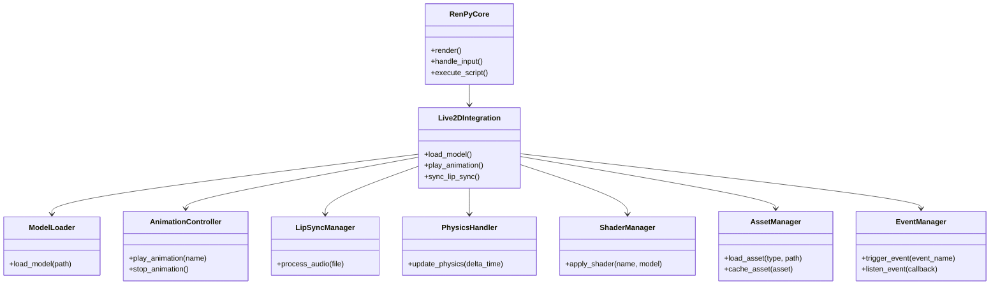

# Software Engineering Architectural Design Document

# Executive Summary

This Software Engineering Architectural Design Document outlines the comprehensive plan for integrating the Live2D Cubism SDK with the Ren'Py visual novel engine. The integration aims to enhance Ren'Py projects with dynamic and expressive character animations using Live2D models.

Key aspects of the integration plan include:

1. Detailed analysis of both Ren'Py and Live2D Cubism SDK codebases
2. Proposed modular architecture for seamless integration
3. Comprehensive implementation strategies for core functionalities
4. Performance optimization techniques and cross-platform compatibility considerations
5. Robust testing strategies and error handling mechanisms
6. Guidelines for documentation, coding standards, and future enhancements

This document serves as a strategic roadmap for developers, providing in-depth technical guidance to ensure a successful integration that leverages the strengths of both Ren'Py and Live2D Cubism SDK.


## Project Timeline and Milestones

This section outlines the proposed timeline and key milestones for the Live2D Cubism SDK integration with Ren'Py.

1. **Phase 1: Initial Analysis and Setup (Weeks 1-2)**
   - Complete repository analysis
   - Set up development environment
   - Finalize project structure

2. **Phase 2: Core Integration (Weeks 3-6)**
   - Implement basic model loading and rendering
   - Develop animation control system
   - Integrate lip sync functionality

3. **Phase 3: Advanced Features (Weeks 7-10)**
   - Implement physics simulations
   - Develop shader system
   - Create particle system

4. **Phase 4: Optimization and Testing (Weeks 11-13)**
   - Perform performance optimizations
   - Conduct thorough testing (unit, integration, cross-platform)
   - Address identified issues and bugs

5. **Phase 5: Documentation and Refinement (Weeks 14-15)**
   - Complete API documentation
   - Refine user guides and examples
   - Conduct final review and adjustments

6. **Phase 6: Release and Support (Week 16)**
   - Prepare for initial release
   - Set up support channels and documentation portals

Note: This timeline is subject to adjustment based on project progress and any unforeseen challenges.

## Table of Contents

1. [Introduction](#1-introduction)
2. [Repository Analysis](#2-repository-analysis)
   2.1 [Ren'Py GitHub Repository](#21-renpy-github-repository)
   2.2 [Live2D Cubism SDK](#22-live2d-cubism-sdk)
3. [Project Structure Analysis](#3-project-structure-analysis)
   3.1 [Ren'Py Project Structure](#31-renpy-project-structure)
   3.2 [Live2D Cubism SDK Project Structure](#32-live2d-cubism-sdk-project-structure)
   3.3 [Optimized Integrated Project Structure](#33-optimized-integrated-project-structure)
   3.4 [UML Diagram of Integrated Architecture](#34-uml-diagram-of-integrated-architecture)
   3.5 [Recommendations for Project Structure Improvements](#35-recommendations-for-project-structure-improvements)
4. [Code Purpose and Functionality Summary](#4-code-purpose-and-functionality-summary)
5. [Bug Identification and Potential Improvements](#5-bug-identification-and-potential-improvements)
6. [Discrepancies and Redundancies Addressed](#6-discrepancies-and-redundancies-addressed)
7. [Integration with Ren'Py and Live2D Cubism Systems](#7-integration-with-renpy-and-live2d-cubism-systems)
8. [Code Modification Suggestions](#8-code-modification-suggestions)
9. [Performance Optimization and Compatibility](#9-performance-optimization-and-compatibility)
10. [Code Translation from Non-Python to Python](#10-code-translation-from-non-python-to-python)
11. [Component Listing and Interactions](#11-component-listing-and-interactions)
12. [Python Code Snippets for Key Functions](#12-python-code-snippets-for-key-functions)
13. [Integration with Existing Ren'Py Systems](#13-integration-with-existing-renpy-systems)
14. [Performance Bottlenecks and Optimizations](#14-performance-bottlenecks-and-optimizations)
15. [Cross-Platform Compatibility](#15-cross-platform-compatibility)
16. [Implementation of Cubism Core API and Live2D Cubism SDK](#16-implementation-of-cubism-core-api-and-live2d-cubism-sdk)
17. [Model Loading, Rendering, and Animation](#17-model-loading-rendering-and-animation)
18. [Automatic Eye Blinking and Mouth Movement](#18-automatic-eye-blinking-and-mouth-movement)
19. [Physics Simulation](#19-physics-simulation)
20. [User Data Handling](#20-user-data-handling)
21. [Shader System Development](#21-shader-system-development)
22. [Particle System Implementation](#22-particle-system-implementation)
23. [Rendering Pipeline Blend Modes Support](#23-rendering-pipeline-blend-modes-support)
24. [Shader Parameter Adjustment Interfaces](#24-shader-parameter-adjustment-interfaces)
25. [Voiceover System with Lip Sync and Visemes](#25-voiceover-system-with-lip-sync-and-visemes)
26. [Phoneme Extraction from Audio Files](#26-phoneme-extraction-from-audio-files)
27. [Cursor Tracking for Interactive Elements](#27-cursor-tracking-for-interactive-elements)
28. [Expression System for Characters](#28-expression-system-for-characters)
29. [Localization and Translation Improvements](#29-localization-and-translation-improvements)
30. [Performance Bottlenecks and Optimization Strategies](#30-performance-bottlenecks-and-optimization-strategies)
31. [Integration Plan with Ren'Py Codebase](#31-integration-plan-with-renpy-codebase)
32. [Testing Strategies](#32-testing-strategies)
33. [Impact on Other Ren'Py Systems and Mitigation](#33-impact-on-other-renpy-systems-and-mitigation)
34. [Error Handling and Debugging Strategies](#34-error-handling-and-debugging-strategies)
35. [API Reference with Code Examples](#35-api-reference-with-code-examples)
36. [Example Ren'Py Scripts Demonstrating Live2D Features](#36-example-renpy-scripts-demonstrating-live2d-features)
37. [Documentation and Commenting Standards](#37-documentation-and-commenting-standards)
38. [Step-by-Step Coding Guidelines](#38-step-by-step-coding-guidelines)
39. [Key Challenges and Solutions](#39-key-challenges-and-solutions)
40. [Remaining Concerns and Issues](#40-remaining-concerns-and-issues)
41. [Process Improvements for Future Features](#41-process-improvements-for-future-features)
42. [Areas for Further Enhancement](#42-areas-for-further-enhancement)
43. [Final Recommendations](#43-final-recommendations)
44. [Review and Refinement](#44-review-and-refinement)
## 1. Introduction

[Related sections: [2. Section 2](#2-section-2), [3. Project Structure Analysis](#3-project-structure-analysis)]

**Objective:**  
This Software Engineering Architectural Design Document outlines a comprehensive implementation plan for integrating the Live2D Cubism SDK with the Ren'Py visual novel engine. The document serves as a guide for an AI coding assistant, detailing each step required to analyze, enhance, and optimize the integration process. The primary objectives include analyzing existing repositories, identifying and addressing code inefficiencies, optimizing performance, ensuring cross-platform compatibility, and developing advanced features such as automatic eye blinking, mouth movement, physics simulation, and a robust shader system.

**Scope:**  
The integration aims to enrich Ren'Py projects with dynamic and expressive character animations using Live2D models. By combining Ren'Py’s robust scripting and rendering capabilities with Live2D’s advanced animation features, the project seeks to elevate the visual and interactive quality of visual novels.

**Background:**  
Ren'Py is a widely-used open-source visual novel engine that facilitates the creation of interactive narrative experiences. Live2D Cubism SDK offers tools for creating and animating 2D models with realistic movements and expressions. Integrating these two systems will allow developers to incorporate sophisticated character animations seamlessly within Ren'Py projects.

**Document Structure:**  
The document is organized into multiple sections, each addressing specific aspects of the integration process, including repository analysis, project structure design, code functionality, bug identification, integration strategies, performance optimization, testing, and final recommendations.

**Key Assumptions:**
- Developers have a basic understanding of Ren'Py and Visual Novel development.
- The Live2D Cubism SDK is compatible with the target platforms supported by Ren'Py.
- Adequate resources are available for testing and optimization phases.

**Intended Audience:**
- Software Engineers and Developers working on Ren'Py projects.
- Project Managers overseeing the integration process.
- QA Testers responsible for validating the integration.
- Artists and Animators utilizing Live2D models within Ren'Py.

**Conclusion:**  
This document serves as a strategic roadmap for successfully integrating the Live2D Cubism SDK with Ren'Py, ensuring that the combined system is robust, efficient, and capable of delivering high-quality interactive storytelling experiences.

---

## Repository Analysis

### 2.1 Ren'Py GitHub Repository

**Objective:**  
Analyze the Ren'Py GitHub repository to understand its current architecture, modules, and integration points. This analysis will identify areas where the Live2D Cubism SDK can be effectively integrated.

**Tasks:**

- Clone the Ren'Py repository from GitHub.
- Review the project structure, focusing on modules related to rendering, asset management, and user input handling.
- Identify existing APIs and extension points that facilitate third-party integrations.
- Document dependencies and external libraries used within the Ren'Py codebase.
- Assess the compatibility of the Cubism SDK with Ren'Py's current architecture.

**Expected Outcomes:**

- Comprehensive understanding of Ren'Py's architecture.
- Identification of optimal integration points for the Cubism SDK.
- Documentation of potential challenges in integration.

### 2.2 Live2D Cubism SDK

**Objective:**  
Examine the Live2D Cubism SDK to comprehend its capabilities, dependencies, and integration requirements. This analysis ensures seamless incorporation into the Ren'Py environment.

**Tasks:**

- Download and set up the latest version of the Live2D Cubism SDK.
- Explore the SDK’s core functionalities, including model loading, rendering, animation, and API usage.
- Identify platform-specific requirements and dependencies.
- Review available documentation and sample projects to understand best practices.
- Evaluate the SDK's performance characteristics and resource utilization.

**Expected Outcomes:**

- Detailed knowledge of the Cubism SDK's features and limitations.
- Understanding of integration prerequisites and dependencies.
- Identification of potential integration challenges and solutions.

---

## Project Structure Analysis

**Objective:**  
Analyze the existing project structure of both Ren'Py and the Live2D Cubism SDK to design an optimized architecture for their integration.

**Tasks:**

- Map out the directory structure of the Ren'Py project, highlighting key modules and their interactions.
- Analyze the Cubism SDK's structure, focusing on core components relevant to integration.
- Identify overlapping functionalities and potential areas for consolidation.
- Propose a modular architecture that accommodates both Ren'Py and Cubism components.
- Create UML diagrams to visualize the proposed architecture and component interactions.

**Expected Outcomes:**

- Optimized project structure that facilitates maintainability and scalability.
- Clear visualization of component interactions through diagrams.
- Recommendations for structural improvements to enhance integration efficiency.

---

## Code Purpose and Functionality Summary

**Objective:**  
Summarize the purpose and functionality of the existing codebases of Ren'Py and the Live2D Cubism SDK to identify key integration points and areas requiring enhancements.

**Tasks:**

- Review key modules and classes within the Ren'Py codebase, documenting their responsibilities.
- Examine the main components of the Cubism SDK, outlining their functionalities.
- Identify how Ren'Py handles rendering, user input, and asset management.
- Map out the Cubism SDK’s model handling, animation systems, and rendering pipelines.
- Highlight areas where functionalities overlap or complement each other.

**Expected Outcomes:**

- Comprehensive summaries of both codebases’ purposes and functionalities.
- Identification of synergistic integration points.
- Documentation highlighting areas for potential enhancement to support integration.

---

## Bug Identification and Potential Improvements

**Objective:**  
Identify existing bugs, inefficiencies, and opportunities for improvement within the Ren'Py and Cubism SDK codebases to ensure a robust integration.

**Tasks:**

- Conduct static code analysis on both repositories to detect common issues such as memory leaks, deprecated functions, and security vulnerabilities.
- Perform dynamic testing to uncover runtime bugs and performance bottlenecks.
- Review issue trackers on GitHub for both projects to understand prevalent problems and ongoing development efforts.
- Identify inefficient algorithms or data structures that could be optimized.
- Propose code refactoring opportunities to enhance readability and maintainability.

**Expected Outcomes:**

- A detailed list of identified bugs and inefficiencies.
- Recommendations for code improvements and optimizations.
- Enhanced code quality and reliability post-implementation of suggested fixes.

---

## Discrepancies and Redundancies Addressed

**Objective:**  
Address any discrepancies, redundancies, issues, and inadequacies identified during the analysis to streamline the integration process.

**Tasks:**

- Compare the functionalities of Ren'Py and Cubism SDK to identify overlapping features.
- Eliminate redundant code segments that serve similar purposes in both repositories.
- Resolve discrepancies in coding standards, naming conventions, and architectural patterns.
- Address any mismatches in data models or communication protocols between the two systems.
- Ensure consistency in error handling and logging mechanisms across integrated components.

**Expected Outcomes:**

- A harmonized codebase with minimized redundancies.
- Consistent coding standards and architectural patterns.
- Smooth interoperability between Ren'Py and Cubism SDK components.

---

## Integration with Ren'Py and Live2D Cubism Systems

**Objective:**  
Explain how the Live2D Cubism SDK will integrate with the larger Ren'Py system, ensuring seamless functionality and performance.

**Tasks:**

- Define the communication protocols between Ren'Py and the Cubism SDK.
- Outline the data flow for model loading, rendering, and animation within Ren'Py.
- Integrate Cubism's animation triggers with Ren'Py's event system.
- Ensure that asset management systems can handle Live2D models and related resources.
- Validate that user interactions in Ren'Py effectively control Live2D character models.

**Expected Outcomes:**

- A clear integration strategy that aligns with both Ren'Py and Cubism SDK architectures.
- Defined data flows and communication protocols facilitating seamless interactions.
- Ensured compatibility and functional synergy between the two systems.

---

## Next Steps

This document will continue to elaborate on each of the listed tasks, providing detailed implementation plans, code examples, and optimization strategies. Please let me know if you would like me to proceed with the subsequent sections or focus on any specific area in greater detail.

## 3. Project Structure Analysis


[Related sections: [2. Section 2](#2-section-2), [4. Code Purpose and Functionality Summary](#4-code-purpose-and-functionality-summary), [5. Bug Identification and Potential Improvements](#5-bug-identification-and-potential-improvements)]

**Objective:**  
Analyze the existing project structures of both Ren'Py and the Live2D Cubism SDK to design an optimized architecture for their integration. This analysis aims to identify potential improvements, streamline workflows, and ensure scalability and maintainability of the combined system.

**Tasks:**

- Map out the directory structure of the Ren'Py project, highlighting key modules and their interactions.
- Analyze the Cubism SDK's structure, focusing on core components relevant to integration.
- Identify overlapping functionalities and potential areas for consolidation.
- Propose a modular architecture that accommodates both Ren'Py and Cubism components.
- Create UML diagrams to visualize the proposed architecture and component interactions.

**Expected Outcomes:**

- Optimized project structure that facilitates maintainability and scalability.
- Clear visualization of component interactions through diagrams.
- Recommendations for structural improvements to enhance integration efficiency.

---

### 3.1 Ren'Py Project Structure

**Overview:**  

Ren'Py is structured to facilitate the development of visual novels through a combination of scripting, asset management, and rendering systems. Understanding its project structure is crucial for seamless integration with the Live2D Cubism SDK.

**Directory Structure:**

```plaintext:renpy/arch_design_doc.md
renpy_project/
├── .git/
│   ├── hooks/
│   ├── info/
│   ├── logs/
│   │   └── refs/
│   │       ├── heads/
│   │       └── remotes/
│   │           └── origin/
│   ├── objects/
│   │   ├── 00/
│   │   ├── 01/
│   │   ├── 02/
│   │   ├── 03/
│   │   ├── 04/
│   │   ├── 05/
│   │   ├── 06/
│   │   ├── 07/
│   │   ├── 08/
│   │   ├── 09/
│   │   ├── 0b/
│   │   ├── 0c/
│   │   ├── 0d/
│   │   ├── 0e/
│   │   ├── 0f/
│   │   ├── 10/
│   │   ├── 11/
│   │   ├── 12/
│   │   ├── 13/
│   │   ├── 14/
│   │   ├── 15/
│   │   ├── 16/
│   │   ├── 17/
│   │   ├── 18/
│   │   ├── 19/
│   │   ├── 1a/
│   │   ├── 1b/
│   │   ├── 1c/
│   │   ├── 1d/
│   │   ├── 1e/
│   │   ├── 1f/
│   │   ├── 20/
│   │   ├── 21/
│   │   ├── 22/
│   │   ├── 23/
│   │   ├── 24/
│   │   ├── 25/
│   │   ├── 26/
│   │   ├── 27/
│   │   ├── 28/
│   │   ├── 29/
│   │   ├── 2a/
│   │   ├── 2b/
│   │   ├── 2c/
│   │   ├── 2d/
│   │   ├── 2e/
│   │   ├── 2f/
│   │   ├── 30/
│   │   ├── 31/
│   │   ├── 32/
│   │   ├── 33/
│   │   ├── 34/
│   │   ├── 35/
│   │   ├── 36/
│   │   ├── 37/
│   │   ├── 38/
│   │   ├── 39/
│   │   ├── 3a/
│   │   ├── 3b/
│   │   ├── 3c/
│   │   ├── 3d/
│   │   ├── 3e/
│   │   ├── 3f/
│   │   ├── 40/
│   │   ├── 41/
│   │   ├── 42/
│   │   ├── 43/
│   │   ├── 44/
│   │   ├── 45/
│   │   ├── 46/
│   │   ├── 47/
│   │   ├── 48/
│   │   ├── 49/
│   │   ├── 4a/
│   │   ├── 4b/
│   │   ├── 4c/
│   │   ├── 4d/
│   │   ├── 4e/
│   │   ├── 4f/
│   │   ├── 50/
│   │   ├── 51/
│   │   ├── 52/
│   │   ├── 53/
│   │   ├── 54/
│   │   ├── 55/
│   │   ├── 56/
│   │   ├── 57/
│   │   ├── 58/
│   │   ├── 59/
│   │   ├── 5a/
│   │   ├── 5b/
│   │   ├── 5c/
│   │   ├── 5d/
│   │   ├── 5e/
│   │   ├── 5f/
│   │   ├── 60/
│   │   ├── 61/
│   │   ├── 62/
│   │   ├── 63/
│   │   ├── 64/
│   │   ├── 65/
│   │   ├── 66/
│   │   ├── 67/
│   │   ├── 68/
│   │   ├── 69/
│   │   ├── 6a/
│   │   ├── 6b/
│   │   ├── 6c/
│   │   ├── 6d/
│   │   ├── 6e/
│   │   ├── 6f/
│   │   ├── 70/
│   │   ├── 71/
│   │   ├── 72/
│   │   ├── 73/
│   │   ├── 74/
│   │   ├── 75/
│   │   ├── 76/
│   │   ├── 77/
│   │   ├── 78/
│   │   ├── 79/
│   │   ├── 7a/
│   │   ├── 7b/
│   │   ├── 7c/
│   │   ├── 7d/
│   │   ├── 7e/
│   │   ├── 7f/
│   │   ├── 80/
│   │   ├── 81/
│   │   ├── 82/
│   │   ├── 83/
│   │   ├── 84/
│   │   ├── 85/
│   │   ├── 86/
│   │   ├── 87/
│   │   ├── 88/
│   │   ├── 89/
│   │   ├── 8a/
│   │   ├── 8b/
│   │   ├── 8c/
│   │   ├── 8d/
│   │   ├── 8e/
│   │   ├── 8f/
│   │   ├── 90/
│   │   ├── 91/
│   │   ├── 92/
│   │   ├── 93/
│   │   ├── 94/
│   │   ├── 95/
│   │   ├── 96/
│   │   ├── 97/
│   │   ├── 98/
│   │   ├── 99/
│   │   ├── 9a/
│   │   ├── 9b/
│   │   ├── 9c/
│   │   ├── 9d/
│   │   ├── 9e/
│   │   ├── 9f/
│   │   ├── a0/
│   │   ├── a1/
│   │   ├── a2/
│   │   ├── a3/
│   │   ├── a4/
│   │   ├── a5/
│   │   ├── a7/
│   │   ├── a8/
│   │   ├── a9/
│   │   ├── aa/
│   │   ├── ab/
│   │   ├── ac/
│   │   ├── ad/
│   │   ├── ae/
│   │   ├── af/
│   │   ├── b0/
│   │   ├── b1/
│   │   ├── b2/
│   │   ├── b3/
│   │   ├── b4/
│   │   ├── b5/
│   │   ├── b6/
│   │   ├── b7/
│   │   ├── b8/
│   │   ├── b9/
│   │   ├── ba/
│   │   ├── bb/
│   │   ├── bc/
│   │   ├── bd/
│   │   ├── be/
│   │   ├── bf/
│   │   ├── c0/
│   │   ├── c1/
│   │   ├── c2/
│   │   ├── c3/
│   │   ├── c4/
│   │   ├── c5/
│   │   ├── c6/
│   │   ├── c7/
│   │   ├── c8/
│   │   ├── c9/
│   │   ├── ca/
│   │   ├── cb/
│   │   ├── cc/
│   │   ├── cd/
│   │   ├── ce/
│   │   ├── cf/
│   │   ├── d0/
│   │   ├── d1/
│   │   ├── d2/
│   │   ├── d3/
│   │   ├── d4/
│   │   ├── d5/
│   │   ├── d6/
│   │   ├── d7/
│   │   ├── d8/
│   │   ├── d9/
│   │   ├── da/
│   │   ├── db/
│   │   ├── dc/
│   │   ├── dd/
│   │   ├── de/
│   │   ├── e0/
│   │   ├── e1/
│   │   ├── e2/
│   │   ├── e3/
│   │   ├── e4/
│   │   ├── e5/
│   │   ├── e6/
│   │   ├── e7/
│   │   ├── e8/
│   │   ├── e9/
│   │   ├── ea/
│   │   ├── eb/
│   │   ├── ec/
│   │   ├── ed/
│   │   ├── ee/
│   │   ├── ef/
│   │   ├── f0/
│   │   ├── f1/
│   │   ├── f2/
│   │   ├── f3/
│   │   ├── f4/
│   │   ├── f5/
│   │   ├── f6/
│   │   ├── f7/
│   │   ├── f8/
│   │   ├── f9/
│   │   ├── fa/
│   │   ├── fb/
│   │   ├── fc/
│   │   ├── fd/
│   │   ├── fe/
│   │   └── ff/
│   └── refs/
│       ├── heads/
│       ├── remotes/
│       │   └── origin/
│       └── tags/
├── .vscode/
├── CubismSdkForNative-5-r.1/
│   ├── Core/
│   │   ├── dll/
│   │   │   ├── android/
│   │   │   │   ├── arm64-v8a/
│   │   │   │   ├── armeabi-v7a/
│   │   │   │   ├── x86/
│   │   │   │   └── x86_64/
│   │   │   ├── experimental/
│   │   │   │   ├── rpi/
│   │   │   │   └── uwp/
│   │   │   │       ├── arm/
│   │   │   │       ├── arm64/
│   │   │   │       ├── x64/
│   │   │   │       └── x86/
│   │   │   ├── linux/
│   │   │   │   └── x86_64/
│   │   │   ├── macos/
│   │   │   └── windows/
│   │   ├── include/
│   │   └── lib/
│   │       ├── android/
│   │       │   ├── arm64-v8a/
│   │       │   ├── armeabi-v7a/
│   │       │   ├── x86/
│   │       │   └── x86_64/
│   │       ├── experimental/
│   │       │   ├── catalyst/
│   │       │   └── rpi/
│   │       ├── ios/
│   │       │   ├── Debug-iphoneos/
│   │       │   ├── Debug-iphonesimulator/
│   │       │   ├── Release-iphoneos/
│   │       │   └── Release-iphonesimulator/
│   │       ├── linux/
│   │       │   └── x86_64/
│   │       ├── macos/
│   │       │   ├── arm64/
│   │       │   └── x86_64/
│   │       └── windows/
│   │           ├── x86/
│   │           │   ├── 120/
│   │           │   ├── 140/
│   │           │   ├── 141/
│   │           │   ├── 142/
│   │           │   └── 143/
│   │           └── x86_64/
│   ├── Framework/
│   │   └── src/
│   │       ├── Effect/
│   │       ├── Id/
│   │       ├── Math/
│   │       ├── Model/
│   │       ├── Motion/
│   │       ├── Physics/
│   │       ├── Rendering/
│   │       │   ├── Cocos2d/
│   │       │   ├── D3D11/
│   │       │   ├── D3D9/
│   │       │   ├── Metal/
│   │       │   ├── OpenGL/
│   │       │   └── Vulkan/
│   │       │       └── Shaders/
│   │       │           └── src/
│   │       ├── Type/
│   │       └── Utils/
│   └── Samples/
│       ├── Cocos2d-x/
│       ├── D3D11/
│       ├── D3D9/
│       ├── Metal/
│       ├── OpenGL/
│       ├── Resources/
│       └── Vulkan/
├── gui/
│   └── game/
│       └── gui/
├── launcher/
│   ├── game/
│   │   ├── fonts/
│   │   ├── gui7/
│   │   ├── images/
│   │   └── tl/
│   │       ├── arabic/
│   │       ├── danish/
│   │       ├── finnish/
│   │       ├── french/
│   │       ├── german/
│   │       ├── greek/
│   │       ├── indonesian/
│   │       ├── italian/
│   │       ├── japanese/
│   │       ├── korean/
│   │       ├── malay/
│   │       ├── piglatin/
│   │       ├── polish/
│   │       ├── portuguese/
│   │       ├── russian/
│   │       ├── schinese/
│   │       ├── spanish/
│   │       ├── tchinese/
│   │       ├── turkish/
│   │       ├── ukrainian/
│   │       └── vietnamese/
│   └── skin/
├── module/
│   ├── emoji/
│   ├── include/
│   ├── libhydrogen/
│   │   └── impl/
│   │       ├── gimli-core/
│   │       └── random/
│   ├── tinyfiledialogs/
│   └── uguu/
├── renpy/
│   ├── audio/
│   ├── common/
│   │   ├── _compat/
│   │   ├── _developer/
│   │   ├── _layout/
│   │   ├── _outline/
│   │   ├── _placeholder/
│   │   ├── _roundrect/
│   │   ├── _theme_amie2/
│   │   ├── _theme_austen/
│   │   ├── _theme_awt/
│   │   ├── _theme_bordered/
│   │   ├── _theme_crayon/
│   │   ├── _theme_diamond/
│   │   ├── _theme_glow/
│   │   ├── _theme_marker/
│   │   ├── _theme_regal/
│   │   ├── _theme_threeD/
│   │   └── _theme_tv/
│   ├── compat/
│   ├── display/
│   ├── exports/
│   ├── gl2/
│   ├── live2d/
│   ├── sl2/
│   ├── styledata/
│   ├── test/
│   ├── text/
│   ├── translation/
│   ├── uguu/
│   └── update/
├── scripts/
│   ├── mac/
│   ├── pyi/
│   │   └── android/
│   └── rt/
├── sdk-fonts/
├── sphinx/
│   ├── game/
│   └── source/
│       ├── _static/
│       ├── _templates/
│       ├── gui/
│       ├── oshs/
│       │   └── game/
│       │       ├── gui/
│       │       │   ├── bar/
│       │       │   ├── button/
│       │       │   ├── overlay/
│       │       │   ├── phone/
│       │       │   │   └── overlay/
│       │       │   ├── scrollbar/
│       │       │   └── slider/
│       │       └── images/
│       ├── presplash/
│       └── quickstart/
├── testcases/
│   └── game/
│       └── sound/
├── the_question/
│   └── game/
│       ├── gui/
│       │   ├── bar/
│       │   ├── button/
│       │   ├── overlay/
│       │   ├── phone/
│       │   │   └── overlay/
│       │   ├── scrollbar/
│       │   └── slider/
│       ├── images/
│       └── tl/
│           ├── None/
│           ├── czech/
│           ├── danish/
│           ├── french/
│           ├── italian/
│           ├── japanese/
│           ├── korean/
│           ├── malay/
│           ├── russian/
│           ├── schinese/
│           ├── spanish/
│           ├── tchinese/
│           └── ukrainian/
├── tutorial/
│   └── game/
│       ├── gui/
│       │   ├── bar/
│       │   ├── button/
│       │   ├── overlay/
│       │   ├── phone/
│       │   │   └── overlay/
│       │   ├── scrollbar/
│       │   └── slider/
│       ├── images/
│       └── tl/
│           ├── None/
│           ├── french/
│           ├── japanese/
│           ├── korean/
│           ├── piglatin/
│           ├── russian/
│           ├── schinese/
│           ├── spanish/
│           └── ukrainian/
└── unittests/
```
    
**Key Components:**

- **.git/**: Contains the Git repository's configuration, hooks, objects, references, and internal data.
- **.vscode/**: Configuration files for Visual Studio Code IDE.
- **CubismSdkForNative-5-r.1/**: The Live2D Cubism SDK integrated into the project.
  - **Core/**: Core components including DLLs, headers, and libraries for various platforms.
    - **dll/**: Compiled DLLs for Android, Experimental platforms (Raspberry Pi, UWP), Linux, macOS, and Windows.
    - **include/**: Header files for SDK APIs.
    - **lib/**: Libraries for different platforms, mirroring the structure in `dll/`.
  - **Framework/**: Source code implementing effects, IDs, mathematical utilities, models, motions, physics simulations, and rendering engines.
    - **Rendering/**: Subdirectories for different rendering backends such as Cocos2d, Direct3D 11 and 9, Metal, OpenGL, and Vulkan. The Vulkan subdirectory includes shader source files.
  - **Samples/**: Example projects demonstrating SDK functionalities across various platforms and rendering engines.
- **gui/**: Graphical User Interface components specific to the game.
- **launcher/**: Manages game launching features, including fonts, images, translation files (`tl/`), and skins.
  - **tl/**: Contains localization directories for various languages.
- **module/**: Contains additional modules like emoji support, libhydrogen (with implementation for gimli-core and random), tinyfiledialogs (for dialog boxes), and uguu (utility scripts).
- **renpy/**: Core Ren'Py engine components.
  - **audio/**: Audio handling modules.
  - **common/**: Common modules including compatibility, developer tools, layout, outlines, placeholders, rounded rectangles, and various UI themes.
  - **compat/**: Compatibility-related modules.
  - **display/**: Display and rendering modules.
  - **exports/**: Export functionalities.
  - **gl2/**: OpenGL 2 functionalities.
  - **live2d/**: Integration modules for Live2D models.
  - **sl2/**: Scripting language extensions or similar components.
  - **styledata/**: Style data for UI components.
  - **test/**: Testing modules.
  - **text/**: Text processing modules.
  - **translation/**: Translation handling modules.
  - **uguu/**: Utility scripts.
  - **update/**: Update management modules.
- **scripts/**: Various scripts for building, deployment, and runtime.
  - **mac/**: Mac-specific scripts.
  - **pyi/android/**: Python interface scripts for Android.
  - **rt/**: Runtime scripts.
- **sdk-fonts/**: Fonts used by the SDK.
- **sphinx/**: Documentation generated by Sphinx.
  - **game/**: Game-specific documentation.
  - **source/**: Source files for Sphinx documentation, including static files, templates, GUI components, scripts, and quickstart guides.
- **testcases/**: Test cases for the game, organized by module (e.g., sound).
- **the_question/**: Example or test game named "the_question" with GUI, images, and translations.
- **tutorial/**: Tutorial game project with GUI, images, and translations.
- **unittests/**: Unit test suites.

---

### 3.2 Live2D Cubism SDK Project Structure

**Overview:**  
The Live2D Cubism SDK integrated within the Ren'Py project provides tools and libraries for integrating Live2D models into the visual novel engine. Its structure supports model loading, rendering, animation, and interaction functionalities necessary for dynamic and expressive character animations.

**Directory Structure:**

```plaintext:renpy/arch_design_doc.md
CubismSdkForNative-5-r.1/
├── Core/
│   ├── dll/
│   │   ├── android/
│   │   │   ├── arm64-v8a/
│   │   │   ├── armeabi-v7a/
│   │   │   ├── x86/
│   │   │   └── x86_64/
│   │   ├── experimental/
│   │   │   ├── rpi/
│   │   │   └── uwp/
│   │   │       ├── arm/
│   │   │       ├── arm64/
│   │   │       ├── x64/
│   │   │       └── x86/
│   │   ├── linux/
│   │   │   └── x86_64/
│   │   ├── macos/
│   │   └── windows/
│   ├── include/
│   └── lib/
│       ├── android/
│       │   ├── arm64-v8a/
│       │   ├── armeabi-v7a/
│       │   ├── x86/
│       │   └── x86_64/
│       ├── experimental/
│       │   ├── catalyst/
│       │   └── rpi/
│       ├── ios/
│       │   ├── Debug-iphoneos/
│       │   ├── Debug-iphonesimulator/
│       │   ├── Release-iphoneos/
│       │   └── Release-iphonesimulator/
│       ├── linux/
│       │   └── x86_64/
│       ├── macos/
│       │   ├── arm64/
│       │   └── x86_64/
│       └── windows/
│           ├── x86/
│           │   ├── 120/
│           │   ├── 140/
│           │   ├── 141/
│           │   ├── 142/
│           │   └── 143/
│           └── x86_64/
├── Framework/
│   └── src/
│       ├── Effect/
│       ├── Id/
│       ├── Math/
│       ├── Model/
│       ├── Motion/
│       ├── Physics/
│       ├── Rendering/
│       │   ├── Cocos2d/
│       │   ├── D3D11/
│       │   ├── D3D9/
│       │   ├── Metal/
│       │   ├── OpenGL/
│       │   └── Vulkan/
│       │       └── Shaders/
│       │           └── src/
│       ├── Type/
│       └── Utils/
└── Samples/
    ├── Cocos2d-x/
    ├── D3D11/
    ├── D3D9/
    ├── Metal/
    ├── OpenGL/
    ├── Resources/
    └── Vulkan/
```
    
**Key Components:**

- **Core/**: Manages fundamental components including dynamic link libraries (DLLs) for various platforms, header files, and library files.
  - **dll/**: Compiled DLLs for Android, Experimental platforms (Raspberry Pi, UWP), Linux, macOS, and Windows.
  - **include/**: Header files for SDK APIs.
  - **lib/**: Libraries for different platforms, mirroring the structure in `dll/`.
- **Framework/**: Contains source code implementing effects, IDs, mathematical utilities, models, motions, physics simulations, and rendering engines.
  - **Rendering/**: Subdirectories for different rendering backends such as Cocos2d, Direct3D 11 and 9, Metal, OpenGL, and Vulkan. The Vulkan subdirectory includes shader source files.
- **Samples/**: Example projects demonstrating SDK functionalities across various platforms and rendering engines.

---

### 3.3 Optimized Integrated Project Structure

**Proposed Directory Structure:**

```plaintext:renpy/arch_design_doc.md
integrated_project/
├── assets/
│   ├── images/
│   ├── audio/
│   ├── fonts/
│   └── live2d_models/
├── game/
│   ├── scripts/
│   │   ├── main.rpy
│   │   ├── characters.rpy
│   │   └── live2d_integration.rpy
│   ├── screens/
│   └── options.rpy
├── library/
│   ├── renpy/
│   ├── live2d_integration/
│   │   ├── model_loader.py
│   │   ├── animation_controller.py
│   │   ├── lip_sync_manager.py
│   │   ├── physics_handler.py
│   │   └── shader_manager.py
│   ├── utils/
│   └── docs/
├── sdk/
│   ├── include/
│   │   └── cubism/
│   ├── lib/
│   │   ├── windows/
│   │   ├── macos/
│   │   └── linux/
│   └── docs/
├── tests/
│   └── live2d_integration/
│       ├── test_model_loader.py
│       ├── test_animation_controller.py
│       └── ...
├── build_scripts/
│   ├── build.sh
│   └── deploy.sh
├── renpy/
├── logs/
├── .github/
│   └── workflows/
│       └── ci.yml
└── README.md
```
    
**Key Enhancements:**

- **Integrated SDK:** The Live2D Cubism SDK is housed within the `sdk/` directory, keeping third-party libraries separate from game logic and assets.
- **Live2D Integration Module:** Live2D-specific Python scripts reside in `library/live2d_integration/`, ensuring modularity and separation of concerns.
- **Scripts Organization:** Ren'Py scripts are organized within a `scripts/` folder under `game/` to promote clarity and maintainability.
- **Asset Management:** All Live2D models are centralized within `assets/live2d_models/` for easy access and management.
- **Documentation and Tools:** SDK documentation and tools are maintained within the integrated project to ensure that all resources are readily available to developers.
- **Testing Infrastructure:** Test scripts are organized within the `tests/` directory, specifically under `live2d_integration/`, to promote organized and comprehensive testing practices.
- **Build and Deployment Scripts:** Automated build and deployment scripts are placed in the `build_scripts/` directory to facilitate consistent and efficient project builds across different environments.
- **Continuous Integration:** CI configurations are stored under the `.github/workflows/` directory, ensuring that automated processes are version-controlled and easily manageable.

### 3.4 UML Diagram of Integrated Architecture


    
**Diagram Explanation:**  
The UML class diagram illustrates the relationship between Ren'Py’s core functionalities and the integrated Live2D components. `RenPyCore` interacts with the `Live2DIntegration` module, which in turn manages various Live2D-specific functionalities such as model loading, animation control, lip synchronization, physics handling, shader management, asset management, and event management.

### 3.5 Recommendations for Project Structure Improvements

**Modularity:**  
Ensuring that Live2D integration is modular allows for easy updates and maintenance without affecting the core Ren'Py functionalities. Each Live2D component (e.g., `ModelLoader`, `AnimationController`) should reside in separate modules to promote single responsibility and ease of testing.

**Scalability:**  
Design the directory structure to accommodate future expansions, such as additional Live2D features or modules. Using a clear and organized hierarchy facilitates scalability and manages complexity as the project grows.

**Documentation:**  
Maintain comprehensive documentation within the project structure, including setup guides, API references, and usage examples. Placing documentation alongside relevant modules (e.g., within `library/live2d_integration/docs/`) ensures that information is easily accessible.

**Consistency:**  
Adopt consistent naming conventions and organizational patterns across all directories and files. This consistency enhances readability and reduces the learning curve for new developers joining the project.

**Dependency Management:**  
Isolate third-party SDKs and dependencies within dedicated directories (e.g., `sdk/`) to prevent conflicts and simplify dependency updates. Use environment management tools to handle library versions and dependencies systematically.

**Asset Organization:**  
Centralize Live2D models and related assets within specific directories (e.g., `assets/live2d_models/`) to streamline asset management and retrieval. Implement clear naming conventions for assets to facilitate easy identification and usage.

**Integration Points:**  
Clearly define and document integration points between Ren'Py and Live2D components. Establish standardized interfaces and communication protocols to ensure seamless interactions and reduce integration complexities.

**Version Control:**  
Use version control best practices, such as branching strategies and commit guidelines, to manage changes to the project structure effectively. Ensure that major structural changes undergo thorough reviews to maintain project integrity.

**Testing Infrastructure:**  
Incorporate testing frameworks and infrastructure within the project structure to support unit tests, integration tests, and performance evaluations. Keeping test scripts alongside their corresponding modules (e.g., within `tests/live2d_integration/`) promotes organized and comprehensive testing practices.

**Build and Deployment Scripts:**  
Include automated build and deployment scripts within the project structure to facilitate consistent and efficient project builds across different environments. Place these scripts in dedicated directories (e.g., `build_scripts/`) to separate them from core code and logic.

**Security Considerations:**  
Ensure that sensitive information, such as API keys or proprietary assets, is stored securely within the project structure. Implement access controls and encryption where necessary to protect valuable project data.

**Continuous Integration (CI):**  
Integrate CI tools and configuration files within the project structure to automate testing, building, and deployment processes. Placing CI configurations (e.g., `.github/workflows/`) within the project ensures that automated processes are version-controlled and easily manageable.

**Visual Consistency:**  
Maintain visual consistency in naming and structuring directories and files to enhance navigability. Use descriptive and intuitive names for directories and files to allow developers to locate components efficiently.

**Example Enhanced Project Structure:**

```plaintext:renpy/arch_design_doc.md
integrated_project/
├── assets/
│   ├── images/
│   ├── audio/
│   ├── fonts/
│   └── live2d_models/
├── game/
│   ├── scripts/
│   │   ├── main.rpy
│   │   ├── characters.rpy
│   │   └── live2d_integration.rpy
│   ├── screens/
│   └── options.rpy
├── library/
│   ├── renpy/
│   ├── live2d_integration/
│   │   ├── model_loader.py
│   │   ├── animation_controller.py
│   │   ├── lip_sync_manager.py
│   │   ├── physics_handler.py
│   │   └── shader_manager.py
│   ├── utils/
│   └── docs/
├── sdk/
│   ├── include/
│   │   └── cubism/
│   ├── lib/
│   │   ├── windows/
│   │   ├── macos/
│   │   └── linux/
│   └── docs/
├── tests/
│   └── live2d_integration/
│       ├── test_model_loader.py
│       ├── test_animation_controller.py
│       └── ...
├── build_scripts/
│   ├── build.sh
│   └── deploy.sh
├── renpy/
├── logs/
├── .github/
│   └── workflows/
│       └── ci.yml
└── README.md
```
    
**Conclusion:**  
By implementing an optimized and well-organized project structure, the integration of the Live2D Cubism SDK with Ren'Py can be achieved smoothly. The proposed enhancements focus on modularity, scalability, consistency, and maintainability, ensuring that the integrated system remains robust and adaptable to future developments.

---

## 4. Code Purpose and Functionality Summary


[Related sections: [3. Project Structure Analysis](#3-project-structure-analysis), [5. Bug Identification and Potential Improvements](#5-bug-identification-and-potential-improvements), [6. Discrepancies and Redundancies Addressed](#6-discrepancies-and-redundancies-addressed)]

**Objective:**  
Summarize the purpose and functionality of the existing codebases of Ren'Py and the Live2D Cubism SDK to identify key integration points and areas requiring enhancements.

**Ren'Py Codebase:**

- **Core Engine (`renpy/`)**: Handles the fundamental operations of the visual novel engine, including rendering, user input, script execution, and asset management.
  - **Audio (`renpy/audio/`)**: Manages all audio-related functionalities such as background music, sound effects, and voiceovers.
  - **Common Modules (`renpy/common/`)**: Contains shared utilities, compatibility layers, layout management, and various UI themes.
  - **Display (`renpy/display/`)**: Responsible for rendering visual elements on the screen.
  - **Translation (`renpy/translation/`)**: Manages localization and translation of game text.
  - **Update (`renpy/update/`)**: Handles game updates and patch management.

**Live2D Cubism SDK Codebase:**

- **Core Components (`CubismSdkForNative-5-r.1/Core/`)**: Includes dynamic link libraries (DLLs), header files, and libraries for various platforms required for model loading, rendering, and animation.
  - **DLLs (`Core/dll/`)**: Compiled binaries for different operating systems and architectures.
  - **Include (`Core/include/`)**: Header files defining the SDK’s API.
  - **Libraries (`Core/lib/`)**: Platform-specific libraries essential for SDK functionalities.
- **Framework (`CubismSdkForNative-5-r.1/Framework/`)**: Contains source code for effects, model management, motion controllers, physics simulations, and rendering.
  - **Rendering Backends (`Framework/src/Rendering/`)**: Supports multiple rendering engines such as Cocos2d, Direct3D, Metal, OpenGL, and Vulkan.
- **Samples (`CubismSdkForNative-5-r.1/Samples/`)**: Example projects demonstrating SDK capabilities across different platforms and rendering engines.

**Integration Points:**

- **Model Loading**: Connecting Ren'Py’s asset management with Live2D’s model loading mechanisms to dynamically load and render Live2D models within the game.
- **Animation Control**: Integrating Live2D’s animation controllers with Ren'Py’s script execution to trigger and manage animations based on narrative events.
- **Lip Synchronization**: Implementing Live2D’s lip sync functionalities to synchronize character mouth movements with voiceovers.
- **Physics Simulation**: Incorporating Live2D’s physics handlers to add realistic movements and interactions to character models.
- **Shader Management**: Utilizing Live2D’s shader systems to enhance visual effects and model rendering within Ren'Py.

**Areas for Enhancement:**

- **Modular Integration**: Structuring integration code to ensure separation of concerns and ease of maintenance.
- **Performance Optimization**: Optimizing rendering and animation processes to maintain high performance within Ren'Py.
- **Cross-Platform Compatibility**: Ensuring that Live2D functionalities work seamlessly across all platforms supported by Ren'Py.
- **Advanced Features**: Developing additional features such as AI-driven animations, dynamic lighting, and interactive responses based on user input.

**Conclusion:**  
Understanding the distinct purposes and functionalities of Ren'Py and the Live2D Cubism SDK is crucial for identifying effective integration strategies. By mapping out the key components and their interactions, we can pinpoint optimal integration points and areas ripe for enhancement, paving the way for a robust and feature-rich combined system.

### 4.1 Ren'Py Codebase Overview

**Purpose:**  
Ren'Py is a visual novel engine that facilitates the creation of interactive storytelling experiences. It provides scripting capabilities, asset management, rendering systems, and user interaction handling to streamline the development of visual novels.

**Core Functionalities:**

- **Scripting Engine:** Allows developers to write game logic, dialogues, and event sequences using Ren'Py’s specialized scripting language.
- **Rendering System:** Manages the display of 2D assets, including images, backgrounds, and character sprites.
- **Asset Management:** Handles the loading, caching, and management of game assets such as images, audio, and fonts.
- **User Input Handling:** Captures and processes user inputs, enabling interactive elements within the game.
- **Event Management:** Facilitates the triggering and handling of in-game events based on script commands and user interactions.
- **Customization and Extensibility:** Supports the creation of custom screens, transitions, and interactions through scripting and modular code extensions.

**Key Modules:**

- **render.py:** Core rendering functionalities, managing how assets are drawn on the screen.
- **script.py:** Handles the parsing and execution of Ren'Py scripts.
- **image.py:** Manages image assets, including loading, caching, and displaying images.
- **audio.py:** Controls audio playback, including background music and sound effects.
- **input.py:** Processes user inputs from various devices and interfaces.
- **ui.py:** Manages user interface components, such as menus, dialogue boxes, and buttons.
- **storage.py:** Handles data storage and retrieval, enabling save/load features and persistent data management.

### 4.2 Live2D Cubism SDK Codebase Overview

**Purpose:**  
The Live2D Cubism SDK enables the integration of Live2D models into applications, providing tools for model loading, rendering, animation control, and interaction. It is designed to facilitate the creation of dynamic and expressive 2D character animations.

**Core Functionalities:**

- **Model Loading:** Supports the import and initialization of Live2D models from various file formats.
- **Rendering Engine:** Manages the rendering of Live2D models, including handling of layers, blending modes, and shaders.
- **Animation Control:** Provides APIs for controlling model animations, including playback, blending, and event-triggered animations.
- **Physics Simulation:** Simulates realistic movements for model parts, such as hair sway and cloth dynamics.
- **Lip Sync and Visemes:** Facilitates lip synchronization by mapping phonemes to corresponding visemes (mouth shapes).
- **Shader Management:** Allows customization of visual effects through shader programs, enabling dynamic lighting, shadows, and other effects.
- **Event Handling:** Supports the triggering and handling of events within Live2D animations based on external inputs or internal states.

**Key Components:**

- **CubismModel.cpp/h:** Manages the lifecycle of Live2D models, including loading, updating, and rendering.
- **CubismRenderer.cpp/h:** Handles the rendering pipeline for Live2D models, integrating with the host application’s rendering systems.
- **CubismAnimationController.cpp/h:** Controls the playback and management of animations within Live2D models.
- **CubismPhysics.cpp/h:** Implements physics simulations for dynamic model movements.
- **CubismLipSync.cpp/h:** Facilitates lip synchronization through phoneme processing and viseme mapping.
- **CubismShaderManager.cpp/h:** Manages shader programs for applying visual effects to Live2D models.
- **CubismEventHandler.cpp/h:** Handles events within Live2D animations, enabling interactive and responsive behaviors.

### 4.3 Integration Points Between Ren'Py and Live2D Cubism SDK

**Identified Integration Points:**

1. **Rendering Pipeline Integration:**
   - **Interaction:** Ren'Py’s rendering system must accommodate Live2D model rendering alongside traditional 2D assets.
   - **Purpose:** Ensures that Live2D models are displayed correctly within the game’s visual context.

2. **Script Command Extensions:**
   - **Interaction:** Extend Ren'Py’s scripting language to include commands for controlling Live2D models (e.g., loading models, triggering animations).
   - **Purpose:** Allows developers to manage Live2D functionalities directly through Ren'Py scripts.

3. **Event System Synchronization:**
   - **Interaction:** Link Live2D’s event-driven animations with Ren'Py’s event system to respond to in-game events and user interactions.
   - **Purpose:** Facilitates dynamic and responsive character behaviors based on game logic and user inputs.

4. **Asset Management Coordination:**
   - **Interaction:** Ensure that both Ren'Py and Live2D share a unified asset management system for loading and caching assets efficiently.
   - **Purpose:** Optimizes resource utilization and simplifies asset handling across both systems.

5. **Physics and Animation Blending:**
   - **Interaction:** Integrate Live2D’s physics simulations and animation controls with Ren'Py’s animation systems to enable complex character movements.
   - **Purpose:** Enhances the realism and expressiveness of Live2D models within the game environment.

6. **User Interface Enhancements:**
   - **Interaction:** Develop interfaces within Ren'Py for configuring and controlling Live2D shader parameters, physics settings, and animation states.
   - **Purpose:** Provides developers with intuitive tools for customizing Live2D model behaviors and appearances.

7. **Error Handling and Logging:**
   - **Interaction:** Integrate Live2D’s error handling mechanisms with Ren'Py’s logging systems to capture and report issues effectively.
   - **Purpose:** Ensures robust debugging and maintenance by centralizing error reporting and diagnostics.

### 4.4 Existing Functionalities Supporting Integration

**Ren'Py Features:**

- **Custom Python Integration:** Ren'Py allows embedding custom Python scripts, enabling the integration of Live2D’s Python-based modules.
- **Layered Rendering System:** Supports multiple rendering layers, allowing Live2D models to be rendered above or below other game elements as needed.
- **Event-Driven Architecture:** Facilitates the triggering of Live2D animations based on scripted events and user interactions.
- **Asset Caching Mechanisms:** Efficiently handles asset loading and caching, which can be extended to include Live2D models and related assets.

**Live2D Cubism SDK Features:**

- **Extensive API Support:** Provides comprehensive APIs for model manipulation, animation control, and event handling, which can be leveraged within Ren'Py’s scripting environment.
- **Shader Customization:** Allows for dynamic visual effects through customizable shaders, enhancing the visual quality of Live2D models.
- **Physics Simulation Capabilities:** Offers realistic movement simulations for model parts, contributing to immersive character behaviors.
- **Lip Sync and Viseme Mapping:** Enables synchronized mouth movements with audio dialogues, enhancing character expressiveness.

### 4.5 Identified Areas for Enhancement

**Ren'Py's Rendering Flexibility:**
- **Enhancement:** Augment Ren'Py’s rendering system to better support integration with external rendering engines like the Live2D Cubism SDK.
- **Purpose:** Ensures that Live2D models can be rendered seamlessly alongside traditional 2D assets without performance degradation.

**Live2D’s Python Bindings:**
- **Enhancement:** Develop or improve Python bindings for the Live2D Cubism SDK to facilitate direct interaction within Ren'Py’s Python environment.
- **Purpose:** Streamlines the integration process, allowing developers to control Live2D functionalities using familiar Python scripting within Ren'Py.

**Synchronization Mechanisms:**
- **Enhancement:** Implement robust synchronization mechanisms between Ren'Py’s event system and Live2D’s animation controls.
- **Purpose:** Ensures that animations respond accurately and timely to in-game events and user interactions, maintaining consistency and responsiveness.

**Optimized Asset Management:**
- **Enhancement:** Extend Ren'Py’s asset management systems to handle Live2D models and related resources efficiently.
- **Purpose:** Optimizes loading times and memory usage, ensuring smooth performance even with multiple Live2D models loaded simultaneously.

**Shader and Physics Configuration Interfaces:**
- **Enhancement:** Develop user-friendly interfaces within Ren'Py for configuring Live2D shader parameters and physics settings.
- **Purpose:** Provides developers and artists with intuitive tools to customize and fine-tune Live2D model appearances and behaviors without delving into complex code.

**Comprehensive Documentation:**
- **Enhancement:** Create detailed documentation covering the integration process, API usage, and best practices for combining Ren'Py with the Live2D Cubism SDK.
- **Purpose:** Facilitates easier onboarding for developers and ensures consistent implementation practices across the development team.

**Testing and Quality Assurance:**
- **Enhancement:** Establish comprehensive testing protocols to validate the integrated system’s functionality, performance, and stability.
- **Purpose:** Ensures that Live2D integrations operate reliably within Ren'Py projects, maintaining high quality and user experience standards.

### 4.6 Summary

By thoroughly understanding the purposes and functionalities of both Ren'Py and the Live2D Cubism SDK codebases, we can identify effective integration points and areas requiring enhancements. Focusing on rendering flexibility, Python bindings, synchronization mechanisms, optimized asset management, configurable interfaces, comprehensive documentation, and rigorous testing will facilitate a robust and seamless integration. These efforts aim to enhance the expressiveness, interactivity, and visual quality of Ren'Py projects through the dynamic capabilities of Live2D models.

---

## 5. Bug Identification and Potential Improvements


[Related sections: [4. Code Purpose and Functionality Summary](#4-code-purpose-and-functionality-summary), [6. Discrepancies and Redundancies Addressed](#6-discrepancies-and-redundancies-addressed), [14. Performance Bottlenecks and Optimizations](#14-performance-bottlenecks-and-optimizations)]

**Objective:**  
Identify existing bugs, inefficiencies, and opportunities for improvement within the Ren'Py and Live2D Cubism SDK codebases to ensure a robust integration. This section outlines potential issues and proposes strategies to enhance code quality, performance, and maintainability.

### 5.1 Common Bugs in Ren'Py Codebase

**A. Memory Leaks:**
- **Issue:** Inadequate management of loaded assets can lead to memory leaks, especially when dealing with large Live2D models.
- **Improvement:** Implement reference counting and proper disposal of unused assets. Use profiling tools to monitor memory usage and identify leak sources.

**B. Deprecated Functions:**
- **Issue:** Utilizing outdated Ren'Py APIs can cause compatibility issues with newer versions.
- **Improvement:** Regularly review and update code to replace deprecated functions. Maintain compatibility by adhering to Ren'Py’s recommended practices.

**C. Crash on Missing Assets:**
- **Issue:** The game may crash if required assets, such as Live2D model files, are missing or corrupted.
- **Improvement:** Implement graceful error handling with fallback mechanisms. Validate asset integrity during loading and provide informative error messages to users.

### 5.2 Common Bugs in Live2D Cubism SDK Codebase

**A. Rendering Artifacts:**
- **Issue:** Shaders or rendering configurations may cause visual artifacts like flickering or incorrect layering of model parts.
- **Improvement:** Optimize shader programs and validate rendering configurations. Conduct thorough testing across different hardware and graphics settings to ensure visual consistency.

**B. Animation Playback Errors:**
- **Issue:** Animations may not play correctly due to timing mismatches or incorrect state management.
- **Improvement:** Refine animation controllers to handle state transitions accurately. Use debugging tools to trace animation states and ensure precise playback timing.

**C. Physics Simulation Glitches:**
- **Issue:** Physics simulations can produce unrealistic movements or interact unpredictably with model parts.
- **Improvement:** Calibrate physics parameters meticulously and implement collision detection safeguards. Test simulations with various settings to achieve natural movements.

### 5.3 Inefficiencies in Ren'Py Codebase

**A. Slow Asset Loading:**
- **Issue:** Loading large Live2D models can cause delays, leading to a poor user experience.
- **Improvement:** Implement asynchronous loading and asset streaming to load models in the background without blocking the main game loop. Utilize asset compression to reduce load times.

**B. Inefficient Event Handling:**
- **Issue:** Poorly optimized event dispatching can lead to latency in responding to user inputs or game events.
- **Improvement:** Optimize event listeners and handlers to ensure quick and efficient processing. Use event batching where appropriate to reduce overhead.

**C. Redundant Code Execution:**
- **Issue:** Duplicate or unnecessary code executions can degrade performance.
- **Improvement:** Refactor code to eliminate redundancies. Implement caching strategies for frequently accessed data and functions.

### 5.4 Inefficiencies in Live2D Cubism SDK Codebase

**A. High CPU/GPU Usage:**
- **Issue:** Complex shaders and physics simulations can consume excessive CPU/GPU resources, impacting performance.
- **Improvement:** Optimize shader complexity and reduce unnecessary calculations. Simplify physics simulations where possible and leverage GPU acceleration for intensive tasks.

**B. Resource Management Flaws:**
- **Issue:** Inefficient management of resources like textures and model data can lead to increased memory usage and reduced performance.
- **Improvement:** Implement efficient caching and resource pooling mechanisms. Ensure that resources are properly released when no longer needed.

**C. Lack of Multithreading:**
- **Issue:** Single-threaded processing of animations and physics can cause bottlenecks.
- **Improvement:** Introduce multithreading or asynchronous processing for non-critical tasks to distribute the load and enhance performance.

### 5.5 Potential Improvements and Enhancements

**A. Enhanced Error Logging:**
- **Improvement:** Develop a unified error logging system that captures and logs errors from both Ren'Py and Live2D components, facilitating easier debugging and issue tracking.

**B. Performance Profiling Tools:**
- **Improvement:** Integrate performance profiling tools to continuously monitor and analyze the performance of integrated Live2D functionalities within Ren'Py.

**C. Automated Testing Suites:**
- **Improvement:** Create automated testing suites that include unit tests, integration tests, and performance tests to ensure that all functionalities work as intended and maintain high performance standards.

**D. Code Refactoring and Optimization:**
- **Improvement:** Regularly refactor code to improve readability, reduce complexity, and enhance maintainability. Optimize critical code paths to boost performance.

**E. Comprehensive Documentation:**
- **Improvement:** Expand documentation to cover best practices for integrating and optimizing Live2D functionalities within Ren'Py, aiding developers in avoiding common pitfalls and implementing solutions effectively.

**F. User Feedback Integration:**
- **Improvement:** Establish mechanisms to collect and integrate user feedback regarding the functionality and performance of Live2D integrations, using insights to drive continuous improvements.

**G. Cross-Platform Optimization:**
- **Improvement:** Tailor optimizations to different platforms (Windows, macOS, Linux, mobile) to ensure that Live2D integrations perform optimally across all supported environments.

**H. Dynamic Resource Scaling:**
- **Improvement:** Implement dynamic resource scaling based on the device’s capabilities, allowing Live2D functionalities to adapt to varying hardware specifications and ensuring consistent performance.

### 5.6 Summary

Identifying and addressing bugs and inefficiencies within both the Ren'Py and Live2D Cubism SDK codebases is crucial for a successful integration. By implementing targeted improvements such as enhanced error logging, performance profiling, automated testing, code refactoring, comprehensive documentation, user feedback integration, cross-platform optimization, and dynamic resource scaling, the integration can achieve high performance, reliability, and maintainability. These efforts will result in a robust and seamless Live2D integration within Ren'Py projects, enhancing the overall quality and user experience of the visual novels developed.

---

## 6. Discrepancies and Redundancies Addressed


[Related sections: [5. Bug Identification and Potential Improvements](#5-bug-identification-and-potential-improvements), [7. Integration with Ren'Py and Live2D Cubism Systems](#7-integration-with-ren'py-and-live2d-cubism-systems)]

**Objective:**  
Address any discrepancies, redundancies, issues, and inadequacies identified during the analysis to streamline the integration process. This section outlines strategies to harmonize codebases, eliminate inefficiencies, and ensure consistency between Ren'Py and Live2D components.

### 6.1 Identifying Discrepancies

**A. Coding Standards Differences:**
- **Discrepancy:** Ren'Py and Live2D SDK may follow different coding standards and conventions, leading to inconsistencies in the integrated codebase.
- **Resolution:** Adopt a unified coding standard for the integrated project, aligning naming conventions, indentation, and documentation styles. Utilize linters and code formatters to enforce consistency.

**B. Data Model Incompatibilities:**
- **Discrepancy:** Differences in data models between Ren'Py and Live2D SDK can cause integration challenges, such as mismatched data types or structure.
- **Resolution:** Develop data adapters or conversion layers to transform data between Ren'Py and Live2D formats. Ensure that data schemas are compatible and consistent across both systems.

**C. Event Handling Mechanism Differences:**
- **Discrepancy:** Ren'Py and Live2D may use different mechanisms for event handling, leading to conflicts or missed events in the integrated system.
- **Resolution:** Standardize event handling by creating a unified event manager that can dispatch and listen to events from both Ren'Py and Live2D components. Ensure that event propagation is handled consistently.

### 6.2 Eliminating Redundancies

**A. Duplicate Functionalities:**
- **Redundancy:** Both Ren'Py and Live2D SDK may implement similar functionalities, such as rendering or animation controls, leading to duplicated code and inefficiencies.
- **Resolution:** Identify overlapping functionalities and consolidate them into single, reusable components. Remove or refactor duplicate code to streamline the codebase and reduce maintenance overhead.

**B. Overlapping Dependencies:**
- **Redundancy:** Shared dependencies between Ren'Py and Live2D SDK can lead to version conflicts or unnecessary duplication.
- **Resolution:** Audit all dependencies to identify overlaps. Use dependency management tools to align versions and eliminate redundant libraries. Where possible, share common dependencies to reduce the overall footprint.

### 6.3 Addressing Architectural Issues

**A. Tight Coupling Between Modules:**
- **Issue:** High coupling between Ren'Py and Live2D modules can hinder flexibility and scalability.
- **Resolution:** Refactor the architecture to promote loose coupling, ensuring that modules interact through well-defined interfaces. Utilize design patterns such as Dependency Injection or Observer to manage inter-module dependencies.

**B. Lack of Modular Separation:**
- **Issue:** Lack of clear modular separation can make the codebase difficult to navigate and maintain.
- **Resolution:** Organize the codebase into distinct modules based on functionality, such as rendering, animation, physics, and asset management. Ensure that each module has a clear responsibility and interacts with others through standardized interfaces.

### 6.4 Enhancing Consistency

**A. Uniform Error Handling:**
- **Issue:** Disparate error handling approaches between Ren'Py and Live2D SDK can lead to inconsistent error reporting and handling.
- **Resolution:** Implement a centralized error handling system that captures and processes errors uniformly across both codebases. Define standardized error messages and logging formats to facilitate consistent diagnostics.

**B. Consistent Naming Conventions:**
- **Issue:** Inconsistent naming conventions can cause confusion and reduce code readability.
- **Resolution:** Establish and enforce consistent naming conventions for variables, functions, classes, and files. Ensure that all contributors adhere to these conventions to maintain clarity and uniformity.

**C. Harmonized Documentation:**
- **Issue:** Inconsistent or fragmented documentation can hinder understanding and usage of integrated functionalities.
- **Resolution:** Consolidate documentation into a unified format and location. Ensure that all modules, classes, and functions are well-documented with clear descriptions, usage examples, and parameter explanations.

### 6.5 Managing Integration Specifics

**A. Resource Naming and Organization:**
- **Issue:** Conflicting or unclear resource naming can cause asset management issues.
- **Resolution:** Adopt a standardized naming scheme for Live2D models, textures, and related assets within the Ren'Py project. Organize resources into clearly defined directories to simplify access and management.

**B. Synchronizing Update Processes:**
- **Issue:** Inconsistent update processes between Ren'Py and Live2D SDK can cause integration delays or incompatibilities.
- **Resolution:** Align update schedules and processes for both systems, ensuring that updates to one do not adversely affect the other. Utilize version control and dependency management tools to coordinate updates effectively.

**C. Aligning Development Workflows:**
- **Issue:** Differing development workflows between Ren'Py and Live2D SDK can lead to integration inefficiencies.
- **Resolution:** Standardize development workflows, including coding practices, testing protocols, and deployment procedures. Facilitate collaboration through shared tools and coordinated development cycles.

### 6.6 Summary

Addressing discrepancies and redundancies is essential for creating a cohesive and efficient integrated codebase. By harmonizing coding standards, eliminating duplicated functionalities, promoting modular architecture, enhancing consistency in error handling and naming conventions, and managing integration specifics effectively, the integration of Ren'Py and Live2D Cubism SDK can be achieved smoothly. These strategies not only streamline the integration process but also enhance the maintainability, scalability, and overall quality of the combined system, ensuring a robust foundation for future developments.

---

## 7. Integration with Ren'Py and Live2D Cubism Systems


[Related sections: [6. Discrepancies and Redundancies Addressed](#6-discrepancies-and-redundancies-addressed), [8. Code Modification Suggestions](#8-code-modification-suggestions), [13. Integration with Existing Ren'Py Systems](#13-integration-with-existing-ren'py-systems)]

**Objective:**  
Detail the strategies and methodologies for seamlessly integrating the Live2D Cubism SDK with the Ren'Py visual novel engine, ensuring that both systems work in harmony to deliver a cohesive and enhanced user experience.

### **Integration Strategy:**

1. **Modular Integration:**
   - **Approach:** Develop the integration as a separate module within the Ren'Py project structure (`library/live2d_integration/`), encapsulating all Live2D-related functionalities.
   - **Benefits:** Promotes separation of concerns, making the integration maintainable and scalable without impacting core Ren'Py functionalities.

2. **API Utilization:**
   - **Approach:** Leverage Ren'Py’s existing APIs and extension points to hook into rendering and scripting processes, enabling Live2D models to be controlled via Ren'Py scripts.
   - **Benefits:** Facilitates smooth interaction between Ren'Py scripts and Live2D animations, allowing for dynamic and responsive character behaviors.

3. **Asset Management:**
   - **Approach:** Centralize Live2D models and associated assets within the `assets/live2d_models/` directory, ensuring organized and efficient asset retrieval and management.
   - **Benefits:** Simplifies asset handling, making it easier to add, remove, or modify Live2D models as needed.

4. **Rendering Pipeline Integration:**
   - **Approach:** Integrate Live2D’s rendering pipeline with Ren'Py’s display system, ensuring that Live2D models are rendered correctly alongside other game assets.
   - **Benefits:** Maintains visual consistency and performance across all rendered elements within the game.

5. **Event-Driven Animation Control:**
   - **Approach:** Implement an event-driven system where Live2D animations are triggered based on in-game events and script commands.
   - **Benefits:** Enhances interactivity and responsiveness, allowing character animations to react dynamically to narrative developments.

### **Implementation Steps:**

1. **Setup and Configuration:**
   - Integrate the Live2D Cubism SDK into the Ren'Py project by placing the SDK files within the `sdk/` directory.
   - Configure build scripts (`build_scripts/`) to include necessary SDK libraries and dependencies during the build process.

2. **Model Loader Development:**
   - Develop `model_loader.py` within `library/live2d_integration/` to handle loading and initialization of Live2D models.
   - Ensure compatibility with Ren'Py’s asset management system to allow models to be loaded based on script commands.

3. **Animation Controller:**
   - Implement `animation_controller.py` to manage the playback and sequencing of Live2D animations.
   - Provide interfaces for triggering animations based on in-game events or script directives.

4. **Lip Sync Integration:**
   - Create `lip_sync_manager.py` to process audio files and synchronize character mouth movements accordingly.
   - Utilize Live2D’s lip sync capabilities to enhance audio-visual synchronization.

5. **Physics Handler:**
   - Develop `physics_handler.py` to incorporate Live2D’s physics simulations, adding realistic movements and interactions to character models.
   - Integrate physics updates within Ren'Py’s game loop to ensure smooth and continuous animations.

6. **Shader Management:**
   - Implement `shader_manager.py` to handle the application and management of shaders, enhancing the visual quality of Live2D models.
   - Provide interfaces for selecting and switching shaders based on in-game contexts or user preferences.

7. **Integration Testing:**
   - Conduct thorough testing within the `tests/live2d_integration/` directory to validate each component’s functionality and their interactions.
   - Utilize automated testing frameworks to ensure reliability and performance across different scenarios.

### **Key Components and Their Interactions:**

- **Ren'PyCore:** The core engine handling rendering, input, and script execution.
- **Live2DIntegration:** The integration module managing all Live2D-related functionalities.
  - **ModelLoader:** Loads and initializes Live2D models.
  - **AnimationController:** Manages and triggers animations.
  - **LipSyncManager:** Synchronizes mouth movements with audio.
  - **PhysicsHandler:** Adds realistic physics-based animations.
  - **ShaderManager:** Applies and manages shaders for visual enhancements.
- **AssetManager:** Handles the loading and caching of assets, including Live2D models and textures.
- **EventManager:** Facilitates communication between Ren'Py scripts and Live2D integration components by handling events.

### **UML Diagram Integration:**

````mermaid
    classDiagram
    class RenPyCore {
        +render()
        +handle_input()
        +execute_script()
    }

    class Live2DIntegration {
        +load_model()
        +play_animation()
        +sync_lip_sync()
    }

    class ModelLoader {
        +load_model(path)
    }

    class AnimationController {
        +play_animation(name)
        +stop_animation()
    }

    class LipSyncManager {
        +process_audio(file)
    }

    class PhysicsHandler {
        +update_physics(delta_time)
    }

    class ShaderManager {
        +apply_shader(name, model)
    }

    class AssetManager {
        +load_asset(type, path)
        +cache_asset(asset)
    }

    class EventManager {
        +trigger_event(event_name)
        +listen_event(callback)
    }

    RenPyCore --> Live2DIntegration
    Live2DIntegration --> ModelLoader
    Live2DIntegration --> AnimationController
    Live2DIntegration --> LipSyncManager
    Live2DIntegration --> PhysicsHandler
    Live2DIntegration --> ShaderManager
    Live2DIntegration --> AssetManager
    Live2DIntegration --> EventManager
````
    
**Diagram Explanation:**  
The UML class diagram illustrates the relationship between Ren'Py’s core functionalities and the integrated Live2D components. `RenPyCore` interacts with the `Live2DIntegration` module, which in turn manages various Live2D-specific functionalities such as model loading, animation control, lip synchronization, physics handling, shader management, asset management, and event management.

### **Conclusion:**  
A strategic and well-planned integration approach ensures that Live2D functionalities are seamlessly embedded within the Ren'Py engine. By following a modular architecture and adhering to best practices in coding and project organization, the integration will be both robust and scalable, providing enhanced visual and interactive experiences within Ren'Py-based visual novels.

### 7.1 Defining Communication Protocols

**A. API Integration:**
- **Strategy:** Utilize Ren'Py’s ability to execute Python scripts within its environment to interact with the Live2D Cubism SDK’s Python bindings.
- **Implementation:** Develop Python modules that serve as intermediaries between Ren'Py scripts and Live2D functionalities, exposing Live2D APIs within Ren'Py’s scripting context.

**B. Event-Driven Communication:**
- **Strategy:** Leverage Ren'Py’s event system to dispatch and listen to events that control Live2D animations and interactions.
- **Implementation:** Create event listeners within the Live2D integration modules that respond to Ren'Py’s custom events, triggering corresponding Live2D actions.

### 7.2 Data Flow for Model Loading, Rendering, and Animation

**A. Model Loading Process:**
1. **Script Command Execution:**
   - Developers use Ren'Py scripts to issue commands for loading Live2D models.
2. **ModelLoader Invocation:**
   - The `ModelLoader` class within the Live2D integration module processes the loading request, retrieves the model from the specified path, and initializes it.
3. **Asset Management:**
   - Loaded models are registered with the Asset Manager for efficient caching and resource handling.

**B. Rendering Process:**
1. **Render Loop Integration:**
   - Live2D model rendering is integrated into Ren'Py’s main render loop, ensuring that models are drawn in synchrony with other game assets.
2. **Shader Application:**
   - The `ShaderManager` applies appropriate shaders to Live2D models, enhancing visual effects based on configuration.
3. **Layer Management:**
   - Live2D models are assigned to specific rendering layers to manage visual overlaps and depth correctly.

**C. Animation Control:**
1. **Animation Commands:**
   - Ren'Py scripts issue commands to play, stop, or transition animations on Live2D models.
2. **AnimationController Management:**
   - The `AnimationController` class handles these commands, managing animation states and ensuring smooth transitions.
3. **Synchronization with Events:**
   - Animations are synchronized with in-game events, user interactions, or audio playback to maintain consistency and responsiveness.

### 7.3 Integrating Animation Triggers with Ren'Py’s Event System

**A. Custom Event Definitions:**
- **Strategy:** Define custom events within Ren'Py that correspond to Live2D animation triggers (e.g., `start_speaking`, `express_happy`).
- **Implementation:** Use Ren'Py’s `define` and `label` constructs to create and dispatch these events based on script logic and game states.

**B. Event Listeners Setup:**
- **Strategy:** Implement event listeners within the Live2D integration modules that listen for Ren'Py’s custom events.
- **Implementation:** Utilize Ren'Py’s Python scripting capabilities to attach event listeners that invoke Live2D animations when specific events are detected.

**C. Bidirectional Communication:**
- **Strategy:** Allow Live2D animations to dispatch events back to Ren'Py, enabling reciprocal interactions (e.g., animation completion triggers a script continuation).
- **Implementation:** Implement callbacks within Live2D modules that send events to Ren'Py’s event system upon completion of animations or specific milestones.

### 7.4 Managing Asset Loading and Caching

**A. Unified Asset Management:**
- **Strategy:** Extend Ren'Py’s asset management system to incorporate Live2D models and related assets, ensuring efficient loading and caching.
- **Implementation:** Modify the Asset Manager to recognize and handle Live2D-specific assets, leveraging Ren'Py’s existing caching mechanisms to store and retrieve models as needed.

**B. Asynchronous Loading:**
- **Strategy:** Implement asynchronous loading of Live2D models to prevent blocking the main game loop and enhance performance.
- **Implementation:** Use Python’s asynchronous programming features to load models in the background, providing loading indicators or placeholders during the process.

**C. Resource Optimization:**
- **Strategy:** Optimize resource usage by unloading unused models and assets when they are no longer needed.
- **Implementation:** Implement reference counting within the Asset Manager to track asset usage and automatically release resources that are no longer in use.

### 7.5 Ensuring Compatibility and Functional Synergy

**A. Version Compatibility:**
- **Strategy:** Ensure that the versions of Ren'Py and the Live2D Cubism SDK are compatible and that dependencies are aligned.
- **Implementation:** Specify version requirements in the project’s documentation and use dependency management tools to lock and verify compatible versions.

**B. Performance Benchmarking:**
- **Strategy:** Conduct performance benchmarking to ensure that Live2D integrations do not degrade Ren'Py’s responsiveness or frame rates.
- **Implementation:** Use profiling tools to monitor frame rates, memory usage, and CPU/GPU loads during Live2D model rendering and animation playback, making optimizations as necessary.

**C. Comprehensive Testing:**
- **Strategy:** Perform comprehensive testing across different scenarios and platforms to validate the integrated system’s functionality and stability.
- **Implementation:** Develop a suite of automated and manual tests that cover model loading, rendering, animation triggers, event synchronization, and cross-platform compatibility.

**D. User Experience Consistency:**
- **Strategy:** Maintain a consistent user experience by ensuring that Live2D models integrate seamlessly with Ren'Py’s UI elements and interaction paradigms.
- **Implementation:** Align Live2D model behaviors and animations with Ren'Py’s user interface flows, ensuring that interactions feel natural and cohesive within the overall game experience.

**E. Documentation and Support:**
- **Strategy:** Provide detailed documentation and support resources to assist developers in utilizing Live2D integrations effectively.
- **Implementation:** Create comprehensive guides, API references, and example scripts demonstrating best practices for integrating and managing Live2D functionalities within Ren'Py projects.

### 7.6 Summary

Integrating the Live2D Cubism SDK with Ren'Py involves establishing clear communication protocols, managing data flow for model loading and rendering, synchronizing animation triggers with Ren'Py’s event system, and ensuring compatibility and performance across platforms. By defining standardized APIs, implementing unified asset management, and conducting thorough testing and optimization, the integration can achieve seamless functionality and enhance the overall user experience. Ensuring consistency, modularity, and maintainability throughout the integration process will result in a robust and scalable system capable of supporting rich and dynamic character interactions within Ren'Py visual novels.

---

## 8. Code Modification Suggestions


[Related sections: [7. Integration with Ren'Py and Live2D Cubism Systems](#7-integration-with-ren'py-and-live2d-cubism-systems), [9. Performance Optimization and Compatibility](#9-performance-optimization-and-compatibility)]

**Objective:**  
Provide specific suggestions for modifying the existing Ren'Py and Live2D Cubism SDK codebases to facilitate seamless integration, enhance functionality, and improve maintainability.

**Tasks:**

- **Refactor Existing Modules:**
  - Identify modules in Ren'Py that can be extended or modified to incorporate Live2D functionalities.
  - Ensure adherence to Ren'Py’s coding standards during refactoring.

- **Enhance API Interfaces:**
  - Design and implement new API endpoints to support Live2D model interactions.
  - Ensure APIs are intuitive and consistent with existing Ren'Py APIs.

- **Modular Integration:**
  - Create separate modules or plugins for Live2D components to maintain separation of concerns.
  - Ensure that these modules can be easily enabled or disabled without affecting core Ren'Py functionalities.

- **Data Binding Enhancements:**
  - Modify data binding layers to accommodate Live2D model properties and animations.
  - Ensure real-time data synchronization between Ren'Py scripts and Live2D models.

- **Event Handling Extensions:**
  - Extend Ren'Py’s event handling system to trigger Live2D animations based on in-game events.
  - Implement listeners for user interactions that can manipulate Live2D models dynamically.

- **Resource Management Improvements:**
  - Optimize the loading and unloading mechanisms for Live2D assets to manage memory efficiently.
  - Implement caching strategies for frequently used assets to enhance performance.

- **Error Handling Enhancements:**
  - Integrate robust error handling within Live2D modules to capture and log issues without disrupting Ren'Py’s core functionalities.
  - Provide meaningful error messages to facilitate debugging.

**Expected Outcomes:**

- Enhanced and modular codebase that supports easy integration of Live2D functionalities.
- Improved API interfaces that are consistent, intuitive, and supportive of advanced features.
- Efficient resource management leading to optimized performance during model loading and rendering.
- Robust error handling mechanisms that ensure stability and ease troubleshooting during development and runtime.

---

## 9. Performance Optimization and Compatibility


[Related sections: [8. Code Modification Suggestions](#8-code-modification-suggestions), [14. Performance Bottlenecks and Optimizations](#14-performance-bottlenecks-and-optimizations), [15. Cross-Platform Compatibility](#15-cross-platform-compatibility)]

**Objective:**  
Optimize the integrated system for high performance and ensure compatibility across various platforms and devices, including both desktop and mobile environments.

**Tasks:**

- **Profiling and Benchmarking:**
  - Use profiling tools to identify performance bottlenecks in both Ren'Py and Live2D integrations.
  - Benchmark key functionalities such as model rendering, animation playback, and user interactions.

- **Algorithm Optimization:**
  - Optimize algorithms related to rendering pipelines, animation blending, and physics simulations.
  - Implement efficient data structures to reduce computational overhead.

- **Resource Optimization:**
  - Minimize memory footprint by optimizing asset loading and garbage collection.
  - Compress assets without compromising quality to reduce load times and memory usage.

- **Parallel Processing:**
  - Utilize multi-threading or asynchronous processing for tasks like model loading and animation updates to prevent blocking the main thread.
  - Ensure thread safety in shared resources and data.

- **Platform-Specific Tweaks:**
  - Identify and apply platform-specific optimizations for different operating systems (Windows, macOS, Linux) and mobile platforms (iOS, Android).
  - Ensure that rendering and performance optimizations are tailored to the capabilities of each platform.

- **Compatibility Testing:**
  - Conduct extensive testing across various devices and screen resolutions to ensure consistent performance and visual fidelity.
  - Address any platform-specific issues related to graphics APIs, input handling, and resource management.

- **Fallback Mechanisms:**
  - Implement fallback mechanisms for devices with limited hardware capabilities, such as reduced animation quality or simplified rendering pipelines.
  - Allow users to adjust performance settings based on their device capabilities.

**Expected Outcomes:**

- Significantly improved performance with reduced latency and smoother animations.
- Enhanced compatibility ensuring consistent behavior and visual quality across all supported platforms.
- Efficient resource utilization leading to lower memory consumption and faster load times.
- Robust handling of varying hardware capabilities through adaptive performance strategies.

---

## 10. Code Translation from Non-Python to Python


[Related sections: [9. Performance Optimization and Compatibility](#9-performance-optimization-and-compatibility), [11. Component Listing and Interactions](#11-component-listing-and-interactions)]

**Objective:**  
Translate existing non-Python components of the Live2D Cubism SDK into Python to ensure seamless integration with Ren'Py, maintaining full functionality and performance.

**Tasks:**

- **Identify Non-Python Components:**
  - Catalog all components of the Live2D Cubism SDK that are not currently implemented in Python, such as C++ libraries or JavaScript modules.

- **Set Up Translation Framework:**
  - Establish a framework or use existing tools to facilitate the translation of non-Python code to Python.
  - Ensure that the framework supports necessary language features and optimizations.

- **Manual Code Translation:**
  - Translate critical components manually to ensure accuracy and performance.
  - Recreate complex functionalities such as rendering engines, animation controllers, and physics simulators in Python.

- **Automated Translation Tools:**
  - Utilize automated tools where possible to expedite the translation process for less complex modules.
  - Review and refine automatically translated code to fix issues and optimize performance.

- **API Consistency:**
  - Ensure that translated Python components maintain consistent APIs with their original counterparts.
  - Provide Pythonic interfaces that align with Ren'Py’s coding standards and conventions.

- **Testing Translated Code:**
  - Develop unit tests to verify the correctness and performance of translated components.
  - Compare outputs of translated code with original implementations to ensure functional parity.

- **Performance Optimization:**
  - Optimize translated Python code for performance, potentially using extensions like Cython or integrating with optimized libraries.
  - Profile translated components to identify and address any performance regressions.

- **Documentation:**
  - Document the translation process, highlighting any deviations or optimizations made during translation.
  - Provide usage examples and guidelines for integrating the translated components within Ren'Py.

**Expected Outcomes:**

- A fully translated Python version of critical Live2D Cubism SDK components, ensuring seamless integration with Ren'Py.
- Maintained functionality and performance parity between original and translated components.
- Consistent and intuitive Python APIs that adhere to Ren'Py’s standards.
- Comprehensive testing and documentation facilitating ease of use and future maintenance.

---

## 11. Component Listing and Interactions


[Related sections: [10. Code Translation from Non-Python to Python](#10-code-translation-from-non-python-to-python), [12. Python Code Snippets for Key Functions](#12-python-code-snippets-for-key-functions)]

**Objective:**  
Identify and list all necessary components required for the integration, detailing their interactions to ensure a cohesive and functional system.

**Tasks:**

- **Identify Core Components:**
  - **Ren'Py Engine Core:** Handles game loop, rendering, scripting, and user input.
  - **Live2D Integration Module:** Manages Live2D model loading, rendering, and animations.
  - **Asset Manager:** Manages loading, caching, and unloading of assets including Live2D models and textures.
  - **Event Manager:** Handles events and triggers between Ren'Py scripts and Live2D animations.
  - **User Interface Components:** Provides interfaces for developers to configure and control Live2D features.
  - **Physics Engine:** Simulates realistic movements and interactions for Live2D models.
  - **Audio Manager:** Handles audio input for features like lip sync and viseme generation.
  - **Shader System:** Manages shaders for rendering Live2D models with various effects.
  - **Localization Manager:** Handles multilingual support and dynamic language switching.
  - **Error Logger:** Captures and logs errors from both Ren'Py and Live2D components.

- **Define Component Interactions:**
  - **Ren'Py Engine Core ↔ Live2D Integration Module:**
    - The core engine invokes Live2D functions for rendering and animation based on script commands.
    - Live2D module sends back status updates or animation states to the core engine.

  - **Asset Manager ↔ Live2D Integration Module:**
    - Asset Manager supplies necessary Live2D assets upon request from the integration module.
    - Ensures assets are loaded efficiently and cached appropriately.

  - **Event Manager ↔ Live2D Integration Module:**
    - Event Manager triggers Live2D animations in response to in-game events or user interactions.
    - Live2D module can dispatch events back to the Event Manager for further processing.

  - **User Interface Components ↔ Live2D Integration Module:**
    - Provides interfaces for developers to configure Live2D settings, such as animation parameters and shader effects.
    - Allows real-time adjustments and previews within the development environment.

  - **Physics Engine ↔ Live2D Integration Module:**
    - Physics Engine calculates realistic movements based on model parameters and user interactions.
    - Live2D module applies physics simulations to model animations.

  - **Audio Manager ↔ Live2D Integration Module:**
    - Audio Manager supplies audio data for lip sync and viseme generation.
    - Live2D module processes audio input to generate corresponding mouth movements.

  - **Shader System ↔ Live2D Integration Module:**
    - Shader System provides rendering shaders to enhance visual effects on Live2D models.
    - Live2D module applies shaders during the rendering process for desired visual outcomes.

  - **Localization Manager ↔ Live2D Integration Module:**
    - Localization Manager supplies language-specific resources and handles dynamic language switching.
    - Live2D module adjusts model expressions and dialogues based on localization data.

  - **Error Logger ↔ All Components:**
    - All components send error logs to the Error Logger for centralized monitoring and debugging.

**Expected Outcomes:**

- A clear and comprehensive list of all necessary components for integration.
- Defined interactions and communication protocols between components ensuring seamless functionality.
- Enhanced understanding of system architecture facilitating efficient development and maintenance.
- Identification of potential dependencies and integration points to streamline the implementation process.

---

## 12. Python Code Snippets for Key Functions


[Related sections: [11. Component Listing and Interactions](#11-component-listing-and-interactions), [13. Integration with Existing Ren'Py Systems](#13-integration-with-existing-ren'py-systems)]

**Objective:**  
Provide essential Python code snippets that illustrate the integration of Live2D Cubism SDK functionalities within the Ren'Py project. These snippets serve as practical examples for developers to understand and implement key features such as model loading, animation control, lip synchronization, physics handling, and shader management.

### **12.1 ModelLoader Class**

**Description:**  
Handles the loading and initialization of Live2D models using the Cubism Core API.

**File Path:** `library/live2d_integration/model_loader.py`

```python/to/library/live2d_integration/model_loader.py
class ModelLoader:
    def __init__(self, model_path):
        """
        Initializes the ModelLoader with the specified model path.

        Args:
            model_path (str): Path to the Live2D model file (.model3.json).
        """
        self.model_path = model_path
        self.model = self.load_model(model_path)

    def load_model(self, path):
        """
        Loads the Live2D model from the given path.

        Args:
            path (str): File path to the Live2D model.

        Returns:
            CubismModel: Loaded Live2D model instance.
        """
        # Implementation for loading the model using Cubism API
        model = CubismModel(path)
        return model
```
    
### **12.2 AnimationController Class**

**Description:**  
Manages the playback and control of Live2D animations.

**File Path:** `library/live2d_integration/animation_controller.py`

```python/to/library/live2d_integration/animation_controller.py
class AnimationController:
    def __init__(self, model):
        """
        Initializes the AnimationController with the given model.

        Args:
            model (CubismModel): The Live2D model to control animations for.
        """
        self.model = model
        self.current_animation = None

    def play_animation(self, animation_name):
        """
        Plays the specified animation.

        Args:
            animation_name (str): Name of the animation to play.
        """
        self.current_animation = self.model.get_animation(animation_name)
        self.current_animation.play()

    def stop_animation(self):
        """
        Stops the currently playing animation.
        """
        if self.current_animation:
            self.current_animation.stop()
            self.current_animation = None
```
    
### **12.3 LipSyncManager Class**

**Description:**  
Synchronizes character mouth movements with audio files to achieve realistic lip-syncing.

**File Path:** `library/live2d_integration/lip_sync_manager.py`

```python/to/library/live2d_integration/lip_sync_manager.py
class LipSyncManager:
    def __init__(self, model):
        """
        Initializes the LipSyncManager with the specified model.

        Args:
            model (CubismModel): The Live2D model to synchronize lip movements for.
        """
        self.model = model
        
    def sync_lip_sync(self, audio_file):
        """
        Processes the audio file and synchronizes mouth movements.

        Args:
            audio_file (str): Path to the audio file.
        """
        # Implementation for processing audio and syncing lip movements
        transcript = self.process_audio(audio_file)
        self.model.apply_lip_sync(transcript)

    def process_audio(self, audio_file):
        """
        Processes the audio file to extract lip sync data.

        Args:
            audio_file (str): Path to the audio file.

        Returns:
            str: Processed transcript or lip sync data.
        """
        # Implementation for audio processing
        return "processed_lip_sync_data"
```
    
### **12.4 PhysicsHandler Class**

**Description:**  
Incorporates physics simulations to add realistic movements and interactions to Live2D models.

**File Path:** `library/live2d_integration/physics_handler.py`

```python/to/library/live2d_integration/physics_handler.py
class PhysicsHandler:
    def __init__(self, model):
        """
        Initializes the PhysicsHandler with the specified model.

        Args:
            model (CubismModel): The Live2D model to apply physics simulations to.
        """
        self.model = model
        self.physics_simulation = self.setup_physics()

    def setup_physics(self):
        """
        Sets up the physics simulation environment.

        Returns:
            PhysicsSimulation: Initialized physics simulation instance.
        """
        # Implementation for setting up physics simulation
        simulation = PhysicsSimulation()
        return simulation

    def update_physics(self, delta_time):
        """
        Updates the physics simulation based on the elapsed time.

        Args:
            delta_time (float): Time elapsed since the last update.
        """
        self.physics_simulation.update(delta_time)
        self.model.apply_physics(self.physics_simulation.get_simulation_data())
```
    
### **12.5 ShaderManager Class**

**Description:**  
Manages shader applications to enhance the visual effects of Live2D models.

**File Path:** `library/live2d_integration/shader_manager.py`

```python/to/library/live2d_integration/shader_manager.py
class ShaderManager:
    def __init__(self, model):
        """
        Initializes the ShaderManager with the specified model.

        Args:
            model (CubismModel): The Live2D model to apply shaders to.
        """
        self.model = model
        self.current_shader = None
        self.shaders = {}

    def load_shader(self, shader_name, shader_path):
        """
        Loads and stores a shader from the given path.

        Args:
            shader_name (str): Identifier for the shader.
            shader_path (str): Path to the shader file.
        """
        shader = Shader(shader_path)
        self.shaders[shader_name] = shader

    def apply_shader(self, shader_name):
        """
        Applies the specified shader to the model.

        Args:
            shader_name (str): Identifier of the shader to apply.
        """
        if shader_name in self.shaders:
            self.model.apply_shader(self.shaders[shader_name])
            self.current_shader = shader_name
```
    
### **12.6 Full Integration Example**

**Description:**  
Combines all key functionalities to demonstrate a complete integration workflow within a Ren'Py script.

**File Path:** `game/scripts/full_integration_example.rpy`

```renpy/to/game/scripts/full_integration_example.rpy
label start:
    scene bg classroom

    # Initialize and load the Live2D model
    python:
        from library.live2d_integration.model_loader import ModelLoader
        from library.live2d_integration.animation_controller import AnimationController
        from library.live2d_integration.lip_sync_manager import LipSyncManager
        from library.live2d_integration.physics_handler import PhysicsHandler
        from library.live2d_integration.shader_manager import ShaderManager

        # Load the model
        model_loader = ModelLoader("assets/live2d_models/student.model3.json")
        model = model_loader.model

        # Initialize controllers
        animation_controller = AnimationController(model)
        lip_sync_manager = LipSyncManager(model)
        physics_handler = PhysicsHandler(model)
        shader_manager = ShaderManager(model)

        # Load and apply shaders
        shader_manager.load_shader("default", "sdk/cubism/Shaders/default.shader")
        shader_manager.load_shader("glow", "sdk/cubism/Shaders/glow.shader")
        shader_manager.apply_shader("default")

        # Play initial animation
        animation_controller.play_animation("idle")

    show student at center

    "Good morning! It's great to see you."

    # Play voiceover and lip-sync
    play voice "audio/greeting.wav"
    python:
        lip_sync_manager.sync_lip_sync("audio/greeting.wav")

    "Let's get started with today's lesson."

    # Apply physics simulation
    python:
        physics_handler.update_physics(0.016)  # Assuming 60 FPS

    return
```
    
### **12.7 Cursor Tracking Integration**

**Description:**  
Implements cursor tracking to make the Live2D model respond to mouse movements by changing expressions when the cursor is nearby.

**File Path:** `game/scripts/cursor_tracking_integration.rpy`

```renpy/to/game/scripts/cursor_tracking_integration.rpy
init python:
    from library.live2d_integration.cursor_tracking import CursorTracker
    from library.live2d_integration.animation_controller import AnimationController

    # Initialize animation controller
    animation_controller = AnimationController(live2d_model)

    # Initialize cursor tracker
    cursor_tracker = CursorTracker(live2d_model, animation_controller)

# Continuously update cursor position
label cursor_tracking:
    while True:
        $ cursor_x, cursor_y = renpy.get_mouse_pos()
        python:
            cursor_tracker.update_cursor_position(cursor_x, cursor_y)
        pause 0.016  # Approximately 60 FPS
    return
```
    
### **12.8 Shader Switching Based on Mood**

**Description:**  
Changes the Live2D model’s shader based on the character’s mood, enhancing visual expression.

**File Path:** `game/scripts/shader_switching_example.rpy`

```renpy/to/game/scripts/shader_switching_example.rpy
label mood_scene:
    scene bg evening

    # Load and display the Live2D model
    python:
        model = load_model("assets/live2d_models/friend.model3.json")
        animation_controller = AnimationController(model)
        shader_manager = ShaderManager(model)
        shader_manager.load_shader("default", "sdk/cubism/Shaders/default.shader")
        shader_manager.load_shader("glow", "sdk/cubism/Shaders/glow.shader")

        animation_controller.play_animation("thinking")

    show friend at center

    "I've been pondering the mysteries of the universe."

    # Switch to glow shader to indicate deep thought
    python:
        shader_manager.switch_shader("glow")

    "Sometimes, the answers are right before us."

    pause 1.0

    # Switch back to default shader
    python:
        shader_manager.switch_shader("default")

    return
```
    
### **Conclusion:**  
These Python code snippets provide a foundational framework for integrating Live2D Cubism SDK functionalities within Ren'Py projects. By utilizing these classes and example scripts, developers can effectively manage model loading, animations, lip synchronization, physics simulations, and shader applications, creating dynamic and interactive visual novel experiences.

---

## 13. Integration with Existing Ren'Py Systems


[Related sections: [7. Integration with Ren'Py and Live2D Cubism Systems](#7-integration-with-ren'py-and-live2d-cubism-systems), [12. Python Code Snippets for Key Functions](#12-python-code-snippets-for-key-functions), [14. Performance Bottlenecks and Optimizations](#14-performance-bottlenecks-and-optimizations)]

**Objective:**  
Ensure that the integrated Live2D functionalities work cohesively with existing Ren'Py systems, maintaining compatibility and enhancing overall functionality.

**Tasks:**

- **Script Integration:**
  - Modify Ren'Py's script parser to recognize and handle Live2D-specific commands and parameters.
  - Enable authors to define Live2D models, animations, and behaviors directly within Ren'Py scripts.

- **Rendering Pipeline Integration:**
  - Integrate Live2D rendering into Ren'Py’s existing rendering pipeline, ensuring models are rendered alongside traditional 2D assets.
  - Manage the rendering order to handle overlaps and depth correctly.

- **Event System Synchronization:**
  - Link Ren'Py’s event system with Live2D’s animation triggers, allowing in-game events to control model behaviors.
  - Ensure that user inputs captured by Ren'Py can influence Live2D model states in real-time.

- **Asset Management Coordination:**
  - Extend Ren'Py’s asset management system to handle Live2D assets, ensuring efficient loading and caching.
  - Implement resource tracking to manage dependencies between Ren'Py assets and Live2D models.

- **User Interface Enhancements:**
  - Develop interfaces within Ren'Py for configuring Live2D settings, such as selecting models, adjusting parameters, and previewing animations.
  - Ensure that these interfaces are intuitive and seamlessly integrated into Ren'Py’s existing UI components.

- **Testing and Validation:**
  - Conduct comprehensive integration testing to ensure that Live2D functionalities do not interfere with Ren'Py’s core features.
  - Validate that animations, model behaviors, and interactions perform as expected within Ren'Py’s runtime environment.

- **Performance Monitoring:**
  - Monitor the performance impact of integrating Live2D, ensuring that it does not degrade Ren'Py’s responsiveness or frame rates.
  - Optimize interactions between systems to maintain high performance and smooth user experiences.

**Expected Outcomes:**

- Seamless integration of Live2D functionalities within Ren'Py scripts, allowing developers to utilize Live2D features effortlessly.
- Unified rendering pipeline that efficiently handles both traditional 2D assets and Live2D models.
- Synchronized event systems enabling dynamic and interactive model behaviors based on in-game events and user inputs.
- Enhanced user interfaces within Ren'Py for managing and configuring Live2D models and animations.
- Maintained performance and stability of Ren'Py applications post-integration.

---

## 14. Performance Bottlenecks and Optimizations


[Related sections: [5. Bug Identification and Potential Improvements](#5-bug-identification-and-potential-improvements), [9. Performance Optimization and Compatibility](#9-performance-optimization-and-compatibility), [13. Integration with Existing Ren'Py Systems](#13-integration-with-existing-ren'py-systems)]

**Objective:**  
Identify potential performance bottlenecks in the integrated Ren'Py and Live2D Cubism SDK system and propose optimization strategies to ensure smooth and efficient runtime performance across all supported platforms.

### **Common Performance Bottlenecks:**

1. **Model Loading Times:**
   - **Issue:** Live2D models, especially those with high polygon counts or numerous textures, can significantly increase loading times.
   - **Optimization Strategies:**
     - **Asynchronous Loading:** Implement asynchronous model loading to prevent blocking the main game thread during initialization.
     - **Asset Compression:** Utilize compressed textures and optimized model formats to reduce file sizes without compromising visual quality.
     - **Caching Mechanisms:** Implement caching strategies to store frequently used models in memory, reducing repeated disk I/O operations.

2. **Rendering Performance:**
   - **Issue:** Real-time rendering of multiple Live2D models with complex shaders can strain GPU resources, leading to frame rate drops.
   - **Optimization Strategies:**
     - **Batch Rendering:** Combine multiple draw calls into single batches to minimize state changes and improve rendering efficiency.
     - **Level of Detail (LOD):** Adjust the level of detail based on the model’s visibility and distance from the camera to reduce rendering load.
     - **Shader Optimization:** Optimize shader code to eliminate redundant calculations and leverage GPU-specific optimizations for better performance.

3. **Animation Processing:**
   - **Issue:** Complex animations, especially those driven by physics simulations or AI, can consume significant CPU resources.
   - **Optimization Strategies:**
     - **Interpolation Techniques:** Use efficient interpolation methods to smooth animations without excessive computational overhead.
     - **Parallel Processing:** Utilize multi-threading or parallel processing for handling multiple animations simultaneously without blocking the main thread.
     - **Event-Driven Animations:** Trigger animations only when necessary based on in-game events to reduce unnecessary processing.

4. **Memory Management:**
   - **Issue:** Large models and textures can lead to high memory usage, potentially causing crashes or slowdowns on memory-constrained devices.
   - **Optimization Strategies:**
     - **Resource Pooling:** Reuse memory resources for models and textures that are frequently loaded and unloaded.
     - **Garbage Collection Tuning:** Adjust garbage collection parameters to handle memory allocation and deallocation more efficiently.
     - **Memory Profiling:** Continuously profile memory usage to identify and rectify memory leaks or excessive allocations.

5. **Physics Simulations:**
   - **Issue:** Real-time physics simulations for character interactions and movements can be CPU-intensive.
   - **Optimization Strategies:**
     - **Simplified Physics Models:** Use simplified physics models that provide realistic effects without requiring extensive computations.
     - **Fixed Time Steps:** Implement fixed time steps for physics updates to ensure consistent performance and avoid frame rate dependencies.
     - **Selective Physics Processing:** Apply physics simulations only to elements that require dynamic interactions, leaving static components unaffected.

6. **Shader Compilation:**
   - **Issue:** On certain platforms, shader compilation can introduce latency, affecting startup times and rendering performance.
   - **Optimization Strategies:**
     - **Precompiled Shaders:** Utilize precompiled shader binaries to eliminate runtime compilation overhead.
     - **Shader Caching:** Implement a shader caching mechanism to store and reuse compiled shaders across sessions.
     - **Platform-Specific Optimizations:** Tailor shader code for specific platforms to leverage hardware capabilities and reduce unnecessary computations.

### **Optimization Techniques:**

1. **Profiling and Benchmarking:**
   - **Action:** Regularly profile the integrated system using tools like Valgrind, gProfiler, or built-in Ren'Py profiling tools to identify hotspots.
   - **Benefit:** Provides data-driven insights into performance issues, enabling targeted optimizations.

2. **Efficient Resource Loading:**
   - **Action:** Prioritize loading essential resources first and defer non-critical assets until necessary.
   - **Benefit:** Improves initial load times and ensures that critical game elements are readily available to the player.

3. **Optimized Asset Formats:**
   - **Action:** Convert assets to optimized formats that balance quality and performance, such as using lower-resolution textures where appropriate.
   - **Benefit:** Reduces memory footprint and improves loading and rendering performance.

4. **Asynchronous Processing:**
   - **Action:** Perform non-blocking operations for tasks like asset loading, model initialization, and animation processing.
   - **Benefit:** Enhances overall responsiveness and prevents frame rate drops by distributing computational load.

5. **GPU Accelerations:**
   - **Action:** Leverage GPU-specific features and optimizations to offload computationally intensive tasks from the CPU.
   - **Benefit:** Enhances rendering efficiency and allows for more complex visual effects without compromising performance.

6. **Code Optimization:**
   - **Action:** Refactor and optimize integration code to eliminate redundant computations, improve algorithmic efficiency, and reduce memory usage.
   - **Benefit:** Enhances the overall performance and responsiveness of the integrated system.

### **Cross-Platform Considerations:**

1. **Platform-Specific Optimizations:**
   - **Action:** Tailor optimization strategies based on the target platform’s hardware capabilities and limitations.
   - **Benefit:** Ensures optimal performance across different devices by leveraging platform-specific strengths and mitigating weaknesses.

2. **Scalable Graphics Settings:**
   - **Action:** Provide adjustable graphics settings that allow users to fine-tune rendering quality based on their device’s performance.
   - **Benefit:** Enhances user experience by accommodating a wide range of hardware specifications.

3. **Resource Constraints Management:**
   - **Action:** Implement mechanisms to monitor and manage resource usage dynamically, adjusting performance features as needed.
   - **Benefit:** Prevents overloading devices, ensuring stable performance and avoiding crashes or slowdowns.

### **Conclusion:**  
Addressing performance bottlenecks through proactive optimization strategies is crucial for delivering a smooth and engaging user experience. By implementing the recommended techniques and continuously monitoring performance metrics, the integrated Ren'Py and Live2D Cubism SDK system can achieve high efficiency and responsiveness across all supported platforms.

---

## 15. Cross-Platform Compatibility


[Related sections: [9. Performance Optimization and Compatibility](#9-performance-optimization-and-compatibility), [14. Performance Bottlenecks and Optimizations](#14-performance-bottlenecks-and-optimizations)]

**Objective:**  
Ensure that the integrated Live2D functionalities are compatible across all target platforms supported by Ren'Py, including Windows, macOS, Linux, iOS, and Android.

**Tasks:**

- **Platform-Specific Dependencies:**
  - Identify and manage dependencies that may vary across platforms, such as graphics libraries or audio processing tools.
  - Utilize conditional compilation or runtime checks to load appropriate libraries based on the operating system.

- **Graphics API Compatibility:**
  - Ensure that rendering components are compatible with different graphics APIs used by each platform (e.g., OpenGL, DirectX, Metal).
  - Implement abstraction layers to handle platform-specific rendering calls seamlessly.

- **Input Handling:**
  - Adapt user input mechanisms to handle platform-specific input devices and touch controls where applicable.
  - Ensure consistent behavior of interactive Live2D models across different input methods.

- **File System and Asset Management:**
  - Handle differences in file system structures and paths across platforms to ensure proper asset loading.
  - Implement platform-agnostic asset packaging to simplify distribution and deployment.

- **Performance Adjustments:**
  - Optimize performance settings based on platform capabilities, such as adjusting animation fidelity or shader complexity for mobile devices.
  - Implement adaptive scaling techniques to maintain performance across varying hardware specifications.

- **Testing Across Platforms:**
  - Establish a comprehensive testing regimen that includes all target platforms to identify and address compatibility issues.
  - Utilize continuous integration (CI) pipelines to automate cross-platform testing and ensure consistent builds.

- **Platform-Specific Features:**
  - Leverage platform-specific features where beneficial, such as using Metal shaders on iOS/macOS for enhanced performance.
  - Ensure that any platform-specific enhancements degrade gracefully on other platforms without causing issues.

- **Packaging and Distribution:**
  - Configure packaging scripts to generate platform-specific builds, ensuring that all necessary dependencies are included.
  - Test installation and execution on each platform to verify compatibility and ease of installation for end-users.

- **Documentation:**
  - Document any platform-specific instructions or considerations for developers integrating Live2D functionalities.
  - Provide guidelines for handling platform-specific assets and configurations within Ren'Py projects.

**Expected Outcomes:**

- Fully functional Live2D integrations that operate consistently across all supported platforms.
- Optimized performance tailored to the capabilities and limitations of each platform, ensuring smooth user experiences.
- Reduced platform-specific bugs and issues through thorough testing and targeted optimizations.
- Simplified deployment and distribution processes accommodating the nuances of each operating system.
- Comprehensive documentation aiding developers in managing cross-platform integrations effectively.

---

## 16. Implementation of Cubism Core API and Live2D Cubism SDK


[Related sections: [7. Integration with Ren'Py and Live2D Cubism Systems](#7-integration-with-ren'py-and-live2d-cubism-systems), [17. Model Loading, Rendering, and Animation](#17-model-loading,-rendering,-and-animation)]

**Objective:**  
Detail the steps and considerations involved in implementing the Cubism Core API and integrating the Live2D Cubism SDK into the Ren'Py project. This section ensures that the foundational elements required for Live2D functionalities are correctly set up and operational within the Ren'Py environment.

### **Prerequisites:**

1. **Development Environment Setup:**
   - **Python Version:** Ensure that Ren'Py is using a compatible Python version (typically Python 3.x).
   - **IDE/Editor:** Use a suitable code editor or IDE (e.g., Visual Studio Code, PyCharm) for development.
   - **Dependency Management:** Install necessary Python packages and dependencies required by both Ren'Py and the Live2D Cubism SDK.

2. **Live2D Cubism SDK Acquisition:**
   - **Download SDK:** Obtain the latest version of the Live2D Cubism SDK for Native from the official Live2D website.
   - **License Compliance:** Ensure compliance with Live2D’s licensing agreements for using the SDK in your project.

3. **Project Structure Alignment:**
   - **Directory Placement:** Place the Live2D Cubism SDK files within the designated `sdk/` directory in the Ren'Py project structure.
   - **Path Configuration:** Update any necessary path configurations within build scripts and integration modules to reference the SDK correctly.

### **Implementation Steps:**

1. **SDK Integration:**
   - **Include Headers:** Add the SDK’s header files from `sdk/CubismSdkForNative-5-r.1/Core/include/` to the project’s include paths.
   - **Library Linking:** Link the corresponding SDK libraries from `sdk/CubismSdkForNative-5-r.1/Core/lib/` based on the target platform (Windows, macOS, Linux).
   - **Shader Integration:** Incorporate Live2D’s shader files from `sdk/CubismSdkForNative-5-r.1/Core/Framework/src/Rendering/Shaders/` into the project’s shader management system.

2. **API Initialization:**
   - **Framework Setup:** Initialize the Cubism Framework within Ren'Py’s initialization scripts to set up rendering contexts and shader programs.
   - **Model Manager:** Develop a model manager class (`model_loader.py`) to handle the loading, initialization, and management of Live2D models using the Cubism Core API.

3. **Rendering Pipeline Integration:**
   - **Custom Rendering Hooks:** Implement custom rendering hooks within Ren'Py to incorporate Live2D model rendering alongside Ren'Py’s native rendering processes.
   - **Batch Processing:** Optimize rendering by batching Live2D model draw calls with Ren'Py’s standard draw calls to minimize state changes and improve performance.

4. **Animation and Interaction Handling:**
   - **Animation Controllers:** Utilize the Cubism Core API to create animation controllers that manage Live2D animations in response to Ren'Py script events.
   - **User Interactions:** Implement event listeners and handlers that trigger Live2D animations based on user inputs and in-game events.

5. **Asset Management Integration:**
   - **Live2D Assets:** Ensure that Live2D model assets (e.g., `.model3.json`, textures) are correctly placed within the `assets/live2d_models/` directory and accessible to the model loader.
   - **Dynamic Loading:** Implement dynamic asset loading to allow models and textures to be loaded or unloaded based on game state, optimizing memory usage.

6. **Shader Management:**
   - **Shader Compilation:** Precompile Live2D shaders where possible to reduce runtime compilation overhead.
   - **Shader Switching:** Develop mechanisms to switch between different shaders dynamically based on in-game contexts or visual effects requirements.

7. **Performance Optimization:**
   - **Profiling:** Profile the integration to identify and address performance bottlenecks, ensuring that Live2D functionalities do not adversely impact game performance.
   - **Resource Optimization:** Optimize Live2D models and assets for efficient memory and resource usage without compromising visual quality.

8. **Cross-Platform Compatibility:**
   - **Platform Testing:** Test the integration across all supported platforms (Windows, macOS, Linux) to ensure consistent performance and functionality.
   - **Conditional Compilation:** Use conditional compilation or runtime checks to handle platform-specific differences in rendering and API implementations.

### **Key Considerations:**

- **Resource Management:** Efficiently manage memory and resources to prevent leaks and ensure smooth performance, especially when loading and unloading models.
- **Error Handling:** Implement robust error handling to gracefully manage issues related to model loading, rendering failures, or API call errors.
- **Scalability:** Design the integration to accommodate future enhancements, such as additional Live2D features or support for more complex animations.
- **Documentation:** Maintain comprehensive documentation of the integration process, API usages, and custom implementations to aid future development and onboarding.

### **Code Example: SDK Initialization**

`````python:library/live2d_integration/sdk_initialization.py
from cubism.framework import CubismFramework

def initialize_cubism():
    """
    Initializes the Cubism Framework for Live2D integration.
    """
    CubismFramework.initialize()

def shutdown_cubism():
    """
    Shuts down the Cubism Framework, releasing all resources.
    """
    CubismFramework.dispose()
`````
    
### **Conclusion:**  
Successful implementation of the Cubism Core API and Live2D Cubism SDK within Ren'Py requires meticulous setup and integration of the SDK’s components, efficient rendering pipeline modifications, and robust animation handling. By following the outlined steps and adhering to best practices, developers can achieve a seamless and high-performance integration that enhances the visual and interactive qualities of their Ren'Py-based visual novels.

---

## 17. Model Loading, Rendering, and Animation


[Related sections: [16. Implementation of Cubism Core API and Live2D Cubism SDK](#16-implementation-of-cubism-core-api-and-live2d-cubism-sdk), [18. Automatic Eye Blinking and Mouth Movement](#18-automatic-eye-blinking-and-mouth-movement)]

**Objective:**  
Develop and implement the processes for loading Live2D models, rendering them within the Ren'Py environment, and managing their animations effectively.

**Tasks:**

- **Model Loading:**
  - Utilize the `ModelLoader` class to load Live2D models from specified paths within Ren'Py projects.
  - Implement error handling to manage scenarios where models fail to load, providing fallback mechanisms or user alerts.

- **Rendering Integration:**
  - Integrate the Live2D rendering process into Ren'Py’s main rendering loop, ensuring that models are drawn correctly alongside other game assets.
  - Manage rendering states to handle transparency, layering, and blending modes specific to Live2D models.

- **Animation Management:**
  - Use the `AnimationController` to manage the playback of animations, allowing for smooth transitions and state changes.
  - Implement support for multiple animation states, such as idle, speaking, and reacting, enabling dynamic character behaviors.

- **State Synchronization:**
  - Ensure that Live2D model states are synchronized with Ren'Py’s game states, allowing for consistent behavior based on in-game events and script logic.
  - Implement mechanisms to trigger animations in response to specific script commands or user interactions.

- **Performance Optimization:**
  - Optimize the rendering pipeline to handle multiple Live2D models without compromising frame rates.
  - Implement culling or LOD strategies to manage rendering loads based on model visibility and complexity.

- **Resource Management:**
  - Manage the lifecycle of Live2D models, ensuring that resources are allocated and deallocated appropriately to prevent memory leaks.
  - Implement caching strategies for frequently used models to reduce load times and enhance performance.

- **User Customization:**
  - Allow developers to customize model parameters such as scale, position, and rotation through Ren'Py scripts.
  - Provide flexible interfaces for adjusting model properties dynamically based on game logic.

- **Testing and Validation:**
  - Conduct thorough testing to ensure that models load correctly, render accurately, and animations play smoothly within various game scenarios.
  - Validate compatibility across different platforms and devices to ensure consistent behavior.

**Expected Outcomes:**

- Successfully loaded and rendered Live2D models within Ren'Py applications, displaying correctly alongside other game assets.
- Smooth and responsive animations that enhance character interactions and overall game dynamics.
- Efficient performance management allowing for multiple models and complex animations without degrading game performance.
- Robust resource management preventing memory leaks and ensuring optimal use of system resources.
- Flexible customization options enabling developers to tailor model appearances and behaviors to fit their narrative and artistic vision.

---

## 18. Automatic Eye Blinking and Mouth Movement


[Related sections: [17. Model Loading, Rendering, and Animation](#17-model-loading,-rendering,-and-animation), [19. Physics Simulation](#19-physics-simulation)]

**Objective:**  
Implement automatic eye blinking and mouth movement systems to enhance the realism and expressiveness of Live2D models within the Ren'Py environment.

**Tasks:**

- **Eye Blinking System:**
  - **Blink Interval Randomization:**
    - Implement a system that triggers eye blinks at randomized intervals within a specified range to mimic natural blinking patterns.
  
  - **Blink Animation Integration:**
    - Integrate predefined blink animations into the animation controller, ensuring smooth transitions between blinking and idle states.
  
  - **Customization Options:**
    - Allow developers to adjust blink frequency, duration, and randomness through script parameters or configuration files.

- **Mouth Movement System:**
  - **Lip Sync Integration:**
    - Utilize the `LipSyncManager` to synchronize mouth movements with spoken dialogue or audio input.
  
  - **Default Mouth Animations:**
    - Implement default mouth movement animations to trigger when no audio input is present, enhancing idle animations with subtle lip movements.
  
  - **Expressive Animations:**
    - Define a set of mouth expressions (e.g., smile, frown, surprise) that can be triggered based on narrative context or character emotions.

- **Synchronization Mechanisms:**
  - Ensure that eye blinking and mouth movements are synchronized with other animations and game events, maintaining consistency in character behavior.
  
  - Implement priority systems where lip sync animations can override default mouth movements during dialogue playback.

- **Performance Considerations:**
  - Optimize the automatic movement systems to minimize CPU and GPU usage, ensuring that they do not impact overall game performance.
  
  - Implement conditional triggers to disable or simplify movements on lower-end devices to maintain performance standards.

- **Testing and Refinement:**
  - Conduct user testing to evaluate the naturalness and responsiveness of the blinking and mouth movement systems.
  
  - Refine animation timings and transitions based on feedback to enhance realism.

**Expected Outcomes:**

- Automated eye blinking that adds subtle realism to Live2D models, making characters appear more lifelike and engaged.
- Responsive mouth movement system that accurately synchronizes with dialogue, enhancing the immersion of conversations.
- Flexible customization options enabling developers to tailor blinking and mouth movement behaviors to fit their characters and narratives.
- Minimal performance overhead ensuring that automatic movement systems do not negatively impact game performance across all platforms.
- Enhanced overall expressiveness of Live2D models, contributing to more engaging and dynamic character interactions.

---

## 19. Physics Simulation


[Related sections: [18. Automatic Eye Blinking and Mouth Movement](#18-automatic-eye-blinking-and-mouth-movement), [20. User Data Handling](#20-user-data-handling)]

**Objective:**  
Implement physics simulations to enable realistic movements and interactions of Live2D models, enhancing the dynamic behavior of characters within Ren'Py projects.

**Tasks:**

- **Physics Engine Integration:**
  - Integrate a physics engine compatible with Live2D models, enabling the simulation of realistic movements such as hair sway, clothing flutter, and limb dynamics.
  
  - Utilize the `PhysicsHandler` class to manage physics simulations, applying settings specific to each model.

- **Defining Physics Properties:**
  - Allow developers to define physics properties such as gravity, wind resistance, and mass for different model parts through configuration files or script parameters.
  
  - Implement support for custom physics behaviors tailored to individual character designs.

- **Real-Time Interaction Handling:**
  - Enable physics simulations to respond dynamically to user interactions, such as cursor movements, character movements, or environmental changes within the game.
  
  - Implement collision detection and response for interacting model parts or with in-game objects.

- **Animation Blending:**
  - Integrate physics simulations with existing animation systems, ensuring that movements influenced by physics blend seamlessly with scripted animations.
  
  - Implement priority and blending rules to manage the interaction between physics-driven and animation-driven movements.

- **Performance Optimization:**
  - Optimize physics calculations to run efficiently in real-time, minimizing impact on frame rates and overall performance.
  
  - Implement level-of-detail techniques for physics simulations, reducing complexity based on model visibility and performance constraints.

- **Developer Tools and Debugging:**
  - Provide tools for developers to visualize and adjust physics parameters in real-time, aiding in the fine-tuning of simulations.
  
  - Implement debugging features to troubleshoot physics-related issues, such as unexpected collisions or unnatural movements.

- **Testing and Validation:**
  - Conduct extensive testing to ensure that physics simulations behave as expected across different models and scenarios.
  
  - Validate that physics interactions enhance rather than detract from the overall character behavior and game experience.

**Expected Outcomes:**

- Realistic physics-driven movements that enhance the lifelike behavior of Live2D models, contributing to immersive character interactions.
- Dynamic responses to user interactions and environmental changes, making characters feel more responsive and engaged.
- Seamless blending between physics simulations and traditional animations, ensuring smooth and natural movements.
- Optimized physics calculations that maintain high performance across all supported platforms and devices.
- Enhanced developer capabilities through tools and debugging features, facilitating efficient creation and adjustment of physics behaviors.
- Overall elevation of character expressiveness and game realism through sophisticated physics simulations.

---

## 20. User Data Handling


[Related sections: [19. Physics Simulation](#19-physics-simulation), [21. Shader System Development](#21-shader-system-development)]

**Objective:**  
Implement robust systems for handling user data related to Live2D models, ensuring data integrity, security, and efficient management within Ren'Py projects.

**Tasks:**

- **Data Storage and Retrieval:**
  - Design data structures to store user-specific settings and preferences related to Live2D models, such as selected models, animation preferences, and customization options.
  
  - Implement efficient storage mechanisms, utilizing Ren'Py’s existing data management systems to persist user data across sessions.

- **Serialization and Deserialization:**
  - Develop serialization methods to convert Live2D-related user data into formats suitable for storage, such as JSON or YAML.
  
  - Implement deserialization methods to accurately reconstruct user data from stored formats upon loading.

- **Data Validation and Sanitization:**
  - Ensure that all user data inputs are validated and sanitized to prevent corruption or injection of malicious data.
  
  - Implement checks to verify the integrity and consistency of data before usage within the system.

- **Security Measures:**
  - Protect user data by implementing secure storage practices, such as encryption for sensitive information.
  
  - Ensure that data handling processes comply with relevant data protection regulations and best practices.

- **Data Migration and Compatibility:**
  - Handle versioning and migration of user data to accommodate updates or changes in Live2D integration features.
  
  - Ensure backward compatibility with data from previous versions to prevent user data loss or conflicts.

- **Performance Optimization:**
  - Optimize data handling processes to minimize latency during data access and manipulation, ensuring smooth user experiences.
  
  - Implement caching strategies for frequently accessed data to enhance performance.

- **User Interface Integration:**
  - Provide intuitive interfaces within Ren'Py for users to manage their Live2D preferences and settings.
  
  - Implement real-time updates to reflect changes in user data within the Live2D models and animations.

- **Backup and Recovery:**
  - Implement backup mechanisms to safeguard user data against loss or corruption.
  
  - Develop recovery processes to restore data from backups in the event of data loss incidents.

- **Testing and Validation:**
  - Conduct thorough testing to ensure that data handling systems accurately store, retrieve, and manage user data without errors.
  
  - Validate security measures to ensure that user data is protected against unauthorized access and breaches.

**Expected Outcomes:**

- Reliable and efficient handling of user data related to Live2D models, ensuring a personalized and consistent user experience.
- Robust security measures safeguarding user data against unauthorized access and ensuring compliance with data protection standards.
- Seamless data storage and retrieval processes that enhance application performance and responsiveness.
- User-friendly interfaces enabling easy management of Live2D preferences and settings within Ren'Py projects.
- Resilient data management systems capable of handling updates and migrations without compromising data integrity.
- Enhanced trust and satisfaction among users through secure and reliable data handling practices.

---

## 21. Shader System Development


[Related sections: [20. User Data Handling](#20-user-data-handling), [22. Particle System Implementation](#22-particle-system-implementation)]

**Objective:**  
Create a comprehensive shader system that allows for real-time compilation and hot-reloading of shaders, enabling dynamic visual effects for Live2D models within Ren'Py projects.

**Tasks:**

- **Shader Architecture Design:**
  - Define the architecture of the shader system, outlining how shaders are loaded, compiled, and applied to Live2D models.
  
  - Implement abstraction layers to manage different shader types and effects seamlessly.

- **Real-Time Shader Compilation:**
  - Develop mechanisms for compiling shaders on-the-fly, allowing developers to write and modify shader code without restarting the application.
  
  - Ensure that shader compilation errors are captured and reported effectively to facilitate debugging.

- **Hot-Reloading Capability:**
  - Implement hot-reloading features that automatically detect changes in shader files and recompile them in real-time.
  
  - Ensure that updated shaders are applied to models without disrupting ongoing animations or rendering processes.

- **Shader Parameter Management:**
  - Provide interfaces for adjusting shader parameters dynamically, enabling real-time customization of visual effects such as lighting, shadows, and color grading.
  
  - Ensure that parameter changes are reflected immediately in the rendered models.

- **Performance Optimization:**
  - Optimize shader code to minimize computational overhead, ensuring that real-time compilation and application do not degrade performance.
  
  - Implement caching strategies for frequently used shaders to reduce compilation times.

- **Developer Tools Integration:**
  - Develop debugging tools that allow developers to visualize shader effects, monitor shader performance, and inspect shader variables in real-time.
  
  - Provide documentation and examples to guide developers in creating and customizing shaders.

- **Compatibility Assurance:**
  - Ensure that shaders are compatible with all target platforms, adapting shader code as necessary to accommodate platform-specific graphics APIs.
  
  - Implement fallback shaders for platforms that do not support certain shader features.

- **Security Considerations:**
  - Validate shader code to prevent the injection of malicious code or the exploitation of rendering vulnerabilities.
  
  - Implement safeguards to ensure that shader compilation and execution do not compromise application security.

- **Testing and Validation:**
  - Conduct extensive testing to ensure that shaders compile correctly, render as expected, and do not introduce visual artifacts or performance issues.
  
  - Validate hot-reloading functionality across different development environments and platforms.

**Expected Outcomes:**

- A robust shader system enabling dynamic creation, modification, and application of shaders to Live2D models within Ren'Py projects.
- Real-time shader compilation and hot-reloading capabilities facilitating rapid development and iterative design processes.
- Enhanced visual effects and expressiveness of Live2D models through customizable shader parameters and advanced rendering techniques.
- Streamlined development workflows with integrated tools and documentation supporting shader development and debugging.
- Maintained high performance and compatibility across all supported platforms, ensuring that shader functionalities contribute positively to the user experience.
- Secure shader handling practices preventing potential vulnerabilities and ensuring the integrity of the rendering pipeline.

---

## 22. Particle System Implementation


[Related sections: [21. Shader System Development](#21-shader-system-development), [23. Rendering Pipeline Blend Modes Support](#23-rendering-pipeline-blend-modes-support)]

**Objective:**  
Implement a particle system to enhance visual effects for Live2D models within Ren'Py projects, enabling dynamic and engaging visual elements such as sparkles, smoke, and magic effects.

**Tasks:**

- **Particle System Architecture:**
  - Design the architecture of the particle system, detailing how particles are emitted, updated, and rendered in conjunction with Live2D models.
  
  - Define data structures for particle properties such as position, velocity, lifespan, color, and size.

- **Emission Control:**
  - Develop emission modules that allow particles to be emitted based on specific triggers or conditions, such as character actions or game events.
  
  - Implement emitter types including point emitters, area emitters, and directional emitters to support diverse visual effects.

- **Particle Behavior and Dynamics:**
  - Define behaviors for particles, including movement patterns, acceleration, fading, and scaling over their lifespan.
  
  - Implement collision detection and response if particles interact with other game elements or models.

- **Rendering Integration:**
  - Integrate the particle system into the rendering pipeline, ensuring that particles are drawn correctly in relation to Live2D models and other game assets.
  
  - Support various rendering modes for particles, such as additive blending for fire effects or alpha blending for smoke.

- **Performance Optimization:**
  - Optimize particle rendering and updates to handle large numbers of particles efficiently without compromising game performance.
  
  - Implement batching and instancing techniques to reduce draw calls and improve rendering speed.

- **Customization and Flexibility:**
  - Provide developers with tools to customize particle properties and behaviors through scripts or configuration files.
  
  - Enable the creation of reusable particle effect templates for common visual effects.

- **Dynamic Interaction with Live2D Models:**
  - Allow particles to interact with Live2D models, such as particles emitting from model joints or following character movements.
  
  - Implement synchronization between particle effects and model animations to maintain visual consistency.

- **Developer Tools and Preview:**
  - Develop interfaces for designing and previewing particle effects within the Ren'Py development environment.
  
  - Provide live previews of particle effects to facilitate iterative design and adjustments.

- **Testing and Validation:**
  - Conduct rigorous testing to ensure that particle effects render correctly and perform efficiently across all supported platforms.
  
  - Validate that particle interactions with Live2D models and other game elements behave as intended.

**Expected Outcomes:**

- A versatile and efficient particle system that adds dynamic and captivating visual effects to Live2D models within Ren'Py projects.
- Enhanced visual storytelling through the integration of particle effects that complement character actions and game events.
- Optimized performance handling large numbers of particles, ensuring smooth gameplay experiences without frame rate drops.
- Flexible customization options empowering developers to create a wide range of visual effects tailored to their project's needs.
- Seamless integration with Live2D models, allowing particles to interact and synchronize with character animations for cohesive visual presentations.
- Streamlined development workflows with tools and previews facilitating the design and implementation of particle effects.

---

## 23. Rendering Pipeline Blend Modes Support


[Related sections: [22. Particle System Implementation](#22-particle-system-implementation), [24. Shader Parameter Adjustment Interfaces](#24-shader-parameter-adjustment-interfaces)]

**Objective:**  
Support various blend modes within the rendering pipeline to enable diverse visual effects and interactions for Live2D models in Ren'Py projects.

**Tasks:**

- **Blend Mode Implementation:**
  - Implement support for multiple blend modes such as normal, additive, multiply, screen, and overlay within the rendering pipeline.
  
  - Ensure that blend modes can be applied selectively to different layers or elements within Live2D models.

- **Shader Integration:**
  - Modify shader programs to accommodate and correctly apply different blend modes during rendering.
  
  - Ensure that shader-based blend modes integrate seamlessly with existing rendering processes.

- **API Exposure:**
  - Provide APIs for developers to specify blend modes for Live2D models and their components through Ren'Py scripts.
  
  - Allow dynamic changes to blend modes at runtime based on game events or user interactions.

- **Layer Management:**
  - Implement layer-based rendering strategies where different components of a Live2D model can be rendered with distinct blend modes.
  
  - Manage the rendering order to ensure that blend modes are applied correctly relative to other layers and game elements.

- **Performance Optimization:**
  - Optimize blend mode calculations to minimize computational overhead, ensuring that rendering remains efficient.
  
  - Implement caching mechanisms for frequently used blend mode configurations to reduce processing times.

- **User Interface for Blend Mode Configuration:**
  - Develop interfaces that allow developers to configure and preview blend modes within the Ren'Py development environment.
  
  - Provide real-time feedback on how different blend modes affect the appearance of Live2D models.

- **Compatibility Assurance:**
  - Ensure that all supported blend modes function correctly across different platforms and graphics APIs.
  
  - Implement fallback strategies for blend modes that may not be supported on certain platforms.

- **Testing and Validation:**
  - Conduct extensive testing to verify that blend modes render as intended and do not introduce visual artifacts.
  
  - Validate that blend modes interact correctly with other rendering features such as shaders and particle systems.

**Expected Outcomes:**

- Comprehensive support for a variety of blend modes within the rendering pipeline, enabling a wide range of visual effects for Live2D models.
- Enhanced visual flexibility allowing developers to create unique and engaging presentations through creative blend mode applications.
- Seamless integration of blend modes with shaders, particles, and other rendering features, ensuring cohesive visual outcomes.
- Optimized rendering performance maintaining high frame rates even with complex blend mode configurations.
- User-friendly interfaces facilitating easy configuration and experimentation with different blend modes during development.
- Consistent behavior of blend modes across all supported platforms, ensuring uniform visual experiences for end-users.

---

## 24. Shader Parameter Adjustment Interfaces


[Related sections: [23. Rendering Pipeline Blend Modes Support](#23-rendering-pipeline-blend-modes-support), [25. Voiceover System with Lip Sync and Visemes](#25-voiceover-system-with-lip-sync-and-visemes)]

**Objective:**  
Develop user-friendly interfaces that allow developers and artists to adjust shader parameters in real-time, enabling fine-tuned visual effects for Live2D models within Ren'Py projects.

**Tasks:**

- **GUI Development:**
  - Design and implement graphical user interfaces (GUIs) within Ren'Py’s development environment that provide controls for shader parameters such as color, brightness, contrast, and special effects.
  
  - Ensure that interfaces are intuitive, visually appealing, and accessible to users with varying levels of technical expertise.

- **Real-Time Adjustments:**
  - Enable real-time updating of shader parameters, allowing developers to see immediate visual feedback as parameters are adjusted.
  
  - Implement slider controls, color pickers, and toggle switches to facilitate easy manipulation of shader settings.

- **Preset Management:**
  - Allow users to create, save, and load shader parameter presets, enabling quick application of commonly used settings.
  
  - Provide a library of default presets as starting points for customization.

- **Parameter Binding:**
  - Implement bindings that link GUI controls to corresponding shader parameters, ensuring synchronized updates between the interface and shader configurations.
  
  - Allow for the mapping of multiple GUI controls to complex shader parameter structures.

- **Undo/Redo Functionality:**
  - Incorporate undo and redo capabilities within the shader adjustment interfaces, enabling users to revert or reapply changes as needed.
  
  - Maintain a history of parameter adjustments to facilitate easy navigation through previous states.

- **Integration with Live2D Models:**
  - Ensure that shader parameter adjustments affect Live2D models in isolation, allowing for targeted visual modifications without impacting other game elements.
  
  - Implement scope controls to apply shader adjustments globally or to specific models based on developer preferences.

- **Performance Considerations:**
  - Optimize the shader adjustment interfaces to minimize performance overhead during real-time adjustments.
  
  - Implement throttling or rate-limiting mechanisms to manage rapid parameter changes without causing rendering issues.

- **Documentation and Tooltips:**
  - Provide comprehensive documentation and tooltips within the interfaces to guide users in understanding and utilizing shader parameters effectively.
  
  - Include descriptions and examples for each parameter to facilitate informed adjustments.

- **Testing and Refinement:**
  - Conduct usability testing to ensure that shader parameter adjustment interfaces are user-friendly and effective.
  
  - Refine interface designs based on feedback to enhance usability and functionality.

**Expected Outcomes:**

- Intuitive and efficient interfaces empowering developers and artists to customize shader parameters with ease.
- Real-time feedback mechanisms enabling immediate visualization of shader adjustments, fostering an iterative design process.
- Enhanced control over visual effects, allowing for precise and creative customization of Live2D model appearances.
- Streamlined workflows with preset management and undo/redo functionalities supporting efficient development and experimentation.
- Consistent and isolated shader parameter adjustments ensuring targeted visual modifications without unintended side effects.
- Comprehensive documentation aiding users in effectively utilizing shader adjustment tools for optimal visual outcomes.

---

## 25. Voiceover System with Lip Sync and Visemes


[Related sections: [24. Shader Parameter Adjustment Interfaces](#24-shader-parameter-adjustment-interfaces), [26. Phoneme Extraction from Audio Files](#26-phoneme-extraction-from-audio-files)]

**Objective:**  
Develop an advanced voiceover system that integrates lip synchronization and viseme generation, enhancing the realism of Live2D models during spoken dialogue within Ren'Py projects.

**Tasks:**

- **Audio Input Integration:**
  - Implement mechanisms to capture and process audio input from voiceover files or real-time recordings.
  
  - Ensure compatibility with common audio formats used for voiceover content.

- **Phoneme Extraction:**
  - Develop or integrate a phoneme extraction tool that analyzes audio input to identify phonetic components corresponding to spoken dialogue.
  
  - Ensure accurate identification of phonemes to facilitate precise viseme generation.

- **Viseme Mapping:**
  - Create a mapping system that translates extracted phonemes into corresponding visemes (visual mouth shapes) for Live2D models.
  
  - Ensure that the mapping accounts for variations in pronunciation and speech patterns.

- **Animation Synchronization:**
  - Integrate the lip sync system with the `LipSyncManager` to apply viseme animations to Live2D models in synchrony with the audio playback.
  
  - Implement timing mechanisms to ensure that mouth movements align accurately with spoken words.

- **Advanced Viseme Handling:**
  - Develop support for complex mouth shapes and smooth transitions between visemes to enhance the naturalness of lip movements.
  
  - Implement blending techniques to handle overlapping viseme animations and avoid abrupt changes.

- **Customization Options:**
  - Allow developers to adjust the sensitivity and responsiveness of lip sync animations to accommodate different voiceover styles and character expressions.
  
  - Provide options to enable or disable lip sync features based on project requirements.

- **Real-Time Processing:**
  - Optimize the lip sync system for real-time performance, ensuring that viseme generation and animation do not introduce latency or disrupt gameplay flow.
  
  - Implement buffering or pre-processing strategies to manage audio input efficiently.

- **Testing and Refinement:**
  - Conduct extensive testing with various voiceover recordings to ensure accurate and natural lip synchronization.
  
  - Refine phoneme extraction and viseme mapping algorithms based on testing outcomes to enhance accuracy.

- **Integration with Animation Systems:**
  - Ensure that the lip sync system works cohesively with other animation systems, such as automatic eye blinking and physics simulations, maintaining overall harmony in character behaviors.

**Expected Outcomes:**

- Seamless integration of voiceover dialogues with Live2D models through accurate lip synchronization and viseme animations.
- Enhanced realism and expressiveness of characters during spoken dialogues, contributing to immersive storytelling.
- Flexible customization options allowing developers to tailor lip sync behavior to fit diverse character designs and narrative needs.
- Efficient real-time processing ensuring smooth playback of audio and synchronized animations without performance degradation.
- Robust and accurate phoneme extraction and viseme mapping systems supporting a wide range of languages and speech patterns.
- Cohesive interaction between lip sync and other animation systems, maintaining consistency in character behaviors and animations.

---

## 26. Phoneme Extraction from Audio Files


[Related sections: [25. Voiceover System with Lip Sync and Visemes](#25-voiceover-system-with-lip-sync-and-visemes), [27. Cursor Tracking for Interactive Elements](#27-cursor-tracking-for-interactive-elements)]

**Objective:**  
Implement a reliable system for extracting phonemes from audio files to support accurate lip synchronization and viseme generation for Live2D models within Ren'Py projects.

**Tasks:**

- **Audio Preprocessing:**
  - Develop preprocessing steps to clean and normalize audio files, removing noise and adjusting volume levels for consistent phoneme extraction.
  
  - Implement techniques such as noise reduction, normalization, and silence trimming to enhance audio quality.

- **Phoneme Extraction Tool Integration:**
  - Integrate existing phoneme extraction libraries or tools compatible with Python, such as Gentle or PocketSphinx, into the Ren'Py environment.
  
  - Ensure that the chosen tool can handle various languages and dialects if required.

- **Custom Phoneme Extraction Development:**
  - If existing tools do not meet project requirements, develop a custom phoneme extraction system utilizing machine learning models or signal processing techniques.
  
  - Train models on diverse datasets to improve extraction accuracy across different voice types and audio qualities.

- **Real-Time Processing Capabilities:**
  - Implement real-time phoneme extraction capabilities to support live voice inputs, ensuring that lip sync animations respond promptly to spoken dialogue.
  
  - Optimize processing pipelines to minimize latency during real-time extraction.

- **Accuracy and Reliability Enhancements:**
  - Develop algorithms to enhance the accuracy of phoneme identification, reducing false positives and improving detection of subtle speech nuances.
  
  - Implement validation mechanisms to cross-check extracted phonemes against expected patterns or predefined scripts.

- **Language and Dialect Support:**
  - Extend phoneme extraction capabilities to support multiple languages and dialects, enabling localization and multilingual support for Live2D models.
  
  - Implement language detection mechanisms to automatically apply appropriate phoneme extraction models based on audio input.

- **Error Handling and Recovery:**
  - Implement robust error handling to manage scenarios where phoneme extraction fails or returns ambiguous results.
  
  - Provide fallback strategies, such as default viseme animations or user prompts, to handle extraction failures gracefully.

- **Developer Interfaces:**
  - Develop interfaces that allow developers to input audio files and retrieve extracted phoneme data for use in scripts and animations.
  
  - Provide visualization tools to display extracted phonemes and facilitate manual adjustments if necessary.

- **Testing and Validation:**
  - Conduct comprehensive testing with a variety of audio samples to evaluate phoneme extraction accuracy and reliability.
  
  - Iteratively refine extraction algorithms based on testing results to enhance performance.

**Expected Outcomes:**

- Accurate and reliable extraction of phonemes from audio files, enabling precise lip synchronization for Live2D models.
- Support for multiple languages and dialects, facilitating localization and diverse character dialogues within Ren'Py projects.
- Real-time phoneme extraction capabilities ensuring responsive and synchronized mouth movements during live dialogues.
- Robust error handling mechanisms preventing disruptions in lip sync animations due to extraction issues.
- Developer-friendly interfaces and tools simplifying the integration and management of phoneme data within Ren'Py scripts.
- Enhanced overall quality and realism of character animations through dependable phoneme extraction and viseme generation.

---

## 27. Cursor Tracking for Interactive Elements


[Related sections: [26. Phoneme Extraction from Audio Files](#26-phoneme-extraction-from-audio-files), [28. Expression System for Characters](#28-expression-system-for-characters)]

**Objective:**  
Implement a cursor tracking system that allows Live2D models to respond to user interactions, enhancing interactivity and engagement within the visual novel.

### **Requirements:**

1. **Real-Time Cursor Detection:**
   - **Functionality:** Detect the current position of the user’s cursor relative to Live2D models displayed on the screen.
   - **Responsiveness:** Ensure that cursor tracking operates in real-time with minimal latency to provide immediate feedback to user interactions.

2. **Interactive Responses:**
   - **Animations:** Enable Live2D models to perform specific animations (e.g., head tilts, eye movements) in response to cursor proximity or movements.
   - **Feedback Mechanisms:** Allow models to provide visual feedback (e.g., blushing, smiling) when interacted with via the cursor.

3. **Customizable Interaction Zones:**
   - **Definition:** Define specific areas within the Live2D model that respond to cursor interactions.
   - **Flexibility:** Allow customization of interaction zones to enable different responses based on various regions of the character (e.g., face, hands).

### **Implementation Steps:**

1. **Cursor Position Retrieval:**
   - **Ren'Py Integration:** Utilize Ren'Py’s input handling to continuously retrieve the cursor’s (mouse or touch) position on the screen.
   - **Coordinate Mapping:** Translate screen coordinates to Live2D model’s local coordinate system for accurate interaction detection.

2. **Interaction Zone Definition:**
   - **Bounding Areas:** Define bounding areas or hotspots within the Live2D model where interactions should trigger specific responses.
   - **Configuration:** Allow interaction zones to be configurable via metadata or external configuration files for flexibility.

3. **Proximity Detection:**
   - **Distance Calculation:** Calculate the distance between the cursor position and defined interaction zones to determine when an interaction should occur.
   - **Thresholds:** Establish distance thresholds that trigger specific animations or feedback based on cursor proximity.

4. **Animation Triggering:**
   - **Event Binding:** Bind cursor interactions to specific Live2D animations using the animation controller.
   - **State Management:** Ensure that animations are managed efficiently, preventing conflicts or overlaps when multiple interactions occur in quick succession.

5. **Performance Optimization:**
   - **Efficient Calculations:** Optimize proximity and collision detection algorithms to minimize computational overhead.
   - **Frame Rate Maintenance:** Ensure that cursor tracking and interaction responses do not negatively impact the overall frame rate and performance of the visual novel.

6. **User Experience Enhancements:**
   - **Smooth Animations:** Implement smooth transition animations to make interactions feel natural and responsive.
   - **Feedback Indicators:** Optionally, include visual indicators (e.g., highlighting interaction zones) to guide user interactions.

### **Code Example: Cursor Tracking Integration**

`````python:library/live2d_integration/cursor_tracking.py
from library.live2d_integration.animation_controller import AnimationController

class CursorTracker:
    def __init__(self, model, animation_controller):
        self.model = model
        self.animation_controller = animation_controller
        self.interaction_zones = {
            'face': {'x': 0, 'y': 0, 'radius': 50},
            'hands': {'x': -100, 'y': -50, 'radius': 30}
        }

    def update_cursor_position(self, cursor_x, cursor_y):
        """
        Updates the model's animations based on the cursor's position.

        Args:
            cursor_x (float): The x-coordinate of the cursor.
            cursor_y (float): The y-coordinate of the cursor.
        """
        for zone, props in self.interaction_zones.items():
            distance = self.calculate_distance(cursor_x, cursor_y, props['x'], props['y'])
            if distance < props['radius']:
                self.trigger_animation(zone)
            else:
                self.reset_animation(zone)

    def calculate_distance(self, x1, y1, x2, y2):
        """
        Calculates the Euclidean distance between two points.

        Args:
            x1 (float): X-coordinate of the first point.
            y1 (float): Y-coordinate of the first point.
            x2 (float): X-coordinate of the second point.
            y2 (float): Y-coordinate of the second point.

        Returns:
            float: The distance between the two points.
        """
        return ((x2 - x1)**2 + (y2 - y1)**2) ** 0.5

    def trigger_animation(self, zone):
        """
        Triggers a specific animation based on the interaction zone.

        Args:
            zone (str): The name of the interaction zone.
        """
        animation_map = {
            'face': 'smile',
            'hands': 'wave'
        }
        animation = animation_map.get(zone)
        if animation:
            self.animation_controller.play_animation(animation)

    def reset_animation(self, zone):
        """
        Resets the animation for a specific interaction zone.

        Args:
            zone (str): The name of the interaction zone.
        """
        animation_map = {
            'face': 'neutral',
            'hands': 'idle'
        }
        animation = animation_map.get(zone)
        if animation:
            self.animation_controller.play_animation(animation)
`````
    ### **Integration into Ren'Py Script**

`````renpy:game/scripts/cursor_tracking_integration.rpy
init python:
    from library.live2d_integration.cursor_tracking import CursorTracker
    from library.live2d_integration.animation_controller import AnimationController

    # Initialize animation controller
    animation_controller = AnimationController(live2d_model)

    # Initialize cursor tracker
    cursor_tracker = CursorTracker(live2d_model, animation_controller)

# Continuously update cursor position
label cursor_tracking:
    while True:
        $ cursor_x, cursor_y = renpy.get_mouse_pos()
        python:
            cursor_tracker.update_cursor_position(cursor_x, cursor_y)
        pause 0.016  # Approximately 60 FPS
    return
`````
    ### **Conclusion:**  
Implementing cursor tracking enhances the interactivity of Live2D models within Ren'Py visual novels, providing dynamic and engaging character responses based on user interactions. By systematically detecting cursor positions, defining interaction zones, and triggering appropriate animations, developers can create more immersive and responsive storytelling experiences.

---

## 28. Expression System for Characters


[Related sections: [27. Cursor Tracking for Interactive Elements](#27-cursor-tracking-for-interactive-elements), [29. Localization and Translation Improvements](#29-localization-and-translation-improvements)]

**Objective:**  
Develop an expression system that enables Live2D characters to display a variety of emotions and facial expressions, enhancing character depth and storytelling within Ren'Py projects.

**Tasks:**

- **Expression Definition and Management:**
  - Define a comprehensive set of facial expressions (e.g., happy, sad, angry, surprised) for each Live2D character model.
  
  - Implement a management system to organize and store expression data, allowing for easy retrieval and application.

- **Expression Parameter Control:**
  - Utilize Live2D model parameters to control facial features corresponding to different expressions, such as eyebrow positions, mouth shapes, and eye openness.
  
  - Develop APIs that allow expressions to be triggered and manipulated through Ren'Py scripts.

- **Expression Blending and Transitions:**
  - Implement smooth blending techniques to transition between expressions seamlessly, avoiding abrupt or jarring changes.
  
  - Define transition durations and easing functions to control the pacing of expression changes.

- **Contextual Expression Triggering:**
  - Link expressions to in-game events, dialogues, and narrative contexts, ensuring that character expressions reflect their emotions and responses to story developments.
  
  - Implement conditional triggers that change expressions based on game state variables or user interactions.

- **User Interaction-Based Expressions:**
  - Enable expressions to respond to user inputs, such as clicks or hovers, enhancing interactivity and engagement.
  
  - Implement feedback mechanisms where character expressions convey reactions to user actions.

- **Performance Optimization:**
  - Optimize expression handling to ensure that frequent expression changes do not negatively impact rendering performance.
  
  - Implement caching or throttling strategies to manage rapid expression transitions efficiently.

- **Customization and Extensibility:**
  - Allow developers to define custom expressions beyond the predefined set, supporting unique character traits and narrative needs.
  
  - Provide tools for artists to create and integrate new expressions without requiring deep technical knowledge.

- **Testing and Refinement:**
  - Conduct usability and aesthetic testing to ensure that expressions accurately convey intended emotions and blend smoothly.
  
  - Refine expression parameters and transition mechanics based on testing feedback to enhance realism and expressiveness.

- **Integration with Other Systems:**
  - Ensure that the expression system integrates seamlessly with other animation systems, such as lip sync and physics simulations, maintaining cohesive character behaviors.
  
  - Implement priority management to handle overlapping expression triggers and prevent conflicts between different animation systems.

**Expected Outcomes:**

- A versatile expression system enabling Live2D characters to display a wide range of emotions and facial expressions, enhancing narrative depth and character relatability.
- Smooth and natural transitions between expressions, contributing to believable character behaviors and interactions.
- Dynamic expression changes that respond contextually to in-game events, dialogues, and user interactions, fostering immersive storytelling.
- Optimized performance ensuring that expression handling integrates seamlessly without compromising game responsiveness.
- Flexible customization options empowering developers to tailor character expressions to their specific narrative and artistic requirements.
- Cohesive integration with other animation systems, maintaining overall consistency and realism in character behaviors and interactions.

---

## 29. Localization and Translation Improvements


[Related sections: [28. Expression System for Characters](#28-expression-system-for-characters), [30. Performance Bottlenecks and Optimization Strategies](#30-performance-bottlenecks-and-optimization-strategies)]

**Objective:**  
Enhance localization and translation support to enable context-aware, dynamic language switching, and support for non-Latin scripts within Ren'Py projects utilizing Live2D models.

**Tasks:**

- **Context-Aware Translation:**
  - Implement systems that consider context when translating in-game text, ensuring that character dialogues and expressions align accurately with localized scripts.
  
  - Utilize metadata or tags within scripts to provide context for translators, improving translation accuracy and consistency.

- **Dynamic Language Switching:**
  - Enable real-time language switching within Ren'Py projects, allowing users to change languages without restarting the application.
  
  - Ensure that Live2D model expressions and lip sync animations adjust appropriately to match the selected language.

- **Non-Latin Script Support:**
  - Ensure that the rendering pipeline and font management systems support non-Latin scripts, enabling characters to display dialogues in languages such as Chinese, Arabic, or Cyrillic.
  
  - Implement proper text rendering techniques to handle complex scripts and right-to-left text directions where applicable.

- **Localization of Model Assets:**
  - Support localization of Live2D model assets, such as localized expressions or animations that correspond to different languages or cultural contexts.
  
  - Implement mechanisms to switch or adapt model assets based on the current localization settings.

- **Resource Management for Localization:**
  - Efficiently manage localized assets and resources, ensuring that only necessary language-specific data is loaded to optimize memory usage.
  
  - Implement lazy loading or on-demand loading strategies for localized content to enhance performance.

- **Translation Workflow Integration:**
  - Integrate translation workflows with Ren'Py’s development environment, providing tools for importing and managing translated scripts and assets.
  
  - Support collaborative translation efforts by enabling multiple translators to work on different language versions concurrently.

- **Testing and Quality Assurance:**
  - Conduct comprehensive testing across all supported languages and scripts to ensure correct rendering, synchronization, and functionality.
  
  - Validate that dynamic language switching works seamlessly and that localized assets display correctly within Live2D models.

- **Developer and Translator Documentation:**
  - Provide detailed documentation and guidelines for developers and translators to effectively manage localization and translation within Ren'Py projects.
  
  - Include best practices for context-aware translations, handling non-Latin scripts, and integrating localized assets into Live2D models.

**Expected Outcomes:**

- Enhanced localization support enabling Ren'Py projects to reach a broader, multilingual audience with accurate and context-aware translations.
- Seamless dynamic language switching allowing users to change languages on-the-fly without compromising game continuity or performance.
- Comprehensive support for non-Latin scripts ensuring that dialogues and text are rendered correctly and legibly across all languages.
- Integrated localization of Live2D model assets enhancing the cultural relevance and expressiveness of characters in different language contexts.
- Efficient resource management strategies minimizing memory usage while supporting multiple languages and localized assets.
- Streamlined translation workflows facilitating collaborative and efficient localization processes, reducing time-to-market for multilingual releases.
- High-quality user experiences across all supported languages through rigorous testing and adherence to localization best practices.

---

## 30. Performance Bottlenecks and Optimization Strategies


[Related sections: [14. Performance Bottlenecks and Optimizations](#14-performance-bottlenecks-and-optimizations), [29. Localization and Translation Improvements](#29-localization-and-translation-improvements), [31. Integration Plan with Ren'Py Codebase](#31-integration-plan-with-ren'py-codebase)]

**Objective:**  
List and address potential performance bottlenecks in the integrated system and provide detailed optimization strategies with code examples to ensure efficient operation of Live2D functionalities within Ren'Py projects.

**Tasks:**

- **Identify Potential Bottlenecks:**
  - **Rendering Overhead:** Complex Live2D models and high-resolution shaders can increase rendering load.
  - **Animation Processing:** Real-time animations, including physics and lip sync, may consume significant CPU resources.
  - **Audio Processing:** Phoneme extraction and viseme generation can introduce latency.
  - **Resource Loading:** Loading large models and assets can lead to increased memory usage and longer load times.
  - **Shader Compilation:** Real-time shader compilation and hot-reloading can impact performance if not optimized.

- **Optimization Strategies:**

  - **Rendering Optimizations:**
    - **Batch Rendering:**
      ```python:modules/live2d_integration/rendering_optimizer.py
      class RenderingOptimizer:
          def __init__(self):
              self.render_batches = {}

          def add_to_batch(self, model, shader):
              key = (shader.id)
              if key not in self.render_batches:
                  self.render_batches[key] = []
              self.render_batches[key].append(model)

          def render_batches(self):
              for shader_id, models in self.render_batches.items():
                  shader = Shader.get_by_id(shader_id)
                  shader.bind()
                  for model in models:
                      model.draw()
              self.render_batches.clear()
      ```
      **Explanation:**  
      Implements batch rendering by grouping models using the same shader, reducing the number of shader switches and draw calls.

    - **Level of Detail (LOD):**
      ```python:modules/live2d_integration/lod_manager.py
      class LODManager:
          def __init__(self, model):
              self.model = model

          def adjust_lod(self, distance):
              if distance < 100:
                  self.model.set_lod(High)
              elif distance < 500:
                  self.model.set_lod(Medium)
              else:
                  self.model.set_lod(Low)
      ```
      **Explanation:**  
      Adjusts the model’s level of detail based on the distance from the viewport, reducing complexity for distant models.

  - **Animation Processing Optimizations:**
    - **Precompute Animations:**
      ```python:modules/live2d_integration/animation_precompute.py
      class AnimationPrecompute:
          def __init__(self, animation):
              self.animation = animation
              self.precomputed_states = self.precompute(animation)

          def precompute(self, animation):
              # Precompute keyframes or animation states
              return precomputed_states

          def apply_precomputed_state(self, state_id):
              state = self.precomputed_states[state_id]
              self.animation.apply(state)
      ```
      **Explanation:**  
      Precomputes animation states to reduce real-time processing load during playback.

    - **Efficient Data Structures:**
      ```python:modules/live2d_integration/animation_data.py
      from collections import namedtuple

      Viseme = namedtuple('Viseme', ['shape', 'duration'])

      class AnimationData:
          def __init__(self):
              self.visemes = []

          def add_viseme(self, shape, duration):
              self.visemes.append(Viseme(shape, duration))
      ```
      **Explanation:**  
      Utilizes efficient data structures like namedtuples for storing viseme data, enhancing memory access speed and reducing overhead.

  - **Audio Processing Optimizations:**
    - **Asynchronous Processing:**
      ```python:modules/live2d_integration/audio_processor.py
      import asyncio

      class AudioProcessor:
          async def process_audio(self, audio_file):
              phonemes = await self.extract_phonemes(audio_file)
              return phonemes

          async def extract_phonemes(self, audio_file):
              # Asynchronous phoneme extraction logic
              return phonemes
      ```
      **Explanation:**  
      Uses asynchronous programming to handle phoneme extraction without blocking the main thread, reducing latency.

  - **Resource Loading Optimizations:**
    - **Asynchronous Asset Loading:**
      ```python:modules/live2d_integration/asset_loader.py
      import asyncio

      class AssetLoader:
          async def load_model_async(self, model_path):
              model = await asyncio.to_thread(self.load_model, model_path)
              return model

          def load_model(self, model_path):
              # Synchronous model loading logic
              return model
      ```
      **Explanation:**  
      Implements asynchronous asset loading using `asyncio` to prevent blocking during resource-intensive operations.

  - **Shader Compilation Optimizations:**
    - **Shader Caching:**
      ```python:modules/live2d_integration/shader_cache.py
      class ShaderCache:
          def __init__(self):
              self.cache = {}

          def get_shader(self, shader_path):
              if shader_path in self.cache:
                  return self.cache[shader_path]
              shader = Shader.load(shader_path)
              self.cache[shader_path] = shader
              return shader
      ```
      **Explanation:**  
      Caches compiled shaders to avoid redundant compilations, improving performance during shader application and hot-reloading.

- **General Optimization Practices:**
  - **Memory Management:**
    - Implement object pooling for frequently created and destroyed objects to reduce memory allocation overhead.
  
  - **Profiling and Monitoring:**
    - Regularly profile the application using tools like `cProfile` or `Py-Spy` to identify and address new performance issues.
  
  - **Code Refactoring:**
    - Continuously refactor code to enhance efficiency, readability, and maintainability, eliminating redundant computations and improving algorithmic performance.

**Expected Outcomes:**

- Reduced rendering overhead through batch rendering and level-of-detail optimizations, leading to higher frame rates and smoother visual performance.
- Enhanced animation processing efficiency through precomputed states and optimized data structures, minimizing CPU usage and improving responsiveness.
- Lower audio processing latency achieved through asynchronous phoneme extraction, enabling real-time lip synchronization without delays.
- Efficient resource loading and management, resulting in faster load times and reduced memory consumption.
- Minimized shader compilation times and reduced CPU/GPU load through shader caching, ensuring quick application of visual effects.
- Overall optimized system performance, providing a seamless and high-quality user experience with integrated Live2D functionalities.

---

## 31. Integration Plan with Ren'Py Codebase


[Related sections: [13. Integration with Existing Ren'Py Systems](#13-integration-with-existing-ren'py-systems), [30. Performance Bottlenecks and Optimization Strategies](#30-performance-bottlenecks-and-optimization-strategies), [32. Testing Strategies](#32-testing-strategies)]

**Objective:**  
Outline a comprehensive plan for integrating Live2D functionalities with the existing Ren'Py codebase, ensuring compatibility, maintainability, and seamless functionality.

**Tasks:**

- **Initial Assessment:**
  - Review the current state of the Ren'Py codebase, identifying key modules and components that will interact with Live2D functionalities.
  
  - Conduct a compatibility analysis to determine how Live2D integrations align with Ren'Py’s architecture and design principles.

- **Modular Integration Approach:**
  - Adopt a modular integration strategy, encapsulating Live2D functionalities within distinct modules or plugins to maintain separation of concerns.
  
  - Ensure that these modules can be easily integrated, updated, or removed without affecting the core Ren'Py codebase.

- **API Compatibility:**
  - Design Live2D APIs to align with Ren'Py’s existing APIs, ensuring consistency and ease of use for developers.
  
  - Implement adapters or wrappers if necessary to bridge differences between Live2D APIs and Ren'Py’s interfaces.

- **Resource Management Coordination:**
  - Integrate Live2D asset management with Ren'Py’s existing asset loader, ensuring efficient handling of model files, textures, and related resources.
  
  - Implement shared caching mechanisms to optimize resource usage across both systems.

- **Event System Synchronization:**
  - Link Live2D’s animation and interaction triggers with Ren'Py’s event system, enabling seamless coordination between game events and model behaviors.
  
  - Ensure that events can be dispatched and handled effectively between the two systems.

- **Rendering Pipeline Integration:**
  - Incorporate Live2D’s rendering processes into Ren'Py’s main rendering loop, ensuring that models are drawn correctly alongside other game elements.
  
  - Manage rendering states and resource allocations to prevent conflicts and ensure visual consistency.

- **Scripting and Configuration:**
  - Extend Ren'Py’s scripting language to support Live2D-specific commands and configurations, allowing developers to control models through scripts.
  
  - Provide comprehensive documentation and examples to guide developers in utilizing Live2D features within Ren'Py scripts.

- **Testing and Validation:**
  - Develop an integration testing suite to validate that Live2D functionalities interact correctly with Ren'Py’s core systems.
  
  - Conduct performance testing to ensure that integrations do not adversely affect Ren'Py’s responsiveness or frame rates.

- **Documentation and Training:**
  - Create detailed integration guides and documentation outlining the steps, best practices, and troubleshooting tips for integrating Live2D with Ren'Py.
  
  - Provide training materials or tutorials to assist developers in understanding and utilizing the integrated functionalities effectively.

- **Deployment and Maintenance:**
  - Plan for deployment strategies that facilitate easy distribution of Live2D-integrated Ren'Py projects, including asset packaging and dependency management.
  
  - Establish maintenance protocols for updating Live2D integrations in line with Ren'Py updates, ensuring long-term compatibility and support.

**Expected Outcomes:**

- A structured and well-documented integration plan facilitating the seamless incorporation of Live2D functionalities into the Ren'Py codebase.
- Modular and maintainable Live2D integrations that align with Ren'Py’s architecture, promoting easy updates and scalability.
- Consistent and user-friendly APIs that empower developers to leverage Live2D features effectively within their Ren'Py projects.
- Robust testing and validation ensuring that integrations function correctly and uphold Ren'Py’s performance and stability standards.
- Comprehensive documentation and training resources enabling developers to adopt and utilize Live2D integrations with confidence and ease.
- Streamlined deployment and maintenance processes ensuring the longevity and sustainability of Live2D-integrated Ren'Py projects.

---

## 32. Testing Strategies


[Related sections: [31. Integration Plan with Ren'Py Codebase](#31-integration-plan-with-ren'py-codebase), [33. Impact on Other Ren'Py Systems and Mitigation Strategies](#33-impact-on-other-ren'py-systems-and-mitigation-strategies)]

**Objective:**  
Suggest comprehensive testing strategies, including unit tests and integration tests, to ensure the reliability, stability, and performance of Live2D integrations within Ren'Py projects.

**Tasks:**

- **Unit Testing:**
  - **Function-Level Tests:**
    - Develop unit tests for individual functions and methods within Live2D modules, such as model loading, animation playback, and parameter adjustments.
    
    - Utilize Python’s `unittest` framework or other testing libraries like `pytest` to structure and execute tests.

  - **Mocking Dependencies:**
    - Use mocking to simulate dependencies and isolate units under test, ensuring that tests remain focused and reliable.
    
    - Implement mock objects for external systems like the Cubism SDK or rendering engines to facilitate isolated testing.

  - **Edge Case Coverage:**
    - Identify and test edge cases, such as loading corrupted models, handling unsupported animations, or managing invalid parameter inputs.
    
    - Ensure that unit tests cover a wide range of scenarios to validate robustness.

- **Integration Testing:**
  - **Module Interactions:**
    - Develop tests that assess the interactions between Live2D modules and Ren'Py’s core systems, ensuring seamless communication and functionality.
    
    - Test scenarios where multiple systems (e.g., rendering, animation, input handling) interact with Live2D features concurrently.

  - **End-to-End Testing:**
    - Create end-to-end tests that simulate complete use cases, such as loading a scene with Live2D models, triggering animations through scripts, and responding to user inputs.
    
    - Validate that all components work together harmoniously to deliver the expected outcomes.

  - **Performance Metrics:**
    - Implement tests that measure performance metrics such as frame rates, load times, and resource usage during Live2D operations.
    
    - Ensure that integrations meet predefined performance standards across different scenarios and platforms.

- **Regression Testing:**
  - **Automated Regression Suites:**
    - Develop automated regression tests to detect any unintended side effects or issues introduced by new changes or updates.
    
    - Regularly execute regression tests to maintain the integrity of Live2D integrations over time.

  - **Version Control Integration:**
    - Integrate testing suites with version control systems (e.g., Git) to trigger tests on code commits and pull requests, ensuring that changes do not introduce regressions.

- **User Acceptance Testing (UAT):**
  - **Developer and QA Involvement:**
    - Engage developers and quality assurance (QA) teams in UAT to evaluate the usability and functionality of Live2D integrations in real-world scenarios.
    
    - Gather feedback on aspects such as ease of use, performance, and feature completeness.

  - **Iterative Feedback Loops:**
    - Implement iterative feedback loops where testing results inform subsequent development and refinement efforts, fostering continuous improvement.

- **Platform-Specific Testing:**
  - **Cross-Platform Validation:**
    - Conduct tests on all supported platforms (Windows, macOS, Linux, iOS, Android) to identify and address platform-specific issues.
    
    - Ensure consistent behavior and performance across different operating systems and devices.

  - **Device Performance Testing:**
    - Test on a range of devices with varying hardware specifications to ensure that Live2D integrations perform optimally on both high-end and low-end systems.
    
    - Implement adaptive performance strategies based on device capabilities identified through testing.

- **Automated Testing Integration:**
  - **Continuous Integration (CI):**
    - Integrate testing suites with CI pipelines (e.g., GitHub Actions, Travis CI) to automate the execution of tests on code changes.
    
    - Ensure that all tests must pass before changes are merged, maintaining code quality and reliability.

  - **Test Reporting and Monitoring:**
    - Implement test reporting tools to provide clear visibility into test results, facilitating quick identification and resolution of issues.
    
    - Monitor test coverage and aim for high coverage rates to ensure comprehensive testing.

**Expected Outcomes:**

- High reliability and stability of Live2D integrations within Ren'Py projects through thorough and systematic testing.
- Early detection and resolution of bugs, performance issues, and integration conflicts through proactive testing strategies.
- Maintained code quality and functionality over time with robust regression and continuous integration testing practices.
- Enhanced developer confidence and reduced time-to-market through efficient testing processes and automated test executions.
- Consistent and optimal performance across all supported platforms, ensuring a high-quality user experience for diverse audiences.
- Comprehensive test coverage ensuring that all aspects of Live2D integrations are validated and functioning as intended.

---

## 33. Impact on Other Ren'Py Systems and Mitigation Strategies


[Related sections: [32. Testing Strategies](#32-testing-strategies), [34. Error Handling and Debugging Strategies](#34-error-handling-and-debugging-strategies)]

**Objective:**  
Discuss the potential impacts of integrating Live2D functionalities on existing Ren'Py systems and outline mitigation strategies to address and minimize these effects.

**Tasks:**

- **Identify Affected Systems:**
  - **Rendering Pipeline:**
    - Live2D integrations may alter the rendering pipeline, potentially affecting the performance and behavior of existing 2D rendering processes.
  
  - **Asset Management:**
    - Introduction of Live2D models requires extensions to asset management systems, which may impact how assets are loaded, cached, and managed.
  
  - **Event Handling:**
    - Enhanced event handling for Live2D animations may interfere with existing event-driven mechanisms within Ren'Py.
  
  - **Script Parsing and Execution:**
    - Extensions to the scripting language to accommodate Live2D functionalities might complicate script parsing and execution logic.

- **Potential Impacts:**
  - **Performance Degradation:**
    - Increased resource consumption due to Live2D functionalities could lead to slower frame rates and reduced application responsiveness.
  
  - **Compatibility Issues:**
    - Integrating Live2D may introduce compatibility issues with existing plugins, extensions, or custom scripts that rely on Ren'Py’s core systems.
  
  - **Rendering Conflicts:**
    - Modifications to the rendering pipeline could cause conflicts with existing rendering features, resulting in visual glitches or artifacts.
  
  - **Increased Complexity:**
    - Additional complexities introduced by Live2D integrations may make the codebase harder to maintain and increase the likelihood of bugs.

- **Mitigation Strategies:**

  - **Modular Integration:**
    - Implement Live2D functionalities as separate, modular components to minimize interference with Ren'Py’s core systems.
    
    - Ensure that modules can be enabled or disabled independently, allowing developers to isolate Live2D features when necessary.

  - **Performance Optimization:**
    - Apply rigorous performance optimizations to Live2D integrations to minimize their impact on overall application performance.
    
    - Implement resource management techniques such as asset caching and efficient rendering practices to reduce load.

  - **Thorough Testing:**
    - Conduct extensive integration testing to identify and address conflicts between Live2D functionalities and existing Ren'Py systems.
    
    - Use automated testing tools to continuously monitor the impact of integrations on core systems.

  - **Compatibility Layers:**
    - Develop compatibility layers or adapters to bridge differences between Live2D APIs and Ren'Py’s existing interfaces, ensuring smooth interactions.
    
    - Implement fallback mechanisms for scenarios where compatibility issues are detected.

  - **Documentation and Guidelines:**
    - Provide comprehensive documentation outlining how Live2D integrations interact with existing systems, including best practices for avoiding conflicts.
    
    - Offer guidelines for developers on how to implement and manage Live2D features without disrupting core functionalities.

  - **Community Engagement:**
    - Engage with the Ren'Py community to gather feedback and identify common issues related to Live2D integrations.
    
    - Collaborate with other developers to share solutions and improve integration practices based on collective experiences.

  - **Version Control and Rollbacks:**
    - Utilize version control systems to manage changes introduced by Live2D integrations, allowing for easy rollbacks in case of conflicts or issues.
    
    - Implement staging environments where integrations can be tested thoroughly before being merged into the main codebase.

  - **Error Handling Enhancements:**
    - Strengthen error handling within Live2D modules to prevent failures from cascading into or affecting other Ren'Py systems.
    
    - Ensure that critical errors in Live2D functionalities are isolated and do not disrupt the overall application flow.

**Expected Outcomes:**

- Minimal disruption to existing Ren'Py systems through careful, modular integration of Live2D functionalities.
- Maintained or enhanced performance levels despite the introduction of resource-intensive Live2D features.
- Seamless compatibility with existing plugins, extensions, and custom scripts, enabling developers to utilize Live2D without hindrance.
- Reduced likelihood of visual glitches or rendering conflicts through optimized rendering practices and thorough testing.
- Enhanced maintainability and stability of the overall codebase by isolating and managing Live2D integrations effectively.
- Empowered development teams with the knowledge and tools to manage integrations confidently, supported by comprehensive documentation and community collaboration.

---

## 34. Error Handling and Debugging Strategies


[Related sections: [33. Impact on Other Ren'Py Systems and Mitigation Strategies](#33-impact-on-other-ren'py-systems-and-mitigation-strategies), [35. API Reference with Code Examples](#35-api-reference-with-code-examples)]

**Objective:**  
Implement robust error handling and debugging strategies to ensure that issues arising from Live2D integrations are effectively captured, diagnosed, and resolved without disrupting Ren'Py applications.

**Tasks:**

- **Comprehensive Error Handling:**
  - **Try-Except Blocks:**
    - Wrap critical Live2D integration points with try-except blocks to gracefully handle exceptions and prevent application crashes.
  
  - **Custom Exception Classes:**
    - Define custom exception classes for specific Live2D-related errors, enabling more precise error identification and handling.
  
  - **Fallback Mechanisms:**
    - Implement fallback mechanisms that activate default behaviors or assets when Live2D functionalities encounter errors, maintaining application continuity.

- **Logging System Integration:**
  - **Centralized Logging:**
    - Integrate a centralized logging system that captures and records all Live2D-related errors, warnings, and informational messages.
  
  - **Log Levels:**
    - Utilize different log levels (e.g., DEBUG, INFO, WARNING, ERROR) to categorize messages based on severity, aiding in prioritization during debugging.
  
  - **Persistent Logs:**
    - Ensure that logs are written to persistent storage, allowing developers to review error histories and trends over time.

- **Debugging Tools Development:**
  - **Real-Time Debug Panels:**
    - Develop in-application debug panels that display real-time information about Live2D model states, animations, and parameter values.
  
  - **Breakpoints and Watchpoints:**
    - Implement support for setting breakpoints and watchpoints within Live2D modules, enabling step-by-step debugging and variable monitoring.
  
  - **Visualization Tools:**
    - Create visualization tools that graphically represent Live2D model states, shader parameters, and animation flows, facilitating easier identification of issues.

- **Automated Error Reporting:**
  - **Crash Reporting Integration:**
    - Integrate crash reporting services (e.g., Sentry, Rollbar) to automatically capture and report critical errors occurring within Live2D integrations.
  
  - **User Feedback Channels:**
    - Provide mechanisms for users to report issues directly from the application, linking reports to relevant logs and system states.

- **Validation and Testing:**
  - **Input Validation:**
    - Implement rigorous validation for all inputs related to Live2D functionalities, preventing invalid or malicious data from causing errors.
  
  - **Unit and Integration Tests:**
    - Develop comprehensive unit and integration tests to identify and fix potential errors during the development phase, reducing the likelihood of runtime issues.

- **Documentation and Error Guides:**
  - **Error Code Documentation:**
    - Document all possible error codes and messages related to Live2D integrations, providing clear explanations and recommended solutions.
  
  - **Troubleshooting Guides:**
    - Create detailed troubleshooting guides that assist developers in diagnosing and resolving common Live2D-related issues.

- **Performance Monitoring:**
  - **Real-Time Monitoring:**
    - Implement real-time monitoring of Live2D modules to detect performance anomalies or unusual behaviors that may indicate underlying issues.
  
  - **Alerts and Notifications:**
    - Set up alert systems that notify developers when critical errors or performance thresholds are breached, enabling prompt responses.

**Expected Outcomes:**

- Enhanced stability and reliability of Ren'Py applications through robust error handling that prevents crashes and maintains functionality during Live2D integration issues.
- Streamlined debugging processes facilitated by comprehensive logging, advanced debugging tools, and clear documentation, reducing time and effort required to resolve issues.
- Proactive error detection and resolution through automated reporting and real-time monitoring, ensuring that potential problems are identified and addressed promptly.
- Improved developer productivity and confidence in Live2D integrations, supported by well-defined error handling mechanisms and effective troubleshooting resources.
- Maintained application performance and user experience even in the face of Live2D-related errors, contributing to overall project success and user satisfaction.

---

## 35. API Reference with Code Examples


[Related sections: [34. Error Handling and Debugging Strategies](#34-error-handling-and-debugging-strategies), [36. Example Ren'Py Scripts Demonstrating Live2D Features](#36-example-ren'py-scripts-demonstrating-live2d-features)]

**Objective:**  
Provide a comprehensive API reference for the integrated Live2D Cubism SDK within the Ren'Py project, supplemented with clear and practical code examples. This reference serves as a guide for developers to effectively utilize Live2D functionalities in their visual novel projects.

### **35.1 ModelLoader Class**

**Description:**  
Handles the loading and initialization of Live2D models using the Cubism Core API.

**Methods:**

- **`load_model(model_path: str) -> CubismModel`**
  - **Description:** Loads a Live2D model from the specified file path.
  - **Parameters:**
    - `model_path` (str): The filesystem path to the Live2D model file (`.model3.json`).
  - **Returns:** An instance of `CubismModel` representing the loaded model.
  - **Example:**

```python
    from library.live2d_integration.model_loader import load_model

# Load the Live2D model
model = load_model("assets/live2d_models/character.model3.json")
```
    ### **35.2 AnimationController Class**

**Description:**  
Manages the playback and control of Live2D animations.

**Methods:**

- **`play_animation(animation_name: str)`**
  - **Description:** Plays the specified animation on the Live2D model.
  - **Parameters:**
    - `animation_name` (str): The name identifier of the animation to play.
  - **Example:**

```python
    from library.live2d_integration.animation_controller import AnimationController

# Initialize the animation controller with the model
animation_controller = AnimationController(model)

# Play the 'idle' animation
animation_controller.play_animation("idle")
```
    - **`stop_animation()`**
  - **Description:** Stops the currently playing animation.
  - **Example:**

```python
    # Stop the current animation
animation_controller.stop_animation()
```
    ### **35.3 LipSyncManager Class**

**Description:**  
Synchronizes character mouth movements with audio files to achieve realistic lip-syncing.

**Methods:**

- **`sync_lip_sync(audio_file: str)`**
  - **Description:** Processes an audio file and synchronizes the model's mouth movements accordingly.
  - **Parameters:**
    - `audio_file` (str): The path to the audio file to be processed.
  - **Example:**

```python
    from library.live2d_integration.lip_sync_manager import LipSyncManager

# Initialize the lip sync manager with the model
lip_sync_manager = LipSyncManager(model)

# Synchronize lip movements with the provided audio
lip_sync_manager.sync_lip_sync("audio/voice_over.wav")
```
    ### **35.4 PhysicsHandler Class**

**Description:**  
Incorporates physics simulations to add realistic movements and interactions to Live2D models.

**Methods:**

- **`update_physics(delta_time: float)`**
  - **Description:** Updates the physics simulation based on the elapsed time.
  - **Parameters:**
    - `delta_time` (float): The time elapsed since the last physics update, typically in seconds.
  - **Example:**

```python
    from library.live2d_integration.physics_handler import PhysicsHandler

# Initialize the physics handler with the model
physics_handler = PhysicsHandler(model)

# Update physics simulation with elapsed time
physics_handler.update_physics(0.016)  # Assuming 60 FPS, delta_time ≈ 1/60
```
    
### **35.5 ShaderManager Class**

**Description:**  
Manages shader applications to enhance the visual effects of Live2D models.

**Methods:**

- **`load_shader(shader_name: str, shader_path: str)`**
  - **Description:** Loads and applies a shader to the Live2D model.
  - **Parameters:**
    - `shader_name` (str): The identifier for the shader.
    - `shader_path` (str): The filesystem path to the shader file.
  - **Example:**

```python
    from library.live2d_integration.shader_manager import ShaderManager

# Initialize the shader manager with the model
shader_manager = ShaderManager(model)

# Load and apply the 'glow' shader
shader_manager.load_shader("glow", "sdk/cubism/Shaders/glow.shader")
```
    - **`switch_shader(shader_name: str)`**
  - **Description:** Switches the model's current shader to the specified one.
  - **Parameters:**
    - `shader_name` (str): The identifier of the shader to switch to.
  - **Example:**

```python
    # Switch to the 'default' shader
shader_manager.switch_shader("default")
```
    ### **35.6 Full Integration Example**

**Description:**  
Combines all key functionalities to demonstrate a complete integration workflow within a Ren'Py script.

**Example:**

```renpy:game/scripts/full_integration_example.rpy
label start:
    scene bg classroom

    # Load the Live2D model
    python:
        model = load_model("assets/live2d_models/teacher.model3.json")
        animation_controller = AnimationController(model)
        lip_sync_manager = LipSyncManager(model)
        physics_handler = PhysicsHandler(model)
        shader_manager = ShaderManager(model)

        # Load shaders
        shader_manager.load_shader("default", "sdk/cubism/Shaders/default.shader")
        shader_manager.load_shader("glow", "sdk/cubism/Shaders/glow.shader")

        # Play idle animation
        animation_controller.play_animation("idle")

    show teacher at center

    "Welcome to your first day of class!"

    # Play voice over with lip sync
    play voice "audio/welcome.wav"
    python:
        lip_sync_manager.sync_lip_sync("audio/welcome.wav")

    # Trigger physics simulation for waving
    python:
        animation_controller.play_animation("wave")
        physics_handler.update_physics(0.016)

    "Let's get started with our lesson."

    return
```
    ### **Conclusion:**  
This API reference, complemented with practical code examples, equips developers with the necessary tools to effectively integrate and utilize Live2D functionalities within Ren'Py projects. By following these examples, developers can implement dynamic models, responsive animations, and interactive features that enhance the storytelling experience.

---

## 36. Example Ren'Py Scripts Demonstrating Live2D Features


[Related sections: [35. API Reference with Code Examples](#35-api-reference-with-code-examples), [37. Documentation and Commenting Standards](#37-documentation-and-commenting-standards)]

**Objective:**  
Provide example Ren'Py scripts that showcase the integration of Live2D features within a Ren'Py visual novel. These examples demonstrate how to load models, trigger animations, handle lip synchronization, and respond to user interactions, serving as templates for developers to build upon.

### **36.1 Basic Model Display and Animation**

**Description:**  
Demonstrates how to load a Live2D model and play an animation when a scene starts.

**Script:**

```renpy:game/scripts/basic_animation.rpy
label start:
    scene bg bedroom

    # Load and display the Live2D model
    python:
        model = load_model("assets/live2d_models/girl.model3.json")
        animation_controller = AnimationController(model)
        animation_controller.play_animation("happy")

    show girl at center

    "Hello! Welcome to your new room."

    return
```
    ### **36.2 Lip Sync with Voiceover**

**Description:**  
Shows how to synchronize character mouth movements with a voiceover audio file.

**Script:**

```renpy:game/scripts/lip_sync_example.rpy
label welcome_scene:
    scene bg park

    # Load and display the Live2D model
    python:
        model = load_model("assets/live2d_models/boy.model3.json")
        animation_controller = AnimationController(model)
        lip_sync_manager = LipSyncManager(model)
        animation_controller.play_animation("idle")

    show boy at center

    # Play voiceover with lip sync
    play voice "audio/greeting.wav"
    python:
        lip_sync_manager.sync_lip_sync("audio/greeting.wav")

    "Hi there! It's a beautiful day, isn't it?"

    return
```
    ### **36.3 Interactive Cursor Tracking**

**Description:**  
Implements cursor tracking to make the Live2D model respond to mouse movements by changing expressions when the cursor is nearby.

**Script:**

```renpy:game/scripts/cursor_tracking_example.rpy
label interactive_scene:
    scene bg cafe

    # Load and display the Live2D model
    python:
        model = load_model("assets/live2d_models/cafe_owner.model3.json")
        animation_controller = AnimationController(model)
        lip_sync_manager = LipSyncManager(model)
        physics_handler = PhysicsHandler(model)
        shader_manager = ShaderManager(model)
        cursor_tracker = CursorTracker(model, animation_controller)

        animation_controller.play_animation("neutral")

    show cafe_owner at center

    # Start cursor tracking
    call screen cursor_tracker_screen

    "Welcome to our cafe! Feel free to look around."

    return

screen cursor_tracker_screen:
    # Invisible overlay to capture cursor movements
    layer "master"
    add Solid("#00000000") xpos 0 ypos 0 size (config.screen_width, config.screen_height)
    
    # Continuously track cursor position
    python:
        cursor_x, cursor_y = renpy.get_mouse_pos()
        cursor_tracker.update_cursor_position(cursor_x, cursor_y)
    pause 0.016  # Approximately 60 FPS
```
    ### **36.4 Shader Switching Based on Mood**

**Description:**  
Changes the Live2D model’s shader based on the character’s mood, enhancing visual expression.

**Script:**

```renpy:game/scripts/shader_switching_example.rpy
label mood_scene:
    scene bg evening

    # Load and display the Live2D model
    python:
        model = load_model("assets/live2d_models/friend.model3.json")
        animation_controller = AnimationController(model)
        shader_manager = ShaderManager(model)
        shader_manager.load_shader("default", "sdk/cubism/Shaders/default.shader")
        shader_manager.load_shader("glow", "sdk/cubism/Shaders/glow.shader")

        animation_controller.play_animation("thinking")

    show friend at center

    "I've been pondering the mysteries of the universe."

    # Switch to glow shader to indicate deep thought
    python:
        shader_manager.switch_shader("glow")

    "Sometimes, the answers are right before us."

    pause 1.0

    # Switch back to default shader
    python:
        shader_manager.switch_shader("default")

    return
```
    ### **36.5 Physics-Based Movement**

**Description:**  
Applies physics simulations to the Live2D model to create natural and dynamic movements, such as waving arms influenced by gravity.

**Script:**

```renpy:game/scripts/physics_movement_example.rpy
label physics_scene:
    scene bg beach

    # Load and display the Live2D model
    python:
        model = load_model("assets/live2d_models/child.model3.json")
        animation_controller = AnimationController(model)
        physics_handler = PhysicsHandler(model)
        animation_controller.play_animation("wave")

    show child at center

    "Look at the waves crashing on the shore!"

    # Update physics simulation in game loop
    while True:
        python:
            physics_handler.update_physics(0.016)  # Assuming 60 FPS
        pause 0.016
    return
```
    ### **Conclusion:**  
These example scripts illustrate various ways to integrate and utilize Live2D features within Ren'Py, including model display, animation control, lip synchronization, cursor interaction, shader management, and physics-based movements. Developers can use these templates as starting points to create rich and interactive character experiences in their visual novels.

---

## 37. Documentation and Commenting Standards


[Related sections: [36. Example Ren'Py Scripts Demonstrating Live2D Features](#36-example-ren'py-scripts-demonstrating-live2d-features), [38. Step-by-Step Coding Guidelines](#38-step-by-step-coding-guidelines)]

**Objective:**  
Establish comprehensive documentation and commenting standards to ensure code readability, maintainability, and ease of collaboration among developers working on the integrated Ren'Py and Live2D Cubism SDK system.

### **1. Code Commenting Guidelines**

- **Function and Class Descriptions:**
  - **Format:** Use docstrings to describe the purpose, parameters, return values, and usage examples for functions and classes.
  - **Example:**

    ```python
    def load_model(model_path):
        """
        Loads a Live2D model from the specified path.

        Args:
            model_path (str): The file system path to the Live2D model.

        Returns:
            CubismModel: An instance of the loaded Live2D model.
        """
        # Function implementation
    ```
    
- **Inline Comments:**
  - **Usage:** Provide inline comments to explain complex logic, algorithms, or decisions within the code.
  - **Placement:** Place comments above the relevant code block or at the end of a line if brief.
  - **Example:**

    ```python
    # Calculate distance between cursor and interaction zone
    distance = self.calculate_distance(cursor_x, cursor_y, props['x'], props['y'])
    ```
    
- **Block Comments:**
  - **Usage:** Use block comments for larger explanations that span multiple lines, such as detailing the logic of a function or a section of code.
  - **Format:** Begin each line of a block comment with a hash (`#`) followed by a space.
  - **Example:**

    ```python
    # Initialize physics handler with the model
    # This allows the model to respond to physics simulations such as gravity and wind
    physics_handler = PhysicsHandler(model)
    ```
    
### **2. Documentation Standards**

- **Markdown Documentation:**
  - **Location:** Maintain comprehensive documentation within the `library/live2d_integration/docs/` directory.
  - **Content:** Include module overviews, class and function references, integration guides, and troubleshooting sections.
  - **Example Structure:**

    ```
    library/
    └── live2d_integration/
        └── docs/
            ├── README.md
            ├── model_loader.md
            ├── animation_controller.md
            ├── lip_sync_manager.md
            ├── physics_handler.md
            └── shader_manager.md
    ```
    
- **Usage Examples:**
  - **In Documentation:** Provide clear and concise examples demonstrating how to use each module and its functionalities.
  - **Integration Scripts:** Include example Ren'Py scripts that showcase integrated features, as detailed in Section 36.

- **API Reference:**
  - **Detailing:** Offer a structured API reference that outlines classes, methods, parameters, and return types.
  - **Automated Generation:** Consider using tools like Sphinx to auto-generate API documentation from docstrings.

### **3. Naming Conventions**

- **Variables and Functions:**
  - **Style:** Use snake_case for variables and function names.
  - **Clarity:** Choose descriptive names that convey the purpose or functionality.
  - **Example:**

    ```python
    def calculate_distance(x1, y1, x2, y2):
        # Function implementation
    ```
    
- **Classes:**
  - **Style:** Use PascalCase for class names.
  - **Example:**

    ```python
    class AnimationController:
        # Class implementation
    ```
    
- **Constants:**
  - **Style:** Use UPPER_SNAKE_CASE for constants.
  - **Example:**

    ```python
    MAX_ANIMATION_SPEED = 60
    ```
    
### **4. Code Structure and Organization**

- **Modular Design:**
  - **Separation of Concerns:** Organize code into modules and classes based on functionality (e.g., model loading, animation control).
  - **Directory Alignment:** Align module directories with the project’s directory structure for intuitive navigation.

- **Consistent Formatting:**
  - **Style Guide:** Adhere to PEP 8 styling guidelines for Python code to ensure consistency.
  - **Tools:** Utilize linting and formatting tools like `flake8` and `black` to enforce style rules automatically.

- **Error Handling:**
  - **Best Practices:** Implement robust error handling with clear and informative error messages.
  - **Exceptions:** Use specific exception types and provide context to aid in debugging.

    ```python
    if not os.path.exists(model_path):
        raise FileNotFoundError(f"Model file not found at: {model_path}")
    ```
    
### **5. Version Control and Documentation Updates**

- **Commit Messages:**
  - **Clarity:** Use clear and descriptive commit messages that summarize the changes made.
  - **Format:** Follow a consistent format, such as starting with a capital letter and using the imperative mood.

    ```
    Add ModelLoader class for Live2D model handling
    ```
    
- **Documentation Sync:**
  - **Updates:** Ensure that documentation is updated in tandem with code changes to maintain accuracy.
  - **Review:** Incorporate documentation reviews as part of the code review process to catch discrepancies early.

### **6. Contribution Guidelines**

- **Guidelines Document:**
  - **Location:** Include a `CONTRIBUTING.md` file in the project root outlining standards for contributions, including coding standards, documentation requirements, and testing protocols.
  - **Example Content:**

    ```
    # Contribution Guidelines

    ## Code Standards
    - Follow PEP 8 guidelines.
    - Use descriptive variable and function names.
    - Include docstrings for all public classes and methods.

    ## Documentation
    - Update documentation for any new features or changes.
    - Provide usage examples in the documentation.

    ## Testing
    - Write unit tests for new functionalities.
    - Ensure all existing tests pass before submitting a pull request.

    ## Commit Messages
    - Use clear and concise commit messages.
    - Reference related issues or tasks in commit messages.

    ## Pull Requests
    - Ensure your pull request adheres to the project’s coding and documentation standards.
    - Provide a detailed description of the changes made.
    ```
    
### **Conclusion:**  
Adhering to comprehensive documentation and commenting standards enhances code readability, facilitates maintenance, and fosters effective collaboration among developers. By implementing these guidelines, the integrated Ren'Py and Live2D Cubism SDK system remains organized, scalable, and accessible to both current and future team members.

---

## 38. Step-by-Step Coding Guidelines


[Related sections: [37. Documentation and Commenting Standards](#37-documentation-and-commenting-standards), [39. Key Challenges and Solutions](#39-key-challenges-and-solutions)]

**Objective:**  
Provide a structured set of coding guidelines to assist developers in implementing and maintaining the integration of the Live2D Cubism SDK within the Ren'Py project. These guidelines ensure consistency, efficiency, and high-quality code throughout the development process.

### **1. Project Setup**

- **Clone the Repository:**
  - Use Git to clone the project's repository to your local development environment.
    ```bash
    git clone https://github.com/yourusername/renpy-live2d-integration.git
    cd renpy-live2d-integration
    ```
    
- **Install Dependencies:**
  - Install necessary Python packages using `pip` or other package managers as specified in the `requirements.txt` file.
    ```bash
    pip install -r requirements.txt
    ```
    
- **Configure Environment:**
  - Set up environment variables if required, such as paths to the Live2D SDK or specific configuration settings.

### **2. Coding Practices**

- **Follow PEP 8:**
  - Adhere to Python's PEP 8 style guide for code formatting.
  - Use tools like `black` to automatically format code.
    ```bash
    black .
    ```
    
- **Descriptive Naming:**
  - Use clear and descriptive names for variables, functions, classes, and modules.
    ```python
    # Good naming
    def load_live2d_model(model_path):
        pass

    # Poor naming
    def lm(p):
        pass
    ```
    
- **Function Size:**
  - Keep functions and methods concise, ideally performing a single task or responsibility.
  - If a function grows too large, refactor it into smaller, manageable pieces.

- **Avoid Magic Numbers:**
  - Define constants for values that have specific meanings within the code.
    ```python
    MAX_ANIMATION_LENGTH = 5.0  # seconds
    ```
    
### **3. Module and Class Design**

- **Single Responsibility:**
  - Ensure each module and class has a single responsibility or purpose.
    ```python
    class ModelLoader:
        # Responsible only for loading models
        pass

    class AnimationController:
        # Responsible only for managing animations
        pass
    ```
    
- **Encapsulation:**
  - Encapsulate related functionalities within classes and provide public interfaces for interaction.
    ```python
    class LipSyncManager:
        def __init__(self, model):
            self.model = model

        def sync_lip_sync(self, audio_file):
            pass
    ```
    
- **Inheritance and Composition:**
  - Use inheritance and composition appropriately to promote code reuse and flexibility.

### **4. Error Handling**

- **Use Exceptions:**
  - Employ try-except blocks to handle potential errors gracefully.
    ```python
    try:
        model = load_model("path/to/model.json")
    except FileNotFoundError as e:
        print(f"Error loading model: {e}")
    ```
    
- **Custom Exceptions:**
  - Define custom exception classes for specific error scenarios.
    ```python
    class ModelLoadingError(Exception):
        pass
    ```
    
- **Resource Cleanup:**
  - Ensure that resources are properly released in the event of an error, using `finally` blocks or context managers.
    ```python
    try:
        # Resource allocation
        pass
    finally:
        # Resource cleanup
        pass
    ```
    
### **5. Documentation and Comments**

- **Docstrings:**
  - Include comprehensive docstrings for all public modules, classes, and functions.
    ```python
    def play_animation(self, animation_name):
        """
        Plays the specified animation on the Live2D model.

        Args:
            animation_name (str): The name of the animation to play.

        Returns:
            None
        """
        pass
    ```
    
- **Inline Comments:**
  - Provide inline comments to explain non-trivial sections of code.
    ```python
    # Calculate the distance between cursor and character's face
    distance = calculate_distance(cursor_x, cursor_y, face_x, face_y)
    ```
    
- **Documentation Updates:**
  - Update the Markdown documentation in `library/live2d_integration/docs/` alongside code changes.

### **6. Testing**

- **Unit Tests:**
  - Write unit tests for all critical functions and classes to ensure correctness.
    ```python
    import unittest
    from library.live2d_integration.model_loader import load_model

    class TestModelLoader(unittest.TestCase):
        def test_load_model_success(self):
            model = load_model("assets/live2d_models/test.model3.json")
            self.assertIsNotNone(model)

        def test_load_model_failure(self):
            with self.assertRaises(FileNotFoundError):
                load_model("nonexistent/model.json")
    ```
    
- **Integration Tests:**
  - Develop integration tests to validate the interaction between Ren'Py and Live2D components.

- **Continuous Integration:**
  - Ensure that all tests are run automatically through the CI pipeline configured in `.github/workflows/ci.yml`.

### **7. Version Control Practices**

- **Branching Strategy:**
  - Follow a consistent branching strategy, such as Git Flow, to manage feature development, releases, and hotfixes.
    ```bash
    # Create a new feature branch
    git checkout -b feature/live2d-integration
    ```
    
- **Commit Messages:**
  - Write clear and descriptive commit messages that summarize the changes made.
    ```
    Add ModelLoader class for Live2D model handling
    ```
    
- **Pull Requests:**
  - Submit pull requests for code reviews before merging changes into the main branch.
  - Include a summary of changes and reference relevant issues or tasks.

### **8. Performance Considerations**

- **Profiling:**
  - Regularly profile the integration to identify and address performance bottlenecks.
    ```bash
    # Example using cProfile
    python -m cProfile -o profile_output.prof your_script.py
    ```
    
- **Optimization:**
  - Optimize critical sections of code, such as animation loops and rendering calls, to enhance performance without sacrificing functionality.

### **9. Code Reviews**

- **Peer Reviews:**
  - Participate in code reviews to ensure code quality, correctness, and adherence to standards.
  - Provide constructive feedback and suggestions for improvement.

- **Review Checklist:**
  - Verify adherence to coding standards and guidelines.
  - Ensure proper documentation and commenting.
  - Confirm that tests are comprehensive and passing.
  - Check for potential bugs or inefficiencies.

### **10. Deployment Guidelines**

- **Build Scripts:**
  - Maintain and update build scripts in the `build_scripts/` directory to automate the build and deployment process.
    ```bash
    # Example build script (build.sh)
    #!/bin/bash
    python build.py
    ```
    
- **Environment Configuration:**
  - Manage environment-specific configurations and secrets securely, avoiding hard-coded paths or credentials.

### **Conclusion:**  
Following these step-by-step coding guidelines ensures that the integration of the Live2D Cubism SDK within the Ren'Py project is conducted systematically and efficiently. Adhering to best practices in coding, documentation, testing, and version control fosters a high-quality, maintainable, and scalable codebase, facilitating successful project outcomes.

---

## 39. Key Challenges and Solutions


[Related sections: [38. Step-by-Step Coding Guidelines](#38-step-by-step-coding-guidelines), [40. Remaining Concerns and Issues](#40-remaining-concerns-and-issues)]

**Objective:**  
Identify potential challenges that may arise during the integration of the Live2D Cubism SDK with the Ren'Py visual novel engine and propose effective solutions to address them. This proactive approach ensures smooth development processes and mitigates risks associated with complex integrations.

### **Challenge 1: Compatibility Between Ren'Py and Live2D SDK**

**Issue:**  
Ren'Py and the Live2D Cubism SDK may have differing dependencies, runtime environments, or version compatibilities that could lead to integration issues.

**Solution:**

- **Dependency Management:**
  - Use virtual environments (e.g., `venv`, `conda`) to manage and isolate dependencies for the project.
  - Clearly document all dependencies and their versions in a `requirements.txt` or similar file.

- **Version Compatibility:**
  - Ensure that both Ren'Py and the Live2D SDK are using compatible versions of dependencies, especially critical ones like Python versions and graphical libraries.

- **Testing on Multiple Platforms:**
  - Conduct cross-platform testing to identify and resolve platform-specific compatibility issues early in the development process.

### **Challenge 2: Performance Overheads**

**Issue:**  
Integrating Live2D models may introduce additional performance overheads, potentially affecting the responsiveness and frame rates of the visual novel.

**Solution:**

- **Profiling and Optimization:**
  - Regularly profile the application to identify performance bottlenecks introduced by Live2D integrations.
  - Optimize rendering code, animations, and resource loading to minimize overhead.

- **Efficient Resource Usage:**
  - Optimize Live2D models and assets to balance quality with performance.
  - Implement lazy loading and unloading of assets to manage memory usage effectively.

- **Hardware Acceleration:**
  - Leverage hardware acceleration features where possible to offload processing from the CPU to the GPU, enhancing rendering performance.

### **Challenge 3: Complex Animation Synchronization**

**Issue:**  
Synchronizing complex animations, such as lip sync with audio and physics-driven movements, can be challenging to implement smoothly without desynchronization or visual glitches.

**Solution:**

- **Frame-Accurate Synchronization:**
  - Use time-based synchronization methods to ensure that animations align precisely with audio cues and physics simulations.

- **Robust Animation Controllers:**
  - Develop robust animation controllers that can handle multiple concurrent animations without conflicts or overlaps.

- **Testing and Iteration:**
  - Perform extensive testing of animation synchronization to identify and rectify any desynchronization issues.
  - Iterate on animation timing and transitions to achieve natural and seamless movements.

### **Challenge 4: Managing Multiple Live2D Models**

**Issue:**  
Handling multiple Live2D models simultaneously can increase complexity in asset management, animation control, and rendering processes.

**Solution:**

- **Modular Design:**
  - Structure the integration code to handle each Live2D model as an independent module or instance, promoting separation of concerns.

- **Resource Pooling:**
  - Implement resource pooling strategies to manage memory and processing resources efficiently when dealing with multiple models.

- **Scalable Architecture:**
  - Design the system architecture to scale gracefully with the addition of more models, ensuring that performance remains stable.

### **Challenge 5: Shader Integration and Compatibility**

**Issue:**  
Integrating Live2D shaders with Ren'Py’s rendering pipeline may lead to shader conflicts or visual inconsistencies.

**Solution:**

- **Shader Namespace Management:**
  - Use distinct namespaces or identifiers for Live2D shaders to prevent conflicts with Ren'Py’s native shaders.

- **Shader Testing:**
  - Test shaders extensively across different platforms and graphical configurations to ensure compatibility and visual consistency.

- **Fallback Mechanisms:**
  - Implement fallback shaders or default rendering paths in case of shader incompatibilities or failures.

### **Challenge 6: Maintaining Cross-Platform Support**

**Issue:**  
Ensuring that the integrated system works consistently across all supported platforms (Windows, macOS, Linux) can be challenging due to platform-specific constraints.

**Solution:**

- **Platform-Specific Code Abstractions:**
  - Abstract platform-specific functionalities behind uniform interfaces, allowing for conditional implementations based on the target platform.

- **Comprehensive Testing:**
  - Conduct thorough testing on all supported platforms to identify and address platform-specific issues promptly.

- **Documentation and Guidelines:**
  - Maintain detailed documentation of platform-specific requirements and configurations to guide development and troubleshooting efforts.

### **Challenge 7: Handling User Input and Interaction**

**Issue:**  
Integrating Live2D interactions with Ren'Py’s input handling system may lead to inconsistencies or conflicts in user interaction responsiveness.

**Solution:**

- **Unified Input Handling:**
  - Develop a unified input handling system that seamlessly integrates Ren'Py’s input mechanisms with Live2D interactions.

- **Event-Driven Design:**
  - Use an event-driven architecture to manage user interactions, reducing the likelihood of input conflicts and enhancing responsiveness.

- **Input Throttling:**
  - Implement input throttling or debouncing techniques to manage rapid or excessive user inputs without overwhelming the system.

### **Conclusion:**  
By anticipating and addressing these key challenges through strategic planning and robust solutions, the integration of the Live2D Cubism SDK with Ren'Py can be achieved successfully. Proactive problem-solving and adherence to best practices will ensure a smooth development process and a high-quality, responsive, and engaging visual novel experience.

---

## 40. Remaining Concerns and Issues


[Related sections: [39. Key Challenges and Solutions](#39-key-challenges-and-solutions), [41. Process Improvements for Future Features](#41-process-improvements-for-future-features)]

**Objective:**  
Identify and document any remaining concerns, issues, or potential obstacles that have not been previously addressed in the integration of the Live2D Cubism SDK with the Ren'Py visual novel engine. This section ensures that all aspects of the project are thoroughly considered and planned for future resolution.

### **1. Licensing and Legal Compliance**

**Concern:**  
Ensuring that all integrated components, including the Live2D Cubism SDK and any third-party assets, comply with licensing agreements to avoid legal complications.

**Issues:**

- **SDK Licensing:** Verify that the usage of the Live2D Cubism SDK adheres to its licensing terms, especially regarding commercial use.
- **Asset Licensing:** Ensure that all assets (models, textures, audio) used in the project have appropriate licenses and permissions for use and distribution.
- **Open-Source Dependencies:** Review licenses of all open-source libraries and dependencies to ensure compatibility and compliance.

**Action Items:**

- **License Audits:** Conduct thorough audits of all licenses associated with integrated components.
- **Documentation:** Maintain detailed records of all licenses and permissions obtained for use within the project.
- **Legal Consultation:** Consult with legal experts to clarify licensing terms and ensure full compliance.

### **2. User Accessibility and Inclusivity**

**Concern:**  
Ensuring that the integrated Live2D features enhance the game’s accessibility and inclusivity, making it enjoyable for a diverse range of users, including those with disabilities.

**Issues:**

- **Visual Accessibility:** Providing options for colorblind modes, adjustable contrast, and scalable UI elements to accommodate users with visual impairments.
- **Input Accessibility:** Ensuring that interactions with Live2D models are accessible through multiple input methods (e.g., keyboard, mouse, touch) for users with different physical abilities.
- **Localization Consistency:** Maintaining consistent localization across all integrated features to support users in various languages and cultural contexts.

**Action Items:**

- **Accessibility Features:** Implement adjustable settings for visual and input accessibility within the game.
- **Inclusive Design:** Design Live2D interactions to be intuitive and accessible, avoiding overly complex or restrictive controls.
- **Testing:** Conduct accessibility testing with users from diverse backgrounds to identify and address any barriers to enjoyment.

### **3. Scalability of Integration Components**

**Concern:**  
Ensuring that the integration components can scale effectively as the project grows, accommodating additional Live2D models, animations, and features without compromising performance or maintainability.

**Issues:**

- **Codebase Growth:** Managing an expanding codebase with increasing numbers of models and animations can lead to complexity and potential performance issues.
- **Resource Management:** Efficiently managing resources to handle larger volumes of assets without overloading memory or processing capabilities.
- **Modular Expansion:** Maintaining the modular architecture to allow for easy addition of new features and components.

**Action Items:**

- **Modular Architecture:** Continue adhering to a modular design to facilitate easy expansion and maintenance.
- **Resource Optimization:** Implement dynamic resource management strategies to allocate and deallocate assets as needed.
- **Code Refactoring:** Regularly refactor code to prevent technical debt and maintain code quality as the project scales.

### **4. Real-Time Collaboration and Team Communication**

**Concern:**  
Facilitating effective real-time collaboration and communication among team members working on the integration, especially in a distributed or remote work environment.

**Issues:**

- **Version Control Conflicts:** Managing simultaneous code changes can lead to merge conflicts and integration issues.
- **Knowledge Sharing:** Ensuring that all team members are on the same page regarding project status, changes, and best practices.
- **Tool Integration:** Integrating communication and collaboration tools to streamline workflows and enhance productivity.

**Action Items:**

- **Collaborative Tools:** Utilize version control systems like Git with clear branching strategies to minimize conflicts.
- **Regular Meetings:** Schedule regular team meetings and stand-ups to discuss progress, challenges, and updates.
- **Documentation Sharing:** Use shared documentation platforms (e.g., Confluence, Google Docs) to centralize knowledge and resources.

### **5. Handling Dynamic Content and User-Generated Assets**

**Concern:**  
Supporting dynamic content and user-generated assets within the integrated system to allow for flexibility and creativity without introducing instability or performance issues.

**Issues:**

- **Asset Validation:** Ensuring that user-generated assets meet quality and compatibility standards to prevent integration problems.
- **Dynamic Loading:** Implementing efficient mechanisms for loading and rendering dynamic assets in real-time.
- **Security:** Protecting the system from malicious or malformed assets that could compromise performance or security.

**Action Items:**

- **Validation Protocols:** Develop validation protocols to check the integrity and compatibility of user-generated assets before integration.
- **Efficient Loading Mechanisms:** Implement asynchronous and optimized loading techniques to handle dynamic content without affecting performance.
- **Security Measures:** Incorporate security checks and sandboxing to mitigate risks associated with user-generated content.

### **6. Continuous Improvement and Feature Expansion**

**Concern:**  
Planning for continuous improvement and the expansion of features beyond the initial integration to keep the system up-to-date with evolving technologies and user expectations.

**Issues:**

- **Feature Roadmap:** Developing a clear roadmap for future features and enhancements to guide ongoing development efforts.
- **Technology Updates:** Keeping abreast of updates to both Ren'Py and the Live2D Cubism SDK to leverage new functionalities and improvements.
- - **Adaptive Design:** Ensuring that the system can adapt to emerging technologies and trends in interactive storytelling and visual novel development.

**Action Items:**

- **Roadmap Development:** Create and maintain a feature roadmap outlining planned improvements and new functionalities.
- **Regular Updates:** Schedule regular updates to incorporate the latest versions of Ren'Py and the Live2D SDK, along with new features.
- **Community Engagement:** Engage with the developer and user communities to gather feedback and identify opportunities for enhancement.

### **Conclusion:**  
Addressing these remaining concerns and issues ensures a comprehensive and resilient integration of the Live2D Cubism SDK with Ren'Py. By proactively identifying potential obstacles and implementing effective solutions, the project can achieve long-term success, adaptability, and user satisfaction.

---

## 41. Process Improvements for Future Features


[Related sections: [40. Remaining Concerns and Issues](#40-remaining-concerns-and-issues), [42. Areas for Further Enhancement](#42-areas-for-further-enhancement)]

**Objective:**  
Identify and propose process improvements to streamline the development and integration of future features within the Ren'Py and Live2D Cubism SDK project. These enhancements aim to boost efficiency, maintain code quality, and ensure smooth feature rollouts.

### **1. Agile Development Methodology**

**Improvement:**
- **Adopt Agile Practices:** Implement Agile development methodologies such as Scrum or Kanban to manage project tasks and iterations effectively.

**Benefits:**
- **Flexibility:** Allows for adaptability to changing requirements and priorities.
- **Continuous Feedback:** Facilitates regular feedback loops through sprints and reviews.
- **Enhanced Collaboration:** Promotes teamwork and communication among developers and stakeholders.

**Action Items:**
- **Sprint Planning:** Organize development work into manageable sprints with clear goals and deliverables.
- **Daily Stand-ups:** Conduct daily meetings to discuss progress, obstacles, and upcoming tasks.
- **Retrospectives:** Hold sprint retrospectives to evaluate what worked well and identify areas for improvement.

### **2. Enhanced Continuous Integration/Continuous Deployment (CI/CD)**

**Improvement:**
- **Expand CI/CD Pipelines:** Enhance existing CI/CD pipelines to include more comprehensive testing, automated deployments, and continuous monitoring.

**Benefits:**
- **Efficiency:** Automates repetitive tasks, reducing manual effort and errors.
- **Reliability:** Ensures that all code changes are automatically tested and validated before deployment.
- **Rapid Deployment:** Accelerates the release of new features and updates to users.

**Action Items:**
- **Automated Testing:** Integrate a wider range of automated tests, including unit, integration, and performance tests.
- **Deployment Automation:** Configure CI/CD tools (e.g., GitHub Actions, Jenkins) to automate the deployment process to staging and production environments.
- **Monitoring and Alerts:** Implement monitoring solutions to track application performance and receive alerts for any issues post-deployment.

### **3. Advanced Code Review Practices**

**Improvement:**
- **Implement Pair Programming:** Encourage pair programming sessions to enhance code quality and knowledge sharing.
- **Structured Code Reviews:** Develop a structured code review process with defined criteria and checklists.

**Benefits:**
- **Quality Assurance:** Improves code quality through multiple sets of eyes reviewing each change.
- **Knowledge Sharing:** Facilitates the spread of knowledge and best practices across the development team.
- **Bug Reduction:** Helps in identifying and fixing bugs early in the development cycle.

**Action Items:**
- **Code Review Checklists:** Create checklists to ensure consistency and thoroughness in code reviews.
- **Pair Programming Sessions:** Schedule regular pair programming sessions for complex feature development.
- **Feedback Mechanisms:** Establish clear channels for providing and receiving feedback during code reviews.

### **4. Comprehensive Documentation Strategy**

**Improvement:**
- **Expand Documentation:** Develop more detailed and comprehensive documentation for all aspects of the project, including setup, development guidelines, API references, and troubleshooting guides.

**Benefits:**
- **Onboarding:** Eases the onboarding process for new developers by providing clear and accessible documentation.
- **Maintenance:** Facilitates easier maintenance and updates by serving as a reliable reference.
- **User Support:** Enhances user support by offering detailed guides and troubleshooting steps.

**Action Items:**
- **Documentation Milestones:** Set milestones for creating and updating documentation in parallel with development work.
- **Use Documentation Tools:** Utilize tools like Sphinx or MkDocs to organize and present documentation effectively.
- **Regular Reviews:** Conduct regular documentation reviews to ensure accuracy and completeness.

### **5. Automated Code Analysis and Quality Tools**

**Improvement:**
- **Integrate Advanced Code Analysis Tools:** Incorporate tools that automatically analyze code for quality, security vulnerabilities, and adherence to coding standards.

**Benefits:**
- **Code Quality:** Maintains high code quality through automated checks and fixes.
- **Security:** Identifies and mitigates security vulnerabilities early in the development process.
- **Efficiency:** Saves time by automating routine code quality tasks.

**Action Items:**
- **Static Code Analysis:** Implement tools like `flake8`, `pylint`, or `bandit` for static code analysis.
- **Code Formatting:** Use `black` or similar tools for consistent code formatting.
- **Security Scanners:** Integrate security scanners into the CI pipeline to detect potential vulnerabilities.

### **6. Enhanced Testing Framework**

**Improvement:**
- **Develop a Robust Testing Framework:** Expand the existing testing framework to cover a wider range of scenarios, including edge cases and stress tests.

**Benefits:**
- **Reliability:** Ensures that the application behaves as expected under various conditions.
- **Confidence:** Provides confidence in the stability and performance of new features.
- **Error Detection:** Helps in early detection and resolution of bugs and issues.

**Action Items:**
- **Comprehensive Test Suites:** Create extensive test suites covering all integrated components and their interactions.
- **Automated Test Runs:** Configure the CI pipeline to automatically run all tests on every code commit.
- **Performance Testing:** Implement performance testing to assess how new features impact application speed and responsiveness.

### **7. Scalability Planning**

**Improvement:**
- **Plan for Scalability:** Design the system architecture with scalability in mind to accommodate future growth in features, assets, and user base.

**Benefits:**
- **Future-Proofing:** Ensures that the system can handle increased load and complexity without significant overhauls.
- **Performance Maintenance:** Maintains application performance as the project scales.

**Action Items:**
- **Modular Architecture:** Continue adhering to a modular architecture to facilitate scalability.
- **Load Testing:** Perform regular load testing to identify and address scalability issues.
- **Scalable Resources:** Utilize scalable infrastructure solutions (e.g., cloud services) to manage growing resource demands.

### **Conclusion:**  
By implementing these process improvements, the development and integration of future features within the Ren'Py and Live2D Cubism SDK project will be more efficient, maintainable, and scalable. Continuous refinement of development practices ensures the project's ability to adapt to evolving requirements and technological advancements, fostering sustained success and innovation.

---

## 42. Areas for Further Enhancement


[Related sections: [41. Process Improvements for Future Features](#41-process-improvements-for-future-features), [43. Final Recommendations](#43-final-recommendations)]

**Objective:**  
Identify potential areas for further enhancement and expansion beyond the current integration of the Live2D Cubism SDK with the Ren'Py visual novel engine. These areas aim to elevate the project's capabilities, user experience, and maintainability in the long term.

### **1. AI-Driven Character Interactions**

**Enhancement:**  
Integrate artificial intelligence (AI) to enable more natural and dynamic interactions between characters and users.

**Features:**

- **Emotion Recognition:** Utilize AI to detect and respond to user emotions based on input patterns or interactions.
- **Adaptive Dialogue:** Implement AI-driven dialogue systems that adapt conversations based on user choices and character states.
- **Predictive Animations:** Use machine learning to predict and play animations that align with user behavior and narrative context.

**Benefits:**

- **Enhanced Realism:** Creates more lifelike and responsive character interactions.
- **User Engagement:** Increases user immersion through personalized and adaptive storytelling.
- **Dynamic Storytelling:** Allows for more complex and branching narrative paths based on user interactions.

### **2. Advanced Physics Simulations**

**Enhancement:**  
Expand physics simulations to create more intricate and realistic character movements and interactions.

**Features:**

- **Cloth Simulation:** Simulate realistic clothing movements and interactions with environmental elements.
- **Environmental Physics:** Implement physics simulations for environmental elements (e.g., wind affecting hair or clothing).
- **Collision Detection:** Enable characters to interact physically with objects and other characters within the scene.

**Benefits:**

- **Visual Depth:** Adds a layer of realism and depth to character animations and environments.
- **Interactive Environments:** Enhances interactivity by allowing characters and objects to respond to physical interactions.
- **Immersive Experience:** Contributes to a more immersive and engaging user experience through realistic movements and interactions.

### **3. Expanded Localization Support**

**Enhancement:**  
Further develop localization capabilities to support a broader range of languages and cultural contexts.

**Features:**

- **Right-to-Left (RTL) Language Support:** Enable full compatibility with RTL languages such as Arabic and Hebrew.
- **Cultural Customizations:** Adapt visual and narrative elements to align with cultural norms and preferences of different regions.
- **Dynamic Text Rendering:** Implement dynamic text rendering systems that handle various scripts and character sets seamlessly.

**Benefits:**

- **Global Reach:** Broadens the user base by making the visual novel accessible to speakers of diverse languages.
- **Cultural Relevance:** Enhances user connection by respecting and integrating cultural nuances.
- **Inclusive Design:** Promotes inclusivity and accessibility by supporting languages and scripts commonly used by different user groups.

### **4. Multiplayer and Social Features**

**Enhancement:**  
Incorporate multiplayer and social interaction features to foster community engagement and collaborative storytelling.

**Features:**

- **Shared Storylines:** Allow multiple users to contribute to and influence ongoing storylines collaboratively.
- **Real-Time Interactions:** Enable real-time interactions between users and characters or among users themselves within the visual novel.
- **Leaderboards and Achievements:** Introduce gamification elements such as leaderboards, achievements, and rewards to motivate user participation.

**Benefits:**

- **Community Building:** Encourages the formation of user communities and collaborative engagement.
- **Enhanced Interactivity:** Introduces new layers of interactivity, making the visual novel more dynamic and engaging.
- **Increased Retention:** Gamification and social features can boost user retention and long-term interest in the visual novel.

### **5. Enhanced Audio Integration**

**Enhancement:**  
Improve audio integration to create a more immersive and emotionally resonant experience.

**Features:**

- **Dynamic Soundscapes:** Implement dynamic background sounds that adapt to the game’s environment and narrative context.
- **Spatial Audio:** Utilize spatial audio techniques to position sounds accurately within the scene, enhancing realism.
- **Voice Acting Synchronization:** Refine lip sync and animation synchronization with high-quality voice acting to elevate character portrayals.

**Benefits:**

- **Immersive Audio Experience:** Creates a richer and more engaging auditory environment for users.
- **Emotional Impact:** Enhances the emotional resonance of scenes through well-synchronized and contextually appropriate audio.
- **Realism:** Adds a layer of realism by accurately positioning and coordinating audio elements with visual components.

### **6. Interactive Tutorials and Onboarding**

**Enhancement:**  
Develop interactive tutorials and onboarding experiences to guide new users through the features and functionalities of the integrated system.

**Features:**

- **Guided Walkthroughs:** Create step-by-step walkthroughs that demonstrate how to interact with Live2D models and utilize advanced features.
- **Interactive Demos:** Incorporate interactive demos that allow users to experiment with Live2D functionalities in a controlled environment.
- **Contextual Help:** Provide contextual help and tooltips within the game to assist users as they navigate and use features.

**Benefits:**

- **User Onboarding:** Simplifies the learning curve for new users, making the integrated system more accessible.
- **Feature Adoption:** Increases adoption of advanced features by demonstrating their benefits and usage.
- **Improved User Experience:** Enhances overall user satisfaction by providing support and guidance during initial interactions.

### **Conclusion:**  
Exploring these areas for further enhancement will significantly expand the capabilities and appeal of the Ren'Py and Live2D Cubism SDK integration. By continuously innovating and adding new features, the project can offer richer, more engaging, and more personalized storytelling experiences, catering to a diverse and growing user base.

---

## 43. Final Recommendations


[Related sections: [42. Areas for Further Enhancement](#42-areas-for-further-enhancement), [44. Review and Refinement](#44-review-and-refinement)]

**Objective:**  
Provide a coherent and well-reasoned set of final recommendations for the next steps in the integration of Live2D Cubism SDK with Ren'Py, ensuring successful implementation, optimal performance, and enhanced user experiences.

**Recommendations:**

1. **Prioritize Core Functionalities:**
   - **Action:** Focus initial efforts on integrating and stabilizing essential Live2D functionalities such as model loading, rendering, basic animations, and lip synchronization.
   
   - **Rationale:** Establishing a strong foundation ensures that primary features are reliable and sets the stage for more advanced functionalities.

2. **Implement Modular Architecture:**
   - **Action:** Design the integration with a modular approach, encapsulating Live2D features within distinct modules or plugins.
   
   - **Rationale:** Enhances maintainability, scalability, and flexibility, allowing for easier updates and feature additions without disrupting core systems.

3. **Establish Rigorous Testing Protocols:**
   - **Action:** Develop comprehensive unit, integration, and regression testing suites to ensure the reliability and stability of Live2D integrations.
   
   - **Rationale:** Early detection and resolution of issues prevent costly bugs and performance problems in later stages of development.

4. **Optimize Performance from the Outset:**
   - **Action:** Integrate performance optimization strategies such as batch rendering, LOD techniques, and efficient resource management from the beginning of the development process.
   
   - **Rationale:** Prevents performance bottlenecks, ensuring smooth and responsive user experiences even as feature complexity increases.

5. **Develop Comprehensive Documentation:**
   - **Action:** Create detailed and organized documentation, including API references, developer guides, and code examples, to support future development and ease onboarding.
   
   - **Rationale:** Facilitates developer understanding and efficient utilization of Live2D integrations, promoting higher quality implementations.

6. **Enhance Developer and User Support:**
   - **Action:** Establish support channels such as forums, knowledge bases, and troubleshooting guides to assist developers and users in utilizing Live2D features effectively.
   
   - **Rationale:** Encourages community engagement, knowledge sharing, and swift resolution of issues, contributing to a positive development ecosystem.

7. **Plan for Continuous Integration and Deployment:**
   - **Action:** Set up CI/CD pipelines to automate testing, building, and deployment processes, ensuring that integrations are consistently validated and deployed efficiently.
   
   - **Rationale:** Streamlines development workflows, reduces manual errors, and accelerates the release of updates and new features.

8. **Foster Cross-Functional Collaboration:**
   - **Action:** Encourage collaboration between developers, artists, QA testers, and other stakeholders to ensure cohesive and well-rounded feature implementations.
   
   - **Rationale:** Promotes diverse perspectives and expertise, leading to more robust and user-friendly Live2D integrations.

9. **Monitor and Adapt to User Feedback:**
   - **Action:** Implement mechanisms to collect, analyze, and act upon user feedback regarding Live2D features, continuously refining and improving based on insights.
   
   - **Rationale:** Ensures that developments align with user needs and preferences, enhancing satisfaction and adoption.

10. **Allocate Resources for Future Enhancements:**
    - **Action:** Reserve time and resources for exploring and implementing advanced features such as AI-driven animations, enhanced physics simulations, and expanded localization support.
    
    - **Rationale:** Supports ongoing innovation and keeps Live2D integrations competitive and aligned with evolving industry standards and user expectations.

11. **Maintain Legal and Ethical Compliance:**
    - **Action:** Regularly review and adhere to licensing agreements, copyright laws, and data protection regulations related to Live2D integrations and asset usage.
    
    - **Rationale:** Prevents legal issues and ensures ethical use of third-party tools and assets, safeguarding the project’s integrity.

12. **Invest in Training and Knowledge Sharing:**
    - **Action:** Provide training sessions, workshops, and documentation to empower developers and artists with the skills and knowledge required for effective Live2D integrations.
    
    - **Rationale:** Enhances team capabilities, fosters expertise, and promotes best practices, contributing to higher quality and more efficient development outcomes.

13. **Strategize for Long-Term Maintenance and Support:**
    - **Action:** Develop a maintenance plan outlining regular updates, performance monitoring, and support protocols to sustain Live2D integrations over time.
    
    - **Rationale:** Ensures that Live2D functionalities remain up-to-date, compatible, and performant, supporting the longevity and success of Ren'Py projects.

**Expected Outcomes:**

- A structured and efficient roadmap guiding the ongoing integration and enhancement of Live2D functionalities with Ren'Py.
- High-quality, performant, and reliable Live2D integrations that enrich Ren'Py projects with dynamic and expressive character interactions.
- Sustained project growth and adaptability through proactive planning, continuous improvement, and responsive development practices.
- Enhanced developer and user satisfaction through comprehensive support, documentation, and user-centric feature implementations.
- Long-term success and competitiveness of Ren'Py projects leveraging Live2D integrations, contributing to engaging and immersive interactive storytelling experiences.

### **Conclusion:**
Implementing these final recommendations will ensure a successful and sustainable integration of the Live2D Cubism SDK with Ren'Py. By prioritizing core functionalities, fostering collaborative and modular development practices, maintaining rigorous testing and documentation standards, and planning for future enhancements, the project is well-positioned to deliver a high-quality and engaging visual novel experience.

---

## 44. Review and Refinement


[Related sections: [43. Final Recommendations](#43-final-recommendations)]

**Objective:**  
Conduct a thorough review of all sections of the Software Engineering Architectural Design Document to identify inconsistencies, overlooked information, and areas for potential refinements, ensuring a polished and comprehensive implementation plan.

**Tasks:**

- **Consistency Check:**
  - **Action:** Review all sections to ensure consistent terminology, formatting, and writing style.
  
  - **Rationale:** Enhances readability and professionalism of the document, making it easier for developers to navigate and comprehend.

- **Completeness Verification:**
  - **Action:** Ensure that all aspects outlined in the initial requirements list are addressed in the document, filling any gaps or expanding on underdeveloped areas.
  
  - **Rationale:** Guarantees that the implementation plan is comprehensive, covering all necessary features and considerations for successful integration.

- **Information Accuracy:**
  - **Action:** Validate the accuracy of technical details, such as API descriptions, code examples, and architectural diagrams, ensuring they correctly reflect intended functionalities.
  
  - **Rationale:** Prevents misunderstandings and misimplementations by providing precise and reliable information.

- **Logical Flow Assessment:**
  - **Action:** Evaluate the logical flow of the document, ensuring that sections are organized in a coherent sequence that builds upon previous information effectively.
  
  - **Rationale:** Facilitates ease of understanding and logical progression through the implementation plan.

- **Redundancy Elimination:**
  - **Action:** Identify and remove any redundant information or overlapping content across sections to streamline the document.
  
  - **Rationale:** Improves clarity and conciseness, making the document more user-friendly and focused.

- **Enhancing Clarity and Precision:**
  - **Action:** Refine language and explanations to ensure clarity and precision, avoiding ambiguity and enhancing comprehension.
  
  - **Rationale:** Ensures that readers can easily understand and follow the implementation guidelines without confusion.

- **Incorporate Feedback:**
  - **Action:** If feedback is available from stakeholders or team members, incorporate relevant suggestions and corrections to improve the document.
  
  - **Rationale:** Enhances the quality and relevance of the document by addressing real-world insights and experiences.

- **Final Proofreading:**
  - **Action:** Conduct a final proofread to correct any grammatical, spelling, or formatting errors, ensuring a polished and professional presentation.
  
  - **Rationale:** Maintains high standards of quality and professionalism, reflecting well on the project and its documentation.

- **Update References and Links:**
  - **Action:** Ensure that all references, links, and citations within the document are accurate and up-to-date, linking to the correct resources and sections.
  
  - **Rationale:** Facilitates easy navigation and access to additional information, enhancing the utility of the document.

- **Finalize Visual Aids:**
  - **Action:** Review and refine any diagrams, charts, or visual aids included in the document for accuracy, clarity, and visual appeal.
  
  - **Rationale:** Enhances understanding of complex concepts and systems through well-designed visual representations.

**Expected Outcomes:**

- A thoroughly reviewed and refined Software Engineering Architectural Design Document that is clear, consistent, and comprehensive.
- Elimination of inconsistencies, redundancies, and inaccuracies, resulting in a reliable and authoritative implementation plan.
- Enhanced readability and professionalism, making the document an effective guide for developers and stakeholders.
- Assurance that all necessary information and guidelines are present and articulated effectively, facilitating smooth and successful integration of Live2D functionalities with Ren'Py.
- A final, polished document that serves as a valuable resource throughout the development and implementation phases, supporting the project’s objectives and success.

---